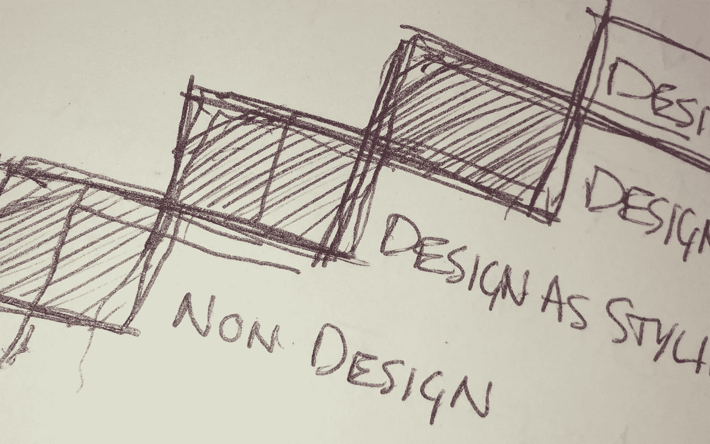

# 了解您组织的设计成熟度

> 原文：<https://medium.com/swlh/knowing-your-organizations-design-maturity-d708b6739258>

设计成熟度是设计在你的业务中运作的水平。在设计之初，这是一个简单的工程扩展，工具和思路非常相似。设计能够给产品开发带来一些过去没有的东西。消费者开始看到看起来不错的产品的价值。人类工效学开始在物品设计中发挥更大的作用。对消费者购买行为有了更好的理解。随着时间的推移，设计开始成熟，并一直持续下去。

今天，设计意味着与 60 年前完全不同的东西。在今天的商业环境中，设计已经发展成熟，成为商业不可分割的一部分。可以理解的是，这并不是一夜之间发生的，但它发生的时间比你想象的更近。

在 20 世纪 90 年代末和 21 世纪初，设计开始意识到它被商业极度误解。有一种文艺复兴开始增加对设计的理解。一个吸引人的领域是使用商业语言的想法。

Design 使用了相当多古怪的语言来描述设计方案，使得那些没有受过设计训练的人很难理解。当你在谈论形式、比例、颜色、负空间，以及某些东西给你的感觉时，大多数人倾向于关闭理解。设计是有价值的，但是除非被理解，否则不能超越它自身的界限。

在大学的大厅里和专业内，开始说商业语言有一股强大的推动力。如果设计要超越自己的界限并受到重视，它必须能够传达为什么它对组织的其他部分有价值。设计开始用其他人能够理解的术语来描述自己和解决方案。

这对设计的价值有如此深远的影响，以至于设计师们开始获得 MBA 学位，MBA 们开始学习设计课程。像斯坦福大学 d.school 这样的地方创造了一个环境，让设计和商业可以合二为一。突然之间，设计运作的环境开始改变。

当设计开始在商业中找到自己的位置时，如果它想作为一种商业功能被认真对待，它必须找到增加价值的方法。设计过程非常适合企业可能面临的任何问题。通过将设计过程与设计师开发创造性解决方案的能力相结合，他们发现自己可以解决业务中的任何问题。突然之间，设计师们开始处理客户服务、财务和营销方面的问题。设计成了团队中不可或缺的一员。设计师们开始意识到，设计体验的价值不仅仅是让事物运转良好或看起来不错。有了经验作为基础，大家开始看到设计对整个生态系统的价值有多大。

现在，设计之外的人正在接受设计过程的培训，并且可以看到设计经验的价值，设计现在可以成为一个组织思维文化的一部分。许多公司依赖于非常注重分析的思维文化。事情是有分寸的，理性的，保守的。但在大多数行业，这并不是消费者想要的。消费者在寻找体验。他们的选择是感性的。一些公司发现，如果他们的文化更具创造性、情感性和创新性，他们生产的东西也将是一样的。他们的产品和服务将更能引起消费者的共鸣。

从设计的历史中你可以看到，它已经相当成熟了。唯一的问题是，这种情况并不是到处都有。有些公司仍然看不到设计的价值。设计还是用做造型部(如果你有造型部明天改名叫设计！).所有的设计组织都有不同的成熟度。这里是设计在一个组织中可以达到的设计成熟度级别，以及你如何开始往上爬。

美学/风格
设计是用来让事物看起来更好的一种方式。它们通常是流程中的最后一步。他们从工程部门得到一个包裹，工程部门的副总裁走进来说:“给你，让它看起来漂亮点。”这种环境不适合居住，它为设计创造了有限的价值，因为设计没有办法与更大的团队一起促进创作过程。

**功能性**
一旦设计进入功能性领域，我们开始赢得一些尊重。还记得你在设计学校的商店里度过的那些日子吗？他们在这里得到回报。设计在这个阶段证明了它的价值，通过向他人展示它可以创造，它可以创造实际工作和功能的东西。这个阶段的设计理解问题的所有约束，并与工程和其他人一起提出创造性的解决方案。向他们展示你对他们的所作所为感同身受，你会走得很远。

**互联**
我们已经开始有点模糊界限了，但是互联的概念意味着你正在与你组织中的不同部门一起工作。你了解市场营销、销售、制造、工程等等的需求。你积极地与他们合作，并让他们参与到你的工作中，以确保他们的意见被听取和考虑。这开始让我们走上创造整体体验的道路。随着设计获得越来越多的尊重，它也将为设计在商业中扮演越来越重要的角色创造条件。

集成
当设计被集成时，它不再局限于设计办公室的墙壁。它有自主权，正在解决营销问题或销售问题。设计被整合到企业的其他学科中。设计不再仅仅被认为是创造产品的人，而是在组织内部被视为变革的推动者。他们被视为能够为企业可能面临的任何问题带来创造性流程和独特解决方案的人。

**战略**
战略不一定是我们谈论设计时首先想到的。但是让我们先退后一步。在这个阶段，设计在整个业务中高度集成，了解每个方面如何工作和运作，并在一年中花几个月的时间进行研究。在这一点上，设计可能比公司里的任何人都更了解你的客户，也知道客户如何融入组织的大局。设计开始运用他们的预见能力来创造适合企业和消费者的策略。一个设计师的观点实际上会让你的策略更强大，因为它不再仅仅依赖于数字。它将由同理心创造。

文化对于一家公司来说，这是一个非常难得的职位，但也有一些。当设计成为你的文化时，企业中的每个人都明白设计是什么，它如何适应，甚至可能在他们的日常生活中使用它的过程。不是每个人都成为设计师，而是每个人都明白如何以系统的方式解决问题，这才是有创意的。人们乐于接受新的想法，他们将想法原型化，他们明白自己可能会失败，他们明白自己在为消费者创造整体体验中的角色。

正如你所看到的，随着时间的推移，设计发展得相当快，而且随着商业格局的变化，它还会继续发展。设计将承担新的角色，但我们的流程将始终允许我们去适应。设计将始终以创造性的方式解决问题，为客户带来愉悦，并拓展业务的边界。当你审视你的组织时，仔细看看设计在你的业务中的角色，以及你是否认为提升设计对组织有益。今天的客户正在寻求体验，设计拥有创造卓越体验的工具和流程。不要低估设计在你的组织中应该扮演的角色，它们是你为消费者创造差异化体验的最大资产。

*发表于* **创业、旅游癖和生活黑客**

-