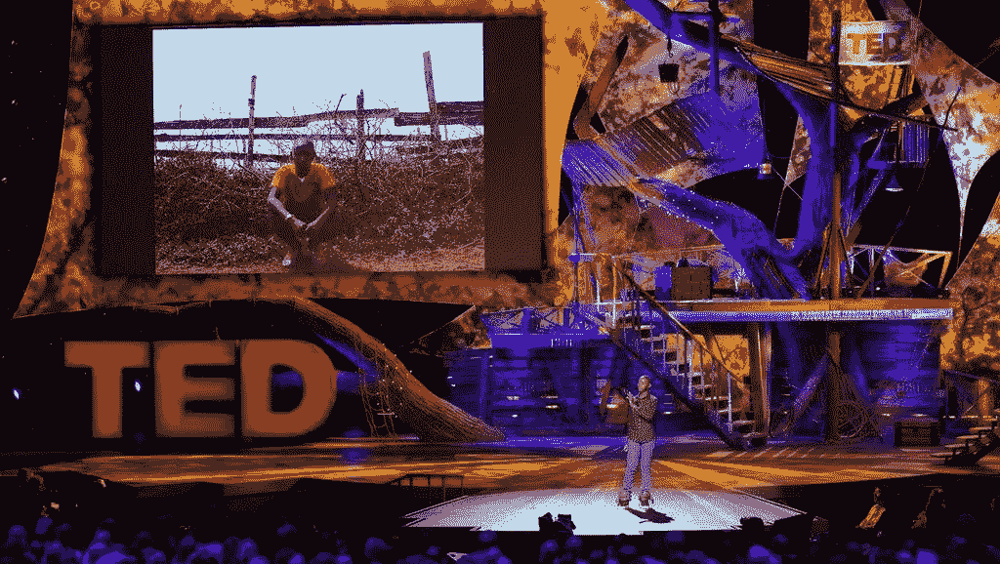

# 好奇害死猫

> 原文：<https://medium.com/swlh/lack-of-curiosity-killed-the-cat-567fe3e7e4aa>

肯尼亚的一个小男孩理查德·图雷利在成长过程中遇到的问题并不多。在他居住的马赛社区，狮子对他们的牲畜构成了巨大的威胁。六岁时，他很好奇:我怎样才能保护家里的牛免受这些狮子的伤害？他试图用火，甚至稻草人来吓跑狮子，但没有任何效果。几次实验后，他恍然大悟:狮子怕动光！他用汽车电池和太阳能电池板——就用他家周围的东西——想出了一个绝妙的解决方案，每天晚上都把狮子吓跑。他一直在研究细节，直到成功为止。这种方法非常有效，以至于他的邻居很快就采用了这种方法，并最终成为肯尼亚各地事实上的解决方案，以保护牛免受狮子、豹子和其他动物的捕食。下面是理查德讲述他的故事的一段鼓舞人心的 TED 演讲。

对我来说，理查德的故事是一个更大的隐喻——它在企业生活中的作用和我们小时候一样大。

> 大多数事情的成功都需要好奇心和对事物的深入钻研，而不仅仅停留在表面的理解层面。而不仅仅是与“我们的工作”直接相关的事情。事实上，有时退一步，“忘却”并从头开始理解远离我们舒适区的事物是很重要的

作为孩子，我们用惊奇的眼光看待周围的一切，我们质疑别人告诉我们的一切，我们试图用新的和创新的方式去理解事物。我们深入。但是随着我们的成长，我们建立了一个充满知识、经验和智慧的云。这种所谓的“学习”创造了一些观点和看法，有时会让我们看不到保持好奇心和学习新事物的需要。我们继续依靠我们的“知识”来度过难关，因为我们说服自己“我们已经知道答案”，而事实上，我们已经失去了好奇心、好奇心和学习新事物所需的热情。

说具体点。

我在麦肯锡工作期间认识的一位新同事被分配到弗吉尼亚州一家医院的急诊部从事精益流程改进项目。他在被分配的那个星期五对医院或急诊一无所知——然而，当他在周一早上出现在客户面前时，他对分诊、统计、住院流程、登机，以及急诊工作的全部内容了如指掌。显然，在周六早上，他 2 岁的孩子发烧醒来，他必须带她去急诊室——所以他决定去 3 个不同的急诊室，以了解这个过程是如何工作的，他要等多久才能被看到，步骤似乎是什么——这是他新发现的启示的基础。我不确定他的妻子在得知他们的小女儿在同一天内接受了三次不同的急诊检查后会不会兴奋，但他显然有学习的热情。他的职业生涯很成功，曾是麦肯锡的合伙人，一家全球电子公司的高管，现在是一家私募股权公司的管理合伙人。

它适用于各个领域。如果你对产品管理或产品设计感兴趣，好奇心也是你的秘密武器。这是深入研究问题和行为，发展鼓舞人心的世界观、愿景和路线图的唯一途径。好的项目经理从用户和问题出发——他们很想知道为什么用户会有问题，他们的替代方案是什么，好的解决方案应该是什么样的。他们利用这些知识来设计一个能引起用户共鸣的解决方案。他们还对工程团队可用的工具、技术和技能感到好奇，以便找到解决问题的最佳方案。许多产品管理实际上是实验——你从一个论题开始，然后尽可能不费力地不断验证它。拥有好奇心是选择正确实验和快速迭代的关键。

如果你是销售主管，是的，你接受过建立关系和了解客户需求的培训。如果你能成为房间里的元老，那就太好了。这还不够。在当今世界，这只是赌注，你必须做得更好。你必须对客户具体问题的来龙去脉感到好奇，同样，如果不是更重要的话，能够在非常具体的层面上讲述你所销售产品的细节。只有这样，你才有机会让精明的买家相信，在他们所有的选择中，你的解决方案是最好的。事实上，最好的销售人员最终会成为体面的产品经理——他们不仅帮助客户了解他们的产品并取得成功，他们还帮助产品团队以合理的详细程度了解客户的痛点。他们总是很想知道事情是如何端到端地工作的，随着时间的推移，他们对事情应该如何工作有了很好的认识——无论是从客户的角度还是从他们自己的解决方案或产品的角度。

好奇心是工程师的生命线。再多的训练或实践也不能让你成为更好的工程师。变得擅长你所做的事情的唯一方法是有足够的好奇心去理解事物是如何工作的。通过浏览代码，通过调试，通过测试，通过修补，通过破坏和修复。如果没有好奇心去了解事物是如何工作的，你就无法成长为一名工程师。最好的工程师不会把自己局限于编码，他们会努力理解产品、市场和端到端的客户流。他们很想知道顾客是如何发现产品的，他们为什么使用它，他们在哪里花费时间，以及他们为什么留下来。他们着眼于大局。

如果你是一名数据科学家，你对你的公司解决的问题越好奇，对你的用户面临的真正问题越好奇，对你所处的市场越好奇，你就越有可能运用你的技能来开发重要的脚本和解决方案。你对团队其他成员的工作越好奇——项目管理是如何工作的，他们做什么，你的脚本将如何包装在代码中供用户使用，它将如何在你的团队建立的设计框架中得到体验，你就越有可能以可行的方式解决问题。

在她的书《心态:成功的新心理学 中，卡罗尔·德韦克解释了两种心态——“固定”心态和“成长”心态——广泛存在于人们之中。固定的思维模式是基于你过去学习的知识和信念，并限制你的思维。成长心态是基于好奇心和学习，并扩展你的思维。

> “思维定势的人认为他们知道自己擅长什么，不擅长什么，害怕走出自己的舒适区。具有成长心态的人把他们所知道的和拥有的一切都看作是一种资产，并且寻找通过实验和新的学习来建立他们的知识的方法。让他们与众不同的是一种信念，即他们可以通过努力发展任何技能，每一次失败都只是一个可以学习和成长的数据点。”—卡罗尔·德韦克

我是这样识别聪明人的:不是通过他们在测试中的智商。而不是他们解决复杂抽象问题的能力。我认为，智力是一种快速理解新概念和新情况并达到一定深度的能力。能够这样做，源于好奇。你可以简单地通过讨论一个他们从未接触过的概念或情况，看看他们会问什么样的问题，来识别聪明的人。我发现聪明的人会参与进来，并迅速提出正确的问题。他们很想知道事情的要点。与他们十分钟的交谈会让你陷入沉思——通常是一些你以前从未想过的问题。你带着启发和活力离开——不是因为你得到了答案，而是因为你得到了一些值得思考的好问题。

所以不管你的角色是什么，*保持好奇*。思考事物是如何以及为什么会以这种方式运行的，并试图弄清事情的真相——在你的大脑中构建拼图，并变得足够容易知道事物之间是如何相互联系的。丰田的 [5 个为什么的框架](http://www.toyota-global.com/company/toyota_traditions/quality/mar_apr_2006.html)是一个很好的组织方式——这是一个简单的框架，帮助你找到问题的根源。从问为什么开始，用接地气的事实来回答。然后，递归地问为什么，直到你问了 5 个为什么。这将帮助你区分症状和问题。在你完全理解问题到底是什么之前，不要试图去解决问题。在许多情况下，你可能解决的是症状而不是问题。

> “重要的是不要停止提问。好奇心有它存在的理由。当一个人思考永恒、生命和现实的奇妙结构的奥秘时，他不禁感到敬畏。如果一个人每天仅仅试图理解这种神秘的一点点，这就足够了。”——阿尔伯特·爱因斯坦

如果我们用先入为主的观念和理论来看待这个世界，依赖于我们固定的知识体系作为观察它的镜头，我们经常以解决错误的问题和错误的解决方案而告终。更糟的是，我们会遇到空衣服。带着孩童般的好奇心走近世界。就像六年级学生在解决一个有趣的新问题。就像理查德·图雷利。

***桑吉夫·阿格拉瓦尔*** *是*[*LeanTaaS iQueue*](http://www.iqueue.com/)*的总裁兼首席营销官。Sanjeev 是谷歌的第一任产品营销主管。从那以后，他在三家成功的初创公司担任过领导职务:移动推送平台 Aloqa 的首席执行官(被摩托罗拉收购)；Tellme Networks(已被微软收购)产品和营销副总裁；以及作为 Collegefeed(被 AfterCollege 收购)的创始 CEO。Sanjeev 毕业于麻省理工学院，获得 EECS 学位，并在麦肯锡公司和思科系统公司工作过。他是一个狂热的壁球运动员，并被贝克尔的《医院评论》评为医疗保健创新领域的顶级企业家之一。*