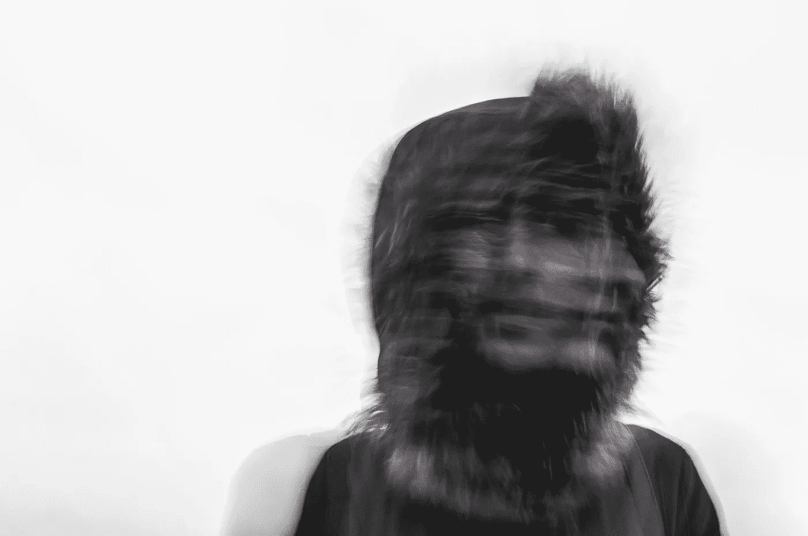

# 上周，我终于崩溃了。你也应该！

> 原文：<https://medium.com/swlh/last-week-i-finally-snapped-da8c7ca37889>

That’s not me. But I sort of felt like this. Photo by [Ehimetalor Unuabona](https://unsplash.com/photos/pTUCMqXCOrk?utm_source=unsplash&utm_medium=referral&utm_content=creditCopyText) on [Unsplash](https://unsplash.com/search/photos/crazy?utm_source=unsplash&utm_medium=referral&utm_content=creditCopyText)

## 这可能是过去几个月发生的最好的事情

上周，我经历了一个有趣的时刻。我内心的某种东西*突然爆发*。

你看，我在健身房，准备开始锻炼。我从来都不是一个喜欢运动的人(我把自己定义为“运动型”)，即使我足够健康，并且在过去的 10 年里去了不同的健身房。但是锻炼几乎总是*无聊*:我从来没有让自己完全享受它。每次我打算去，都会遇到一些阻力。

呆在家里会好得多。阅读或观看网飞会好得多。我可以明天去，不是吗？

亲爱的读者，这听起来可能有点耳熟。

和我的女朋友一起，我发现了一个每周去两次健身房的惯例，我们确实在大多数时间里坚持了这个惯例*。夏天，我们会去跑步，但这也是一个挑战。我喜欢之后的时刻，在夏天的雨中跑步回家。*

*但是在跑步过程中，它很无聊，令人筋疲力尽，令人不快，向我展示了我是多么的不适合，以及我没有做多少训练。*

*在过去的几周里，我没有做任何重量训练，我在椭圆机上锻炼了一个小时，并在那里看着网飞。至少我当时是汗流浃背，脑子被占了。*

> *但是几天前，有东西断了。我问自己:为什么？*

*为什么我这么不情愿地做这件事？这种*我不想这样做*的心态给我带来了什么？*

*这对我享受生活有帮助吗？它肯定没有。*

***当我参加活动时，它是否帮助我做到了最好？**也，没有。*

*它至少提供了一个更好的选择吗？不完全是，因为我没有把运动换成同样有益的活动，我换成了字面上的*无所事事*。*

> *然后我意识到我还没说完。不喜欢运动是一方面，但还有其他方面我回避。清理我的桌子。着手处理我的财务和税收问题。*

*在避免上述情况的同时，我还做了其他的事情:抓指甲、不尽情享受食物、在谈话中不认真倾听。*

*匆忙做事。*

*我到底为什么要花这么多时间和自己斗争？*

*有一段时间，我只是坐在那里，思考发生了什么事。*

*所有这些事情在我的脑海里都有一个容器，上面写着:“事情很糟糕，但你应该去做。”其中一些事情可以推迟和避免，其他的我经常做，但是没有乐趣。*

*但是容器在一瞬间就裂开了。我还不知道是什么触发了那一刻。*

*逃避这一切，匆忙做事，勉强工作，带给我的是什么？*

*找不到一点积极的东西。顶多，多一会享受连续剧或电影之类的琐事。但是代价是什么呢？我没有变得更健康，我没有完成我的项目，我感到有压力，因为我知道我正在推迟我应该在几年前就做的事情。*

> *勉强做事很烂。你没有正确地执行动作，因为在内心深处，你并不真的想这么做。*

*现在有两种方法:停止做这件事，直到你找到一个替代方案。*

> *路径二:打破你头脑中的“回避”框，决定你现在要如何处理这些事情。看看他们，看看在过去的几年里，不情愿和回避带来了什么。它让你快乐了吗？你达到目标了吗？还是你推迟了，推开了，藏起来了，才发现你的目标还和那时一样遥远？*

*现在走出你的阴影。*

*感谢阅读！*

**

## *这篇文章发表在[《创业](https://medium.com/swlh)》上，这是 Medium 最大的创业刊物，有 291，182+人关注。*

## *订阅接收[我们的头条新闻](http://growthsupply.com/the-startup-newsletter/)。*

**