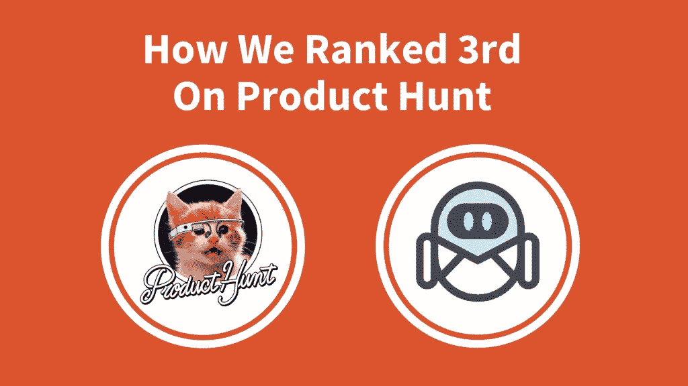
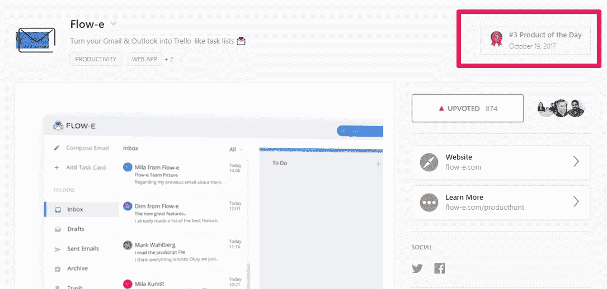
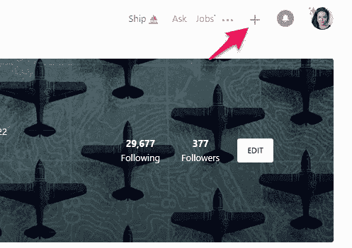
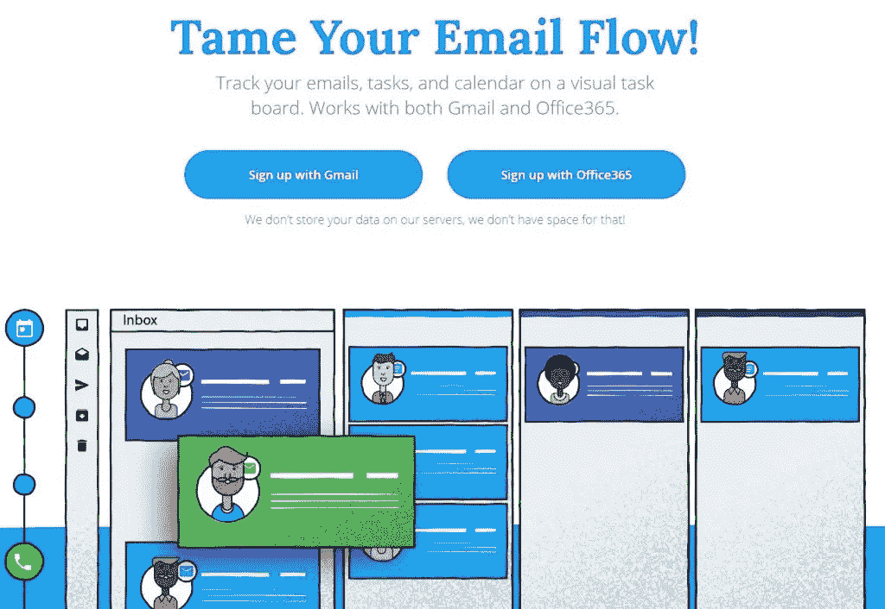
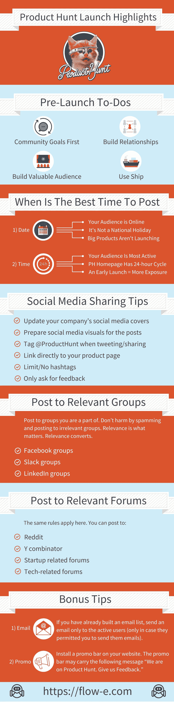

# 发布和排名:这是我们在产品搜索中排名第三的情况

> 原文：<https://medium.com/swlh/launch-and-rank-here-is-how-we-ranked-3rd-on-product-hunt-d1cb7c0c840f>

毫无疑问，产品搜索是科技极客最性感的地方之一。

如果你有一个新的应用程序、产品、书籍，或者只是埃隆·马斯克的无聊的公司帽子，你可能会首先在产品搜索上推出它。

对于那些对斯拉夫人来说，寻找产品听起来像日本字母表的观众来说，这里有一个简短的概述。

# 什么是产品搜寻(PH)？

Product Hunt 不仅仅是“一个地方”，它是一个社区，开发者、企业家、记者、投资者和技术世界的成员在这里花时间发现和讨论新产品。

这个社区很酷的一点是，他们会欢迎几乎所有开发阶段的产品(只要产品可用)。

该平台由创新者和早期采用者组成；他们喜欢第一个专门尝试新产品。

# 除了以上，还有什么真本事？

1)每个产品都在产品搜索的头版，因为头版曝光率最高。

2)在 PH 电子邮件摘要简讯中宣传当天的顶级产品。

3)该平台有助于一下子接触到大量受众。

4)最有价值的是你从用户那里得到了真实的反馈。他们会确切地说出他们对你的产品的看法。

但我意识到，要获得这些好处，你必须获得“如何寻找产品”的硕士学位。

我们做了我们的“学术研究”，现在我们分享它。完全透明。

# 求救，求救！我们有一个问题

当我第一次开始准备产品搜索发布时，我亲自阅读了谷歌上从第 1 页到第 4 页的所有内容(加上每篇文章的参考资料)。

这些信息令人困惑。

我很困惑。

Picture Credit: PookieCatsWorld

我应该直接链接到我们在 PH 上的产品帖子吗？我应该向投票支持类似产品的人发送大量的 DMs 吗？我应该只征求反馈吗？

答案是如此的含糊不清。

然后我决定只看今年(目前是 2017 年)发表的文章。

这解决了我的来源问题。

只有一篇文章。产品搜寻指南“如何启动产品搜寻”我希望在浪费时间阅读过时的指南之前知道它的存在。

我们只是跟随他们的向导。这是有道理的。这是他们的平台，他们最了解。

让我向您介绍我们的产品发布，并最终澄清您可能有的任何模糊问题。

所以…

# 1)哟，很高兴见到你:预发布

你会在几乎所有关于“如何寻找产品”的指南中读到你应该在一个月后开始的内容。但是他们错了。一个月不够。

产品搜寻就像一场婚姻。你不会和一个你认识的人结婚一个月。

你认识一个人越久，你建立的联系就越牢固。

**1.1)熟悉这个社区:**足够幸运的是，我已经加入这个社区很多年了。但是，如果你只是点击了注册按钮，并计划很快推出，开始探索平台。关注你感兴趣的人，关注主题，并在评论中留下反馈。尊重人家的劳动，不要无礼。如果你不能帮助，就不要伤害。

**1.2)建立关系:**你可以在 Twitter 上关注社区中的人。关注与你兴趣相投的人，而不是拥有最佳个人资料图片的人。第一类人更有可能追随你，并参与你在社交媒体上的内容。回馈并参与他们的内容。

**1.3)建立一个与你价值观一致的受众群体:**这意味着，最初，寻找测试者或[早期采用者](https://en.wikipedia.org/wiki/Early_adopter)是件好事。一旦你给他们一个有价值的产品，他们很可能会回馈。这将是一个坚实的人群，你的社区，将传播你的发布。正如我的一位同事所说，“养育一个孩子需要一个村庄。”确实如此。

**1.4)使用 Ship:** Ship 就像是你产品的预告片页面。它也被称为即将到来的页面。这是一种非常方便的方式来与社区和您的观众分享即将发生的事情。利用你拥有的任何机会。我们有机会测试船，这里是我们即将到来的页面看起来:[https://www.producthunt.com/upcoming/flow-e](https://www.producthunt.com/upcoming/flow-e)

# 2)集合:猎人、制造者和贡献者访问

首先，让我们看看产品搜索主页是如何组织的。它有两个部分/狩猎产品列表:流行和最新的。

然后，提交后，您的产品将出现在最新的部分。正如你可能已经猜到的那样，每个人的目标都是成为热门栏目的主角。

值得一提的是，为了提交你的产品，你应该有一个贡献者访问权限，或者你应该请一个猎人来搜索你的产品。

**2.1)贡献者访问:**我强烈建议你获得一个贡献者访问。其实如果你已经按照第一步做了，应该已经有了。贡献者访问权限赋予您搜索自己产品的权利。如果你没有权限狩猎，你应该按照[这些步骤](https://www.producthunt.com/contributor)。

**2.2)谁是猎人:**猎人是产品狩猎社区的成员，他们已经狩猎了至少一种产品。这意味着他们有一个贡献者访问权限，并且很可能是非常活跃的成员。在产品搜索向搜索者的追随者发送电子邮件通知的时候，谁搜索你的产品曾经很重要。既然这不再适用，你最好把时间花在建立受众上，而不是猎杀猎人。要乐于建立价值，而不仅仅是模糊的关系。

**2.3)谁是制造者:**制造者被称为制造产品的人，被列/加为制造者(你和你的队友)。你可以是猎人，也可以是创造者。

**2.4)你应该寻找我们自己的产品吗:**是的，请。我不明白为什么人们仍然希望被其他(更有影响力的)猎人猎杀。我找到了我们的产品 [Flow-e](https://flow-e.com/) ，我们做得很好。我喜欢我的公司是因为我们有相同的价值观。

能完全独立的时候我们不喜欢依赖。

我的意思是，当你寻找你的产品时，你节省了时间，并且完全控制了发布日的物流。例如，我们画廊的媒体视觉效果有问题。

我们不得不调整它们的大小，并立即更新我们的页面。当然，我们很舒服；页面在我们手里，所以没有时间压力。

# 3)时机:发布的最佳时间和日期是什么时候:

# 3.1)天:

这方面的推测已经够多了，我还可以推测更多。一周中启动的最佳时间是:

*   你知道你的观众会在线(也就是说，这不是一个全国性的节日或者圣诞节)
*   谷歌没有推出新产品，埃隆·马斯克也没有发布无聊的帽子 2.0

这意味着你应该在大日子狩猎。例如，我们计划在 10 月 17 日星期二发布 Flow-e，但是我们没有成功。18 号我们也没有。

剩下的竞争名额太少了(我们在为前 5 名而战)。所以我们推迟了两次发布时间，直到我们第三次发布时才决定在 19 日发布我们的产品。

# 3.2)时间:

这里我有一个理论，但让我先概述一下确认的细节:

*   产品搜索主页以 24 小时为周期。这意味着新产品在太平洋标准时间上午 12:01 登陆主页。
*   从逻辑上讲，你越早发布，你的产品曝光时间就越长(也就是说，越多的人会看到你的产品，并最终表现出一定的喜爱)。

**关于我的理论:**我相信你应该在你的受众在线的时候推出。因为新产品在发布后很快收到大量投票时会被挤到受欢迎的部分。再说一次，这是我的一个理论，基于我在发射前几个月的近距离观察。

# 4)准备好:发布时的清单

在发布日，这些是你必须填写的东西，这样你的产品才能在产品搜索中出现。

**4.1)如何发布你的产品:**如果你想让你的产品有特色，那就得猎奇。再说一次，你可以随意寻找你自己的产品。正如我之前提到的，你需要一个贡献者权限来搜索你的产品。要发布您的产品，请登录您的帐户，然后单击您的个人资料图片旁边的“+”。现在你可以开始这个过程了。

**4.2)添加链接:**添加贵公司/产品网站作为主链接。然后你可以添加更多的链接，如 App Store、Google Play 或任何其他可以找到你的产品的地方。例如，我们首先添加了 https://flow-e.com 的，然后是我们针对 PH 社区的特别优惠页面。

**4.3)添加您的姓名:**添加您的产品/公司名称。整洁干净— Flow-e。

你也可以在名字中使用表情符号，但前提是表情符号是名字本身的一部分。否则是不允许的。

**4.4)添加标语:**此字段只有 60 个字符。用一句话描述你的产品，并且要具体。减少废话，不要使用“最好的”、“最具创新性的应用”等常见的说法。

对于 Flow-e，我们使用了下面的标语:“把你的 Gmail 和 Outlook 变成类似 Trello 的任务列表

。“在你的标语中随意添加图标/表情符号(但不要过度使用)。它增加了良好的视觉效果并吸引注意力。

**4.5)添加缩略图:**缩略图是您的产品简介图片。它用于用单一视觉元素来描述产品。您可以使用静态可视元素或 GIF。选择最能传达价值主张的一个。对于 Flow-e，我们选择了 gif。这是描述背后想法的最佳方式。

**4.6)添加图库:**图库是人们打开你的帖子首先看到的。我强烈推荐做一个短视频。不到 50 秒。其他资产是形象化你的产品的图片。但不仅仅是截图。让他们有吸引力。

通过视觉与观众交流。确保视觉效果是矩形的(大约 2:1 的比例)，可以在 twitter/facebook 上分享。如果您希望页面以视频元素开始，请先上传视频。

视频是目前你能创造的最吸引人的信息(在产品搜索中也是允许的)。我们添加了视频(第一个)和 4 个视觉元素来可视化问题和我们的解决方案。

**4.7)添加主题:**只添加与您的产品最相关的主题。我们增加了 4 个。对于 Flow-e，我们选择了生产力、web 应用程序、电子邮件和任务管理。

**4.8)添加 Makers:** 这里有个提示。确保在发布前几个月，你的产品的制造商有活跃的帐户和贡献者访问。总是添加参与产品开发的每个人的用户名。

没有公司账户，只有个人账户。看到整个团队参与评论总是好的。另外，制作者的追随者会在发布日收到通知。

将你的两个账户——Twitter 和脸书——关联起来，这样你的更多朋友就能找到你。我们已经将我们所有的队友都添加为创造者。整个团队都很努力，我们都配列为创客。

**NB:** 如果你已经走到了这一步，那么你已经准备好出发了。一旦你的帖子上线，还有 3 个部分需要填写。

**4.9)添加描述:**描述出现在图库部分下。我们只添加了两个句子。没有花哨，只有有价值的信息，简短，中肯。没人有时间看科技小说。

**4.11)添加“网络周边”:**在此部分添加任何新闻文章、产品评论、媒体文章等。

**4.12)添加社交媒体链接:**这就像它说的那样简单。添加贵公司的脸书、Twitter、Medium 和 Instagram。如果你有 AngelList 的个人资料，把它放在你的帖子里。

**4.13)添加制造商评论:**重要的是，制造商之一要第一个评论产品。这将为讨论创造先决条件。保持你的介绍简短，但要甜蜜。我已经介绍了团队，我们试图解决的问题以及我们计划如何用 Flow-e 解决它。

**4.15)准备优惠:**我们为 PH 社区准备了特别优惠。由于我们要求反馈，我们希望他们能够在独家条件下试用我们的产品，只对产品搜索社区开放。

# 5)执行力:推销你的产品的营销

像许多帖子和指南推测的那样，要求你的网络，无论是在线还是离线，帮助传播消息总是有利的，并且不违反产品搜索的规则。在我们对你们发布的营销部分有所了解后，我会详细关注哪些事情不能做。

我会非常简短，从第一人称的角度来说。我想强调的是，由于整个团队的努力，我们获得了成功的回报。他们都参与了上市当天的营销活动。

我知道大多数技术人员讨厌做市场营销。当你用无聊的方式做营销时，它是无聊的。给它一个灵魂，它就会飞翔。选择你最想做的任务。

这是我在上市当天必须执行的营销清单。它让我 22 小时没合眼。我睡了两个小时。然后我在 24 小时循环结束前 30 分钟醒来。

# 5.1)社交媒体分享技巧:

**更新你公司的社交媒体封面:**为产品搜索制作特别封面。仅使用 1-2 个意思相似的句子:“我们正在寻找产品。给我们反馈。

**为帖子准备社交媒体视觉效果:**在推特和脸书上使用合适的尺寸，使用强烈的视觉元素。不要在视觉元素上重叠沉重的文字。用一句中肯的话。

**在推文/分享时标记@ product hunt:**PH 寻找他们可以喜欢、分享或转发的制造商/公司发布推文和脸书帖子。标记 PH 是他们发现你的帖子和推文的方式。

**直接链接到你的产品页面:**不要链接到 producthunt.com，而是链接到你的产品页面([https://www.producthunt.com/posts/flow-e](https://www.producthunt.com/posts/flow-e))。你不会因为这样做而受到惩罚(下面会有更多相关内容)。

**限制/禁止标签:**我没有在我的推文中使用任何标签(更不用说脸书的帖子了)。分散人们的注意力，让他们看不到本质是没有意义的。相反，我在 Flow-e 和 Product Hunt 上标记了我们帖子的链接。我还用表情符号来吸引用户的注意力。

**寻求反馈:**向受众简要介绍产品发布并寻求反馈。你也可以提到有一个特别的优惠，只提供给 PH 社区。仅此而已。永远不要要求支持票。看起来很绝望。

**保持你的社交媒体活跃:**每 2-3 小时发一次推文/帖子。这大约是每个工作日 3-4 次。

# 5.2)向群组发布:

发布到您所属的群组。不要向不相关的群体发送垃圾邮件和发帖。相关性才是最重要的。相关性转换。相关受众采取行动并给出反馈。

一些选项包括:

**脸书集团；
**松弛组；
**领英集团。******

******注意:确保你已经在发布前几周加入了这些小组。需要一段时间才能得到小组管理员的批准。******

# ******5.3)发布到论坛:******

******同样的规则也适用于此。您可以发帖至:******

********Reddit(自己做好准备，他们的观点已经接近骨子里了，对你敏感的灵魂毫不在乎)；
**Y 组合子；
**创业相关论坛；
**科技相关论坛等。**************

******不要害怕发帖和寻求反馈。******

******是的，有一个很大的机会被禁止从一个 subreddit 例如(我被禁止，我没有停止要求反馈)。******

******我的一个拥有百万美元创业资金的朋友曾经告诉我“如果你没有被任何地方禁止，意味着你还没有足够努力地推动你的产品前进。”******

******你道歉然后继续生活。******

# ******5.4)向您的用户/朋友和家人/影响者和支持者发送电子邮件:******

******如果你已经建立了一个邮件列表，只给活跃的用户发邮件(除非他们允许你给他们发邮件，否则给不请自来的人发邮件是无效的)。******

******不要要求他们投赞成票。不要仅仅为了推荐你的产品而要求他们注册。相反，用 1-2 句话解释收到对你产品的反馈有多重要。******

******请他们参与讨论或在你的产品页面上写一篇评论。这比给 10 000 个没有账户的用户发邮件要有用得多。******

# ******5.5)安装促销条:******

******我在我们的网站上安装了一个推广栏。酒吧里有这样的句子:“我们在寻找产品。给我们反馈。”和一个直接链接到 Flow-e 页面的按钮。******

************

# ******6)流言终结者:不要做什么******

******营销人员、猎人和制造商，这是你的禁忌清单。******

******请求支持票。不要要求 upvotes，而是要求反馈。如果你有一个好的产品，它会被欣赏。PH 上的社区精通技术，他们知道什么时候一个好的产品需要关注和支持。******

********群发推文。**不要向投票支持类似产品的用户、有影响力的人、著名的猎人等群发推文。这不是吸引他们注意力的正确方式。再说一次，如果你是真实的，人们会支持你。******

******使用雷霆一击。**不要用雷霆一击。这是垃圾邮件，无效的，很容易被产品搜索的算法检测到。你最终可能会得到一个点球，而不是一场胜利。****

******·猎杀一名“猎人”**我已经提到过这一点，但人们倾向于通过发推特和电子邮件来“折磨”猎人，询问他们是否会猎杀他们的产品。我已经找到了我们自己产品，它只对我们有利。我们必须进行视觉编辑和一些文字改进。自从我找到了 Flow-e，这一页就在我们手里。我们最好的决定之一就是不要浪费时间去“猎杀猎人”****

******链接到“producthunt.com.** ”这是最古老的神话之一。不要链接 PH 主页。直接链接到你的产品页面。为什么你想让你的观众更难找到你的产品？毫无意义。根据 PH guide，链接到你的产品页面对算法没有任何影响。你不会因为直接链接到你的产品页面而受到惩罚。我可以证实这一点。****

# ****结论:****

****我想在信息图中总结最重要的方面。****

****最后，我想说，任何活动的营销都是产品促销的一个重要方面。****

****然而，创造一个好的产品对社区来说更有吸引力。****

****即使你的产品是未经打磨的钻石，建立价值，社区会告诉你如何打磨它。****

****附:让我们再次让电子邮件变得伟大！****

********

*****这个帖子最初发布在 Flow-e:* [*发布和排名:下面是我们如何在产品搜索*](https://flow-e.com/blog/how-to-launch-on-product-hunt/) 中排名第三****

********

## ****这个故事发表在 [The Startup](https://medium.com/swlh) 上，这里有 258，400 多人聚集在一起阅读 Medium 关于创业的主要故事。****

## ****点击订阅接收我们的头条新闻[。](http://growthsupply.com/the-startup-newsletter/)****

********