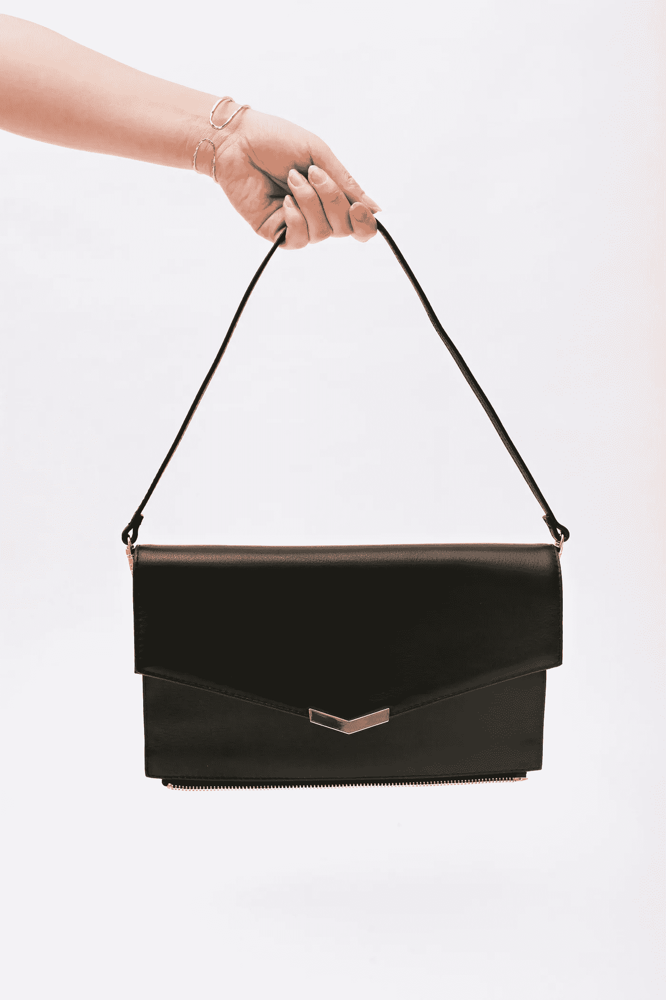

# 发布:Tracy 二合一包今天开始发货

> 原文：<https://medium.com/swlh/launch-the-tracy-2-in-1-bag-begins-shipping-today-2464ac45123d>

## 反思我们的第一年，实物产品，并作为一个唯一的创始人

# **我们的发布会**

[Tara & Co](http://www.taraand.co) 正在为忙碌的女性重新设想产品，今天我很兴奋地宣布，我们已经开始履行我们早期支持者 [Indiegogo 的订单](http://www.igg.me/at/tara)，并通过我们自己的在线[商店](http://www.taraand.co)正式推出 Tara & Co。

想想就在今年早些时候，我们[才发布](/@JuliaLam/announcing-tara-co-4b6f22f1a6b0)Tracy 二合一包，真是疯狂！

该产品受到了广泛的欢迎。我们已经预售了价值超过 11 万美元的产品，被 [Brit+Co](https://www.brit.co/tara-and-co-convertible-work-bag/) 、旧金山纪事报、Buzzfeed 和 [LA 时尚杂志](http://thelafashion.com/2017/06/08/fashion-meets-function/)报道，并与[Woman in Product](http://www.womenpm.org/)conference、[build by Girls](https://www.builtbygirls.com/)以及 [Expat Woman](http://www.theexpatwoman.com/) 举办的全球职业峰会合作。

The Tracy 2-in-1 Bag together as one piece, and separated as two.

我们以激励我们的女性来命名我们所有的产品；我们的第一款包袋 Tracy 2-in-1 以杰出的 Tracy Chou 的名字命名。Tracy 是一名前 Pinterest 工程师和企业家，因其在多样性方面的工作而闻名，她呼吁男性主导的技术领域的公司发布他们的多样性数据，以推动我们在工作场所进行关于女性和平等的真正对话。超过 250 家公司响应了她的号召，包括谷歌和脸书这样的巨头。

下面是二合一 Tracy 的一些功能:

*   **二合一袋。**两个拉链连在一起的包，1 个足够装 13 英寸笔记本电脑，& 1 个可拆卸拉链手包。没错，我们的翻盖变成了拉链手包。

*   **穿多种方式。**可作为单肩包、背包、斜挎包佩戴。

*   **个性化。**推出另外两种离合器色[熔岩红和天蓝色](https://shop.taraand.co/products/colored-clutch)。可单独佩戴，也可搭配使用，打造个性十足的大号包包。

*   **可扩展的隔间和组织**。许多隔层，包括一个可放 13 英寸笔记本电脑的软垫口袋、可放水瓶、雨伞等物品的可扩展隔层、拉链口袋等等。

*   手包自带口袋和可拆卸表带。

*   **最好的材料。**真皮软皮& YKK 拉链。

**Tracy 2 合 1(配有主要的可转换手提包和黑色拉链手包)零售价为 395 美元，可以选择以 99 美元的价格购买一个额外的天蓝色或熔岩红色手包。彩色手包可以和你的 Tracy 混搭，也可以单独使用。**

**当然，你现在就可以在我们新开设的网上商店购买这款包包，地址为**[**www.taraand.co**](http://www.taraand.co)**！**

# 回顾过去的一年

当我们进入公司的下一个阶段时，我想花点时间回顾一下大约一年前的今天，我们是如何开始这段疯狂的旅程的。

我已经思考了很长一段时间，关于女性在工作场所未被满足的需求，我决定学习制造实物产品。

我的背景是技术。我在脸书待了 4.5 年，然后开始经营一些专注于技术的创业公司。2016 年我卖了最后一个，水桶。

当我为我的上一家公司筹集资金，从一个会议跑到另一个会议，从一个社交活动跑到另一个会议的时候，我在想，“那些为忙碌的女性准备的产品都到哪里去了？”

保护我的设备、让我在会议中看起来和感觉良好、并在我需要时提供分散重量的袋子在哪里？面向美国和加拿大 5300 万生活方式充满活力的职业女性的产品在哪里？我还没有找到满意的答案，所以我决定创造一个。

在六周内，我找到了一个有 15 年经验的设计师，我们设计并制造了第一个工作原型。

我们试图解决两个具体问题:

1)如何在你想要的时候看起来圆滑优雅，但在你需要的时候有分散的重量？

2)如何避免包包包，只携带一个适合你所有需求的包包？

从那以后，一直是用户研究、设计、原型制作、测试、众筹、重新设计、重新原型制作、重新测试以及现在的制造和运输的旋风。

我很感激有机会做一些你每天都可以触摸、感受和使用的东西。我喜欢有机会为我的同龄人做点什么。我既是我们最大的粉丝，也是最大的评论家，我希望这能推动我们做出你们喜欢的东西。

# 构建物理产品

向构建物理产品的过渡是一个相当长的学习经历。代替用户测试线框，我实际上给人们一个我们包的早期版本，让他们带着它到处跑，去旅行，带着它去工作，带着他们的孩子走回家，等等。

原型制作现在意味着购买 5 种不同的塑料板，并对每种板进行试验，看看哪种板既有合适的舒适度，又能保持正确的结构。或者将四种不同的面料粘合在一起，看看哪一种看起来更优雅，但又能提供所需的舒适性和实用性。

将两个包合二为一并非易事——创新从来都不是。此外，我们决定创建一个你可以举行三路！

创造两个看起来像两个独立的包包，但又像一个包包一样一起工作的包包，需要无尽的创造力、机械工程、优先取舍、无尽的改进和爱。

我现在非常尊重我周围所有的物质事物。甚至我厨房里的一个简单的杯子都经过了设计、原型制作、测试、重新设计、重新测试、精心制造、再次测试，通过卡车或船只在几周甚至几个月的时间里运送，重新包装，重新运输，并到达我的家门口，制造得非常完美，这样我就可以享受这杯美味的橙汁了。我们周围的一切都是如此精心制作，以创造一种特殊的体验。它让我大吃一惊。

在过去的一年里，我学到了很多关于材料、设计、制造、物理原型和运输的知识。这是一个雄心勃勃的项目，我喜欢领导完成，但绝不容易。

然而，我很荣幸得到了我们 300 多名支持者的支持，他们相信这个想法并一直支持我们。

# 作为唯一的创始人

这也是我自己创办的第一家公司，我很喜欢它。在硅谷，你需要一个联合创始人是一种耻辱。从理论上讲，两个人一起解决问题通常比一个人要好——两倍的人一起解决，对吗？众所周知，保罗·格拉厄姆说过，硅谷最大的孵化器之一 YCombinator 不会资助公司，除非它们有联合创始人，而我过去也有过联合创始人。像任何其他关系一样，共同创始人关系既可能非常有益，也可能非常有害。

在一天结束的时候，每个人都有自己的想法、抱负、职业道德、人际关系、健康问题和恐惧。成功的领导需要在多个层面上保持完美的一致，很少有两个人(或更多人)很早就在愿景上保持完美的一致；我见过共同创始人关系失败多少次就成功多少次。

我喜欢用人体解剖学来比喻一家公司。我坚信任何公司都只有一颗“心”,我只能指出少数公司的情况并非如此。这个人是你的愿景，产品领导者，人们留在船上的原因。通常有一个 ***人*** 你的公司不能没有他。

一般来说，这往往是你的首席执行官或谁运行产品。有时候，联合创始人的功能就像一个重要的器官——肺或肝脏，发挥着维持身体运转的重要作用。有了它们，身体会健康、快乐、运转良好。然而，有时联合创始人可能更像一个附录——你并不真的需要它，而且它可能非常耗时和痛苦。很多时候独自去做是值得的。

作为唯一的创始人，你获得的最大优势是速度。决策很快，你不必为前进而争论一切。大多数时候，做一些更快和几乎完美的事情比做一些更慢和完美的事情要好。你也有能力判断哪些决定可以不经讨论就做出，哪些决定需要经过深思熟虑的讨论才能推进。

尽管我喜欢分享领导权，但我相信，如果我有一个联合创始人，我不可能在一年内建立起这家公司。速度和弹性是早期创业中最重要的两件事。我已经管理好了自己的建设能力，现在我们在这里。

创业是艰难的，令人筋疲力尽的，而且是无尽的时间，希望你能实现一些完美的愿景。作为唯一的创始人，我觉得我只受每天工作时间的限制。有时会让人不知所措，我一周工作 7 天，仍然没有足够的时间，但我不断地为我们取得的进步感到振奋。

在生活中，很容易感到停滞不前，但我很少有这种感觉，因为我总是在寻找更好的选择。

*作为唯一的创始人，我绝不孤单。我从我的团队中获得了难以置信的帮助，优秀的设计师，出色的顾问，一个在各方面都给予帮助的出色的未婚夫，以及许多朋友和家人，他们帮助回答了一项调查，测试了一些东西，与我们合作，并在这一路上为我们加油。*

这家公司，这种产品，是我一手打造的，就像他们每一个人一样。

# 我们出发了！

我们是女人为女人制造的产品。

**对于我们的 Indiegogo 支持者:**非常感谢你们对我们的信任，帮助我们资助这个项目，以及一路上对我们的支持。我们希望你喜欢你的 Tracy 二合一包。

**对于忙碌的女性:**我们希望您能试用 Tracy 二合一包，为您的生活增添优雅与实用。

**送给亲爱的伴侣:**我们听说送礼季即将来临，现在是时候给你的妻子/女朋友/女儿买一个时尚的敞篷包了。；)

**您现在可以在:**[**www.taraand.co**](http://www.taraand.co)购买

感谢所有人的爱和支持——没有你们，我们不可能做到这一点。

*塔拉——你的生活方式。*

## 这个故事发表在 [The Startup](https://medium.com/swlh) 上，这是 Medium 最大的创业刊物，拥有 289，682+人关注。

## 在这里订阅接收[我们的头条新闻](http://growthsupply.com/the-startup-newsletter/)。

