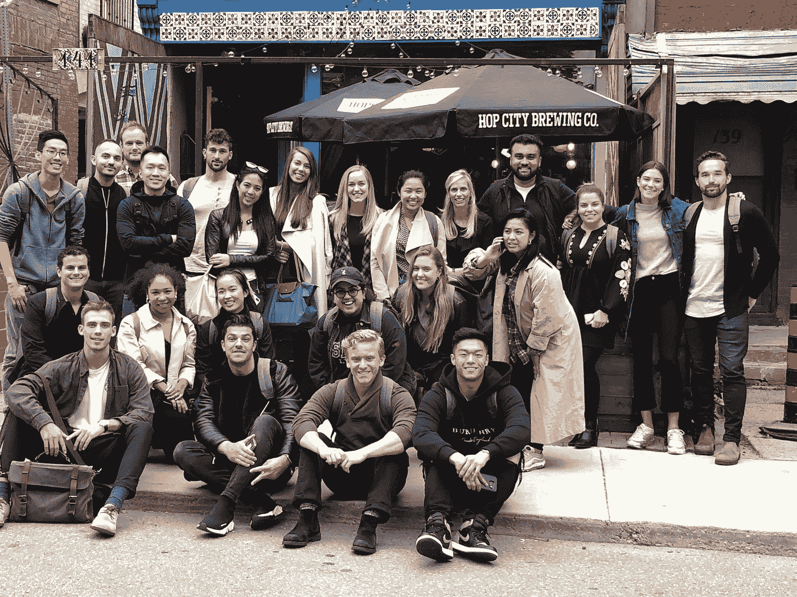

# 在正确的火箭船上开始你的职业生涯🚀

> 原文：<https://medium.com/swlh/launch-your-career-on-the-right-rocket-ship-4ab72b84358e>

Thank you J.Quach for the images: [http://jquach.co/](http://jquach.co/)

所以你已经有了一份很棒的毕业生简历，里面充满了学术成就、课外活动和合作/实习经历。你对自己想去哪里工作已经有了一些想法，但是很多地方对你都有吸引力。

也许你正在做第二份或第三份工作，在不同的工作环境中收集有价值的技能。你现在所在的地方已经变得陈旧，你已经停止学习，觉得没有太多的成长空间。

如果你是前者，甚至是后者，你可能会问自己:我如何找到我想要的职业？

我知道你不是唯一的一个。在我自己的职业生涯中，我有过这样的感受，并帮助别人度过了他们充满挑战的时期。当你在职业生涯的早期，我希望你知道你不需要知道所有的答案，但是让我与你分享一些我一路走来学到的建议。

# 找职业，不是找工作

一份**工作**是一个权宜之计。一个地方，你在那里领取薪水，有时利用你在学校或工作中获得的技能。这是一个地方，当你醒来时，你是*那种*可以进去，但看不到自己在余生中的幸福(但说真的，谁知道在这个时间点上你想永远做什么？).这是一个限制你成长的地方，因为它不会挑战你。

职业生涯是你承诺过的地方。你可以预见自己至少会在那里呆上两年，因为公司会花 6 个月的时间让你成长，6 个月的时间让你掌握自己的技能，最多一年的时间让你和对方一起思考下一步在公司的发展方向。这是一个让你每天醒来都兴奋不已的地方，因为你充满挑战，从未停止学习，热爱你周围的人和成长。

# 找到一个导师，留住那个导师

访问[行业事件](https://techtoronto.org/salesto/)，阅读思想领袖的博客，搜索 LinkedIn 公司和个人资料，找到一位你尊敬的行业导师。一个你可以预见未来 5 到 10 年的人。向那个人伸出手，请他喝杯咖啡。

一个好的领导者总会有一份学员名单。你会惊讶于有些人对成为你的导师是多么开放。如果你能证明你是一个真正想进入这个行业并想得到建议的人，一杯 10 到 15 分钟的咖啡有时会对你进入这个行业大有帮助。

一旦你开始了这种关系，以有规律的节奏建立这种关系是很重要的。不要只是在遇到问题时去见你的导师，而是要设定目标和检查点，以确保你走在通往你想去的地方的路上。

以下是一些建议，可以让别人对你的指导机会做出回应:

*   对他们的公司和他们关注的焦点进行研究。如果你发现自己在给别人发关于工作机会的信息，那么你还没有先做好调查并搜索他们的工作信息。
*   谈谈你想从导师计划中得到什么，并马上问一些聪明的问题。把它想象成电梯推销:例如，如果你想得到一份销售工作，你需要像对待顾客一样迅速激发他们的兴趣
*   尽你所能加入个人风格。你在一次会议上见过他们吗？你们有一些相互的联系吗？我自己的一些例子是:在[我与](https://www.youtube.com/watch?time_continue=1&v=hHvyDycxX0A)[卡特·格兰特](https://www.linkedin.com/in/cartergrant1/)在[加拿大销售大赛](http://www.greatcanadiansalescompetition.com/)上的获奖陈述中，你喜欢我的*瑞克和莫蒂*笔记本吗？这些小事有助于显示对细节的关注，表明你真正的目标是找到正确的导师，而不是随便一个导师。

# 学习和发展的文化至关重要

你一生中的大部分时间都在一个教育系统中度过，这个系统是关于课程和从一个年级到下一个年级的。找个懂这个的公司。准备最充分的公司会有一个结构良好的培训计划，在你的前 30-60-90 天入职，以及你的经理定期检查的持续指导。在你职业生涯的早期，你需要尽可能多的反馈，因为你获得了好习惯，去掉了坏习惯。

确保你要去的地方有你想要的职业发展。了解他们是在寻找合适的人选，还是希望将你作为他们团队的潜在未来进行投资。你是齿轮还是工程师？

Uber Eats Canada Sales Team during a 2-day offsite where we learned and developed our strengths, set goals for the rest of the year, did an amazing race challenge and celebrated with a food tour.

面试时问一些问题来确定你是否得到了一个好职位:

*   我的头几周是什么样的？
*   你培训像我这样的新员工的方法是什么？
*   在你的职业生涯中，你有没有帮助别人进入公司新职位的例子？
*   您为[公司名称]的培训和发展计划做了哪些事情？

## 寻找火箭船，登上去，不要问它要去哪里。

找一个正在经历高速增长的地方，或者加入一家仍在/不断解决问题的初创公司。当你在职业生涯的早期，你可以在你的生活中冒险，而这可能是你将来无法做到的。把你自己放在一个正在经历高速增长的环境中，如果你以正确的态度进入并执行，你可能会发现机会和机会之门会为你敞开。

一旦你进去了，就速度而言，一切都会变得模糊不清，期望值可能会高得离谱。甚至可能一夜之间从 100 名员工增加到 500 名。你会很快知道自己是否适合，你会比以前适应得更好。最后，当你回首往事，看到你做过的所有不可思议的事情时，一切都是值得的。

以优步的一些客户代表为例，他们现在在 T2、奈洛比、T4 和葡萄牙的里斯本推出了 Uber Eats。也许你想从客户管理进入销售行业？

*如果你在寻找这种类型的机会，**[***妖孽噬多伦多***](https://www.uber.com/en-CA/careers/list/42748/) ***！****

**

> *我们只经过这个世界一次。很少有悲剧比生命受阻更广泛，很少有不公正比被外界强加的限制剥夺奋斗甚至希望的机会更深刻，但这种限制被错误地认定为存在于外界。 —史蒂芬·杰·古尔德*

*各位，我刚刚递交了你们的第一份火箭船邀请函。*

*虽然你会发现更多的人有他们自己的铃铛和口哨——记住永远知道你的价值。你已经学会了以职业为目标，选择并接触正确的导师，找到完美的环境，现在已经准备好上船了。*

*迈出第一步——这是你欠自己的。*

*你觉得这些建议有用吗？对那些寻找一个称之为家的地方的人有更多的建议吗？欢迎在下面分享你的评论。爱也是分享——我们帮助传播信息越多，对我们有才华的未来领导者就越有利。*

*我写过的其他帖子:*

* [## 最低可行的伙伴关系

### 以校准文档为先导

medium.com](/swlh/the-minimum-viable-partnership-4fa4367305f9)  [## 我如何(以及为什么)为我们的销售团队成立了一个读书俱乐部

### 一起阅读的真正投资回报

medium.com](/swlh/how-and-why-i-started-a-book-club-for-our-sales-team-5a9a71584994) 

## 这篇文章发表在 [The Startup](https://medium.com/swlh) 上，这是 Medium 最大的创业刊物，拥有+ 380，266 名读者。

## 在这里订阅接收[我们的头条新闻](http://growthsupply.com/the-startup-newsletter/)。

*