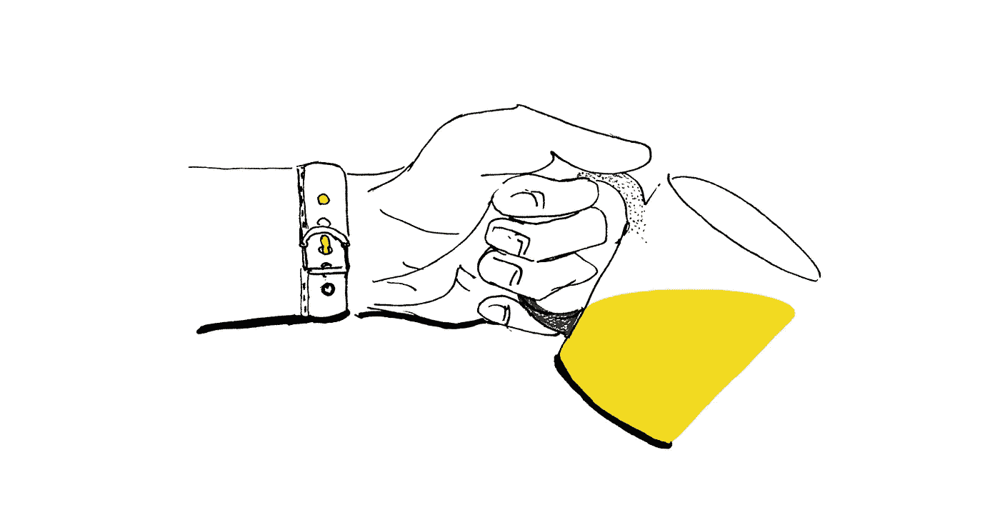

# 推出 ICO——为创业融资的新方式？

> 原文：<https://medium.com/swlh/launching-an-ico-a-new-way-to-fund-your-startup-e37df8e92a3a>

今年早些时候，我和我的商业伙伴开始了我们的创业冒险。我们做了正确的步骤(理论上):做了广泛的市场调查，阅读了[“The Lean Startup”](http://theleanstartup.com/)，准备了商业模式画布和基本行动计划，辞去了我们的有偿工作，推出了一个 MVP，收集了潜在客户的反应和反馈，围绕它重新设计了产品，然后我们还必须考虑资金问题，因为如果我们想快速上市，下一个版本将需要不止两个人。

# 传统筹资方式

我们已经研究了相当多的融资方案，以下是我们认为的每种方案的主要利弊*:

# 机构资金

欧洲小企业资助方案和其他地方或区域赠款:

*   优点:一旦你的项目被批准，(在大多数情况下)你不需要把钱还回去，没有股权
*   缺点:过长和复杂的申请过程，平均数额(足够几个月，但不是整个产品开发)，强制性和复杂的报告
*   我们的交易障碍:花费在管理上的时间

# 传统风投和天使投资者

*   优点:你有某个在该领域有专长的人，他可以把你和潜在的合作伙伴或其他专家、导师、潜在的客户联系起来
*   缺点:尽职调查期可能需要 6 个月或更长时间(平均创业期的⅓)，强制转让股权/股份(高达公司所有权的 30%)，需要繁重的管理和报告
*   对我们来说，交易破坏者:其他人正在为贵公司的未来做出关键决策

# 催速剂

那些提供种子资金的公司——不是所有的公司都这样做，所以如果你走那条路，确保你事先清楚这一点。

*   优点:接触教练和导师，接触行业专家和投资者
*   反对意见:如果他们给你钱-他们要求股权，我们在这里谈论的是非常小的金额，你几乎无法生存几个月；他们中的许多人都很新，还在学习中，所以支持并不总是有保证的
*   我们的交易破坏者:为了几千欧元放弃 5-10%的股权

# 众筹

*   优点:对世界开放，大多数平台收取你总收入的 5-10%
*   缺点:你必须回馈一些小玩意，额外津贴，如果你没有一个小的实体产品，这可能会变得相当困难；人们参与的金额很小，所以你必须说服更多的人获得适当的资金，因此你必须开展一场巨大的营销活动——几乎与 ICO 一样大，太多人这样做了，所以即使是最小的营销错误也会产生影响
*   对我们来说，交易的阻碍因素是:为了很小的金额而付出太多的风险、时间和精力

# 伙伴关系

或者试图说服(通常是小的)老牌公司合作开发技术或市场

*   优点:如果你成功说服了他们，你就有了一个强大的风险共担伙伴(有史以来最好的收获之一)
*   缺点:没有财政支持，你必须放弃大部分股权，他们中的一些人甚至想要股权+部分服务费，你要花很多时间去寻找他们并建立合作关系，在他们被说服之前，你必须放弃很多想法
*   对我们来说，交易破坏者:如果你有一个绝妙的想法，而你只是在寻找一个在这个领域比你更有经验的合作伙伴，你就冒着他们窃取你的想法并自己实施的风险——这至少发生在我们身上

# ICO 利弊

在某个时间点上，我们还决定探索“街区上的新小子”ICO，以下是我们的发现:

*   优点:相对快速，完全无股权，来自世界各地的投资者和潜在客户(除了美国和其他几个目前限制 ico 的国家)，相对较大的金额可能-你可以获得所有你需要的资金，以在未来几年内发展你的公司
*   缺点:复杂的结构，很少有开发者知道技术，不成熟的论坛生态系统，支持服务等等。税收和将加密货币转换回“真实”货币的棘手情况，您的项目必须集成代币和区块链的使用，风险非常大——不能保证成功
*   我们的交易破坏者:技术和生态系统的成熟度

> *请注意，这只是我们根据在欧洲创业生态系统中的经验得出的观点，但我们仍然认为值得分享。

# 我们的选择还是为什么是 ICO？

我们权衡了上述所有融资方式的利弊，决定采用 ICO。高风险的同时也是高收益的。我们找到了一种将代币整合到我们的商业模式中的方法，这甚至为我们打开了一个新的市场。最后，这在很大程度上是关于承担风险、全力以赴并保持对公司的控制，以及放弃股权以换取更安全的资金和支持之间的平衡。

我们将在这个每周系列的下一篇文章中揭示更多我们的 ICO 之旅和发现，敬请关注。

# 想进一步了解我们公司和 ICO？

查看[startAround.co](http://www.startaround.co/)网站的新闻和更新，或者加入 startAround [Telegram](https://t.me/joinchat/EiULqhJWpz9G7paL2ytQsw) 讨论，从我们这些创始人那里获得第一手信息。

## 这个故事发表在[的《创业](https://medium.com/swlh)上，这里有 262，800 多人聚集在一起阅读 Medium 关于创业的主要故事。

## 在这里订阅接收[我们的头条新闻](http://growthsupply.com/the-startup-newsletter/)。

