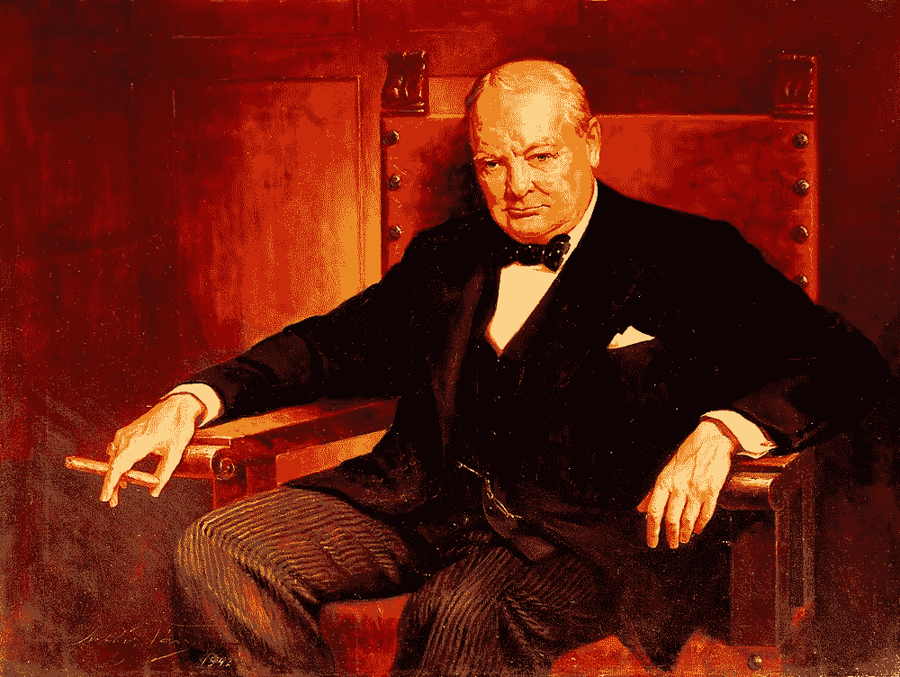
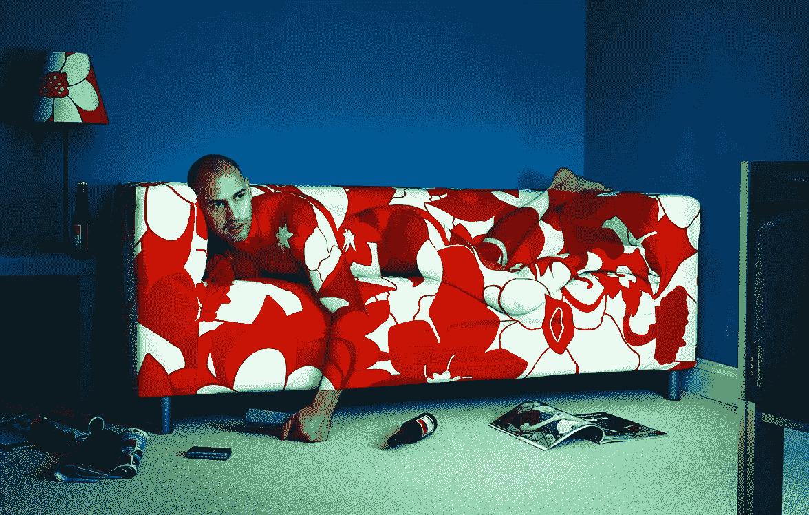
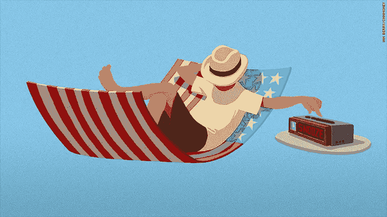

# 懒惰帮助你思考什么是重要的

> 原文：<https://medium.com/swlh/laziness-helps-you-think-about-what-matters-c67a3ac2bd37>

Image Credit: [kingandmcgaw](https://www.kingandmcgaw.com/prints/arthur-pan/sir-winston-churchill-101368#101368::media:0)

我们不可能总是 100%的时间都超高效。

即使是埃隆·马斯克也有不建造火箭飞船，只是坐着喝咖啡吃甜甜圈的时候。我一直相信这样一个谎言:为了得到你想要的东西，你必须时时刻刻拼命工作。

我不是说我们都应该懒惰；我想说的是，我们都会有懒惰的时候。

如果你认为你从不懒惰，并且总是“精力充沛”,那么你是在欺骗自己。

# **沉思**

有没有洗热水澡，然后站在热水底下超过十分钟的经历？你只是一时懒惰。

你曾经坐在沙发上，翘着脚什么都不做三十分钟，却没有看一本关于如何提高自己的书吗？你只是又懒了一会儿。

有没有去买了一杯咖啡，坐在那里喝了很长时间？是的，你猜对了，你又变成坏男孩/坏女孩了。

让我问你一个问题:*“在这段懒惰的时间里，你的思想有多清晰？”*

我敢打赌，你的答案会是“很棒，很棒，很棒，等等”

那是因为在懒惰的时候，你的思维是最好的。只有当你懒惰的时候，你才能停止追求你的目标，想想你到底在做什么。如果你总是在跑比赛，那么你永远不能后退一步去思考整体策略。

> **我们中的许多人一生都在不停地追求目标，但从未真正思考过我们在做什么或为什么。**

如果我们花更多的时间故意懒惰，那么我们会看到我们的生活是什么，并能够做出必要的改变，将我们带到下一个层次。

Image Credit: Getty Images / [Simon Winnall](https://www.simonwinnall.com/)

# **深度思考**

我发现当我偷懒的时候，我内心最深处的想法就会向我展现出来。

举个例子，站在浴室里什么也不做，有助于我思考。当我问自己那些真正深刻的人生问题时，比如“当我死了，这一切到底有什么意义？”

你需要进行深入思考的精神状态不是一部充满通知的电话，互联网的过度刺激和一瓶伏特加。当你懒惰的时候，清晰的思维就会出现。

你的思想感觉像是自由的，可以做它想做的事情。你的思维没有试图“活在当下”或有创造性或解决另一个商业问题。你的大脑什么也不做，这时它可以做你迫切需要做的深层思考。

我们迫切需要做更深入的思考。我们比以往任何时候都需要它。

> “我们接触了太多的 FOMO，当我们懒惰、无所事事时，我们可以逃避社会对我们的压力”

Image Credit: [Erick M. Ramos](https://www.erickmramos.com/)

# 在某些方面，我变得更懒了

我现在做的比以往任何时候都少。

我全年只有两个目标，而去年有十个。我已经接受了我新发现的懒惰作为思考和创新的方式。通过变成人们眼中的懒惰，我已经把不重要的和重要的分开了。

人们眼中的我懒惰实际上只是我有创造力。我的创造力在虚无、寂静和一点懒惰中茁壮成长。

# **生产力真的变成了不专注的工作**

懒惰的对立面是生产力。虽然人们看起来工作很忙，我们都认为我们因为科技而变得如此高效，但实际上我们比以往任何时候都更没有效率。

我们在做分散注意力的工作，充满了干扰和通知，很少有深入的工作。

与懒惰的不同之处在于，它在你的头脑中创造了杠杆，这样它就可以放松。一个放松的头脑可以做专注的、有创造力的、有趣的、有深度的工作。

> 一个压力很大的大脑只是试图做最少的事情，并勾掉一个无止境的待办事项清单。不专注的工作在情感上是痛苦的，甚至比懒惰更糟糕。

# **无所事事的懒惰转化为更高的生产力**

上周，我在欧洲呆了三个星期，没有发表博客文章，这让我感到内疚。我的 Medium 和 LinkedIn 参与度下降了三分之二。

我感到内疚，因为我在假期里偷懒去探索世界。你知道真正疯狂的是什么吗？虽然完全懒惰，根本不写博客，但我的想法比以往任何时候都多。我回到澳大利亚的家，带着一种不同的写博客的方式和一个更深层次的原因！

当我徒步穿越意大利海岸，探索 1992 年奥运会举办地的时候，我设法让自己的大脑停止思考写博客。通过不去想我喜欢的事情，我回家时比以往任何时候都更有效率。无所事事的懒惰通过增加创造力转化为更高的生产力。

我的写作水平提高了一个层次。

我想出点子的能力变得更强了。

我写博客的方式变得更有效率了。

这一切都是由于懒惰和三个星期无所事事造成的。

Image Credit: [Ian Berry](http://www.ianberry.nyc/ed-gr/)

# 利用懒惰去思考什么是重要的，然后付诸行动

> “把懒惰作为一种工具固然很好，但不要把这篇文章误认为是一张许可条，让你变成一个肥胖的懒汉，无所事事。”

在某些时候，理想的情况是在你的懒惰期过后，你仍然需要做这项工作。没有行动的懒惰不会是你希望的灵丹妙药。懒惰本身并不是你想要的。

在懒惰之后采取行动是一种很有效的探戈舞蹈。一点来自 A 列，一点来自 b 列。懒惰期和工作期。

# **我不再害怕懒惰**

当我生活中有一段时间变得懒惰时，我不会再为此生气。

*为什么？因为我知道接下来是我做过的最好的作品，这对我来说很重要。*

你有同样的机会。不要害怕偶尔偷懒。你不可能一直在线。有时候你不得不关掉。

> 懒惰是一张你每周至少要放一次在日程表上的出狱自由卡。

降低你的生产力。利用你的懒惰。

*原载于* [*Goalcast*](https://www.goalcast.com/2018/10/05/laziness-get-ahead/)

# 行动呼吁

如果你想提高你的工作效率，学习一些有价值的生活窍门，那就订阅我的私人邮件列表吧。你还将获得我的免费电子书，它将帮助你成为改变游戏规则的在线影响者。

[**点击这里马上订阅！**](http://timdenning.net/free-ebook)

## 这篇文章发表在 [The Startup](https://medium.com/swlh) 上，这是 Medium 最大的创业刊物，拥有+ 376，592 名读者。

## 在此订阅接收[我们的头条新闻](http://growthsupply.com/the-startup-newsletter/)。

