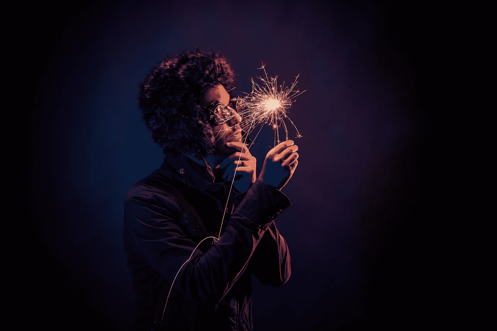

# 以丰富而非匮乏为导向

> 原文：<https://medium.com/swlh/lead-with-abundance-not-scarcity-d4639b8b15a7>

几天前，当我坐下来写这篇文章时，我正要点击发表按钮，但令我极度恐惧的是，我意外地删除了整个 2000 字。

我非常沮丧，不知道如何才能再次创造它。可笑的是，当我在写“选择富足而不是匮乏”的时候我意识到，如果我要说到做到，这不仅要扩展到工作、人际关系和财富上，还要扩展到我们必须在任何特定时刻创造更多所需的丰富内部资源上。

所以我把我的思维模式从稀缺转变为丰富——当你盯着一个空白的电脑屏幕时，这并不容易，5 分钟前，它还包含着你所有的珍贵单词，都整齐地按正确的顺序排列。

事实上，当我与这种心态斗争时，我的女儿在一旁看着我，大声说道:

“同样的事情发生在我身上，我发现我第二次写的东西往往会比第一次写得更好。”

孩子们能够获得完全有意义的智慧真是太棒了。她的评论激励我重新写了一遍，知道总会有更多。我们都不是稠密的空物体。我们是智慧、潜力、创造力和无与伦比的力量的源泉。

因此，我又坐下来，重新写了一遍整件事，尽管感觉有所改变。

几年前，我可能会在遇到第一个障碍时就放弃，说服自己只能写一篇关于这个主题的文章。有限的思维模式创造了有限的行动、有限的可能性和有限的决定。

我们的心态会影响我们所适应的事物。

你要么因为恐惧(匮乏)而行动，要么因为信任(富足)而行动。恐惧和信任不能共处一室。一方必须离开房间，让另一方进来。

一天中，我们倾向于在思维定势中上下波动。当我们情绪低落时，我们的资源在减少，自信在减弱，稀缺心态就会抬头。

**在这段时间里，一切都感觉有限，所有的路都不通向任何地方，所有的可能性都被关闭和禁止。**

这对我们的外表、我们的选择、我们选择交往的人以及我们被迫忍受的工作都有巨大的影响。

它也转化为我们白天的谈话和我们使用的肢体语言。在我们的反应中变得更加需要、焦虑和消极。那是稀缺的心态；我们都经历过，我认识的人没有一个能幸免于此。

我们抓住我们被给予的东西，就像一个人在哈罗德冬季大拍卖中拿走最后一件商品一样。就好像这是一生一次的机会，永远不会重复，所以抓住它，不要放弃。

但是我们忘记了哈罗兹每年都有大减价。那里有更多的存货。当我们带着“匮乏”的有色眼镜生活时，生命是有限的。尽管我们想要的东西(甚至更多)多得令人难以置信。

我最近辅导了一个客户，他是一个非常有才华的多面离婚律师，但他仍然对远低于他能力的工作机会做出反应。

原因是他不相信会有更好的事情发生。他非常担心万一没有其他东西提供给他，他会错过任何东西，在这个过程中，他经常感觉自己被贬低了。

他带着匮乏的心态生活，(这与他的银行存款余额无关)。在我们的一次会议中，他正在纠结是否要接受一位首席执行官提供的工作，这位首席执行官在整个电子邮件交流中一直在贬低他。

所以我问他。

“想象一下，如果你知道有五位首席执行官急切地想雇用你，你会坚持给你提供的工作吗？”

我还没来得及把问题说完，他就回答说“不”。

我的客户开始想象，如果他知道总会有更多的机会，那么生活会是什么样子。

他的肢体语言改变了，他深呼吸了，他活了过来。这将意味着他必须在活动中战略性地建立关系网，在那里他可以遇到合适的商业联系人，更多地使用 Linkedin 来培养合适的商业关系，以获得合适的人的推荐和推荐。但是球现在在他的球场上，由他来创造合适的机会，所有的机会都在那里。

这并不是坐下来调整所有的脉轮，在罐子里烧香来带来正确的共鸣。这是关于真正地从这个空间中生活，并从丰富的能量中采取所需的行动，而不是缺乏。

这也不是妄想。我的客户非常有活力，聪明，多才多艺，经常旅行，会说几种语言，口齿伶俐，非常合格。

**他应该得到更好的结果，而不是因为害怕没有其他东西存在而最终贬值。因为这根本不是真的。**

然而，我们都经历过，由于焦虑和不信任而贬值了自己的价值。所以我们妥协了，我们降低了标准，我们想知道为什么 30 年后，生活还是这个样子。

不管我们是哈佛毕业生还是高中辍学生。在这方面，学术教育是没有用的，我看到我的女儿们经历了学术过程，我清楚地看到它没有为她们准备好更大的游戏。

因为这关系到一个更大的游戏。

**这是内心的游戏。**

提升你的标准，从有意识的思考中创造一种生活，溢出到你所做的选择中，并影响从现在开始所创造的一切。

想象一下登上玻璃电梯。

最初，你只能看到有限的全景，但随着电梯上升，你开始看到一个更广阔的景观，比你从下面站着的地方想象的还要广阔。你的思维也是如此。当你在有意识的思想中上升时，你的思维扩展了，你开始看到更多的机会，这些机会是你困在底层时从未看到的。

小时候，老师和父母反复向我们灌输“双鸟在林不如一鸟在手”这句话。这基本上可以解释为——满足于你所拥有的比冒险失去一切去寻求更多更好。

中世纪时代带来了某种程度的满足，无论我们被给予什么，并且不惜一切代价只接受“安全”的选择，不管它是否让我们精神上冷漠和缺乏灵感。

想象一下，如果我们手里的这只鸟是一只哑弹，几乎不会飞，而且生病了。如果丛林里的那些能指引我们找到更好的东西呢？

这有风险，但很有趣，而且(更重要的是)可以让你学习和成长。

一旦你体验到这个世界已经拥有了你所需要的一切，你就知道你已经准备好了，这会增强你的适应力和足智多谋，没有什么能破坏这一点。

在过去的岁月里，在我意识到这一点之前，我会陷入注定失败的关系和工作中，让我毫无灵感。在我知道我应该得到更好的那一刻，我的频率改变了，我开始吸引以前永远不会出现在我视野中的机会。

我现在可以清楚地看到前后的对比。当这些心态在我头上盘旋时，生活会是什么样子。

在我做治疗师的那些年里，我相信我的余生将注定是一个离婚的母亲，拿着有限的薪水，看着那些抑郁、有自杀倾向和上瘾的病人。尽管我的工作很有声望，但我做梦也没想到会有更多的可能。虽然我暗暗希望我错了。

我乘坐的电梯一直卡在底层，所以我看到的只是一维的生活，没有任何问题，但在我的直觉里，我知道还有更多。

这是一次偶然的机会，在我还是一名临床医学家的时候，我遇到了一位教练(更多的是出于好奇，而不是其他原因)，这让我印象深刻，也让我看到了更多我可以看到的全景。

当我坐在伦敦西北部的诊所里时，在我最疯狂的梦想中，我会想象几年后我会离开治疗行业，成为一名蔻驰，提出令人垂涎的教练建议，成为一名公共演说家，与国外令人难以置信的专业人士合作，并出版我的第一本书。

**我知道还会有更多，我总是不得不相信这一点，即使自我怀疑袭来。**

如果我有可能，你也完全有可能。

如果你知道所有你想要的都在那里，你需要做的就是伸手去拿，你会伸手去拿什么？

如果你本能地知道可能性是无穷无尽的，你将不再容忍什么？

随着我们进入年中，这不仅仅是一个希望和祈祷事情会有所不同的时候。这是一个反思你想要创造什么的时候，也是一个抓住所有等待你去抓住的难以置信的机会的时候。

如果这篇文章引起了你的共鸣，你可以在我的新书 [中阅读更多类似的章节，看看里面:停止寻求开始生活](https://www.amazon.co.uk/dp/1781332959/ref=cm_cr_ryp_prd_ttl_sol_0) **现在亚马逊上有售。**

**如果你想和我分享这篇文章的观点，请发邮件给 micheleattiascoaching@gmail.com**

 [## 首页|米歇尔·阿提亚斯生活蔻驰&演讲者

### 作为一个忙碌的专业人士，你的生活可能看起来很棒，但在完美的外表下，你会发现…

www.micheleattiascoaching.com](http://www.micheleattiascoaching.com/) 

这篇文章发表在 [The Startup](https://medium.com/swlh) 上，这是 Medium 最大的创业刊物，拥有 281，454+读者。

## 在这里订阅接收[我们的头条新闻](http://growthsupply.com/the-startup-newsletter/)。

