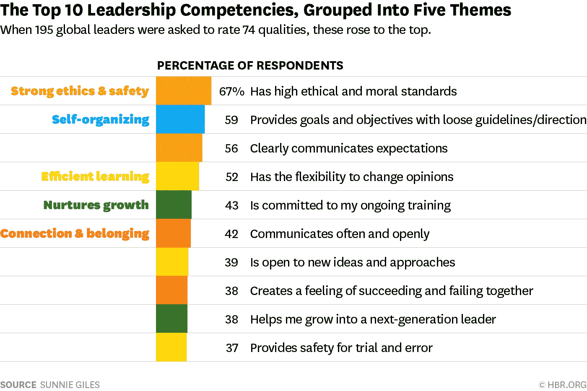

# 领导力(名词):领导能力

> 原文：<https://medium.com/swlh/leadership-n-capacity-to-lead-eb05c9253698>

> ˈlē-dər-ˌship

Photo by [Ethan Weil](https://unsplash.com/photos/IrI889hknhc?utm_source=unsplash&utm_medium=referral&utm_content=creditCopyText) on [Unsplash](https://unsplash.com/search/photos/team?utm_source=unsplash&utm_medium=referral&utm_content=creditCopyText)

我们谈论了很多关于打破创新周期、创造和传播指数级技术、扩展人类的话题。我们都需要发展我们的领导力，以实现有意义的突破，推动我们自己、我们的企业和我们的未来。但“领导力”到底是什么？？？在谷歌上简单搜索一下就晕了。

[据布朗大学的 Joe Iarocci](https://serveleadnow.com/why-are-there-so-many-leadership-books/) 称，2015 年 10 月，亚马逊提供了 57136 本书名中带有“领导力”一词的书籍。根据他调查的数据，每天有 4 本关于领导力的新书出版！他认为大量领导力书籍背后有 5 个原因:

1.  **许多人可以随意发表对领导力的看法。**
2.  读者对领导力书籍有许多不同的品味。
3.  **任何人都可以出版一本领导力书籍。**
4.  **领导力的实践是不断发展的。**
5.  **描述领导力的方式没有限制。**

在不计其数的书籍、文章和视频中，有一个来源自 2013 年末以来一直激励着我，它简洁、成功、精致地解释了当今伟大领导者的特质:[来自](http://roselinde_torres_what_it_takes_to_be_a_great_leader) [BCG](https://www.bcg.com/) 的 [Roselinde Torres](https://www.bcg.com/about/people/experts/roselinde-torres.aspx) 的 TED 视频。她说，21 世纪的领导力由三个问题定义和证明:

*   你认为你的商业模式或生活的下一次变革会发生在哪里？伟大的领导者都不会低头。他们放眼未来，塑造未来，而不仅仅是对未来做出反应。
*   你的个人和职业利益相关者网络的多样性衡量标准是什么？所以这个问题是关于你和与你截然不同的人发展关系的能力。伟大的领导者明白，拥有一个更加多样化的网络是更高层次的模式识别的来源，也是解决方案的来源，因为你有与你想法不同的人。
*   你有足够的勇气放弃过去让你成功的做法吗？伟大的领导者敢于与众不同。他们不只是谈论冒险，而是实际去做。最有影响力的发展出现在当你能够建立起情绪上的耐力来承受人们告诉你你的新想法是幼稚的，鲁莽的，或者只是愚蠢的时候。

L 领导力与头衔无关，很明显，在成为伟大的领导者之前，你必须成为一个伟大的人。好消息是，很明显，随着时间的推移和实践，大多数领导特质是可以学习和提高的。以下是 HBR 于 2016 年发布的[全球领导者最重要的领导能力:](https://hbr.org/2016/03/the-most-important-leadership-competencies-according-to-leaders-around-the-world)

很高兴看到“拥有强大的道德”是领导者的最高能力，因为解决每项颠覆性技术的道德问题显然是优先事项&在增加创新的同时避免负面的意外后果，特别是在人工智能和大数据时代。

> 简而言之:
> 
> 预见变化，拥抱观点的多样性，敢于与众不同，将你的激情与高伦理道德标准结合起来。

祝你好运！

如果你觉得这个故事有趣，请随意鼓掌一次、两次或五十次👏👏👏👏👏

如果你看不够，就关注我的[媒体](/@ezgitasdemir)和[推特](http://twitter.com/ezgitasdemir4)🤗

这里还有一些你可能会感兴趣的文章:

[真实性](/swlh/oath-to-authenticity-b60d761fa904)

[用心的领导者](/swlh/the-mindful-leader-an-interview-with-michael-bunting-901c38742cff)

[战略学习](/swlh/strategic-learning-an-interview-with-professor-willie-pietersen-510314827a3d)

*Ezgi Tasdemir 是诺华肿瘤公司的员工。本文由 Ezgi Tasdemir 创作。所有观点、分析和观点完全独立，仅属于作者，不代表诺华或任何其他公司或组织的观点或意见。作者没有从诺华或任何其他制药/非制药公司获得任何资助或支持。*

## 这个故事发表在 [The Startup](https://medium.com/swlh) 上，这是 Medium 最大的创业刊物，拥有 317，238+人关注。

## 在这里订阅接收[我们的头条新闻](http://growthsupply.com/the-startup-newsletter/)。

