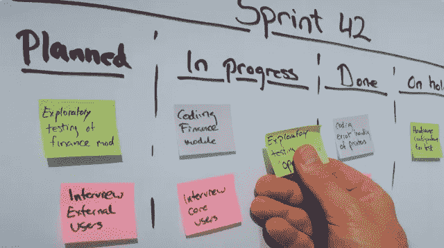
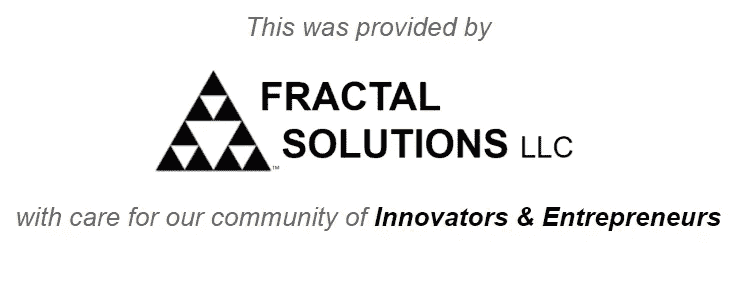
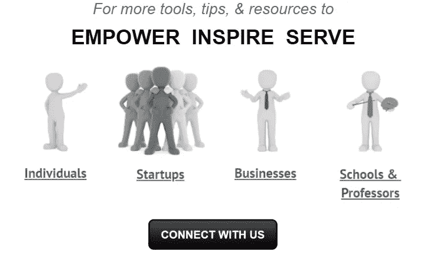

# 了解如何在您的公司实施看板

> 原文：<https://medium.com/swlh/learn-how-to-implement-kanban-in-your-company-ffaf11a26dde>

## 你知道什么是看板吗？你知道怎么实施吗？

您知道看板可以用来管理办公室活动，被认为是一种精益办公工具吗？丰田著名的生产系统给市场带来了许多新概念。丰田系统中一个众所周知的部分是看板。

# **什么是看板？**

在 20 世纪 50 年代的日本，**丰田**，*日本最大的公司之一*，正经历着一段极其艰难的时期。在应对稀缺资源和技术问题时，日本巨人遇到了困难。丰田寻求开发一种新的生产系统，以更少的浪费带来更多的利润。这一努力创造了后来被称为**的丰田生产系统**。

通过可持续发展寻找利润，丰田的哲学将他们引向了支柱之一"**及时，** " *经常与看板*混淆。

**准时制**，或 **JIT** ，是*根据市场*需求生产的一种技术，消除了维持库存和按需生产的成本。JIT 是在正确的时间制造正确数量产品的过程，而看板系统是管理 JIT 的工具。

该系统的一个基本概念是以尽可能小的批量生产、*理想情况下一次生产一件产品*。这一概念可以应用于服务公司，以帮助管理同时进行的各种活动的混乱场景。因此，**看板是一种在交易和阶段驱动的活动中具有巨大潜力来提高生产率的工具**。

# **该方法如何工作**

在日语的直译中，术语“看板”的意思是“卡片”这是描述看板系统的好方法。该方法包括使用卡片(如果没有使用[数字工具](https://teamslux.com/?lang=en&utm_source=Fractal%20Solutions%20LLC%20Blog)，有时是便利贴)来指示和可视化公司的生产进度或流程。这个系统以使用很少的资源而闻名，使它变得实用和容易理解。

看板系统对应于一个框架，在这个框架中安排公司某个特定项目或部门的所有任务。**看板高度可视化的本质使员工能够轻松理解需要满足的截止日期和里程碑。**

用两个主轴**来组织这个框架是很流行的:一个用于任务，一个用于阶段**。第一个轴是所有需要执行的任务卡。第二个轴由不同的状态组成，如“*进行中*、“*完成*、“*未完成*”等。在这个布局中，您只需将任务卡或便利贴插入与其状态对应的轴中。就这么简单！当你开始使用整合这一过程的数字工具[时，它会变得更加深入、简化和富有成效。](https://teamslux.com/?lang=en&utm_source=Fractal%20Solutions%20LLC%20Blog)

与今天的技术相比，这看起来很简单，甚至有些过时，但是看板仍然非常有效。

**员工可以使用如此多的新工具，但通常简单的任务可视化帮助最大。**

文本信息并不总是被所有人很好地理解，经常需要重新表述它，甚至完全重新解释它。 **看板系统**然而，遵循着一句名言“一图胜千言。”因此，它利用了我们大脑的视觉处理能力，这比我们阅读纯文本要快得多。

通过组织一个项目或公司方面的活动流程，并使用高度可视化的框架，你将**帮助你的员工以更容易的方式看到进展**。这意味着那些参与未决任务的人之间的交流将以一种更简单和更具说明性的方式进行。

# 最棒的是…

***您可以使用 Lux Systems 制造的*** [***团队平台***](https://teamslux.com/?lang=en&utm_source=Fractal%20Solutions%20LLC%20Blog) ***上的看板和其他工具，比以往任何时候都更好地管理您的会议、项目、任务。***

[**团队**](https://teamslux.com/?lang=en&utm_source=Fractal%20Solutions%20LLC%20Blog) 正在革新公司的管理。

## [**了解团队如何帮助你的公司**](https://teamslux.com/?lang=en&utm_source=Fractal%20Solutions%20LLC%20Blog)

[***获得免费演示***](http://teamslux.rds.land/request-a-demo?utm_source=Fractal%20Solutions%20LLC%20Blog)

## 在 www.FractalSolutionsLLC.com 了解更多信息

*FTC 披露:如果您购买本页所列的某些商品或服务，我们可能会获得补偿。我们只列出我们信任的资源。补偿并不影响我们的推荐，但确实使我们有可能向我们的观众提供免费内容和有价值的折扣。我们的目标是授权、激励、服务创新者和企业家。*

## 这篇文章发表在[《创业](https://medium.com/swlh)》上，这是 Medium 最大的创业刊物，有 340，876+人关注。

## 在这里订阅接收[我们的头条新闻](http://growthsupply.com/the-startup-newsletter/)。

