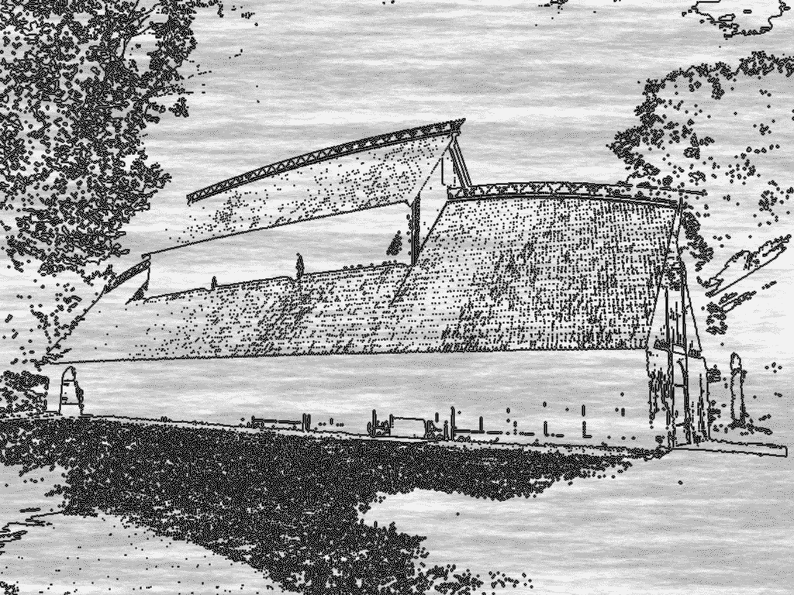

# 多学点技能，为了你的未来！

> 原文：<https://medium.com/swlh/learn-more-skills-for-your-futures-sake-e816b09472fa>

## 未来属于那些学习更多技能并以创造性的方式将它们结合起来的人――罗伯特·格林，精通

Photo by [Porapak Apichodilok](https://www.pexels.com/@nurseryart) on [Pexels](https://www.pexels.com/photo/boy-child-clouds-kid-346796/)

我个人很喜欢这句话！真正理解它是我改善未来旅程的第一步。

我知道你也能做到！

并不是说我的未来一定不好，但是我知道生活不仅仅是早上 8 点起床，朝九晚五的工作，回家，做饭，吃饭，玩电子游戏和睡觉。

冲洗并重复。

你也有这种感觉吗？

难道不是缺少了某种“更高”的目的吗？

我做这份工作会给世界带来什么？

我不想只是“在”地球上。我想在地球上“做”。或者我猜也许在不久的将来火星也是如此！

这并不是说我“朝九晚五”的工作很糟糕。实际上很棒。我不断地学习，并和一群技术高超的人一起工作。我喜欢认为我的表现很棒，我做得很好，但内心深处缺少了一些东西，但我不知道是什么。

# 当事情开始改变时

9 个月前，当我离开多伦多成为一名流浪者时，我已经开始将全部注意力放在我的创业上。太棒了。我完成了这么多。

然而，仍然缺少一些东西:我根本没有学到很多东西。

> *“把今天当作你生命的最后一天去生活；学习就像你会永远活着一样*。圣雄甘地

学，**学**，**学**。

你能学的东西没有限制。直到我开始研究如何快速学习新技能，我才知道这是真的。

在我每月学习 3 项新技能的 5 个月中，我发现的唯一能学得更快的方法是学习更多不同的技能。

> **越学越多。**

你的大脑会记住模式，并将它们储存在你的记忆中。你“储存”的模式越多，建立新联系和快速吸收新模式的速度就越快。

现在，我不是大脑专家，但这似乎与我在过去一年左右阅读的关于这个主题的更科学的东西一致。

这难道不是好消息吗？

> 要学得更快，你只需要学得更多！

学习是一个既愉快又痛苦的过程。你的实验会不断失败。只有当你不放弃它们的时候，你的学习才会进步。但是一旦你获得了知识，你就可以用它做任何事情。尤其是如果你考虑到上面的引用:“学习更多的技能，并以创造性的方式将它们结合起来”。

# 未来和成功

按照大多数现代标准，我可能没有一年前那么成功了:

*   我没有一个可以称之为家的地方；
*   我没有工资；
*   我的创业公司还没有一家真正起飞。

> 然而，不知何故，我感到前所未有的成功。你知道为什么吗？因为我非常开心，我在做更有影响力的事情！

我非常熟练。

我做了很多我从来不知道自己能做的事情。如果我从来没有尝试过，我仍然会编码我的生活，不知道我其实有其他的事情我可以做。

这就是为什么我拒绝只专注于一件事的想法。因为，说真的，在尝试其他事情之前，谁真正知道自己最擅长什么。很多事情。一大堆东西！说真的！

我不知道我会画画，直到去年十月我试了试。直到去年 11 月，我才知道自己能搞清楚零售业是如何运作的。我不知道我能写，直到我在一月份试着写。

# 技能组合的最新表现

The Mead Hall

现在，我不希望你认为这个故事的全部意义是为我的最新业务做广告，但我只是认为这是一个以创造性的方式结合技能的很好的例子。

经过一段时间的构思，我昨天开设了维京精品店。说实话，我其实直到昨天才想明白。

从表面上看，它可能看起来像一个正规的商店(我希望不是)，但它真的不是。

**我把我的写作技巧、商业技巧和绘画技巧结合在一起，让它成为现实。**

维京精品店讲述的是 8 世纪的维京人哈拉尔德·戈德斯金的故事。他卖的每样东西背后都有一个故事。我写了这些故事。我画了图像。每周，他都会出售在最近一次突袭中发现的新商品。每次突袭都有一个故事。米德大厅是讲述故事的地方。这是商店的博客。这不全是为了卖来自中国的廉价货。

# 学习如此多技能的进化

如果你 9 个月前告诉我，我会:

*   被[在网上卖维京的东西](http://www.vikingboutique.com)；
*   有没有[出了一本书](https://amzn.to/2H8zKyz)，第二本也要来了；
*   指导一位来自印度的雄心勃勃的工程师；
*   已经增肌 8kg
*   我收到了完成我的游戏的资助；
*   有[不大成功的博客](/@danny_forest)；
*   与一位来自西班牙的新朋友开始了一项文本到语音的业务；

我会告诉你你疯了。

然而，我坚信这一切都始于有意识地计划并努力工作，每月学习 3 项新技能。

> 一旦你致力于自我提升，并且找到了一个可行的框架，就没有什么能阻止你了！

# 结论

> “今天的你并不是明天的你。”——[*兹德拉夫科*](https://medium.com/u/206228785f04?source=post_page-----e816b09472fa--------------------------------)

记住这点！

要做到这一点，一个万无一失的方法就是坚持不懈地学习新技能。

你会以你意想不到的方式改变。你将会比你想象的做得更多，取得更大的成就。你会完成你的目标。你会做一些对你、你的周围以及更远的地方都有影响的事情。

你能做到的！

**感谢阅读和分享！:)关注我更多类似的故事！**

准备好让你的学习更上一层楼了吗？查看我的课程！

## 这个故事发表在 [The Startup](https://medium.com/swlh) 上，这是 Medium 最大的创业刊物，拥有 314，551+人关注。

## 在此订阅接收[我们的头条新闻](http://growthsupply.com/the-startup-newsletter/)。

