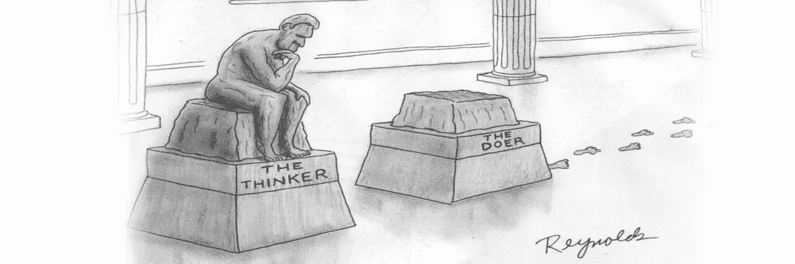

# 在实践中学习:高等教育收益和保持的关键

> 原文：<https://medium.com/swlh/learning-by-doing-the-key-to-higher-learning-gains-and-retention-6ee0e8c47b81>

俗话说，“经验是最好的老师。”

从来没有说过更真实的话。

有真实世界的经历还是有话说的。做一个实干家是令人垂涎的。

从我记事起，我就一直喜欢学习。事实上，我仍然为自己是一个终身学习者而自豪。这很有趣，因为我从来没有对任何事情感到满意，因为我觉得总有新的东西要学。

# 一种独特的学习方式

在过去的几个月里，我一直在为我的女儿参观和面试竞争激烈的独立学校。一天早上，我在纽约参加一个家长参观活动。像大多数这样的旅行一样，有一个给父母的介绍。当所有的家长都坐下来等待演示开始时，有人分发了信息包。

在包裹里，有一本小册子，上面有一段深刻的引言。上面写着，

> *“一个孩子如何学习将永远影响他或她的一生。”*

我完全被震撼了。

从那以后，我一直在思考这句话。

除了引言，这所学校最让我惊讶的是他们独特的就业项目。

我记得我在想，*“什么小学或中学有工作计划？孩子们不是应该在学习吗？”*

哦，但是他们是通过实践来学习的。

这所学校为体验式学习提供了一个独特而真实的环境。每个学校小组负责一项对学校日常运营至关重要的工作。

例如，8 人负责学校的邮局。他们制作学校邮箱，整理用品，设计邮票，制定价目表，每天收集、分拣和投递邮件。

所以随着参观的进行，我注意到几个孩子快速穿过大厅。我很快意识到他们在收发邮件。

**它并没有就此停止。**

九个孩子经营学校商店。是的，一个真正的商店。他们负责管理库存，跟踪和订购产品，并记录销售和费用。

> (这是我最喜欢的！当我看到这个的时候，我真的很奇怪…当我写这个的时候有点奇怪)

10 是学校的标志制造者。这个创意团队确保所有的健康和安全信息都张贴在学校各处。他们还制作手写或数字的标志，以识别建筑中的所有房间。

11 人经营印刷店。他们正在学习如何在 19 世纪 90 年代的钱德勒普莱斯踏板印刷机上进行活版印刷排版。他们负责印刷学校文具、节日贺卡和其他印刷品。

12 人有一项独特的工作，他们充当 4 人的助手。他们负责扮演一个支持者的角色，就像美国的老大哥大姐一样。学校将这些小组组合在一起，教导 12 岁的学生如何成为有责任心和同情心的人。

这 13 个人是学校的记者。他们负责出版校报。

超级毒品学校。这是我见过的最棒的学校之一。

> 现在暂停一会儿，想想这些意义不大的机器每天都在学习什么。

8 是学习协作、组织和后勤。9 正在学习供求关系、比较定价、消费者行为和客户服务。学习语言和书面交流。11 人正在学习文化和交流。12 岁的孩子正在学习研究并成为负责任的公民。13 岁的学生正在发展写作和人际交往技能，并学习用于设计校报的设计软件。

但是回到你身上。

你选择如何学习？希望通过做。

# 边做边学的好处

边做边学转化为更高的学习收获和记忆。

> 孔子曾说:*“我听了就忘。我看见了，我记得。我知道，我理解。”*

让它浸泡一会儿。

我知道你想取得非凡的成就，但仅仅尽力是不够的。**你需要尽可能以最好的方式做到最好。**

没有比做你想学的事情更好的学习方法了。

如果你想学习如何成为一名更好的作家，那就写作吧。如果你想学习如何成为一个更好的演讲者，那就说吧。如果你想学习如何成为一名企业家，那就去创业吧。

你可以看所有你想看的书。你可以挑所有你想挑的脑洞(请不要挑脑洞，那样很奇怪)。除非你真的把手弄脏，去做那该死的事情，否则你永远也不会有成为任何事情的大师所需要的能力。

现在替代体验有了用武之地。你知道，接受导师的建议或者观察你崇拜的人。

但是谁愿意忍受损失一百万美元或经历离婚来吸取教训呢？我当然不喜欢，所以我会整天吃那些替代品。

对于其他事情，我每次都选择边做边学。

有时这是一次很棒的经历，而有时却很痛苦，但同样，这是学习的最好方式。

你不能给实际体验定价。你得到上下文。有知识是一回事。但不会自动转化为技能。

想知道发展一项技能的最好方法吗？做这项工作。

This is me telling you to “just do the f***ing work.”

我是这样给人解释的…

你知道雨闻起来像什么吗？

如果你曾经闻到过下雨的味道，你的脑海中可能会浮现出各种各样的画面。不仅如此，你现在还能闻到雨的味道。这就是语境。

一个更具体的例子是骑自行车。

你可以读一本书或者看别人骑自行车，但是除非你骑上自行车开始叫卖，否则你永远也不会明白。

很可能有一天你会忘记你在那本书里读到的东西。但我可以向你保证，即使 20 年后，你将能够拿起一辆自行车，开始骑行，不会错过一步。

你只能从边做边学的心态中获得。

那么，你打算如何将它应用到你的旅程中呢？让我知道。

—

## 像这样？给我看看下面的♥！

***德万·穆通加*** *在*[*DewaneMutunga.com*](http://dewanemutunga.com/)*写道，在这里，他通过教导创业者如何掌握自己的心理和利用系统，让他们能够过上最充实的生活，从而让他们更聪明地工作。在推特上关注他*[*@ DewaneMutunga*](http://twitter.com/dewanemutunga)*。*

*要获得更多关于建立高杠杆业务和过上更充实生活的有用建议，* [*加入他的免费简讯*](http://dewanemutunga.com/newsletter/) *。*

*原载于 2017 年 4 月 17 日*[*dewanemutunga.com*](https://dewanemutunga.com/learning-by-doing/)*。*