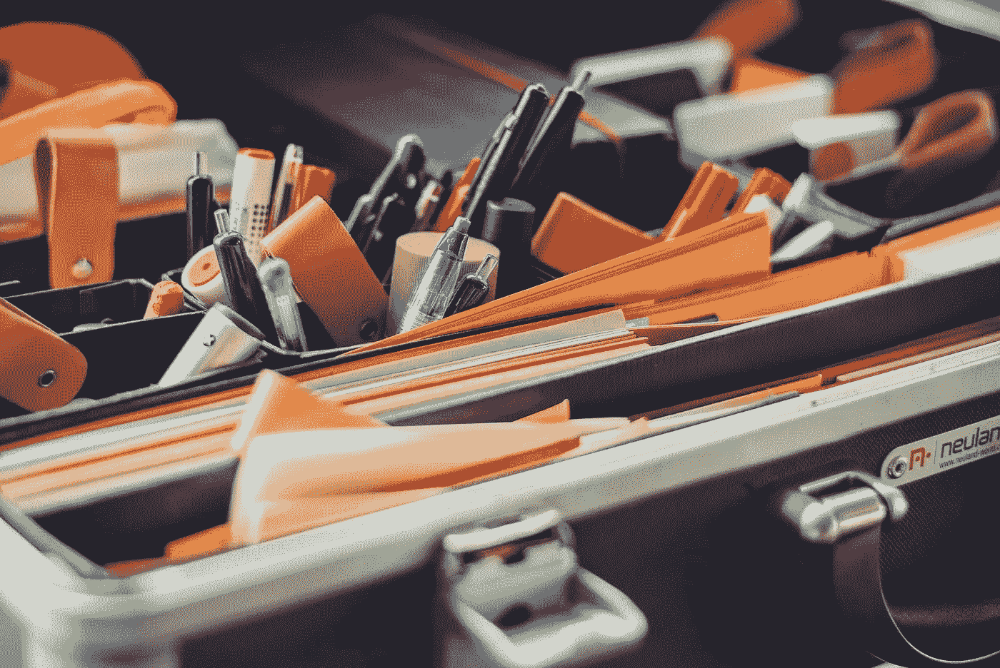

# 学习自我管理需要应用

> 原文：<https://medium.com/swlh/learning-management-of-yourself-takes-application-c1479466849e>

虽然现在有很多关于自我管理的书，但是阅读它们会给你一个想法——一个大纲——但是直到你尝试了它们，你才会知道它们的建议和技巧是否真的有用。

我已经读了那些书的一小部分，但是还算不错，并且深入地看了看我能从它们身上学到什么。