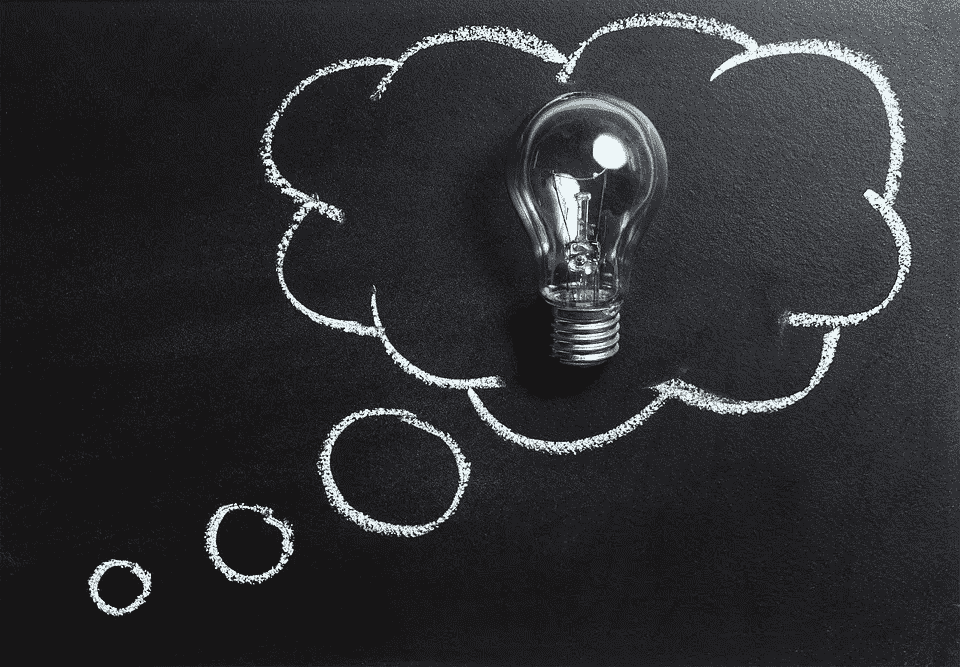

# 学习学习！

> 原文：<https://medium.com/swlh/learning-to-learn-bb737357401>

# 保持学习活力的几种方法。

Stock photo from pixabay

不久前，我开始在我的脸书墙上写下# today yielded 的标签。这最初是随机的，但随着时间的推移，我意识到我已经有目的地从我的日常生活中寻找教训来分享。我也逐渐认识到学习是一门需要学习的学科(你可能想发微博说出来！).不幸的是，我们已经把学习和知识联系起来了。也许有一部分，但远不止如此！如果你搜索“学习”,你会找到许多定义，不幸的是，这些定义与课堂学习有关，而课堂学习只与知识有关。有一个地方，但我喜欢的是与这个定义或相关的类型:

> “学习是一个接受信息的变革过程，当信息内化并与我们所经历的相混合时，它会改变我们所知道的并建立在我们所做的基础上。它基于输入、过程和反思。它改变了我们。”松明·宾汉姆和玛莎·康纳(新社会学习)

你会发现许多定义——你可以从这里的[开始](http://theelearningcoach.com/learning/10-definitions-learning/)，但是一致的是学习是可操作的——意味着它转化为行动。这是一个过程:意味着你欺骗自己说你已经到了！它是变革性的——与之前和之后相比有了显著的变化。这归因于一系列的环境和经历。还有很多其他的东西。

那么，我们如何才能在日常生活中满足学习的需求呢？我敢建议几件事！

1.敞开心扉，从日常经历中学习。建立学习文化是生活中一个全新的层面。不幸的是，没有人教我们这样做。例如，在你的部门中销售最多的人可能只能用他的姿势或肢体语言来感谢他的好运。现在，除非你观察并挑选出一些他们做的不同的事情，这是你永远不会注意到的。公司软件只会提示你获取老板们关心的东西的信息——底线。然而，许多重要的东西更具艺术性，更难识别，更不用说量化了。

2.感激你不知道所有的事情——你也不需要知道。这是谦逊的一课。我们每天都需要喝一点。下次你参加演示时，有意识地思考一下这个问题。最有可能的是，你会观察某人的穿着，他们的声音或口音等等，在你听到他们说的任何话之前，你的潜意识已经决定是否要认真对待他们说的话。

3.在统计学中，我们用平均值来衡量很多东西。不幸的是，平均值与异常值正好相反。生活往往会引导我们趋向平均水平。这就是为什么你会听到这样的话，平均这个和平均那个。但是我们都是独特的。学会学习就是学会调查离群值。平均是众所周知的中庸之道。但离群值在外围。如果你没有有目的地观察周边，你就会错过那里的一切。

4.不断学习。你昨天学的东西今天可能会过时。这与我们一直被教导的内容有明显的不同，与选修另一门课程无关。我们将去学校，学习我们需要知道的一切，然后开始从我们在学校多年的辛劳中捞钱，不幸的是，这不再是真的了。

5.记录它，编译它，分享它！书面文字有一些特殊之处。随着时间的推移，它向我们展示了我们已经成长了多少。因此，如果你不喜欢写博客，你需要考虑开始。我们想向你学习。最初，平台并不重要，但实践很重要。但更自私的是，再过几年，你会意识到你在向你学习！即使在《圣经》中，上帝也命令摩西书面记录他们穿越荒野的过程，这难道不是一个奇迹吗？

你是如何保持学习活力的？请在评论中告诉我们。

## 这篇文章发表在[《创业](https://medium.com/swlh)》上，这是 Medium 最大的创业刊物，有 302，119+人关注。

## 订阅接收[我们的头条新闻](http://growthsupply.com/the-startup-newsletter/)。

