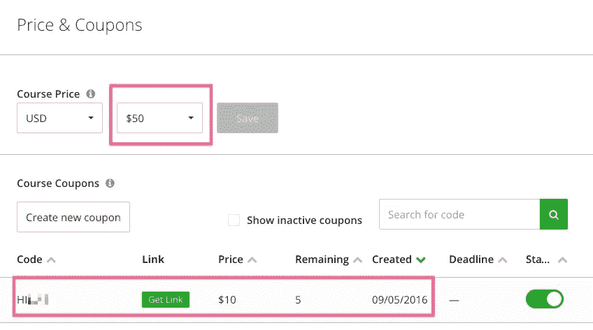

# 我在 Udemy 上开设第一门课程的心得

> 原文：<https://medium.com/swlh/learnings-from-launching-my-first-course-on-udemy-3c465d32754a>

我喜欢亲自动手做一些实验。创建一个关于 Udemy 的课程就是其中之一。

这是一次很棒的经历，我也很高兴分享我的经验来帮助你创建你的第一个课程。

**Udemy 课程:** [用 MySQL 5.7+ (2016)练习高级 SQL 查询](https://www.udemy.com/practice-advanced-sql-with-mysql/)

# 突出

*   我只花了 **40 个小时**就创造出了**评分为 4.9/5 的球场。**
*   到目前为止，我的总收入是 2220 美元——详细信息在最后。
*   最好的一个月是 2016 年 11 月，为我创造了 **880 美元**的收入。

Net earnings: $2,220\. Course rating: 4.90 / 5

# TL；学习博士

1.  一个很棒的课程(评分 4.9)可以在 40 小时的工作时间内快速创建— **。**
2.  为前 2000 名学生免费提供这门课程是可取的。**课程得到评级**并且学生的数量是可见的——这给了**很多可信度。**
3.  我的学生中只有 0.5%完成了 100%的课程讲座。
4.  只有 1.6%的学生完成了至少 50%的讲座。*真悲哀！*
5.  通常从网站访问到购买的**转化率**是 5%。在 11 月的特别促销活动中(70%的折扣)，转化率提高到 10%。
6.  我的电子邮件列表(1k+)中没有人购买该课程，这很令人惊讶。似乎更好的办法是向朋友免费提供课程，并要求他们给予好评。
7.  确保每次录制开始时 ***拍*** 。
8.  搜索引擎优化对 Udemy 也很重要。我的课程从第 4 页**的第**页开始，现在是目标关键字第 1 页的第**第 1 个位置。**
9.  没有人在推特上分享过这个课程。2500 名学生中的 0%。
10.  讲师的收入只是课程价格的一小部分。
11.  在曼谷，很难找到一个足够安静的房间来录音。一天的办公室租金是我的解决方案。
12.  一门课程永远不会完美。最好设定一个时间限制，然后释放你创造的一切。旷课。抄近路。发布

📚如果你想知道细节，请继续阅读。

# 创建新课程

当我准备课程大纲的时候，我定义了很多我想包含的有趣的主题。当我在准备讲座时，我发现这比预期的要花更多的时间，所以我取消了这些讲座。即使没有他们，这门课也获得了很高的评价，没有人注意到有什么东西“不见了”:-)

## 内容

对于技术课程，您需要创建以下内容作为讲座的附件:

*   **视频&音频**(截屏+带画外音的头像)
*   **幻灯片**(使用谷歌演示)
*   **示例代码**(保存为 Markdown 文件并导出为 pdf)
*   **学生的额外阅读资源**(从文档中分发)

Most of the lectures (i.e. S02-L02) have 3 files attached: slides, SQL and working file. GitHub repository. [https://github.com/michaljuhas/SQL-training-advanced](https://github.com/michaljuhas/SQL-training-advanced)

## 外卖和建议

*   课程永远不会是完美的，最好发布你所拥有的，并从用户那里获得第一手反馈。
*   时间管理和计划很重要。我早上 4 点起床，赶在我的孩子 7 点起床之前做完讲座。
*   设定一个目标，花费**少于 40 小时**然后释放。
*   我了解了麦克风的类型(动圈和电容)，最终买了 [**蓝色雪人**](http://www.bluemic.com/products/yeti/) 。
*   我试过几个投屏工具，购买了 [**Camtasia 2**](https://www.techsmith.com/camtasia.html) 。Udemy 导师有 50%的折扣——谷歌一下。
*   添加讲座**前缀，即 S01-L01** (=Session 01，Lecture 01)，它将帮助您组织讲座。
*   **启用几个讲座的预览**，让参观者更有信心*(确保这些讲座的内容很棒！).*

Lecture prefixes. Previews enabled.

# 屏幕广播

如果你录制了一段视频，我强烈建议**也附上你的头像**。这使得学习体验更加个性化。

录制两个视频并同步它们需要一些额外的工作，但这是值得的。

Screencast with headshot makes the lecture more personal and engaging.

💥**提示:**将每节课拆分成单独的录音，并说:*【鼓掌鼓掌】S02 L01 下午 3:45[等待 5 秒钟]大家好，欢迎来到第 2 单元第 1 课*

*   *【拍手鼓掌】*将在您的音频 **预览**中生成 **2 个尖峰，您将可以直观地看到这些尖峰，并且您将能够同步这 2 个视频(截屏&大头照)——确保在大头照上可以看到拍手声。**
*   **别忘了说时间**，不只是 S02-L01。您可能需要多次录制同一个讲座，这样同步会更容易。

## 外卖和建议

*   在联合办公空间预订一个房间，为期 1 天，记录一切。
*   确保在每次录制开始时*拍*。
*   试着在一天内记录下所有的事情，以便有相同的记录条件和设置。

# 视频录制设置

我在一个合作空间预订了一个安静的房间，并建立了我的录音室:

*   两台高清摄像机—一台足够了，另一台是备用的。
*   麦克风[蓝色雪人](http://www.bluemic.com/products/yeti/)。
*   耳机 [Jabra](http://www.jabra.com/) 配橙色线缆——是的，橙色是我最喜欢的颜色！
*   流行过滤器——我能找到的最便宜的。
*   笔记本电脑——Mac 似乎是视频录制的标准…#性感
*   截屏软件 [Camtasia 2](https://www.techsmith.com/camtasia.html) 。
*   用于课堂笔记的纸和笔(笔记本电脑屏幕已被记录，因此您需要额外的笔记)。
*   咖啡、茶和水——是的，这将是漫长的一天！
*   2-3 朵花🌼让你振作起来🙂

# 课程推广

我在头 10 天免费提供课程。大约有 2000 名学生报名，提高了好评率。

在它接触到 2，000 名学生后，我向我的电子邮件列表中的一部分人发送了一封带有 33%折扣优惠券的电子邮件。很遗憾，没有人使用此优惠券购买:-/

Email to around 1,000 email subscribers didn’t bring any sales. You can see the [full email content here](http://us13.campaign-archive1.com/?u=61aa72d6a1ee029b1c654236c&id=67dfcfc942&e=[UNIQID]).

## 外卖和建议

*   一开始就免费提供课程。
*   找到 10 个推广免费课程的脸书团体，并在发布日发布在那里(只要谷歌一下)。
*   请你的朋友提交好评。

# 搜索优化

有超过 200 门课程带有“sql”关键字。我选择了两个关键词来关注:

*   **sql 高级**(撰写本文时第一位)
*   **mysql sql** (撰写本文时第二位)

## 外卖和建议

*   选择几个目标关键词，每隔 3-4 天用课程描述和讲座标题进行实验。

Great! The **1st** position in search results for : **sql advanced** and **2nd** position for **mysql sql**

# 收入

您可以将课程设置为免费或从 20 美元到 200 美元不等。

请记住，作为一名讲师，你只能获得这个目标售价的一小部分。

## Udemy 定价是如何工作的？

*   **讲师自身推广** —讲师获得 97%的销售额。
*   **Udemy 有机销售** — 50%的收入分成。
*   **会员流量** —只有 25%的收入归讲师所有。

阅读更多关于[我的讲师收入份额](https://support.udemy.com/hc/en-us/articles/229605008-Instructor-Revenue-Share)的信息。

Big spike of revenue in November. Udemy was pushing big sale — 70% off.

## 更新:2017 年 1 月 11 日

*   12 月是一个好月份，这要感谢圣诞促销——521 美元
*   2007 年 1 月 20 日，Udemy 推出了纽约的宣传片😃目前收益率为 343 美元。感觉这个月也会是个不错的月份！

## 优惠券

如果你有一个受众来推广你的课程，你可以创建一个折扣券并将其发送到你的电子邮件列表，或者分享给 FB/TW/LN 粉丝。

## 68 折？真的吗？！

Udemy 可以随时决定为您的课程提供折扣。2016 年 11 月，他们甚至推出了 68 折的课程。

即使你作为教师不喜欢你的课程有如此大的折扣，你也无能为力。

In an incognito tab I can see they give 68% discount to new visitors. Ridiculous.

# 特色课程

有一件事我还没想明白:如何成为特色？我相信这会极大地促进销售。

如果有人知道，请告诉我！:)

# 与学生交流

Udemy 允许为学生设置这些自动消息:

*   给新生的欢迎词
*   **祝贺消息**给那些完成课程的人
*   **面向所有学生或部门的促销公告**(每月 2 次)
*   **面向所有学生或部门的教育公告**(每月 4 份)

如果你有更多的课程，比如一门免费课程和一门付费课程，宣传公告会很棒。我只有一门课，没有什么可以交叉推广的，所以还没用过这个功能。

The automated messages: a) welcome message and b) congratulations message.

## 外卖和建议

*   清楚地表明这是一个自动的欢迎信息。人家又不傻。
*   没有必要要求学生在 Twitter 上分享——到目前为止还没有人这样做。
*   一定要让学生给好评。
*   考虑创建一个免费的课程来获得线索，另一个付费。在免费课程中向学生发送宣传公告。

# 课程网站转换

我已经在 Udemy 课程登陆页面安装了 Google Analytics。交通非常稳定，每天大约有 200 名游客。

通常约有 5%的游客会购买该课程。在 11 月的特别促销期间，转化率为 9–10%。

遗憾的是，10 次销售并不意味着讲师获得 500 美元的收入。凭借巨大的折扣(高达 70%)、代销商收入分成(讲师仅获得 25%)和退款，我们谈论的是每天 10 美元的净收入。虽然不多。

Special promotion in November — all courses for $15 — increased the traffic significantly.

During the special promotion in November, lots of students purchased the course.

# 美妙的学习经历

创建我的第一门课程是一次巨大的学习经历&很有趣。还有那点被动收入也没问题！😃

我希望这篇文章能激励你走出舒适区，尝试新的课程。请在评论中告诉我，好吗？👀

# 更多见解和最佳实践

我对加速成长和学习充满热情。和我一起探索父母可以从创业环境中运用什么来养育他们的孩子。

激情、企业家精神、**早期学习、**快速阅读、**家庭学校、**编码和机器人技术如何帮助**加速我们家庭的教育和成长？**

## [报名](https://growth.michaljuhas.com/subscribe/)学习如何最大限度地发挥孩子的潜力:

 [## 订阅:为现代热情的父母成长

### 回答希望最大限度发挥孩子潜力的父母的问题。教育体系陈旧，学…

growth.michaljuhas.com](https://growth.michaljuhas.com/subscribe/)