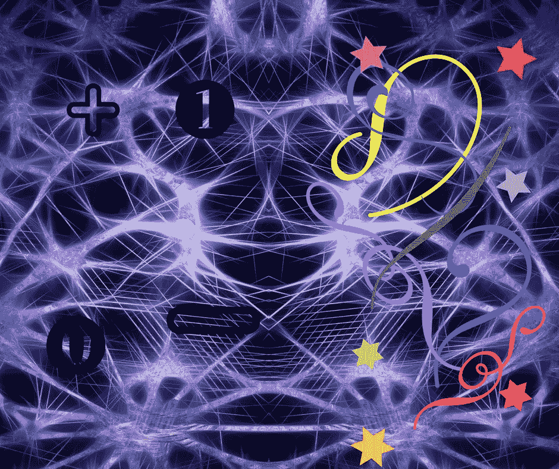

# 左脑还是右脑？为什么不两者都要？

> 原文：<https://medium.com/swlh/left-brain-or-right-why-not-both-a3b5ff390cbe>

人们喜欢谈论自己是左脑还是右脑，并经常以此作为借口，来解释为什么他们认为自己不擅长做他们认为应该由大脑另一边来做的事情。

创意人员会说“我不懂数学”之类的话，而工程师们经常会举手宣称他们无法“理解”艺术。

当然，我们可能倾向于逻辑任务和创造性任务，但这并不意味着我们只使用我们大脑的一侧或另一侧——暴露一种严重的疾病或损伤，损害大脑的一部分。我们需要双方边走边想，吃太多薯片。

All or the other

也就是说，无论是双手都很灵巧的人，还是也写代码的摇滚音乐家，都很少有人能平等地使用这两方面。除此之外，它们可能没有我们想象的那么罕见，只是我们根据第一次见到它们的方式将它们归类为一种或另一种。我们假设电影制作人是右脑思考的，当他不制作音乐视频和独立短片时，不可能设置服务器配置。我们在精算科学课上看到这个人，但无法想象他在朋克乐队中演奏。我们惊叹于那些身为律师或工程师的浪漫作家，他们利用空闲时间创作杰克逊·波拉克作品的微型复制品。

然而，如果我们仔细想想，我们可以看到相似之处。电影剪辑软件需要和服务器设置一样多的注意力、技术知识和组织技能。音乐，无论是朋克还是古典，都遵循取悦观众的模式，需要设备的安排，分层的声音，通常还需要空间意识，以便在演出结束后将所有设备放回车里。

当我们声称自己拥有一个或另一个大脑时，我们经常会排斥另一个大脑，进而将自己与我们可能喜欢的技能和活动隔绝开来。我们也没有意识到我们已经拥有的技能。

# 换句话说，我们低估了自己。

不要总是低估自己。和你大脑的两边(和个性)交朋友。拥抱你的矛盾和细微差别。更重要的是，接受你不是千篇一律的一维存在，你不是刻板印象或卡通。你是你明亮和令人敬畏的多维自我。

现在，去做你自己的怪人吧。

# 嘿，你能走到这一步，想想鼓掌？两个？面包师的一打？祝你有美好的一天，别忘了闪耀。

## 这篇文章发表在[的《创业](https://medium.com/swlh)，这是 Medium 最大的创业刊物，拥有 277，050 多名读者。

## 订阅接收[我们的头条新闻](http://growthsupply.com/the-startup-newsletter/)。

