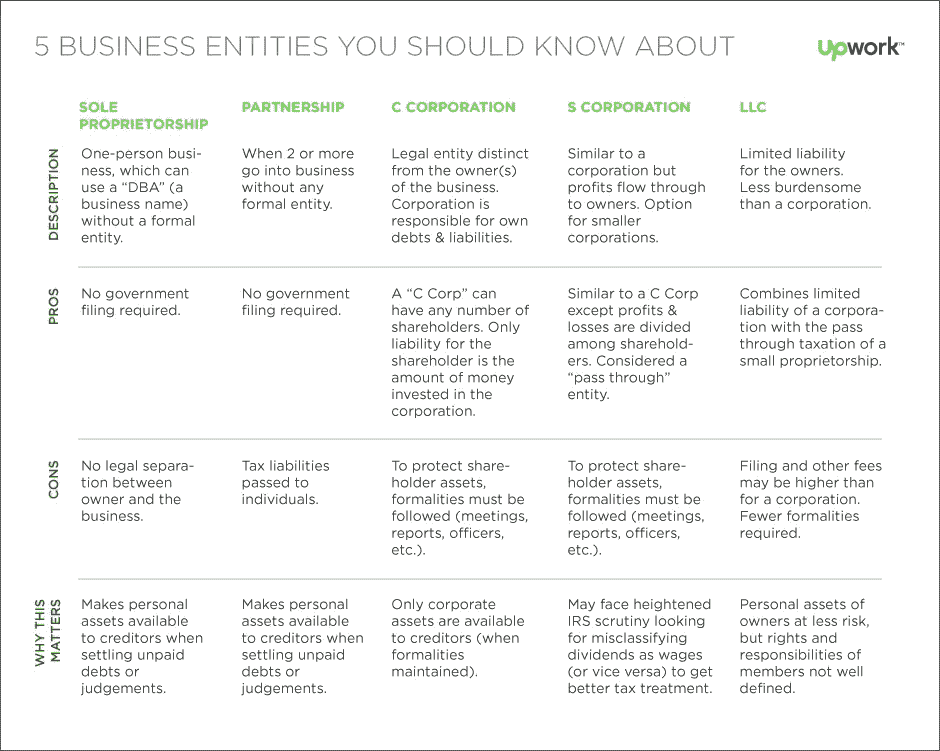
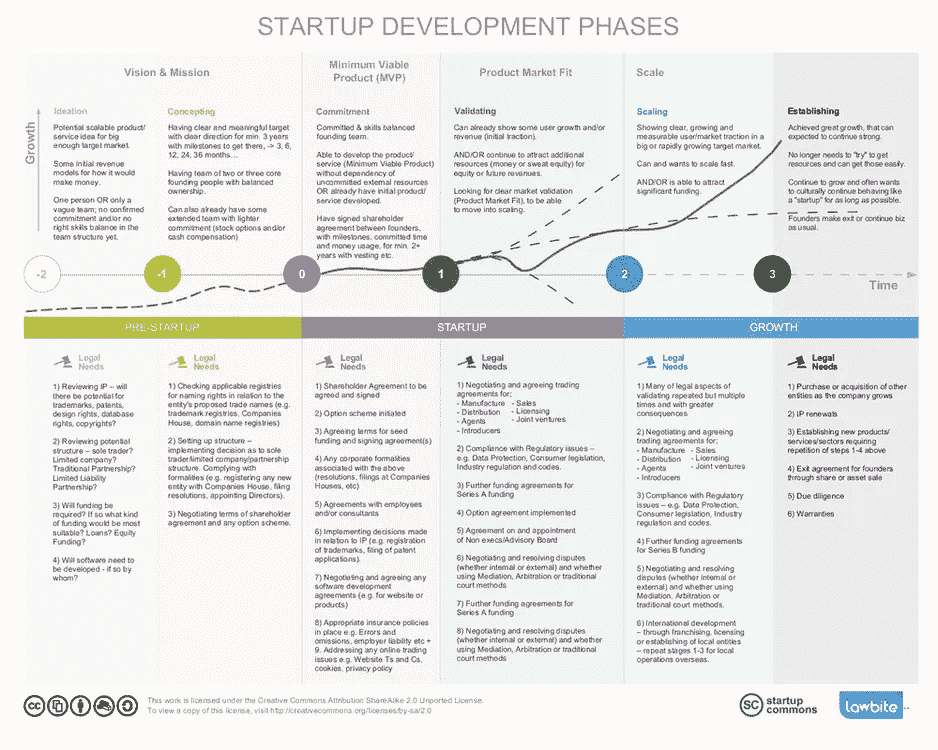

# 创业法律 101:12 分钟简介

> 原文：<https://medium.com/swlh/legal-101-for-startups-12-min-introduction-b085e8885d93>

Originally published at [http://www.appsterhq.com](http://www.appsterhq.com/?utm_source=CP&utm_medium=Medium)

虽然创业不是“最性感”的部分，但创始人必须熟悉与创业相关的基本法律原则和实践。

事实上，创始人做出的每一个法律决定都有可能严重影响公司的合作伙伴、投资者、员工甚至客户。

创业者有必要了解创业法 101。

为了有助于这一追求，我将提供一个入门指南，介绍启动和扩大新业务所涉及的最重要的法律决定。

# 一句忠告

[早期创业创始人](http://www.appsterhq.com/blog/early-stage-entrepreneurs-launch-profitable-startup)陷入了一点困境。

一方面，他们经常被告知，雇佣一名经验丰富的律师来专业处理创业的所有法律问题是非常重要的。

但另一方面，他们通常缺乏聘请合格律师所需的资金。

因此，本简短指南旨在作为一种折中方案:

*   它列出了所有初创公司创始人必须做出的核心法律决定的总体思路，
*   但它肯定不能替代实际的法律建议或选择。

在做出重大商业决策之前，收集尽可能多的信息总是最好的，尤其是那些**专门为你的公司**量身定制的信息。

如果你有必要的资金，那么我们建议在对你的创业公司进行重大法律变更之前，先咨询一下专业律师。

# 1.成立公司的形式

作为创始人，你必须做出的第一个重大法律决定之一是，你的初创公司将采取何种特定的法律形式。

公司是指创建一个独立于企业所有者的法律实体的行为。

根据[投资媒体](http://www.investopedia.com/terms/i/incorporate.asp)，公司成立是…

> “…t *用于组建公司实体或公司的法律程序。公司是独立于其所有者的法律实体，拥有自己的权利和义务。*
> 
> *世界上几乎所有国家都可以成立公司，通常在名称中使用“股份有限公司”或“有限公司”等术语来标识。*
> 
> *公司注册包括起草名为“公司章程”的法律文件，列出企业的主要目的、名称和地点，以及发行的股份数量和股票类别(如果有)。”*

在 [大多数情况下](https://www.slideshare.net/DentonsGlobal/startup-legal-basics)，成立一家初创公司会产生一种情况，即公司作为一个独立的实体，拥有自己的一套责任、义务和特权，凌驾于公司所有者之上——从税收、融资、就业到合同和债务。

在美国，股份有限公司可以采取不同的形式，包括独资企业、合伙企业、有限责任公司、C 公司和 S 公司(来源: [1](https://www.entrepreneur.com/article/75118) 、 [2](http://fitsmallbusiness.com/llc-vs-s-corp-vs-c-corp/) )。

让我们依次简要回顾一下其中的每一项。

**独资**:

*   最常见且最容易创建；
*   仅允许单一所有者的企业；
*   所有者和企业之间没有法律上的区别；
*   主要优势:更优惠的税收待遇和易于创建；
*   主要缺点:所有者的个人资产面临风险，即他们可能被用于支付企业的债务/义务(包括诉讼)。

**合伙**:

*   由两个或更多个人拥有的；
*   容易形成；最低的前期成本；
*   每个合伙人都可以贡献金钱、劳力或能力来换取公司的所有权；
*   主要优势:税收优惠和易于创建；
*   主要缺点:个人对商业义务的责任，以及合作伙伴的争斗/分歧。

**LLC** :

*   完全受州法律管辖；
*   所有者必须选择国税局如何征税(例如，作为独资企业、合伙企业或公司)；通常，税收“转嫁”给有限责任公司成员；
*   所有成员都承担有限责任；
*   主要利益:实用性和灵活性，因为它们将公司的有限责任与合伙企业的税收利益结合起来；
*   主要缺点:与独资企业或有限合伙企业相比，运营成本可能稍高。

**C 公司**:

*   [QuickBooks](https://quickbooks.intuit.com/r/structuring/sole-proprietorship-partnership-llc-or-corporation-whats-right-for-your-business/) 提供了全面的概述:

> “如果你渴望在证券交易所上市，a C 公司是你的理想选择。被认为是独立于其所有者的法律实体。
> 
> 公司为股东提供有限责任保护，将个人资产与商业债务隔离开来。
> 
> 然而，C 类公司受到“双重征税”,不享受税收优惠待遇。
> 
> C 公司的利润在公司一级纳税一次，股东在个人一级再次纳税。重要的是要认识到，股东可能会丧失他们的有限责任地位，并被要求对 C 公司的债务和义务承担个人责任。"

S 公司:

*   将 C 类公司的有限责任辩护与合伙企业和独资企业的税收优惠结合起来；
*   限于股东人数不超过 100 人的公司；
*   与 C 类公司类似，如果违反公司手续，股东可能被剥夺有限责任保护；
*   主要缺点:建立起来相对困难和昂贵；灵活度低(来源: [1](https://quickbooks.intuit.com/r/structuring/sole-proprietorship-partnership-llc-or-corporation-whats-right-for-your-business/) 、 [2](https://www.slideshare.net/UNH_ORPC/startup-101-on-structure-equity-and-avoiding-legal-headaches?qid=83be0d71-e92d-4d92-a111-6d532549cd8d&v=&b=&from_search=4) 、 [3](http://innovation.ucsd.edu/wp-content/uploads/2017/03/UCSD-Intro-Entrepren-Series-3_9_17-v2.pdf) 、 [4](https://www.legalzoom.com/knowledge/knowledge-center) 、 [5](http://fitsmallbusiness.com/llc-vs-s-corp-vs-c-corp/) )。

选择错误的公司形式会给你的公司带来问题，包括:

*   不得不支付高于必要的税，
*   改变业务的困难，
*   并在各种情况下可能被追究个人责任。

一般来说，公司、有限责任公司和有限合伙企业为创始人提供了最多的好处，其中一个关键的好处是债权人的责任保护。

然而，大多数投资者倾向于将资金分配给 C 类公司，尤其是特拉华州注册的 C 类公司。

关于这一点，必须指出的是，许多美国公司都是在特拉华州注册的。

为什么？因为:

*   特拉华州的法院系统专门处理公司事务，在全国备受尊重；
*   在组建公司时，特拉华州为创始人提供了足够的灵活性、各种税收优惠和重要的隐私保护；和
*   根据 Nellie Akalp 的说法:“风险投资者和投资银行通常更喜欢特拉华州的公司，而不是其他州和商业结构。”

有关在特拉华州成立公司的潜在利弊的更详细分析，请参见[此处](https://www.legalzoom.com/articles/incorporating-in-delaware-advantages-and-disadvantages)。

像 [Stripe Atlas](https://stripe.com/atlas) 或[valcu.co](https://valcu.co/)这样的服务帮助初创公司在特拉华州注册。

最后，这里有一张来自 upwork.com 的精彩信息图，总结了每种不同类型公司的一些主要特征:

(Image [source](https://content-static.upwork.com/blog/uploads/sites/3/2015/11/03112354/Five-types-of-Companies.png))

# 2.税收和会计

创业者在创业时必须考虑许多复杂的税务和会计问题，这些问题中的每一个都可以成为一篇完整文章的主题。

我不会深究大量精确的细节，相反，我会指出创始人在创办新公司时必须做出的一些与税收和会计相关的重大决定。

首先，对于新企业来说，重要的是在合并后完成以下会计步骤:

*   开立一个专门用于商业交易的银行账户；
*   跟踪业务费用；
*   实行簿记制度；和
*   建立工资制度。

接下来，你必须熟悉州和联邦的纳税义务。

T he [美国小企业管理局](https://www.sba.gov/business-guide/launch/get-federal-state-tax-id-number-ein)对这些不同的义务提供了一个极好的介绍性概述，包括你可能会申请的联邦和州 ID 税号的需要和目的。

记住以下事实很重要:

1.  纳税义务因企业的法律结构而异。
2.  如果你是个体户(独资企业、有限责任公司、合伙企业)，你将在个人所得税申报表上申报营业收入。
3.  另一方面，公司是独立的税务实体，独立于所有者纳税。你从公司获得的收入作为雇员纳税。
4.  美国大部分但不是所有的州都有销售税(即有一小部分州不要求商家缴纳销售税)([来源](https://startupbros.com/stop-stressing-sales-tax-get-business/))；
5.  如果您的企业与您所在州之外的州有所谓的“[销售税关系](http://www.salestaxinstitute.com/Sales_Tax_FAQs/What_is_nexus)”，即重要联系，那么您完全有可能必须在您所在州之外的一个或多个州注册销售税许可证、向客户收取销售税并提交销售税申报表*—更多信息请参见[此处](https://www.thebalance.com/what-is-a-tax-nexus-398356)和[此处](https://blog.taxjar.com/sales-tax-nexus-every-state/)；和*
6.  在欧盟销售数字产品的美国初创公司通常必须缴纳新的欧盟增值税:仅仅因为你的企业不在欧盟，并不意味着你不需要缴纳这项税。
7.  欧盟现在根据顾客所在地而不是卖家所在地征收这种税。这意味着，如果你的美国数字业务卖给英国的客户，你必须支付增值税。

为了帮助抵消支付州税、联邦税、欧盟税和其他形式税的部分成本，一定要研究你的企业可能有权享受的各种税收优惠(如[可再生能源税收抵免](https://energy.gov/savings/residential-renewable-energy-tax-credit))。

此外，如果您计划向员工授予股票期权，一定要做好尽职调查:不遵守 IRS 准则这样做可能会给公司和员工带来负面的税务后果。

同样，所有向投资者和创始人出售的股票都将受联邦和州证券法的管辖。这些法律也适用于投资你的创业公司以换取股权的家人和朋友。

# 3.共同创始人协议

建立正确的联合创始人关系是我们一直给 Appster 的初创公司的建议。

在最近的一篇文章中，我指出了成功建立联合创始人合伙关系的 5 个关键策略:

1.  **及早定义角色职责**(集体决定哪些任务属于哪个联合创始人)；
2.  **创建并签署一份创始人协议**(敲定关于职责、股权和归属以及知识产权转让的具体细节)；
3.  **就时间承诺达成一致**(对每个人贡献多少以及何时贡献制定明确的预期)；
4.  **商定退出计划**(不要留下每个成员最终想对公司做什么的问题没有答案)；和
5.  **同意“我们失败了，现在怎么办？”计划**(尽早决定如何得出企业已经失败的结论，以及如何应对)。

联合创始人协议必须包含以下关键问题的答案:

*   谁得到公司的百分之几？这是否受制于[归属](http://www.appsterhq.com/blog/introduction-to-startup-equity)？
*   每位联合创始人在角色、责任和时间承诺方面有什么期望？
*   在哪些具体情况下可以解雇联合创始人？
*   创始人可以以什么价格回购被解雇或退休的联合创始人的股份？
*   做出关键业务决策的流程是什么？您将如何解决“死锁”的情况？
*   从每个联合创始人的角度来看，初创公司的总体愿景和使命是什么？

# 4.就业法

F 不遵守州和联邦劳动法( [1](http://webapps.dol.gov/elaws/elg/) 、 [2](https://www.dol.gov/general/aboutdol/majorlaws) 、 [3](https://www.dol.gov/whd/state/state.htm) )可能会对你的创业产生严重影响，包括可能会对你的企业中涉及的各种不同类型的个人提起刑事指控。

在其他常见的违规行为中，将员工错误分类为承包商和不向员工支付最低工资是两个典型的例子。

简而言之:如果一个人被要求在特定的时间出现在你的公司办公室，并且每天工作特定的时间，那么这个人就被认为是*员工*——不管合同中是否使用了不同的术语(例如，“承包商”)。

参见[此处](https://www.irs.gov/businesses/small-businesses-self-employed/independent-contractor-self-employed-or-employee)了解更多关于员工和独立承包商之间划分的信息。

A 要采取的另一个重要步骤是决定哪些类型的信息，例如成本数据、客户名单、一般财务数据、发明、产品规格等。—将被保密。

此外，作为一名创始人，你必须明确设计一项政策，并围绕防止工作场所的骚扰来实施实践。

最好的策略是尽一切可能阻止骚扰，因为一旦骚扰发生，它会极大地影响你公司的声誉和商业文化的健康。

# 5.隐私政策和使用条款

“隐私政策”可以被[定义为“声明公司或网站收集和发布访问者信息的政策”](http://www.businessdictionary.com/definition/privacy-policy.html)

[TechTarget](http://whatis.techtarget.com/definition/privacy-policy) 提供了一个更有帮助和更广泛的描述，指出:

> *“隐私政策是一份说明组织如何处理在其运营中收集的任何客户、委托人或员工信息的文件。*
> 
> *隐私页面应详细说明收集的任何个人身份信息，如姓名、地址和信用卡号，以及订单历史记录、浏览习惯、上传和下载等其他数据。*
> 
> *该政策还应说明数据是否可能留在用户的计算机上，如 cookies，或者用户数据是否可能与第三方共享或出售给第三方。”*

“使用条款”协议规定了用户在使用您的网站/应用程序时同意遵守的主要条款和条件。

换句话说，它封装了“开发者定义的可接受的数字媒体使用合同”([来源](http://www.dictionary.com/browse/terms-of-service))。

使用条款文档至关重要，因为它们在法律上确立了您的公司和您的用户之间的具体安排。

[TermsFeed](https://termsfeed.com/terms-conditions/generator/) 坚持认为，这些声明可以帮助初创公司防止滥用，保护其内容，保留其终止权利，限制其责任，并建立管理其运营的法律的位置。

说白了，详细透明的隐私政策和服务条款声明对 21 世纪的科技公司来说是绝对必要的。

即使围绕隐私保护和服务使用这两个领域的法律[有点不清楚](http://whatis.techtarget.com/definition/privacy-policy)，在当今以互联网为中心的世界中，任何创业公司都不应该在没有明确告诉用户它如何处理他们的数据以及用户可以从使用创业公司的服务中获得什么的情况下开展业务。

有一些真正受欢迎的服务可以让初创公司轻松创建一流的隐私政策和条款及条件声明，包括[克莱基](https://www.clerky.com/)、[卢本达](http://www.iubenda.com/en)和 [Snapterms](http://snapterms.com/) 。

# 6.知识产权

通常，科技初创公司最可行的资产是其知识产权。

说到保护您的知识产权，您有几种选择，包括:

*   **专利**(即“由美国专利商标局授予的与发明相关的有限持续时间的产权”([来源](https://www.uspto.gov/trademarks-getting-started/trademark-basics/trademark-patent-or-copyright)))；
*   **版权**(即“向包括文学、戏剧、音乐、艺术和某些其他智力作品在内的‘原创作品’的作者提供的一种保护形式”([来源](https://lawmart.com/copyright-vs-trademark-vs-patent/)))；
*   **商标**(即“在商品交易中使用的表示商品来源并与他人商品相区别的文字、名称、符号或图案”([来源](https://lawmart.com/copyright-vs-trademark-vs-patent/)))；
*   **商业秘密**(即“为企业提供竞争优势的任何机密商业信息”，如可口可乐的配方([来源](http://www.wipo.int/sme/en/ip_business/trade_secrets/trade_secrets.htm)))；和
*   **保密协议**(即“双方或多方之间用于表明双方之间存在保密关系的法律协议”——也称为“保密协议”(NDA) ( [来源](http://www.investopedia.com/terms/c/confidentiality_agreement.asp)))。

在 Appster 这里[，我们认为对于早期创业公司来说，专利通常是对宝贵资源的浪费——尤其是时间和金钱。](http://www.appsterhq.com/?utm_source=CP&utm_medium=Medium)

一般来说，它们成本太高，在初创企业中根本没有必要。

企业家应该把他们的钱用于实现他们的想法，而不是以每个 3 万美元的代价毫无必要地保护他们。[我写过](http://www.appsterhq.com/blog/reasons-why-startups-dont-need-patents)如果你想了解更多，为什么专利对科技创业公司来说通常是不必要的。

然而，*至关重要的是你:*

1.  商标你的品牌；
2.  购买相关域名(避免[“域名抢注者”](http://www.whoishostingthis.com/blog/2013/11/06/domain-squatting/)和其他试图利用你的成功的寄生者)；和
3.  与你的员工和共同创始人起草并签署全面的保密协议。

由[startupcommons.org](http://www.startupcommons.org/startup-key-stages-for-legal-services.html)提供的精彩而全面的信息图，详细描述了在创业生命周期的每个不同阶段出现的各种法律问题:

//

## 感谢阅读！

# 如果你喜欢这篇文章，请随意点击下面的按钮👏去帮助别人找到它！

> 最初发表于[http://www.appsterhq.com](http://www.appsterhq.com/?utm_source=CP&utm_medium=Medium)

