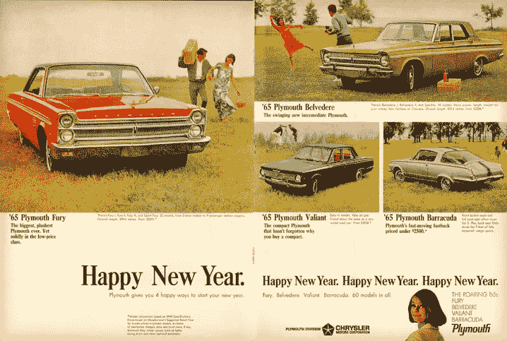
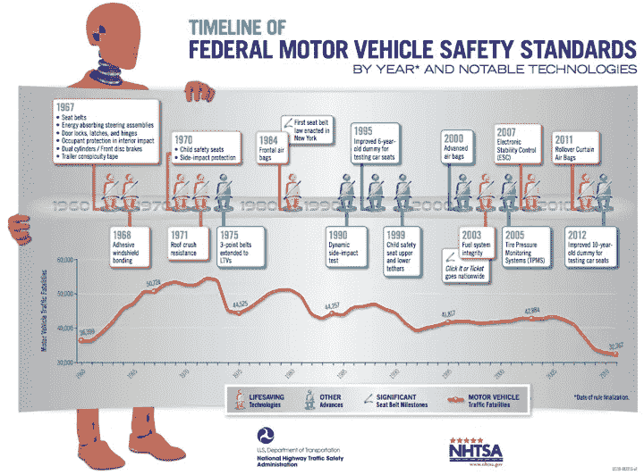
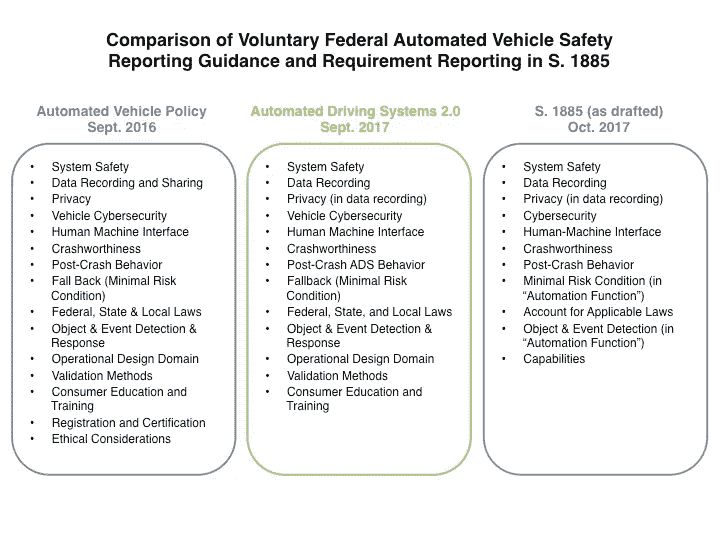

# 为自动车辆安全立法

> 原文：<https://medium.com/swlh/legislating-automated-vehicle-safety-77a1eea03bec>

1965 Plymouth Advertisement. Life Magazine, December 25, 1964\. ([https://www.flickr.com/photos/91591049@N00/15780044204](https://www.flickr.com/photos/91591049@N00/15780044204)).

1965 年，每加仑汽油的价格是 31 美分，雪佛兰 Impala 是美国最畅销的汽车，普利茅斯推出了“咆哮 65s”系列，5 万人——比以往任何时候都多——死于美国道路上。

正是在这种背景下，美国国会通过了《1966 年国家交通和机动车安全法》，这是第一部为机动车制定联邦安全标准的法律。这项 1966 年法案启动的安全和监管制度建立在人类驾驶车辆的基本概念上。随着自动化车辆的出现，美国监管汽车安全的系统需要全面更新。

当谈到汽车安全时，自动车辆(AVs)提出了一个有趣的命题。一方面，它们是事故的潜在万能药，随之而来的是交通伤亡。短信不会分散自动驾驶汽车的注意力；除非被编程，否则 AVs 不会在影响下驾驶，也不会超速或转弯过快。正如 NHTSA 在其著名的[报告](https://crashstats.nhtsa.dot.gov/Api/Public/ViewPublication/812115)中发现的那样，2005 年至 2007 年期间，94%的车祸是由司机的严重失误造成的。据推测，自动驾驶汽车将消除大多数此类事件。

另一方面，相对来说，AVs 还没有在我们国家的道路上测试过——它们被豁免遵守当前的安全法规，它们的制造商只被要求自愿提交安全报告。迄今为止，AVs 大多是由人类司机驾驶，准备在出现问题时接管控制权。但是自动驾驶技术在变化，监管也在变化。

参议院 AV 法案包括一项条款，禁止各州为运营基于残疾的 AVs 颁发许可证，这可能意味着 AVs 不能被要求配备方向盘或驾驶员控制装置(如果 S. 1885 通过成为法律)。此外，加州上周[宣布](https://www.theverge.com/2017/10/11/16458850/self-driving-car-california-dmv-regulations)将允许无人驾驶自动驾驶汽车从 2018 年年中开始在道路上行驶。在接下来的几年里，AVs 的功能将和火车非常相似:除非按下“全停”按钮，否则乘客将无法控制车辆。

在这三个部分的第二部分中，我们探讨了国会提出的自动车辆立法 [H.R. 3388](https://www.congress.gov/bill/115th-congress/house-bill/3388) 和 [S. 1885](https://www.congress.gov/bill/115th-congress/senate-bill/1885) 如何规范自动车辆的安全操作。

如果你错过了第一部分，这里有一个[链接](/@mraify/legislating-automation-how-congress-is-approaching-automated-vehicles-7887e7242528)，它专注于不包括卡车运输的重量限制，联邦政府对州政府的优先权，以及 AV 豁免数量的扩展到 10 万。

# 第三部分的第二部分:

*   机动车辆标准的背景:50 年的发展历程
*   更新 FMVSS:赶超 AVs
*   中期安全报告:做你喜欢的？
*   网络安全:朝着正确方向迈出的第一步

# 机动车辆标准的背景:50 年的发展历程

随着 1966 年国家交通和机动车安全法案的通过，第一个联邦安全标准于 1968 年生效。这些最初的法规要求美国乘用车配备前后座椅安全带、软垫仪表板、门锁和铰链、前盘式制动器以及其他安全改进措施。其他法规紧随其后，强制要求我们现在认为理所当然的组件，如 1971 年的车顶抗压结构，1984 年的前安全气囊，以及 2007 年的电子稳定控制。

所有这些安全标准，以及更多的安全标准，都在联邦机动车安全标准(FMVSS)中进行了汇编，并编入了[美国法典标题 49，第 301 章](https://www.law.cornell.edu/uscode/text/49/subtitle-VI/part-A/chapter-301)。这些功能是一种设计、构造和性能要求的清单，在美国道路上行驶的任何汽车都必须满足这些要求。

[https://www.nhtsa.gov/staticfiles/communications/pdf/Lives-Saved-Tech-Timeline.pdf](https://www.nhtsa.gov/staticfiles/communications/pdf/Lives-Saved-Tech-Timeline.pdf)

该安全标准是 20 世纪 60 年代末和 70 年代形成的更广泛的道路安全体系的一部分。1966 年，联邦运输部(USDOT)成立，将安全作为其主要任务之一；国家运输安全委员会很快在 1967 年跟进调查民用运输；此外，国家公路运输安全管理局(NHTSA)成立于 1970 年，其任务是制定和实施 FMVSS，并调查交通事故。

然而，这种机动车辆安全机制是为 20 世纪 60 年代的汽车设计的。当然，随着时间的推移，法规发生了变化，增加了新的要求来提高安全性，但驾驶汽车的基本概念在过去 50 年里并没有真正改变。对于自动车辆，很明显，今天的法规不适合自动车辆。即使粗略回顾一下 FMVSS 也能揭示为什么需要豁免来运行 AVs。让我们以[美国法典中的第一个标准为例:标准№101](https://www.gpo.gov/fdsys/granule/CFR-2011-title49-vol6/CFR-2011-title49-vol6-sec571-101/content-detail.html) 。本标准的目的是:

> “确保机动车辆控制装置、信号装置和指示器的可接近性、可见性和可识别性，并促进在白天和夜间条件下正确选择控制装置，以减少因驾驶员注意力从驾驶任务上转移以及错误选择控制装置而造成的安全危险。”

该标准规定了汽车中旋钮和控制装置的位置、照明和功能要求，即使不涉及该标准的实质内容，很明显，如果 2018 年的自动化车辆要通过测试，就需要对关键定义进行更改。

以“控制”这个词为例，它的定义是:

> “装置的手动操作部分，使驾驶员能够改变车辆或车辆子系统的状态或功能。”

或者这个词，“司机”，定义为:

> "机动车辆中坐在驾驶控制系统后面的乘客. "

在自动驾驶汽车中，如何定义“驾驶员”？一个控制旋钮还需要“手动”吗？机舱内必须显示哪些信息？乘客需要知道右转向灯打开了吗？此外，AV 中的转向信号是否还需要声音谐音和在黑暗中可视闪烁的指示器？

这些问题只是在回顾机动车安全法规的第一个标准的第一部分*时立即想到的几个问题。很明显，FMVSS 必须更新以适应 AVs，这对交通部来说将是一项具有挑战性且耗时的任务。参议院和众议院的法案都规定了 FMVSS 应该如何更新，以及政府如何在过渡期间监督 AVs 的安全运行。*

# 更新 FMVSS:赶超 AVs

你可能还记得第一部分，众议院和参议院的法案都确立了联邦政府——而不是州或地方——是监管自动车辆的设计、建造和性能的唯一权威。这种“先发制人”的权力带来的挑战是，现有的 FMVSS，就其现状而言，将禁止 AVs 在道路上运行。事实上，这正是 AVs 必须从当前机动车法规中豁免的原因。

具有讽刺意味的是，国会一方面声称联邦政府拥有监管 AVs 的专属权力，另一方面又声称联邦政府目前没有这样做的监管手段。为了解决这一问题，参众两院的立法提案要求运输部(USDOT)加快更新 FMVSS，以便尽快对 AVs 进行监管。

参议院的立法相当规范。它责成 Volpe 中心(位于马萨诸塞州剑桥市的一个 USDOT 研究机构)的主任在六个月内审查 FMVSS，并确定需要更新以包括 AVs 的领域。然后，它给运输部长三个月的时间来启动规则制定程序，纳入沃尔普案的建议。最后，它规定部长必须在 Volpe 报告提交后一年内发布最终规则。总之，参议院的法案设定了一个时间表，我们将在法案签署后的 18 个月内修改法规。

南 1885 年对 Volpe 的具体引用与传统有点不一致，传统认为更新机动车法规是 NHTSA 的责任(回想一下，NHTSA 就是根据这一明确授权创建的)。参议院可能选择让 Volpe 承担这项任务的一个原因是，早在奥巴马政府 2016 年的初始自动车辆政策之前，Volpe 已经[在 2016 年 3 月对 FMVSS 进行了](https://ntl.bts.gov/lib/57000/57000/57076/Review_FMVSS_AV_Scan.pdf)148 页的扫描。审查的主要结果之一是，现有的法规很容易适用于 AVs，只要 AVs 设计包括方向盘和驾驶员控制装置(这一功能看起来将在未来几年内逐步淘汰)。虽然这些发现可能不再适用于即将到来的 AVs 车队，但 Volpe 扫描确实提供了一种对 FMVSS 进行急需的全面审查的方法，并且在这里利用他们的专业知识可能是有意义的。

众议院立法通过阐明创建规则制定和安全优先计划(“计划”)的过程来应对正式管理 AVs 的挑战。该计划可以被广泛地认为是一个不断更新的活文档，以跟上 AV 开发和部署的步伐。最初，该计划将侧重于更新 FMVSS 和确定 AVs 所需的新标准。此外，该计划将包括 NHTSA 未来五年的总体优先事项(包括 AVs 和一般事项),每两年更新一次。在 H.R. 3388 中，部长负责在立法签署后的一年内制定并与国会和公众分享该计划的第一个版本。

Author’s visualization.

虽然众议院规则制定和安全优先计划方法要求我们不需要仅仅创建*一个计划*来在第一年内更新 FMVSS，但是 H.R. 3388 确实要求部长在 18 个月内启动规则制定程序，并在前六个月内开始审查 FMVSS。然而，它并不要求我们在一定时间内更新 FMVSS。

有点令人困惑的是，众议院法案还要求美国不得在两年内发布最终规则，要求提交安全评估证明。认证过程由部长定义，但它可能是更新 FMVSS 的有效替代方法，除非众议院法案明确规定:“部长不得将高度自动化车辆的部署或测试作为安全评估认证审查的条件。”因此，美国国防部不能使用自己的 AV 安全认证程序——如果众议院的法案通过，法律将要求建立该程序——来确保 AV 的安全运行？最终，两个法案都提出了更新 FMVSS 的途径，但众议院的法案不太明确，并引入了新的要求，这可能比什么都更令人分心。

据推测，一旦 FMVSS 得到更新，美国生产 AVs 的公司将有明确的设计和制造指南。即使在众议院更长的时间表下，制造商可能只有一年的时间来更新他们的设计和制造工艺，以适应法案中规定的豁免到期前的新法规(三年标记)。这个时间表对制造商来说可能是一个挑战，因为他们可能需要重新设计车辆的元件，并在仅提前一年通知的情况下重新配置生产线。完全有可能，国会将被迫在两年内再次采取行动，进一步延长豁免，以使制造商有时间将其生产与修订后的 FMVSS 保持一致。

# 中期安全报告:做你喜欢的？

认识到需要几年时间来更新 FMVSS 以适应 AVs，并考虑到在同一时期道路上的 AVs 数量可能会攀升至 100，000，国会需要做出一个决定，在没有正式法规的情况下，如何对今天运行的 AVs 进行安全监控:制定中期报告还是什么都不做？

这不是一个新的挑战。在奥巴马政府的领导下，从 2016 年开始，数量有限的 2500 辆自动驾驶汽车被允许上路行驶。作为 2016 年 9 月 [*联邦自动驾驶汽车政策*](https://www.transportation.gov/AV/federal-automated-vehicles-policy-september-2016) 的一部分，管理局引入了“安全评估信”的概念该政策强烈要求制造商向 NHTSA 提交一份报告(以信函的形式),说明他们是如何遵循联邦指导方针的。它包括 15 类信息，从数据记录和共享到耐撞性到伦理考虑。虽然不要求提交，但却非常强烈地鼓励提交，甚至国防部长 Foxx 在他的公开讲话中也鼓励提交。此外，还试图建立一个问责规范——制造商的回答者被要求在信中包括他们的姓名和职务，以便美国国防部跟进。

当特朗普政府一年后用 [*自动驾驶系统 2.0*](https://www.nhtsa.gov/press-releases/us-dot-releases-new-automated-driving-systems-guidance) 文件修订 AV 指南时，它用“自愿安全自我评估”取代了“安全评估信”流程奥巴马政策的 15 个领域被缩减为 12 个——特别是“道德考虑”部分被取消了——并引入了一些语言来澄清:“不要求实体提交自愿的安全自我评估，也没有任何机制来迫使实体这样做。”与奥巴马时代的报告要求相比，语气肯定发生了显著变化，但特朗普政府的做法并没有明显偏离已经自愿的报告计划。顺便提一下，Alphabet 的分拆公司 Waymo 最近自愿发布了一份基于自动车辆系统 2.0 指南的[安全报告](https://waymo.com/safetyreport/)(可能会在一篇附加文章中详细介绍)。

从本质上讲，2016 年 9 月和 2017 年联邦反病毒指南在安全监管方面都踢了一脚。众议院和参议院的立法在临时安全报告的方法上有所不同，众议院的法案延续了自愿的现状，而参议院的法案阐明了临时安全报告要求的组成部分。

Author’s visualization. H.R. 3388 does not include reporting requirement specifications, so it is not included here.

如上所述，H.R. 3388 给了部长两年的时间来最终决定哪些实体需要提交安全证书，以及什么构成相关的安全测试。在部长发布最终规则之前，众议院法案默认采用奥巴马政策规定的安全认证信方法，或“要求安全评估信的高度自动化车辆发布的任何后续指南”。它并不试图规定任何额外的报告要求。因此，根据众议院的法案，看起来制造商在未来两年的安全报告中将摆脱困境，除非他们想超越自愿信息。

当涉及 FMVSS 修订前的安全报告时，参议院法案更具规范性。它*要求*每个制造商向部长提交年度安全报告，其中包括遵循特朗普时代联邦政策指导的 11 个类别。实际上，参议院的法案将以前的自愿报告要求变成了强制性的。然而，它确实有一个条款，允许制造商选择退出报告，如果他们只是测试车辆的话——这需要定义，但可以肯定的是，载有付费客户的 AV 已经超过了测试阶段。如果对参议院语言的这种解释是正确的，那么参议院法案在安全报告方面实际上超越了特朗普和奥巴马时代的指导。参议院实际上会要求制造商报告其自动驾驶汽车的安全性，而不是一蹴而就。

# 网络安全:朝着正确方向迈出的第一步

随着越来越多的车辆关键功能由电子手段控制，网络安全已成为汽车行业日益重要的问题。此外，随着 3G 和 4G 连接的出现，现在从远处侵入车辆已经成为可能。正如 [2015 吉普切诺基白帽黑客](https://www.wired.com/2015/07/hackers-remotely-kill-jeep-highway/)公开展示的那样，已经有现有汽车被黑客攻击关闭刹车或控制温度的例子。对于自动驾驶汽车，这种威胁可能会变得更加明显，因为所有的控制都需要电子化，以遵循计算机大脑的指示，特别是在没有方向盘或刹车踏板的情况下。

这两项法案都努力要求制造商制定网络安全计划，向国会保证他们在 AVs 的设计和运营中考虑网络安全。众议院比参议院的法案更加明确，声明反病毒软件制造商必须在颁布后 180 天内制定书面的网络安全计划，否则他们不能销售或“引入商业”任何反病毒软件。据推测，这一要求不适用于测试或驾驶车辆。

另一方面，参议院的立法规定部长有责任检查网络安全计划，以确保它们符合第 1885 条规定的要求(见下文)。通过不明确地将网络安全计划与用例联系起来，参议院的法案创造了一个更广泛的授权，将包括试点和测试车辆，除非它们得到了部长的豁免。此外，参议院法案给予制造商 18 个月的更长时间来遵守网络安全。

H.R. 3388 和 S. 1885 规定了各自的网络安全计划中应包括的内容，都包括:1)检测和缓解对控制系统的攻击；2)对员工进行政策培训的流程；3)限制访问关键控制系统的过程；以及 4)每个制造商的联系点的标识。(值得注意的是， [Equifax](https://www.csoonline.com/article/3222882/data-breach/what-business-can-learn-from-the-equifax-data-breach.html) 最近的网络攻击表明，拥有单一联系点可能是一种负担，也许大型组织需要一种更系统的网络安全方法。此外，参议院的法案规定，制造商还必须包括:他们在遭受攻击后快速恢复的方法；从整个行业吸取经验教训的过程；以及制造商将如何与标准制定机构合作的信息。

总的来说，参众两院在反病毒网络安全问题上的立场并不一致，如果这项立法提交会议讨论，达成共识应该不会有什么挑战。尽管如此，网络安全计划在保护 AVs 免受网络攻击方面的功效仍有待观察。此外，与建立在现有框架基础上的法案的其他部分相比，两个法案中阐述的规范相对笼统。鉴于潜在的脆弱性，将网络安全纳入这两项立法是值得欢迎的，但如何实施网络安全的细节有待今后考虑。

下周寻找这个三部分系列的最后一部分，它将解决隐私，消费者教育，以及所有添加到众议院法案中与自动车辆没有太大关系的随机位！

## 这个故事发表在[的初创企业](https://medium.com/swlh)上，这家媒体的出版物拥有超过 256，410 人的关注。

# 订阅[在这里获取头条](http://growthsupply.com/the-startup-newsletter/)。

