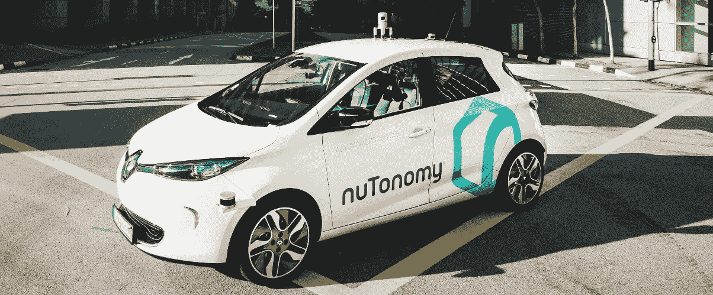
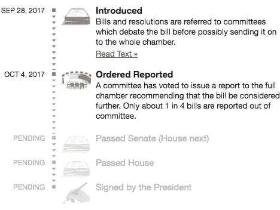
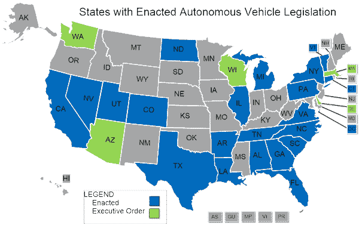
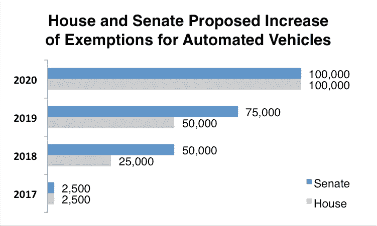

# 立法自动化:国会如何对待自动化汽车

> 原文：<https://medium.com/swlh/legislating-automation-how-congress-is-approaching-automated-vehicles-7887e7242528>

Boston-based nuTonomy is already testing automated vehicles in the Seaport District. Congress is poised to expand from 2,500 to 100,000 automated vehicle exemptions over the next three years.

2017 年秋季对联邦自动驾驶汽车(AV)立法的支持者来说是好事，众议院( [H.R. 3388](https://www.congress.gov/bill/115th-congress/house-bill/3388) )和参议院( [S. 1885](https://www.congress.gov/bill/115th-congress/senate-bill/1885) )都在认真考虑法案。随着国会两院两党压倒性的支持，似乎很有可能一项反病毒法案将很快提交到总统的办公桌上，为联邦政府监管反病毒的运营环境铺平道路。

这是一个三部分系列的第一部分，探讨了目前正在辩论的反病毒立法的关键组成部分，从扩大反病毒的使用，到政府如何确保它们的安全运行，到网络安全等。

# **第三册第一部分包括:**

*   快速回顾立法:两个法案，两个伟大的标题
*   重量限制:卡车和公共汽车不适用
*   先发制人:联邦法律至高无上
*   豁免:AVs 不需要遵循同样的规则…目前

# **快速回顾立法:两项法案，两个伟大的标题**

H.R. 3388，“简称”名为“安全确保生命未来部署和研究车辆进化法案”或自动驾驶法案，由众议员 Latta (R-OH-5)和共同发起人众议员 Schakowsky (D-IL-9)于 7 月下旬提出，并于 9 月 5 日在能源和商业委员会一致投票通过。一天后，经过 40 分钟的辩论，众议院通过了口头表决。有趣的事实:众议院法案最初是用另一个同样精彩的简称“指定每辆汽车的自动化水平法案”或贴花法案推出的。众议院通过后，H.R. 3388 被送往参议院，并提交给商业、科学和运输委员会，目前参议院正在审议自己的法案。

Tracking H.R. 3388 via [https://www.govtrack.us/congress/bills/115/hr3388](https://www.govtrack.us/congress/bills/115/hr3388)

参议院 AV 法案 S. 1885 于 9 月 28 日由参议员图恩(共和党)提出，并由参议员彼得斯(民主党)、布朗特(共和党)和斯塔贝诺(民主党)共同发起。所有迹象表明，参议院法案在参议院获得通过后，可能会获得类似的两党支持。上周，商业、科学和运输委员会报告了 S. 1885，现在预计将在未来几个月内提交参议院表决。顺便提一下，参议院的法案也有一个很棒的标题:“美国通过革命性技术进步实现更安全交通的愿景”或 AV START。幸运的话，参众两院将为最终的合并法案想出一个更好的简称。

Tracking S. 1885 via [https://www.govtrack.us/congress/bills/115/s1885](https://www.govtrack.us/congress/bills/115/s1885)

# **重量限制:卡车和公共汽车无需适用**

虽然自动货运车辆有[潜力](http://thehill.com/blogs/pundits-blog/transportation/348622-autonomous-trucking-will-make-commercial-driving-a-safer)来减轻卡车司机的压力和提高安全性，并解决 50，000 人的卡车司机短缺问题，但我们不太可能很快看到自动 18 轮车在我们的高速公路上巡航，因为参议院和众议院的法案都包括对自动车辆的 10，000 英镑上限。除非对参议院的法案进行修正，否则参议院不太可能扩大众议院设定的重量限制。顺便提一下，10，000 磅的门槛为乘用车留出了足够的空间——包括像特斯拉 Model S(约 5，000 磅)这样带有重型电池组的电动汽车。

What 10,000 pounds is and isn’t. Author’s visualization.

一方面，肯定有一种观点认为，在高速公路上推广自动驾驶汽车技术会比在城市里更安全。对 AVs 来说，最令人烦恼的挑战之一是人类不可预测的行为，包括司机和行人。在高速公路上，由于道路的使用密度较低，速度相对稳定，操作环境较为简单，因此人机对话的挑战最小。

另一方面，很容易理解为什么卡车运输工会站出来反对将卡车运输纳入 AVs 法案[中，理由是担心 AVs 系统会扰乱该行业的就业。《经济学人》](http://thehill.com/policy/technology/352958-senate-releases-driverless-car-legislation) [*，*](https://www.economist.com/news/special-report/21700758-will-smarter-machines-cause-mass-unemployment-automation-and-anxiety) [*彭博*](https://www.bloomberg.com/graphics/2017-jobs-automation-risk/) ， [*洛杉矶时报*](http://www.latimes.com/projects/la-fi-automated-trucks-labor-20160924/) *，*关于自动化对就业收入的影响的研究，有充分的理由担心，在货运领域允许甚至有限地使用 AV 能力可能会滑向完全自动化。最终，随着优步和 Lyft 等交通网络公司的出现，移动行业的彻底转型——特别是出租车牌照价值的暴跌——可能只是开胃菜，主菜是完全自动化。

虽然讨论较少，但重量限制也禁止在道路上测试和实施自动公共交通公交车(例如，在快速公交路线上运行的自动公交车)。这从实现中移除了自动化技术的另一个相对容易的应用。由于有专用车道和既定路线，快速公交车辆可能是 AV 技术在城市环境中最简单、最安全的应用。然而，10，000 磅的限制并不禁止测试和运行更小的 AV 航天飞机，如来自 [EasyMile](http://easymile.com/) 和 [Navya](http://navya.tech/en/) 的那些正在全国几个城市试点的飞行器。

# **先占权:联邦法律至高无上**

参议院和众议院法案一致的另一个领域是他们断言联邦政府独自负责监管自动车辆的“设计、建造和性能”。这两项法案都规定，联邦政府将是唯一一个监管自动车辆如何制造、如何运行以及必须满足什么安全要求的实体。

为什么这很重要？一段时间以来，当涉及到监管 AVs 时，州、市和联邦政府的角色并不明确。根据州立法机构的全国会议，21 个州已经通过了规范 AVs 的立法，另外五个州已经颁布了与 AVs 相关的行政命令。在这片无人监管的土地上，一些州已经通过了法案，要求在出现问题时，由一个人坐在方向盘后面接管，其他州(如加利福尼亚州)已经寻求为在其境内运行的 AVs 制定独特的安全标准和性能要求。

National Conference of State Legislatures [tracks](http://www.ncsl.org/research/transportation/autonomous-vehicles-self-driving-vehicles-enacted-legislation.aspx) automated vehicle legislation and executive orders.

管辖权复杂化的可能性甚至超过了州一级。可以想象，如果一个城市的反垄断车由优步或 Lyft 这样的运输网络公司运营，而该城市本身又对反垄断车进行监管(例如纽约市的出租车和豪华轿车委员会)，那么城市甚至可以对反垄断车的运营进行监管。

各州的权利倡导者和 AV 制造商都同意，从长远来看，这种监管当局的大杂烩是站不住脚的。这里的挑战是，一些州认为 AV 技术未经测试，无法安全推广，并反对联邦政府取消其监管 AV 设计和性能的能力，以使其更加安全。众议院和参议院的法案极大地增加了不符合机动车安全法规的 AVs 的数量，这使得情况变得更加复杂。从本质上说，联邦政府是在对各州说:“你不能再以安全为由监管 AVs*和*你必须相信，在没有修订机动车标准的情况下，我们会监控它们的安全。”这对于州和地方来说是一颗难以下咽的药丸，这是有充分理由的。

尽管联邦政府对监管权力的主张引起了很多争议，但这两项法案也澄清了各州仍将控制的广泛清单。也就是说，魔鬼可能隐藏在细节中。当涉及到州政府监管 AVs 的权利时，众议院法案是这么说的:

> 本小节中的任何内容均不得被解释为禁止州或州的政治分区维护、执行、规定或继续实施与注册、许可、驾驶教育和培训、保险、执法、碰撞调查、安全和排放检查、州或州的政治分区内街道上车辆的拥堵管理或交通有关的任何法律或法规，除非该法律或法规是对高度自动化车辆、自动驾驶系统或自动驾驶系统组件的设计、建造或性能的不合理限制人力资源 3388

该规范可能会打开或关闭各州监管 AVs 的大门。虽然各州可能不再强制要求设计和性能规范，但他们仍然有权控制汽车注册、汽车保险和拥堵管理。通过这一套权力，一个担心 AVs 对其社区的影响的州可以相当容易地阻止 AVs 在其境内运营，或者确保 AVs 只在某些条件下运营(例如，对没有公共交通服务的地区的最后一英里服务)。

另一方面，众议院和参议院的法案也有一个很大的漏洞，为 AV 运营商和制造商反对州法规打开了大门。你抓住它了吗？这里是:“除非法律或法规是对高度自动化车辆的设计、建造或性能的不合理限制……”如果一个州要求 AVs 专门服务于服务不足的人口进行注册，这是否构成“不合理限制”？我们真的不知道。这个术语没有定义。相反，这是一些很可能在挑战，诉讼，也许是未来的额外立法中解决的问题。

# **豁免:AVs 不需要遵循同样的规则…目前**

虽然我们口头上谈论众议院和参议院的法案授权自动车辆运行，但实际上它们更具体地允许自动车辆免除所有其他车辆必须遵守的机动车辆安全要求。

美国的车辆受美国法典第 301 章[第 49 章的管理，该法典规定了使用公共道路的车辆的设计、构造、性能和耐久性要求。然而，自动驾驶汽车是一项新技术，需要更新的法规(例如，方向盘规则是否应该适用于自动驾驶汽车？).早在 2016 年 9 月，奥巴马政府下的交通部就通过国家公路交通安全管理局(NHTSA)，允许 2500 辆自动驾驶汽车在我们国家的道路上行驶，免除他们必须遵守当前的机动车法规，而不是等到新法规制定出来。](https://www.law.cornell.edu/uscode/text/49/subtitle-VI/part-A/chapter-301)

在接下来的三年里，参议院和众议院的法案将免税额度大幅提高到 10 万英镑。在美国注册的轻型汽车超过 1.9 亿辆，10 万辆 AVs 只是沧海一粟，但与目前的水平相比，这是一个相当重要的举措。

Exemptions for automated vehicles increase to 100,000 over the next three years in both the House and Senate bills, albeit in different intervals. (Assumes bill is signed in late 2017/early 2018).

众议院和参议院的法案对扩张的时间表略有不同。众议院法案将免税数量扩大了 10 倍，前 12 个月为 25，000，下一年为 50，000，最后在立法通过后的第三年为 100，000。参议院的法案更激进一些，第一年开始 5 万英镑，第二年 7.5 万英镑，最后一年 10 万英镑。此外，参议院的立法还表明，如果需要，制造商可以申请超过 10 万英镑。

我不清楚从 2500 辆豁免的 AVs 增加到 100000 辆是否构成安全风险的增加，因为我们预计计算机在驾驶方面会比人类更好。事实上，在道路交通死亡人数再次上升的时候，增加道路上 AVs 的数量实际上可能会略微减少道路交通死亡人数。但是，允许更多的车辆在我们的道路上行驶而不遵守机动车安全法规的总体概念令人担忧。豁免程序旨在作为一种权宜之计，在机动车法规更新期间允许新技术的有限试点。通过大幅增加豁免数量，国会将增加对存在于美国法典之外的影子安全制度的依赖。

在允许对公众有益的新技术进行测试和维持有充分理由建立的监管程序之间存在着矛盾。为了解决这一矛盾，参众两院都提出了议案:1)要求美国交通部迅速更新机动车法规，以解决 AVs 问题；以及 2)规定中期安全报告的要求。

这个三部分系列的第二部分将从国会提出的自动车辆安全方法开始。敬请关注。

如果您有想法或问题，请随时联系我们，或者在下面发表评论。

## 这个故事发表在[的初创企业](https://medium.com/swlh)上，这家媒体的出版物拥有超过 256，410 人的关注。

# 订阅[在这里获取头条](http://growthsupply.com/the-startup-newsletter/)。

