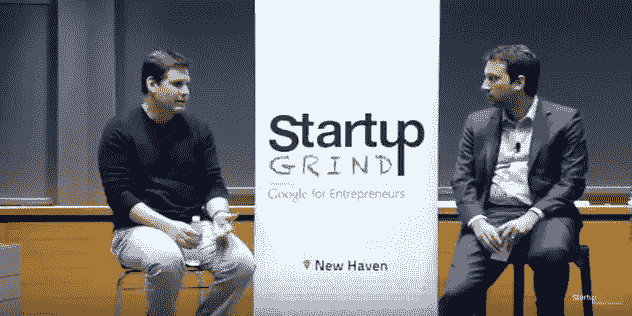

# 来自一系列创业内幕的教训

> 原文：<https://medium.com/swlh/lessons-from-a-serial-startup-insider-a70837fcbedc>

未来的工作会是什么样子。

我最近在耶鲁的高级管理人员会议上参加了一个创业研习会，演讲者是连续创业者 Steven Kokinos Fuze 的联合创始人。Fuze 是一款包罗万象的通信软件。

**关于未来的工作会是什么样子，有三件事特别让我印象深刻。**

1.  他强调了之前关于启动资金的讨论。他一再发现，投资者的决定是基于他们对出席者的直觉反应以及他们的相处方式。这是关于人，而不是想法。我从其他风投那里听说过这一点——他们想知道你以前建立了什么，学到了什么，以及当糟糕的事情发生时谁是老板。答案不是我们所有人。
2.  他的公司发展很快。最大的挑战之一是自上而下的沟通。他意识到他需要传递有意义和准确的信息。来自远见者的人类联系是需要的。当他与高层领导交谈时，有许多误解，他们通过组织图流程传递信息。每个人都加入了自己的观点，突然之间，真正的信息变得令人费解。
3.  最后——他们将不属于管理角色的工作或重要的技能发展工作外包到经济上更友好的地方。

最后一个我很好奇。他提到，他们在波士顿、纽约和旧金山都有大型集散中心，这些都是非常昂贵的地区。当他提到让来自不同地区的其他人加入时，我以为他指的可能是美国南部一些正在发展的科技中心。

我没想到会听到渥太华和葡萄牙。

> 这让我想知道，当这么多事情将要改变时，我们将重点放在学习编码上——除了更便宜的劳动力之外，人工智能肯定会接管更多。扎实的基础很重要，如果这真的是最终的职业选择，它可能会有价值。

**问题是——我遇到的很多在科技领域担任要职的人从未上过学。他们学习舞蹈、艺术、音乐、文科。**

他们坚信，这些领域的思维有助于形成更具创造性的方法。

我仍在仔细考虑这个问题——我很想知道这如何应用到你的行业中。

+++++++++++++++++++++++++++++++++++++

丽莎·大圭为不断创新的成长型公司提供指导、演讲和研讨会，这些公司明白扩大规模的最佳方式是鼓励每个人畅所欲言。

## 这篇文章发表在 [The Startup](https://medium.com/swlh) 上，这是 Medium 最大的创业刊物，有 339，876 人关注。

## 在这里订阅接收[我们的头条新闻](http://growthsupply.com/the-startup-newsletter/)。

