# 创业中的教训

> 原文：<https://medium.com/swlh/lessons-from-a-startup-within-a-startup-f9da6f5d2f0d>

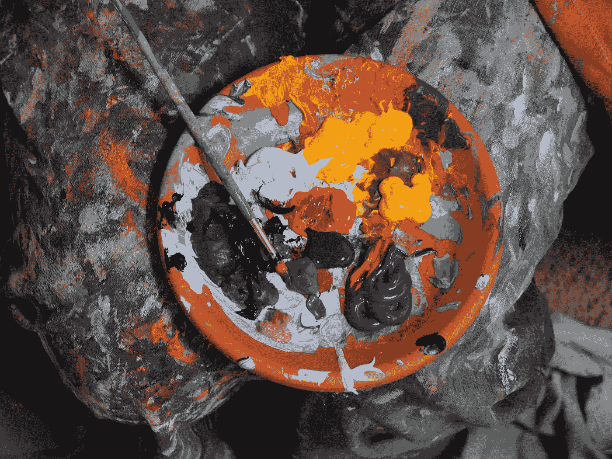

凯尔·莫罗

当我开始在 Buffer 工作时，在讨论项目和想法时，我经常听到一句话:“让我反思一下。”

这是我在以前工作的科技公司很少听到的一种情绪，这让我感到惊讶。

虽然快速行动和快速决策可能是一种非常有价值的方法，但我从 Buffer 那里学到，给[留出停顿和反思的空间也很好。](https://open.buffer.com/buffer-values/)

在 Buffer 的图像创建工具 Pablo 一周年之际，这似乎是一个反思我们自己的“创业中的创业”的成功和挑战以及处理我们所学到的东西的好时机。

(在我们开始之前，先简单说明一下:我只是有幸为 Pablo 工作了几个月，所以当我说“我们”时，我指的是 Buffer 所有出色的人，他们是 Pablo 故事的一部分。)

以下是过去一年中 Pablo 的内部故事，以及创建“创业公司中的创业公司”的感受

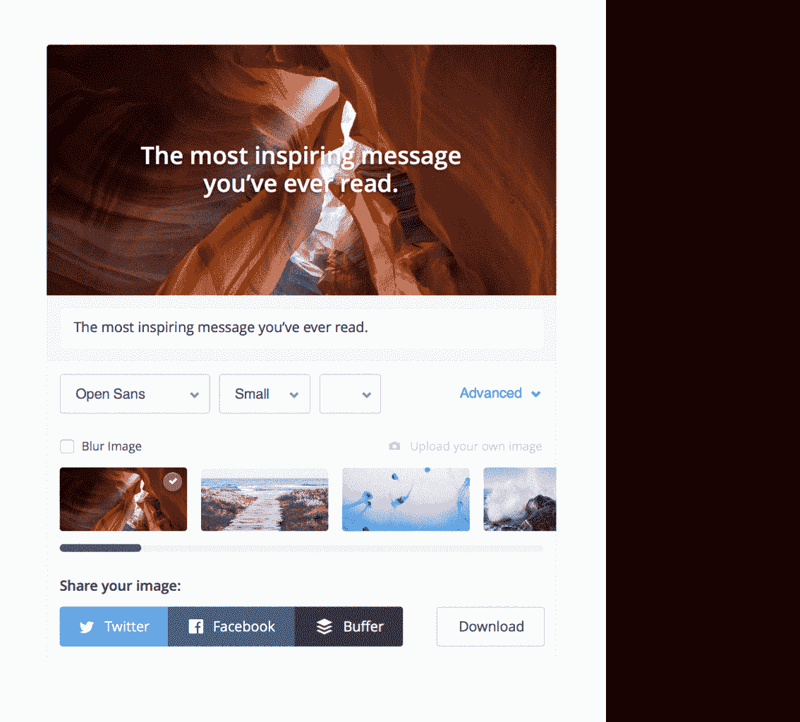

# 2015 年 1 月:“引人入胜的图像”项目开始

Pablo 的创意来自两条不同的道路:

*   我们营销团队的凯旺碰巧分享了他在为社交媒体创建图片时遇到的一些摩擦点。
*   与此同时，我们的客户开发团队听说用户正在努力为他们通过 Buffer 分享的内容创建引人入胜的图片。用户认识到，如果他们在帖子中包含图片，他们会看到更多的参与。然而，这是一个付诸实践的挑战。

有几个很棒的工具可以帮助创建图像，但是在反思了我们听到的一些棘手问题后，我们觉得可以在内部构建一个解决方案，也可以很好地与 Buffer 集成。

很快就清楚了这是一个机会。

这是日期为 2015 年 1 月 8 日的产品规格的原始描述。在这一点上，该项目仅被称为“吸引人的图像项目”"

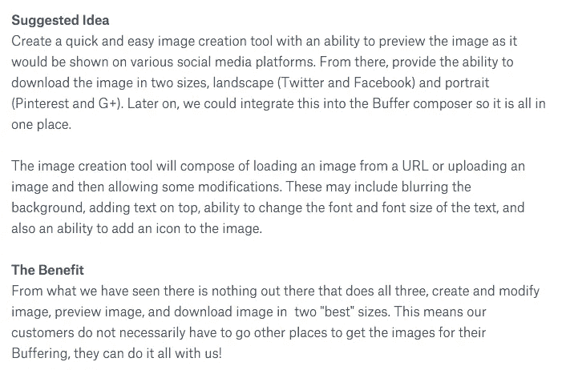

**经验教训:**从这段时间我们学到了第一课:*解决自己的问题。*

# 2 月:测试、验证和命名

在定义了需要验证的内容之后，团队开始开发最小可行的产品。它花了大约一个月的时间来构建，并且非常专注于快速创建图像。只有很少的几个功能，而且非常强调引用。

这是一个早期的原型:

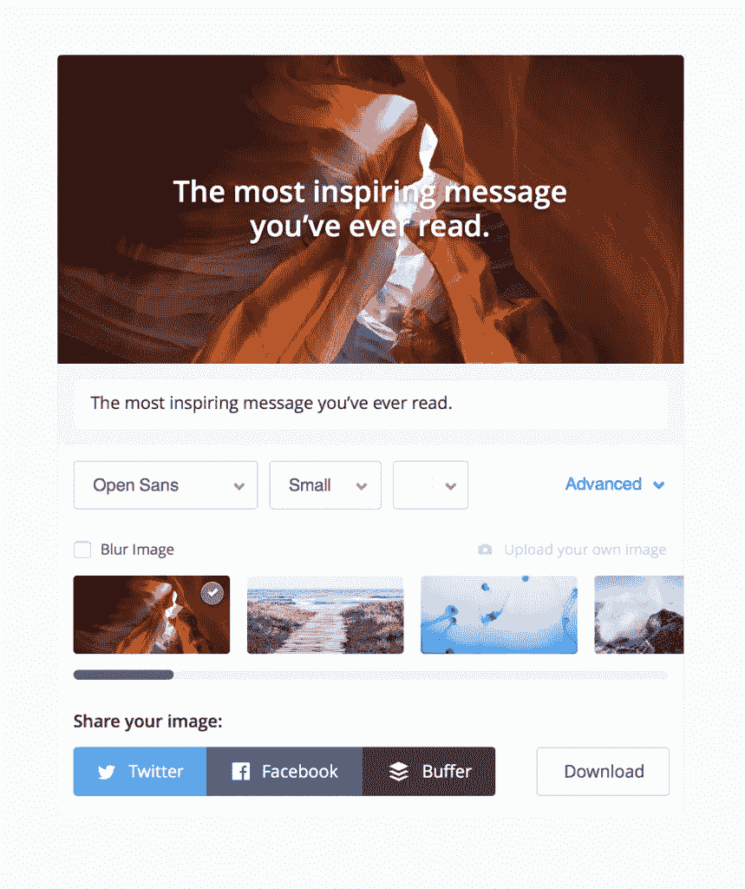

我们的新兴工具现在需要一个名字！这里有一些关于选择“Pablo”作为工具名称的对话。

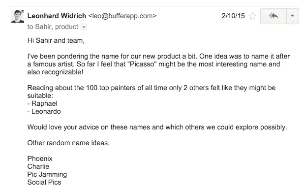

帕布罗出生的电子邮件:

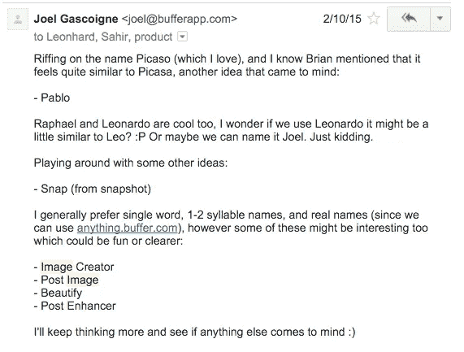

我们在 2 月中旬悄悄向一小群用户推出了我们的新工具，非正式的口号是“在 30 秒内创建引人入胜的社交图像”在分享之前，我们先来看看最后的一些内部测试！

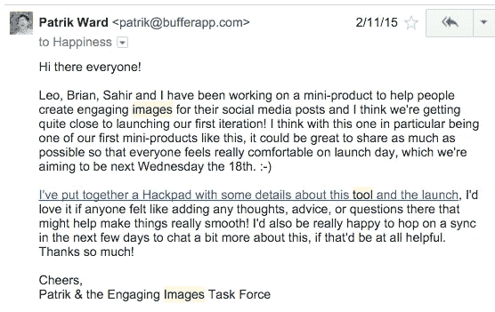

Pablo 的第一个版本的目标是验证来自最初客户访谈的假设:*我们认为 Buffer 用户在分享到 Twitter 时，在创建引人入胜的图片时会遇到困难。*

所以在月末，当我们从我们进行的[产品-市场契合度](https://open.buffer.com/measure-productmarket-fit-product-feature/)调查中获得一些有希望的结果时，这感觉就像是巨大的验证。

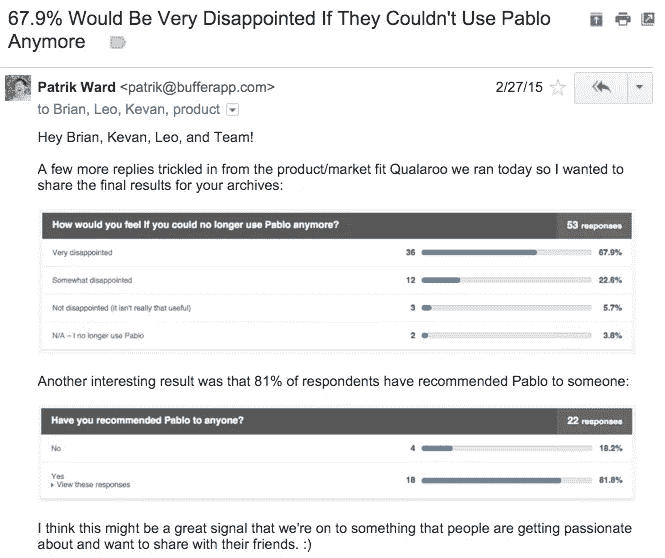

我们仍然不确定我们是否解决了正确的问题，或者我们是否以正确的方式解决了它们。要弄清楚我们是否走在正确的道路上，还有很多工作要做。

然而，我们从产品搜索的惊人社区中获得了很多兴奋，他们[在我们还没有完全准备好](https://www.producthunt.com/tech/pablo-by-buffer)之前就选中了 Pablo！

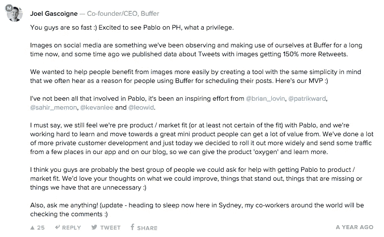

**经验教训:** *在你准备好之前发射。*

# 三月:启动和学习

终于在三月份，我们对这个小项目的第一个版本感到非常满意，并且正式推出了 Pablo ！

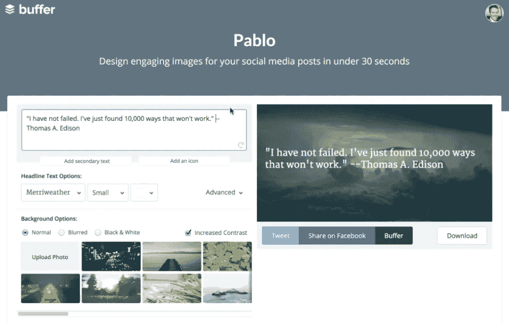

我们得到了一些[很棒的](http://www.entrepreneur.com/article/243635) [新闻](http://thenextweb.com/socialmedia/2015/03/05/buffer-takes-pablo-its-words-on-an-image-service-out-of-beta/#gref)和大量很棒的反馈，包括一个我们可能想进一步解释这个名字的信号:

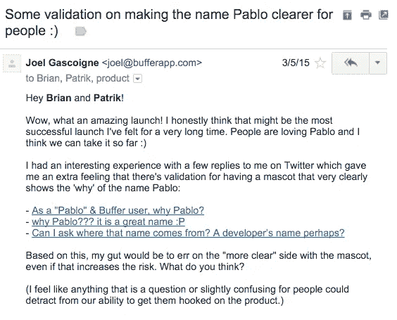

考虑到乔尔的这些好想法，以下是我们为 Pablo 探索的一些“吉祥物”创意:

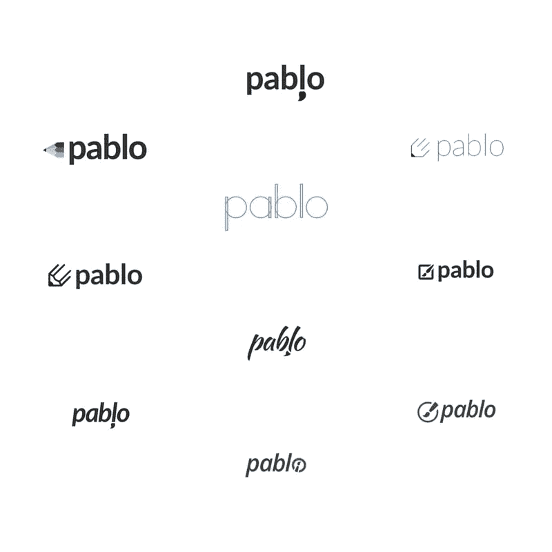

在最终到达你现在看到的巴勃罗的图像之前:

**经验教训:** *消除任何阻碍客户掌握产品的障碍。*

# 宁静的夏天

很多新企业家陷入了这样一个思维陷阱:如果你开发了一个产品，用户自然会发现它并开始使用它。

当你足够幸运地在一家已经快速成长并拥有繁荣社区的公司中开发新产品时，就更容易落入这个陷阱。

Buffer 社区非常支持，这在 Pablo 发布期间表现得非常明显。然而，人们很快意识到，增长必须是有意的。

在帕布罗推出后不久，发生了一些变化，导致我们与 Buffer 相比，对帕布罗的关注减少了。我们正在尝试自我管理，同时也在关注与 Pinterest 的整合。

这导致 Pablo 被放在一边一点——正如你从数据中看到的，如果你不专注于增长，它不会自己发生。

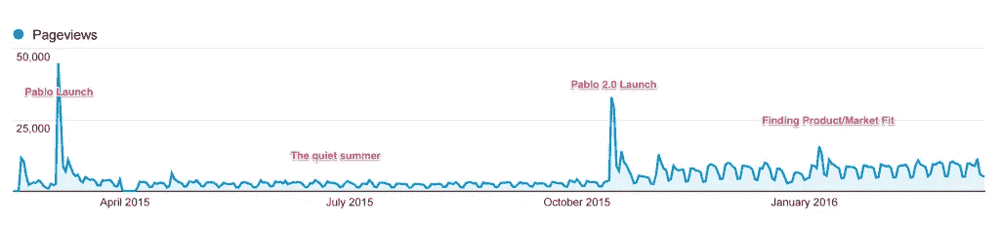

**经验:** *你建造了它，并不意味着他们会来。*

# 秋天:决定巴勃罗的未来

在为 Pinterest 推出了 [Buffer，并从探索自我管理中学习了](https://blog.bufferapp.com/buffer-for-pinterest)[一些宝贵的经验](https://open.buffer.com/self-management-hierarchy/)之后，似乎是时候弄清楚 Pablo 的下一步了。

在这些对话中，出现了一些关键问题:

*   这是生意还是副业？
*   我们需要 Pablo 这个名字吗，或者我们应该把它集成到 Buffer 中？
*   Pablo 的市场机会是什么？

老实说，我们还在纠结其中的一些问题，还没有明确的答案。

然而，我们知道我们想快速学习。我们决定专注于我们可以立即采取的措施，推动 Pablo 向前发展，并继续为我们的用户提供价值。

在几次客户访谈后，这些是我们的行动项目:

*   **让 Pablo 成为优秀的胸针设计师。我们刚刚在 Buffer 中引入了 Pinterest，感觉这是一个很好的搭配。**
*   **更轻松地将图像和文本导入 Pablo。**人们会不厌其烦地分享来自其他网站的有趣的文本片段，而图片主要是用来吸引人们对其文本的注意。
*   **暂时将 Pablo 与缓冲区分开。**对快速社交媒体图片的需求超出了缓冲社区，我们的数据显示，许多非缓冲用户发现了它的价值。

**经验教训:** *为了让一个项目向前推进，* f *专注于你现在能做的事情。*

# 10 月:Pablo 2.0 发布

基于这些经验，我们开始着手开发 Pablo 2.0，并于 2015 年 10 月发布。

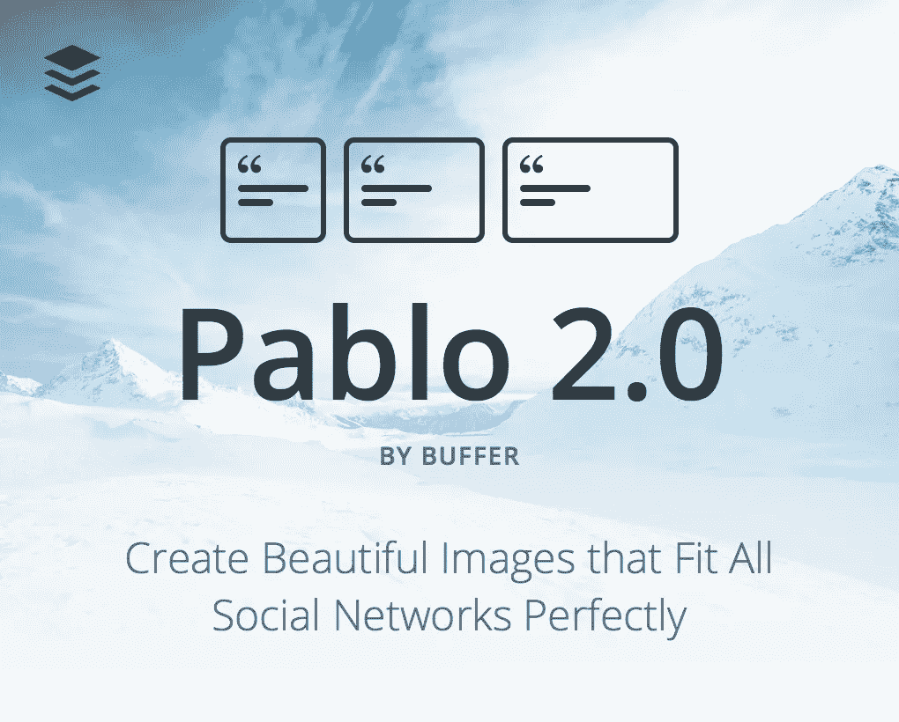

这次迭代的目标是让 Pablo 感觉更像一个应用程序，而不是一个超级强大的页面。

这导致了一个更干净的用户界面和几个新功能。然而，授权用户在 30 秒内创建引人入胜的社交图片的目标并没有改变。

Pablo 2.0 的发布非常成功，我们看到了新的使用高峰。

然而，兴奋过后，使用次数又降了下来。有趣的是，我们有了新的基线，比以前有了明显的提高。

我们再次尝试了一个更小的改进——对 Pablo 扩展的升级——并与 Buffer 社区分享了它。再次出现初始峰值，然后下降到新的基线。

随着每一次迭代，我们从 Buffer 社区获得了更多的用户。有一个清晰的循环，目标是尽快度过这些循环。

吸取的教训: *早期的成长常常感觉像楼梯。*

# 2016 年初:微调和产品市场匹配

在推出 Pablo 2.0 并为 Pablo 创建了一个产品区之后，我们仍然需要回答一个关键问题:Pablo 的产品是否适合市场？

我们已经使用肖恩·埃利斯创建的的[调查测量了几次产品与市场的契合度——最近一次是在几周前。](https://open.buffer.com/measure-productmarket-fit-product-feature/)

每次的结果都显示，如果不能再使用 Pablo，67-70%的用户会“非常失望”。

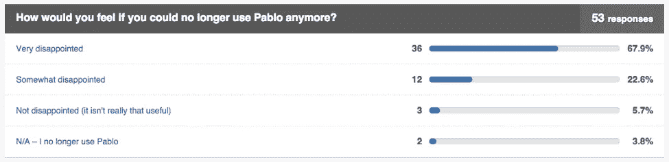

根据 Sean 的建议，产品与市场的契合度超过 40%，这是一个了不起的结果！我们一定是在正确的道路上，对吗？

当我们深入研究数据时，我们发现 Pablo 的使用是零星的，我们的保留率不太理想。如果人们对没有帕布罗感到失望，那么他们为什么不经常使用它呢？

我们的一个假设是，我们没有与 Pablo 一起处理足够多的用例。巴勃罗在一些事情上做得非常好，人们因此而喜欢他。然而，我们对 Pablo 有着雄心勃勃的目标，需要继续解决用户的更多痛点，以推动定期使用和持续增长。

我们希望继续向 Pablo 的超级用户学习，并找出如何让它成为他们每周工作流程的一部分。

**经验:** *产品与市场的契合度并不总是与忠诚度相关。*

# 巴勃罗的未来

在过去的一年里，我们从 Pablo 身上学到了很多，并将继续对产品和团队进行迭代。

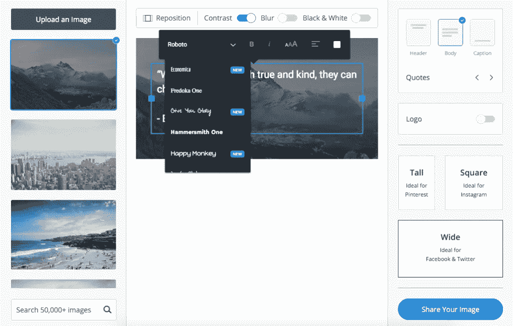

随着公司的发展和更多人的加入，工作开始变得更加专业化。我们现在有营销、客户支持、数据和其他几种类型的专家，他们会就每个主题提供令人难以置信的建议。

作为初创公司中的初创公司，感觉这将是其他初创公司没有的巨大优势。但是更多的资源也会导致你行动缓慢。

当你只有一个小团队在项目中工作时，每个人都扮演着多面手的角色。

*   你没有联系你的营销团队来帮助你写最新的博文或邮件；你自己做。
*   你没有时间去分析数据，而是去看几个 KPI。
*   您可以看到您产品的每一个错误和缺陷，因为您是回答所有支持请求的人。

这可能并不总是随着公司的成长而增长，但对于早期来说是至关重要的。

这对 Pablo 来说意味着我们已经将团队减少到三个人，他们将作为多面手来工作。我们还通过使用 Buffer 的其他成员作为顾问来复制启动环境，而日常活动由核心团队完成。

**经验:** *早期创业公司通常需要多面手。*

# 轮到你了

即使作为成长中的初创企业中的一员，我也学到了很多经验丰富的企业家多年来一直写的经验教训。

我们犯了很多错误，还会犯更多的错误。我们的目标是每天学习，不断提高。对于 Pablo 来说会有一些令人兴奋的事情，我希望在一年后，我们可以用一些新的课程来庆祝 Pablo 的两岁生日。

我希望有机会听到你在推出产品或发展业务时学到的经验。如果你对我们如何改进巴勃罗有什么想法，我洗耳恭听。请在评论中与我们分享！

附:在你的电子邮件中获取我们关于工作场所文化、生产力、透明度等的所有帖子。[现在报名](http://buff.ly/1OmnSUx?utm_source=social&utm_medium=medium&utm_campaign=weekends)。

*原载于 2016 年 3 月 21 日*[*open.buffer.com*](https://open.buffer.com/pablo-startup-within-a-startup/)*。*