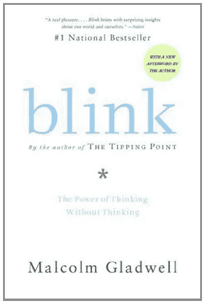

# 马尔科姆·格拉德威尔的《眨眼的教训:不假思索的思考的力量》

> 原文：<https://medium.com/swlh/lessons-from-blink-the-power-of-thinking-without-thinking-by-malcolm-gladwell-ac03aa343eee>

一眨眼的功夫就能产生和数月理性分析一样多的价值

**评分:** 7/10

**完成:**2018 年 2 月

**相关:** [临界点](https://www.amazon.com/gp/product/0316346624/ref=as_li_tl?ie=UTF8&camp=1789&creative=9325&creativeASIN=0316346624&linkCode=as2&tag=dansilvestre-20&linkId=0496e86f896f9b49290ff10341c3a5d5)

[在亚马逊上阅读更多信息](https://www.amazon.com/gp/product/0316010669/ref=as_li_tl?ie=UTF8&camp=1789&creative=9325&creativeASIN=0316010669&linkCode=as2&tag=dansilvestre-20&linkId=f1414f793c1f765103c8391d87db1baf)