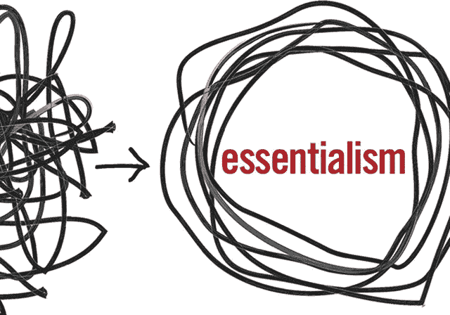

# 要素主义的教训:对更少的自律追求

> 原文：<https://medium.com/swlh/lessons-from-essentialism-the-disciplined-pursuit-of-less-by-greg-mckeown-416f49cc6a2d>

**评级:** 6/10

**相关:** [改变人生的整理魔法](http://www.dansilvestre.com/life-changing-magic-tidying-marie-kondo/)

[在亚马逊上阅读更多信息](https://www.amazon.com/gp/product/0804137382/ref=as_li_tl?ie=UTF8&camp=1789&creative=9325&creativeASIN=0804137382&linkCode=as2&tag=dansilvestre-20&linkId=4d06b7b7e331a52c71c8de4392eea4d7)

[点击此处获取课程的完整索引](http://www.dansilvestre.com/book-summaries/)

*“记住，如果你不优先考虑你的生活，别人会的。”*

# 简短的摘要