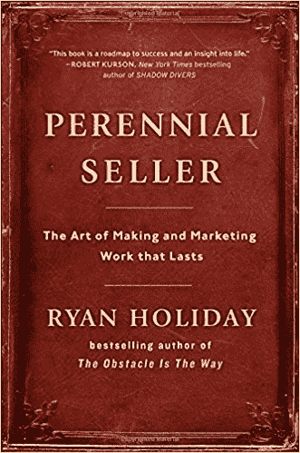

# 瑞安·哈乐黛的《来自常年卖家的教训》

> 原文：<https://medium.com/swlh/lessons-from-perennial-seller-summary-265990478b72>

有一本书在创作故事和为故事寻找读者方面给了我最深刻的见解:[T2·瑞安·哈乐黛的《T1》。](https://www.amazon.com/gp/product/0143109014/ref=as_li_tl?ie=UTF8&tag=turnerstories-20&camp=1789&creative=9325&linkCode=as2&creativeASIN=0143109014&linkId=86347af3e0cf696ee218d865da935397)

我将沿着这本书的结构分享我所学到的、测试过的和应用过的经验。希望这也能应用到你的写作中(假设你是一名作家)。自然，我推荐[去读](https://www.amazon.com/gp/product/0143109014/ref=as_li_tl?ie=UTF8&tag=turnerstories-20&camp=1789&creative=9325&linkCode=as2&creativeASIN=0143109014&linkId=86347af3e0cf696ee218d865da935397) …