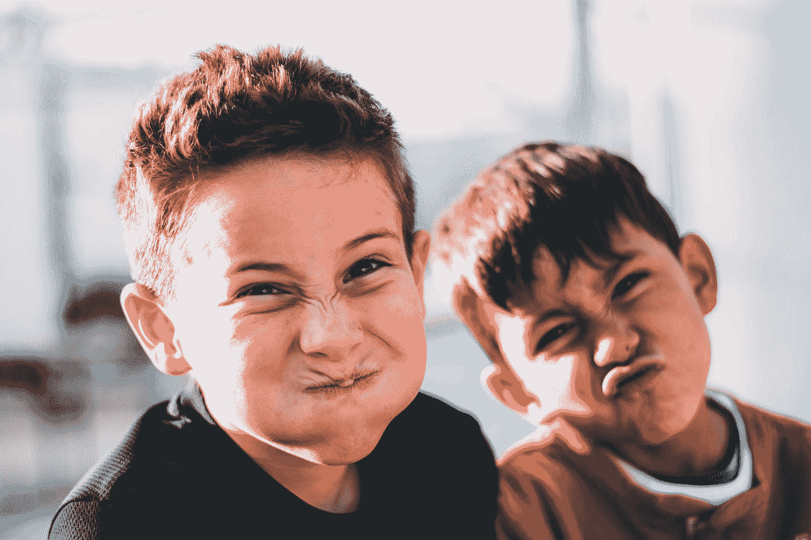
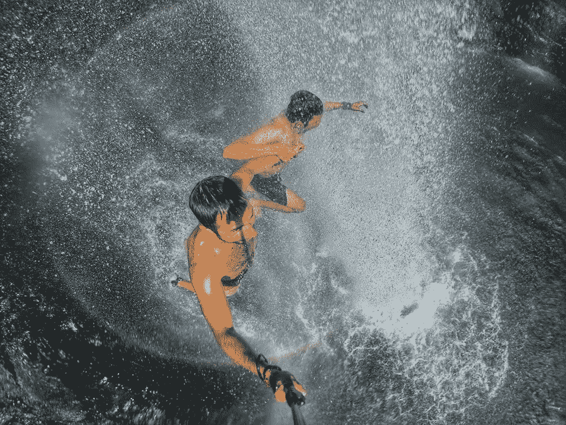

# 我从严肃嘲笑我的朋友那里学到的教训

> 原文：<https://medium.com/swlh/lessons-i-learned-from-my-friends-seriously-laughing-at-me-10dd5313de6a>

[Credit](https://unsplash.com/@austin_pacheco?utm_source=medium&utm_medium=referral)

## 人们也嘲笑你吗？

让我把事情弄清楚。我的朋友信任我，毕竟他们是我的朋友。

他们中的大多数人实际上也会在需要的时候打电话给我寻求建议。

众所周知，我能给出好的建议。

不，不是他们不信任我。

我想说的是，**我的朋友们真的对我的人生方向感到困惑。**

例如，当我告诉我的朋友我想指导别人并改变他们的生活时，他们笑了。

老实说，这已经不是第一次有人嘲笑我了。

例如，当[我被解雇的时候，我是一名服务员。](https://theascent.pub/why-being-fired-might-be-the-best-thing-that-ever-happened-to-you-360e028d2dec)

回到 2016 年 8 月，在餐饮工作 8 年，被辱骂解雇后，我向他们宣布:*我要做一个* [*企业家*](https://en.wikipedia.org/wiki/Entrepreneurship) *。嗯，反应相当迅速和残酷。**人笑了**。*

从那以后，我花了 3 个月的时间决定成为一名企业家。我找到了一个疯狂到追随我的商业伙伴，托马斯·德斯平。

9 个月后，我们在 T21 的电子商务销售额超过了 50 万欧元。

我们创建了第一个 Ecom Villa ( *一个进入电子商务的策划者/退隐者*)，他是当今该领域最大的人物之一，Nick Peroni(*Ecom 帝国* [*的创始人*](https://www.facebook.com/groups/ecomempires/) *，目前拥有超过 66，000 名成员*)。
作为一名企业家，我粉碎了它，决定将我所有收入的 90%投资于[加密货币](https://cointelegraph.com/bitcoin-for-beginners/what-are-cryptocurrencies)。

你猜怎么着，人们又笑了。

而事实是，**我完全理解他们。**

我是说，你认识的人中有多少人不仅换了工作，还换了职业，一年三次？

你认识的破产者中有多少人把他们所有的钱都投资在没人知道的东西上。

也许十分之一。嗯，这个是我。

有时候，你赢了，有时候你输了。不管结果如何，你都需要从中吸取教训。

你必须学会成长。因为只有成长才会引领你走向成功。

所以简而言之， [**没有不冒风险的成功**](https://theascent.pub/why-do-you-need-to-take-risks-to-be-a-successful-entrepreneur-7b62d26bcc6e) 。

Me in Bali helping [Jonathan Edwards](https://medium.com/u/598396c22cdc?source=post_page-----10dd5313de6a--------------------------------) to jump from a waterfall.

## 我为什么继续？

我的朋友中没有一个人，**我周围的人没有一个人有我的眼光**。他们无法想象我为自己设想的一半。

不仅如此，他们中的大多数都没有我的胆量。

我重新开始了无数次，我喜欢冒险。这是我的天性。

值得称赞的是，他们是我的朋友。他们只想给我最好的。

意思是最安全。

> “起初他们说你做不到。现在他们问，你是怎么做到的。”

我认为这种哲学是理所当然的。

我不打算证明人们是错的。我想告诉大家一切皆有可能。

说句公道话，不是所有的朋友都笑话我。

我总能指望我的 20%的朋友对我放在那里的任何东西感兴趣。

可靠的朋友，如果我可以这样称呼他们的话。

你应该把时间花在那些人身上。

> “你是和你相处时间最长的五个人的平均值。”

环顾四周。

你可以爱你周围的人，但如果他们不能激励你，多花些时间和那些激励你的人在一起。

这毕竟是你的生活。

## 三二一…开拍！

[CONTACT ME HERE](https://nickbnns.com)

 [## 被疯狂解雇如何让我的生活变得最好

### 一个你可以利用的人生教训。

theascent.pub](https://theascent.pub/why-being-fired-might-be-the-best-thing-that-ever-happened-to-you-360e028d2dec)  [## 我在管理我的六位数业务时学到的重要经验

### 领导和管理是成功的关键

medium.com](/swlh/delegating-is-the-most-important-part-of-a-viable-business-48e2f17baf63)  [## 不要把自己藏在动机后面

### 你实际上不需要

theascent.pub](https://theascent.pub/dont-bullshit-yourself-with-motivation-f38d1dd4b61e)  [## 你将如何用神经科学提升你的自信和自尊

### 这实际上比你想象的要容易

medium.com](/swlh/boost-your-confidence-and-self-esteem-using-neuroscience-techniques-3ea06ee36c43)  [## 我学到的 5 件事在 5 个月内实现 50 万欧元的销售额

### 这是一个直运反馈

medium.com](/@nicolasserial/5-things-ive-learned-making-half-millions-euros-in-sales-4a451567f6ef)  [## 癌症杀死了我爸爸

### 我怎么能原谅它呢？

medium.com](/@nicolasserial/have-you-lost-a-close-one-to-cancer-too-df46fe67557c)  [## 你相信奇迹吗？

### 什么是奇迹？

medium.com](/@nicolasserial/do-you-believe-in-miracles-a08c7842ee11)  [## 为什么我会免费蔻驰你？

### 当正常价格是 1497 美元。

medium.com](/@nicolasserial/why-do-i-coach-for-free-2073574d383d)  [## 世界在扼杀你的野心？

### 这篇文章可能会帮助你

medium.com](/@nicolasserial/the-world-is-killing-your-ambition-6d68a36eb9c0)  [## 从服务员到赢家

### 我的第一篇媒体文章，献给某个特别的人

medium.com](/@nicolasserial/from-waiter-to-winner-d9d14a7b125f)  [## 变得更快乐的 5 个步骤

### 说到底，幸福是你做出的选择。

theascent.pub](https://theascent.pub/5-steps-to-become-more-happy-f31328b0ef47)  [## 为什么要成为一个成功的企业家需要冒险？

### 做一个梦想家很好，但做一个规划者和工作者更好。

theascent.pub](https://theascent.pub/why-do-you-need-to-take-risks-to-be-a-successful-entrepreneur-7b62d26bcc6e) 

## 这篇文章发表在 [The Startup](https://medium.com/swlh) 上，这是 Medium 最大的创业刊物，拥有+ 375，985 名读者。

## 在此订阅接收[我们的头条新闻](http://growthsupply.com/the-startup-newsletter/)。

