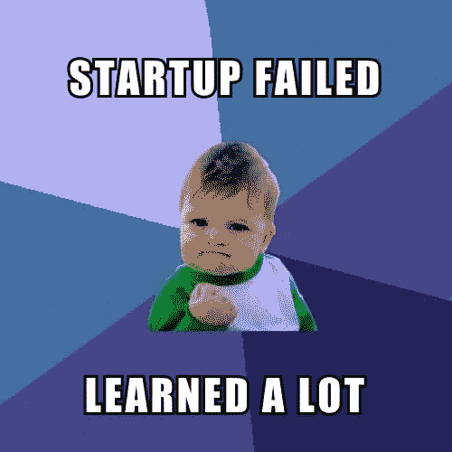
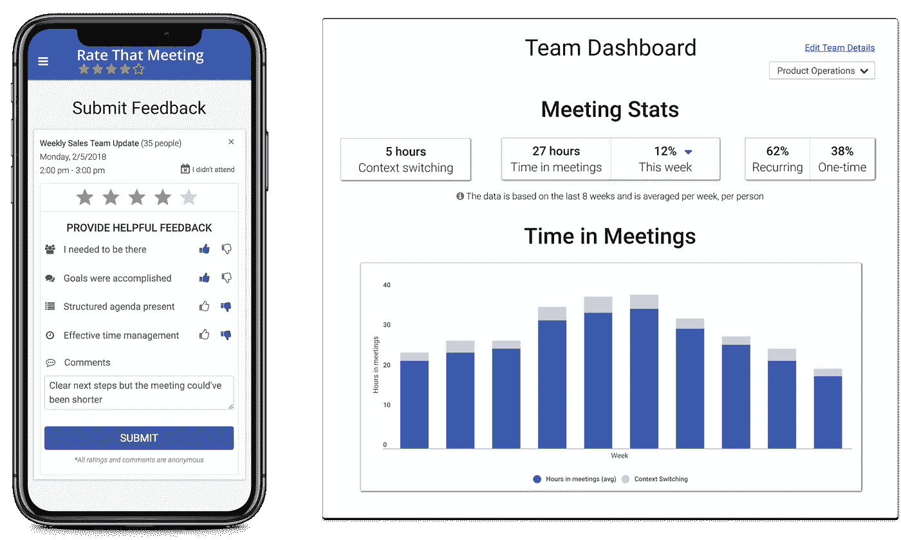
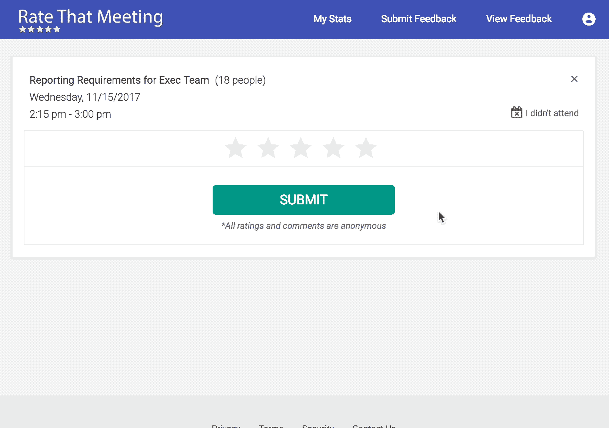
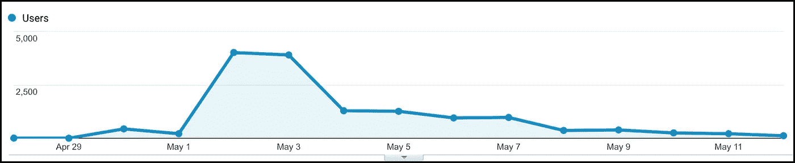
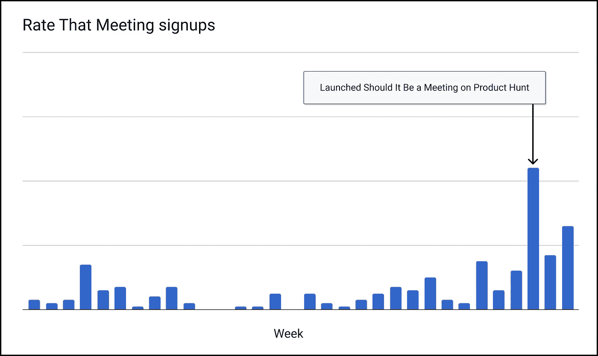
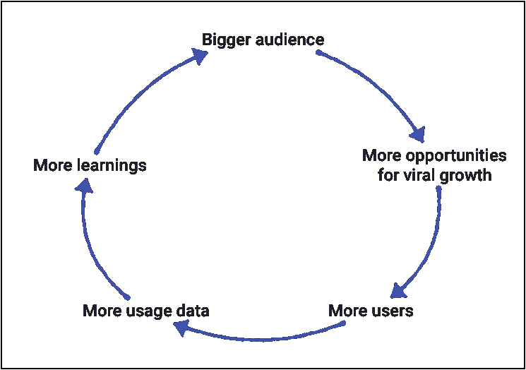
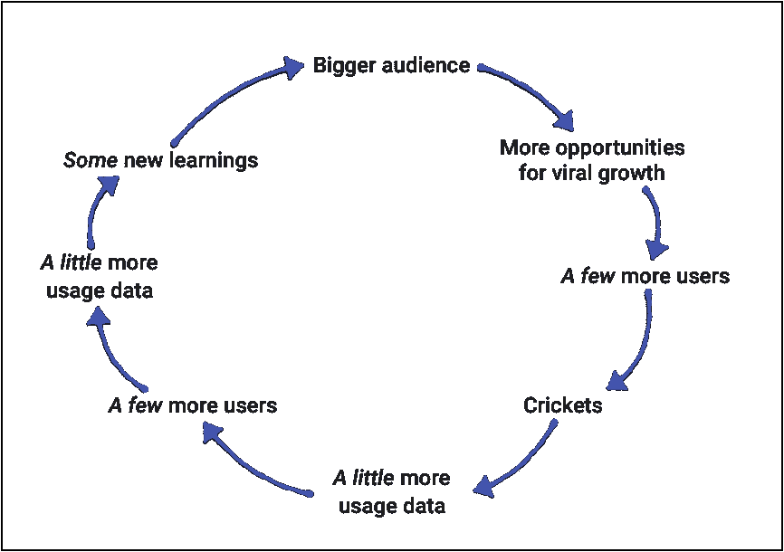

# 从失败的创业中吸取的教训

> 原文：<https://medium.com/swlh/lessons-learned-from-a-failed-startup-6f0dd86ddf95>

开公司很难。但是“失败”绝对不是我用来描述我的经历的词语之一。

My grandma used to tell me to “make every experience a learning experience”

自从让朋友和家人知道我和我的联合创始人关闭了我们的创业公司，很多人问我学到了什么，我会有什么不同的做法。所以我想写下我的一些想法会有所帮助。

迪伦·萨瑟和我花了一年半的时间开发了一套工具，旨在帮助人们在工作中完成更多的事情。我们开发了 4 款应用，被 100 多家不同公司的数千人使用。虽然我们的目标不是构建 4 个不同的应用程序，但我们反复思考了许多想法，直到我们最终确定了满足的[等级。](https://ratethatmeeting.com)

# 评价那次会议

UX for rating meetings you attend on the left, Teams dashboard on the right

我们对会议评级的愿景是明确的——我们希望帮助团队在工作中少花一些时间在没有成效的会议上。为此，我们构建了一个平台来促进会议参与者和组织者之间的匿名反馈，并为团队领导提供了一个仪表板来分析必要的数据，以评估会议对团队生产力的影响。

决定停止那次会议对我们俩来说都是一个艰难的决定，但是有一些我们不能忽视的明确信号和我们不能解决的问题。

**我们提供维生素而不是止痛药。**当软件作为问题的解决方案出现时，用户希望一键解决问题。但是改善工作中的会议需要更多的点击。长期的解决方案需要上层管理人员的认同和整个组织的持续自我反思。科技当然可以帮助 T4，但是没有灵丹妙药——我们花了更长的时间才意识到这一点。

结果，我们有很多客户喜欢那次会议，但是很少客户喜欢那次会议。

我们从未解决的核心问题是确保定罪。迪伦和我决定不寻求外部投资者的资金，直到我们都有信心认为会议解决了无效会议的问题。剧透:我们没有到达那里。

曾经有过一些成功的例子，但是它们还不够强大，增长也不够快。我们试图从根本上改变公司的会议文化，这真的很难做到。

# 运作良好的事物

## #1 —无情的优先排序

由于我们还没有筹集到资金(见上文:信念是筹集资金的必要条件)，我们强迫自己为公司设定积极的时间表和里程碑。

对于我们讨论的每一个新功能，我们都反复问自己，“这会让我们更接近信念和金钱的目标吗？”(“钱”=资金或可观的收入)——是的，我们确实大声问了对方这个问题。如果答案是否定的，我们就踢它。

这个过程很痛苦，但也是非常有用的练习。它迫使我们认真思考我们正在做的每一件事，以及它是否会直接有助于我们的目标。

## #2 —公司内部病毒式传播

After submitting feedback for a meeting you attended, you could encourage your peers to do the same

我们在我们的应用中建立了强大的挂钩，这(1)增加了现有用户的效用，(2)有助于让更多的人注册。这些挂钩带动了我们总客户注册量的 56%。

*   **会议反馈** (35%的病毒式注册):RTM 用户可以为他们参加的会议提交匿名反馈，我们会邀请会议组织者注册，以便审查这些反馈。
*   **会议推荐** (25%的基于病毒的注册):作为一个会议参与者，你可以很容易地邀请你的同事评价你最近与他们举行的相同会议，即使他们没有注册 RTM。
*   **团队** (25%的病毒式注册):我们鼓励经理们创建团队并邀请他们的直接下属，以便深入了解整个组织的生产力。
*   **标准 CTA**(15%的病毒式注册):当 RTM 用户组织他们自己的会议时，我们会要求所有内部与会者在会议结束后提供反馈，并在提交反馈后邀请他们注册。

## #3 —产品搜寻

我们建立了[应该是一个会议](https://shoulditbeameeting.com)作为一个周末项目，以帮助实现几个目标— (1)对会议进行市场评估，(2)传播减少会议的技巧，以及(3)玩得开心。

为了吸引眼球，我们决定于 2018 年 5 月初在[产品搜索](https://www.producthunt.com/posts/should-it-be-a-meeting)上发布。尽管我们为了确保发布成功而忽略了大部分我们读到的内容(我们仓促发布，事先没有建立大量受众)，但**我们仍然在当天的所有产品中名列前五。**我们将大部分成功归功于该应用的易用性和免费的一般特性，不需要用户创建帐户，并提供即时价值(主要是以“不，你不应该安排会议”的形式)。

我们在 2 天内看到了近 1 万名访问者，这远远超出了我们的预期。

Site traffic for Should It Be a Meeting: launched on PH 5/2, featured in their newsletter the following day

这对推动额外的流量和对会议进行评级的注册产生了实质性的影响，即使用户不得不跳过几个圈才能从应该对该会议进行评级的会议中获得。

Weekly signups for Rate That Meeting **increased 6x** after launching Should It Be a Meeting on Product Hunt

重要提示——尽管在我们推出产品搜索后，网站访问量和注册量都有所增加，但客户保持率却没有增加，这就是为什么即使在新注册量上升的情况下，我们仍然觉得有理由关闭该应用程序。

# 经验教训

## # 1——将信念放在首位

在产品开发的早期阶段，信念应该充当指路明灯。有些时候，我们忽略了确保产品的可信度是我们的首要任务，这是一个错误。

这种在适当的优先顺序上的失误促使我们开发出我们感兴趣的功能，但这并没有让我们更接近于证明我们的假设或找到适合市场的产品。

我们陷入了一个陷阱，认为通过注册新用户，我们可以更多地了解他们如何使用产品，而不是专注于取悦我们的现有客户，并将他们变成热情的用户——同时关注这两者是行不通的。

## # 2——要么筹集$美元，要么不筹集(但一定要选择一个)

我们犹豫到底要不要筹集资金，尤其是在最初的几个月。我们花了太多时间争论我们是否能产生足够的收入来维持业务，或者我们是否应该寻求外部资本。因此，我们的优先事项转移了太多次，这分散了我们对信念和产品市场适应性的关注。

我们最终决定，为了成功，我们可能需要筹集资金。但我们也决定等到我们找到信念，因为我们不想让投资者相信我们和我们的产品，如果我们自己还没有被说服的话。这迫使我们斗志昂扬。这种争斗被证明是有益的，并迫使我上面描述的无情的优先化，但它有时迫使我们也变得*好斗。*

因为我们为自己设定了如此激进的时间表，所以我们无法对我们发布的大多数功能进行长期的游戏——我们会推出它们，如果它们没有立即产生积极的影响，我们就会转向下一个。

我们严重低估了大公司的行动速度和企业软件的销售周期。我们只是需要更多的时间来推动大客户，我们的跑道用完了。

## # 3——忽略大客户，锁定小客户群

也许这对某些人来说是显而易见的，但对我们来说却不是如此。因为我们已经在我们的应用程序中建立了这样的病毒挂钩，我们认为大公司为我们的应用程序提供了完美的成长和繁荣环境。

**Expectation** for signing up larger companies

我们的病毒挂钩在一些较大的公司非常有效，但是如果新用户不使用和参与软件，他们就没有价值。即使增长并不缓慢，数量数据本身也很少能说明全部情况。

**Reality** of signing up larger companies

大公司取得有意义的进展很慢——我们认为这很大程度上是由于激励不当。每一个注册的新公司或用户总是让我们兴奋，我们被激励着快速行动。但是对我们的任何客户来说，给我们产品的反馈都不是最重要的(很明显)，这意味着他们没有动力像我们一样快速行动。这种缺乏紧迫感常常导致进展停滞，令人沮丧。

让反馈回路与你的客户一起工作真的很难**并且**非常重要**，我们发现在大公司这要困难得多。**

**同样重要的是要记住[的大交易可能被过度炒作。](https://blog.ycombinator.com/big-deals/)**

# **谢谢你**

**自从我们在 2016 年开始从事 MailCoach 的工作以来，我们学到了很多东西，我们鼓励成千上万的人更积极地思考他们的工作流程，我们度过了一段美好的时光。**

**毫无疑问，我们将带着更大的眼界和更厚的脸皮开始下一次冒险。**

**非常感谢我们各自网络中的每一个人，他们在这一路上帮助了我们——特别是[托德·萨塞多蒂](https://medium.com/u/4ad9d6bf0406?source=post_page-----6f0dd86ddf95--------------------------------)、[普拉温·萨维卡](https://medium.com/u/e0015b9c9477?source=post_page-----6f0dd86ddf95--------------------------------)、汤姆·施密特、迈克·麦卡洛、[卢克·克内珀](https://medium.com/u/6fb3b1d87dba?source=post_page-----6f0dd86ddf95--------------------------------)、莫尼克·何、[德雷克·巴卢](https://medium.com/u/2bde363634ad?source=post_page-----6f0dd86ddf95--------------------------------)、[克里斯·C·威廉姆斯](https://medium.com/u/55e89bdb611e?source=post_page-----6f0dd86ddf95--------------------------------)、[维尼·特兰](https://medium.com/u/aa80748dd63c?source=post_page-----6f0dd86ddf95--------------------------------)、[大卫·拉比](https://medium.com/u/bf1304443404?source=post_page-----6f0dd86ddf95--------------------------------)、[布鲁斯·法尔克](https://medium.com/u/169a0a3cc225?source=post_page-----6f0dd86ddf95--------------------------------)、以及**

**—丹尼·罗斯福(在 danny@dannyroosevelt.com 打招呼)**

****

## **这篇文章发表在《初创企业》杂志上，这是 Medium 最大的创业刊物，有 332，253 人关注。**

## **订阅接收[我们的头条新闻](http://growthsupply.com/the-startup-newsletter/)。**

****