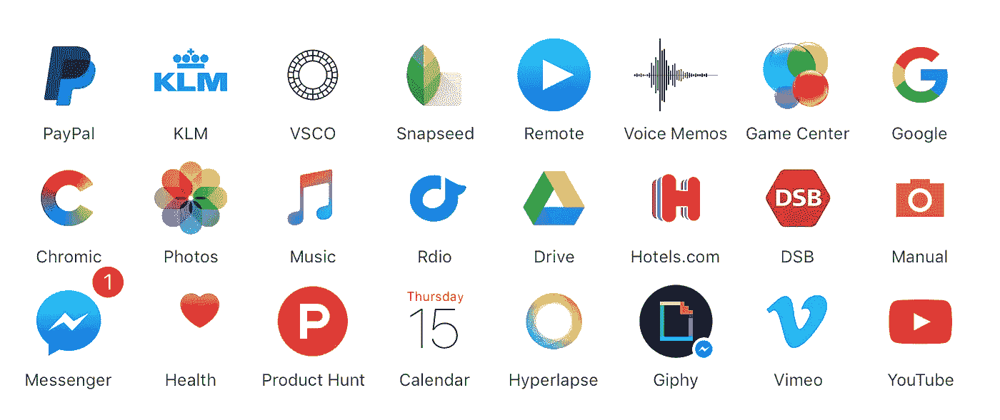
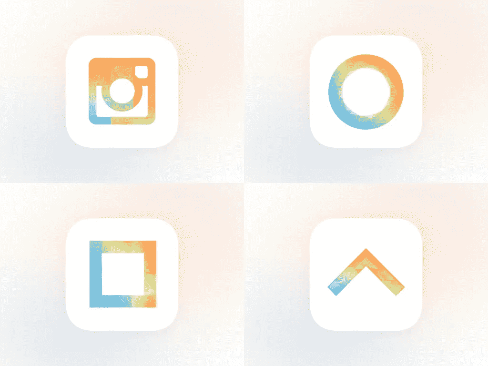

# 我们来谈谈白色的应用程序图标

> 原文：<https://medium.com/swlh/let-s-talk-about-white-app-icons-ce2e83b9eb86>

我打开手机，发现我的另一个常用应用程序在一夜之间更新了。然而，盯着我的是另一个 120x120 像素的白色松鼠，中间有一点颜色。另一只咬了白色。

几周前，我带着一个名为“[设计更好的应用图标](https://vimeo.com/144562417)的演讲在伦敦、洛杉矶、佛罗伦萨&阿姆斯特丹巡回演讲。我和很多人谈论过图标。一个反复出现的话题(最终进入我的演讲)是关于越来越多的应用程序图标使用白色背景。这促使我写了这条推文:

除了我是一个脾气暴躁的老人的背景之外，这件事引起了人们的共鸣，我为让它这样悬着感到难过。让我们来谈谈白色应用程序图标。

# 这是怎么回事？

我们界面的刷白正在渗透到我们的应用程序图标中，全球越来越多的设计师选择在干净的白色背景上使用字形。

这种发展有许多原因。这一变化的起点显然是 iOS 7 的推出，以及更扁平的界面和简化的应用图标的兴起。苹果制作的最重要的股票应用程序中，有相当一部分以白色背景为特色。换句话说:如果你在浏览互联网、看照片、听音乐或检查健康状况，你最有可能通过一个白色的应用程序图标来完成。

UI 设计思维的整体转变被很好地[记录和辩论](http://www.pixelresort.com/blog/the-interview-about-flat-design-that-wasnt-cool-enough-for-the-media/)，坦率地说，对于这个咆哮来说并不那么有趣。然而，在这种清理和简化的背后是应用程序图标设计的一个有趣的发展:在画布上引入空白的愿望。

# 白色怎么了？

白色没什么不好。见鬼，[我做了白色的应用图标](https://www.behance.net/gallery/31013323/Minimalistic-App-Icons)，当它们被很好地执行时，我喜欢它们。问题是**综艺**和**平庸**。

## 多样化

图标体现了一个产品；它是用户每次与产品交互时看到的东西。因此，一个应用图标的成功标准很大一部分是脱颖而出，清楚地传达该产品是关于什么的。你的图标是你在用户心目中塑造产品形象的最好工具。因此，当一种潮流席卷全球时，每个长相相似的偶像都会在独特性方面受到影响，这并不完全令人惊讶。图标设计缺乏多样性会损害用户的导航能力，模糊你产品的精神形象。让你的图标看起来和其他图标太相似，本质上是在恶化你和用户的关系。通过选择白色作为应用程序图标的主色，你选择在画布上使用更少的颜色，因此潜在地限制了你可以独一无二的像素数量。

[Josh Puckett’s](http://twitter.com/joshpuckett/) scary take on a future Instagram Icon. ([source](https://twitter.com/joshpuckett/status/657358423994990593))

## 平常

关于应用程序图标中流行的简化的、印刷风格的设计，可以说很多事情。一方面，它使设计变得更加容易，因为它不需要纹理和照明的内在知识来创建一个令人惊叹的平台可接受的图标。另一方面也打开了平庸图标设计的闸门。每个人只要有一份 photoshop 软件和 10 分钟的空闲时间，就可以创造出可以作为应用图标的东西。仅仅因为某样东西 ***看起来*** 简单，并不意味着把它做成 ***就是*** 简单。事实上，正如大多数图标设计师所知道的，在限制条件下让一些极简的东西工作得很好通常需要更多的努力。虽然趋势可能会改变，但制造可扩展、可交流且外观出众的产品的工艺是不变的。这并不一定是针对白色的应用程序图标，但我发现白色的应用程序图标在平庸的时候是一个很大的冒犯者。色彩的缺乏让设计师们不去关心或不去考虑画布或网格的整体。

# 做出有意义的决定

所以总结一下；无论如何，*制作白色的应用程序图标*，但是当你这样做的时候——想想你的设计选择会如何提升或伤害你的独特性，以及你与用户的联系。总是基于最大的影响而不是肤浅的审美，什么'别人已经做了'或因为它很容易做决定。如果你真的使用干净的白色背景，那就这样做，因为它对你的产品有意义，并给予它应有的关心和重视。

*更新:这篇文章给了我很多很好的回应，但我觉得有必要用一种更有建设性和更实用的方法来跟进我所认为的***如何打造一个伟大的应用图标。阅读“* [*设计更好的 app 图标*](/@flarup/designing-better-app-icons-bac276f89ead#.fdluifxgd) *”少传多要点。❤**

* [## 设计更好的应用图标

### 我通常不太喜欢抱怨太多的文章，毕竟上周的文章“让我们…

medium.com](/p/bac276f89ead) *

# *🗯和我一起在 [Youtube](https://www.youtube.com/c/flarup) 上观看幕后、设计工具提示和冒险！*

*发表于*****(***创业、流浪、生活黑客)*****

************************