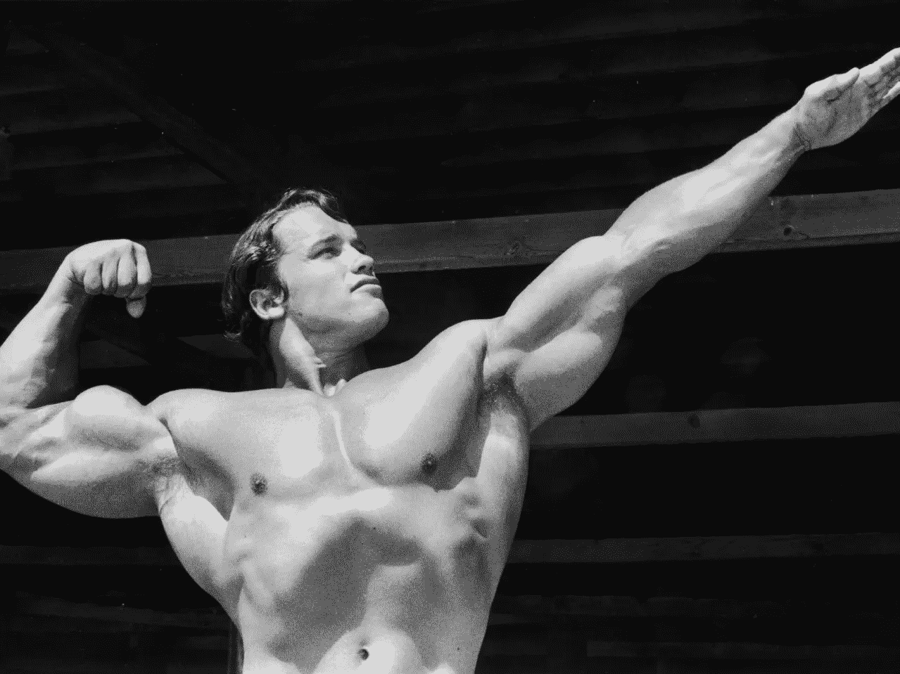

# 让我们都从阿诺德·施瓦辛格那里吸取教训

> 原文：<https://medium.com/swlh/lets-all-learn-this-lesson-from-arnold-schwarzenegger-75d53c968c94>

HULTON ARCHIVE / STRINGER / GETTY

阿诺德的故事很精彩。如果你还没有读过他的传记:《全面回忆:我不可思议的真实生活故事》，把它加入你的清单。每个人都有适合自己的东西，这非常鼓舞人心。

在他做的所有事情中，我认为我学到了最有价值的一课:

> “我知道如果我只露出我身体更好的部分——我的手臂、胸部或三角肌——我从同龄人那里得到的只会是精彩的评论，我很快就会忘记我可怕的小腿，所以我继续穿着会引起自我挫伤疼痛的切角运动裤……这很有效。每次锻炼时，我都会先训练它们，通常在锻炼结束时我会做几组。”——阿诺德·施瓦辛格。

我们多久暴露一次自己的弱点？

很少。

作为一个男人，我的腿真的很小。我一直为他们感到羞耻。事实上，我年轻的时候也因此被取笑过。因为这个原因，很长一段时间我都不穿短裤。我不想暴露他们。我不想暴露这个弱点。

我害怕别人的评价。事实上我现在也是。我们不都是吗？

但是现在在健身房露出我的腿，我更有动力去锻炼它们。对我来说很难。我两腿发软。但是在健身房，没有人会因此对我评头论足。他们明白了。他们看到我在努力克服自己的弱点，并尊重这一点。

我刚才提到了我的一个身体弱点，就像阿诺德一样，但这真的适用于一切，不仅仅是身体。它可能是一种你学不会的技能，一种你有的恐惧，在生意上，在工作上，任何事情上。我几乎不会骑自行车。我恐高。我害怕溺水等等。

暴露你的弱点非常困难。因为有了更多的自信，事情变得简单了一些。但是，这里有一个关键的教训:在合适的环境中暴露你的弱点。

我不喜欢在健身房外露腿。断章取义，人们会因此对我做出负面评价。

除非你有阿诺德的信任，否则我建议你也这样做。暴露你的弱点，让人们更容易看到你的弱点。并逐渐扩展环境。

对我来说，这个月我的腿长了很多。它们仍然很小，但比以前小了。渐渐地，我变得不那么为他们感到羞耻了。

如果我不暴露我的腿，我可能会主要在我的手臂上练习，因为我有明显的力量。

所以让我们都向阿诺德学习吧！

# 一点运动

你的弱点是什么？

你是怎么把它们藏起来的？

你如何揭露他们？

你对他们做了什么？

让我们互相帮助。感觉勇敢？请在评论中发表。你会发现，在一个没有评判的环境中，把它说出来感觉很好。

你能做到的！

**感谢阅读和分享！:)**

**如果你喜欢这个故事，请随意鼓掌几下(说真的，最多 50 下)。**

想要更多的动力，去看看 dannyforest.com。

## 这篇文章发表在[《创业](https://medium.com/swlh)》上，这是 Medium 最大的创业刊物，有 289，682+人关注。

## 订阅接收[我们的头条新闻](http://growthsupply.com/the-startup-newsletter/)。

