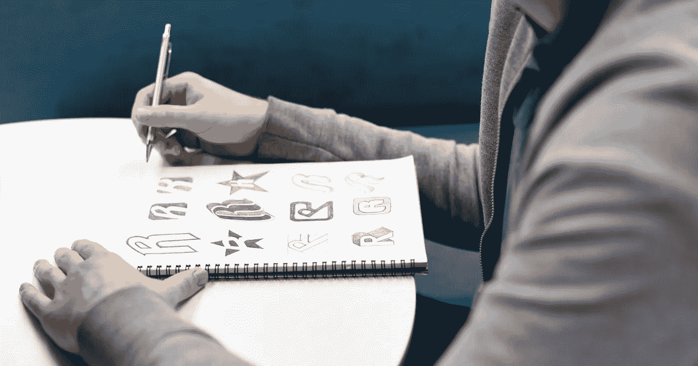

# 让我们建立一个更好的品牌形象

> 原文：<https://medium.com/swlh/lets-build-a-better-brand-identity-e782cfc5582a>

Photo by rawpixel.com on Unsplash

## 什么是品牌标识，如何确保您的品牌标识在视觉上反映出您是谁

建立更好的品牌识别是塑造你理想品牌的起点。注意我说的“塑造”你的品牌，因为品牌不是你的名字或标志。你的品牌是世界对你的看法，在很多方面，这是你无法控制的。