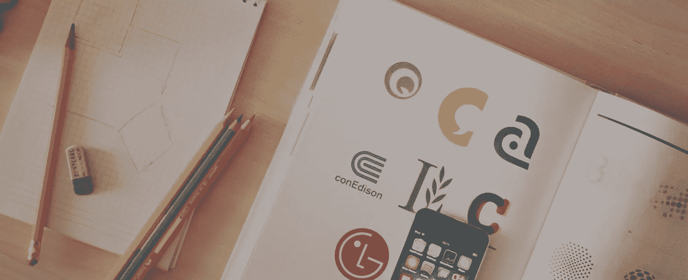

# 让我们来讨论一下一个标志要多少钱

> 原文：<https://medium.com/swlh/lets-discuss-how-much-a-logo-cost-7768fc9c77d1>

Photo by [Aleks Dorohovich](https://unsplash.com/photos/nJdwUHmaY8A?utm_source=unsplash&utm_medium=referral&utm_content=creditCopyText) on [Unsplash](https://unsplash.com/search/photos/sketch?utm_source=unsplash&utm_medium=referral&utm_content=creditCopyText)

## 为什么一个好的商标要花费几百美元

你知道标志是你的品牌身份的基本组成部分，它对你的标志从竞争中脱颖而出至关重要。作为一个商人，你应该权衡标志设计的成本和你将获得的质量和价值。