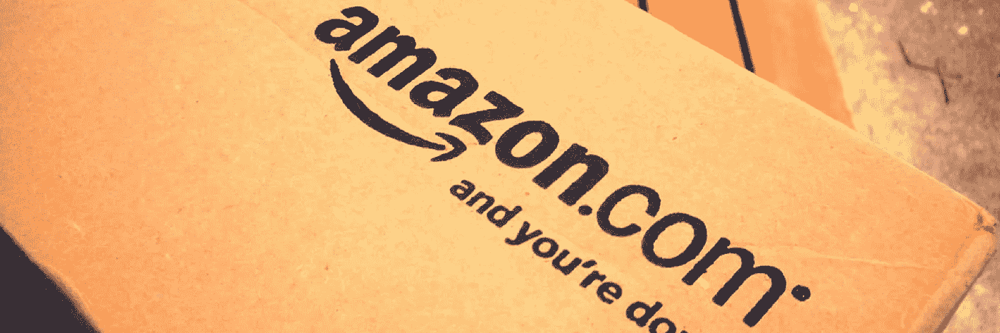

# 亚马逊做到了我们就去做！没有。

> 原文：<https://medium.com/swlh/lets-do-it-if-amazon-did-it-nope-b58c94aeda20>

亚马逊优秀且经过充分测试的功能不一定适用于你的电子商务网站。

为什么？

好吧，让我们来看看他们的顾客评论，突出的例子，以便我们更好地理解。亚马逊的顾客评论软件最近被 Target.com 收购，用于他们的电子商务购物网站。

尽管使用了相同的软件，令人惊讶的是，Target.com 在广受欢迎的《哈利·波特与死亡圣器》发行后的第一个月没有收到 3 条评论。与此同时，亚马逊收到了 1805 条评论。两家零售网站都售出了约 200 万份。

我们从中获得了什么？

我们知道复制是没问题的，但是在这样做的时候，我们必须确定为什么这对他们有用，以及如何对你有用。深入到事情的本质，因为这不会浪费你的时间，反而会让你受益。

# 也就是说，有理由不抄袭亚马逊

*   一项分析研究显示，Amazon.com“在可用性测试领域被认为是其他 20 个顶级网站中主页加载速度最慢的网站之一，它的主页也是最混乱的。尽管如此，在使用该网站后，用户最终表示他们会使用该网站，并会进一步推荐它。这表明，对网站的熟悉和品牌识别的强大游戏对亚马逊有用，因为它的缺陷随后被忽视了。然而，如果你决定跟风复制网站的每一个细节，这些缺陷可能是你网站的死亡之吻。
*   著名 UX 设计师兼博主约书亚·波特认为，盲目抄袭亚马逊或脸书等顶级网站的设计是一个可怕的想法。她提出了这样一个思维过程:当一个人在复制时，他不知道设计背后的原因，他没有直接回应客户的需求，而这才是正确的做法。她总结道，这是贬低你自己数据的方式。

**尽管如此，获得灵感并融入周围看到的聪明设计的一部分是没问题的，同时记住这样做的时候要聪明！**

*可以关注我们* [*脸书*](https://www.facebook.com/monsoonfish) */* [*领英*](https://www.linkedin.com/company/13404751/) */* [*推特*](https://twitter.com/monsoonfishy)*/*[*Dribbble*](https://dribbble.com/monsoonfish)

*最初发表于*[*【monsoonfish.com】*](http://monsoonfish.com)*。*

## 这篇文章发表在 [The Startup](https://medium.com/swlh) 上，这是 Medium 最大的创业刊物，拥有 277，994+读者。

## 在这里订阅接收[我们的头条新闻](http://growthsupply.com/the-startup-newsletter/)。

