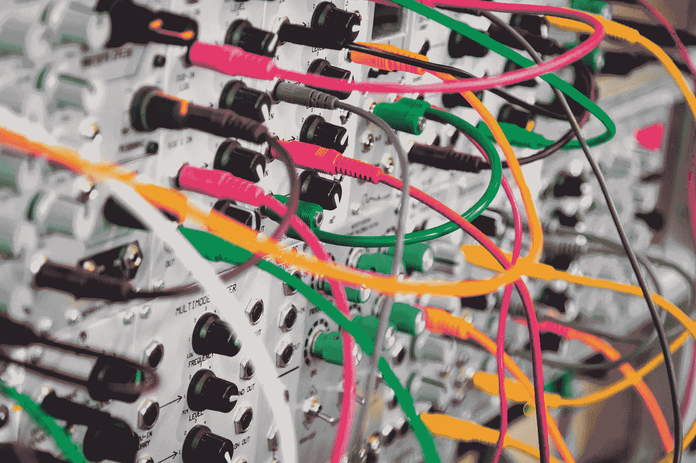

# 让我们在人工智能上保持我们的马

> 原文：<https://medium.com/swlh/lets-hold-our-horses-on-ai-74fed5148fe1>

自动化时代已经来临，但它并没有像一些耸人听闻的报道和围绕这个话题的普遍争议所暗示的那样快。

Photo by [John Carlisle](https://unsplash.com/photos/l090uFWoPaI?utm_source=unsplash&utm_medium=referral&utm_content=creditCopyText) on [Unsplash](https://unsplash.com/search/photos/neural-network?utm_source=unsplash&utm_medium=referral&utm_content=creditCopyText)

似乎我们每隔一天就会看到一篇关于人工智能的新文章，同时还有少量机器学习的内容。Medium 的[首页](/@LanceUlanoff/did-google-duplex-just-pass-the-turing-test-ffcfe6868b02)也不例外，有一篇文章报道了 Google Duplex 在能够模仿年轻…