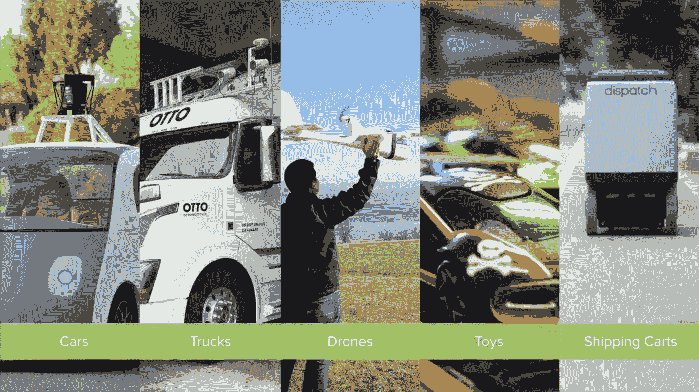
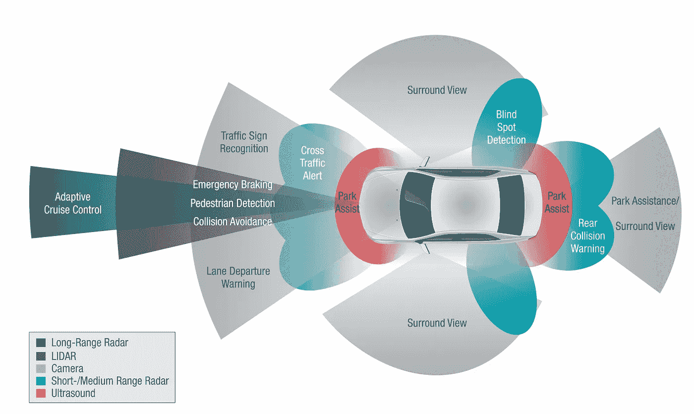
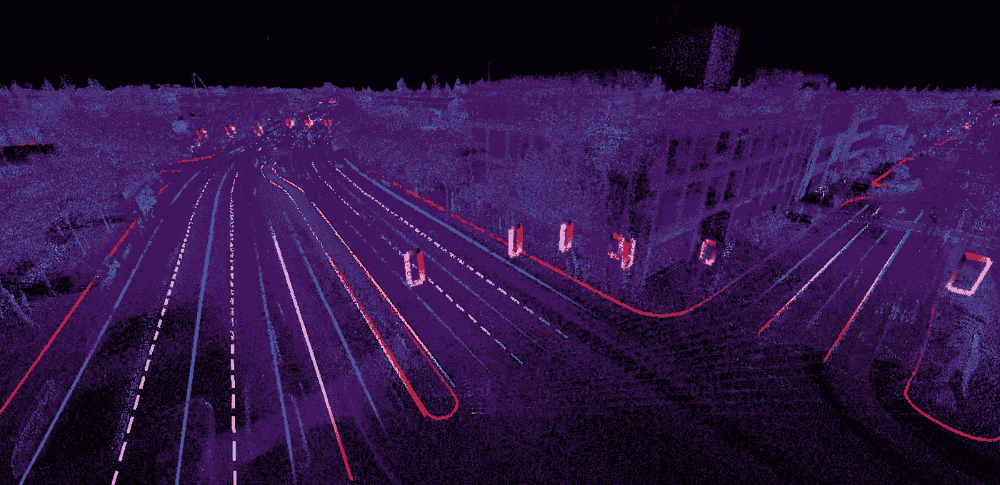
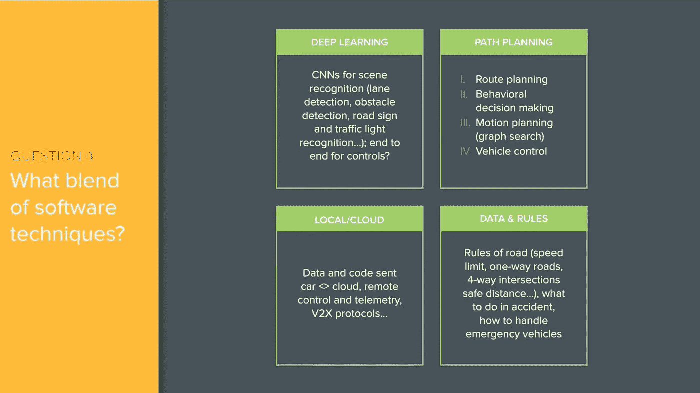
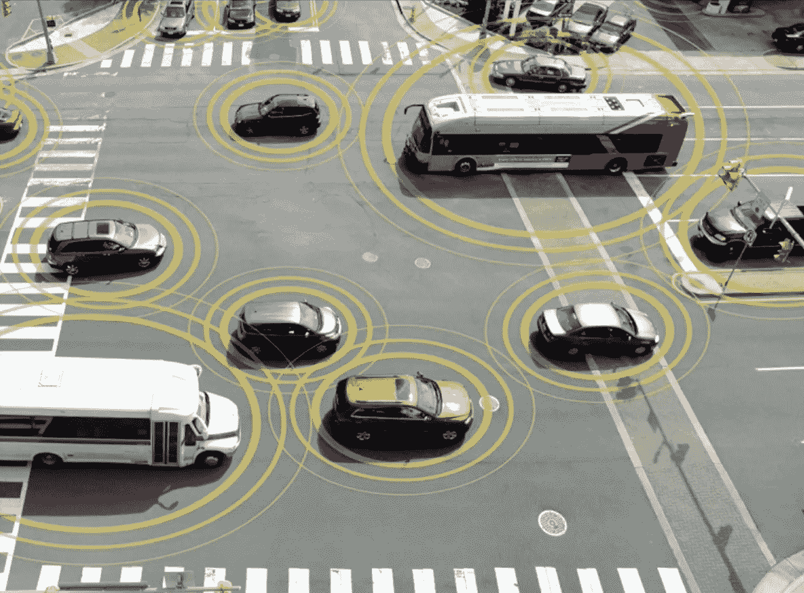
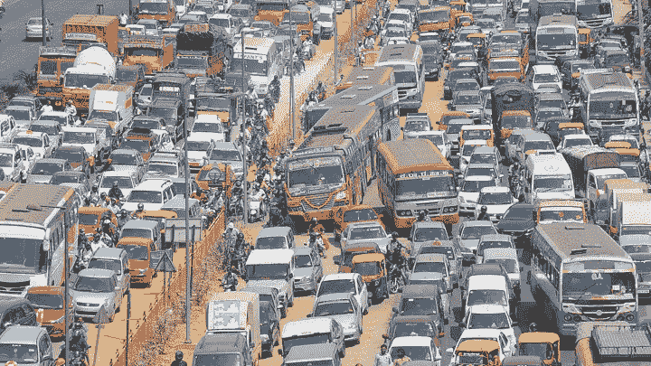
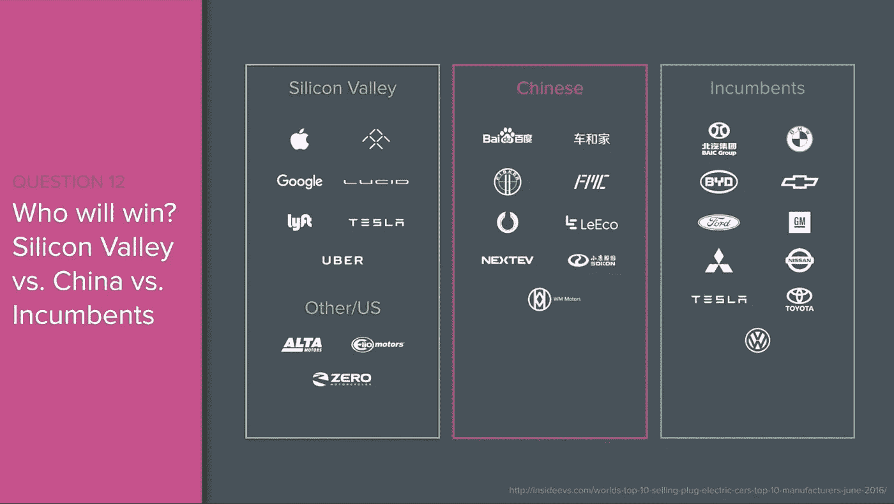
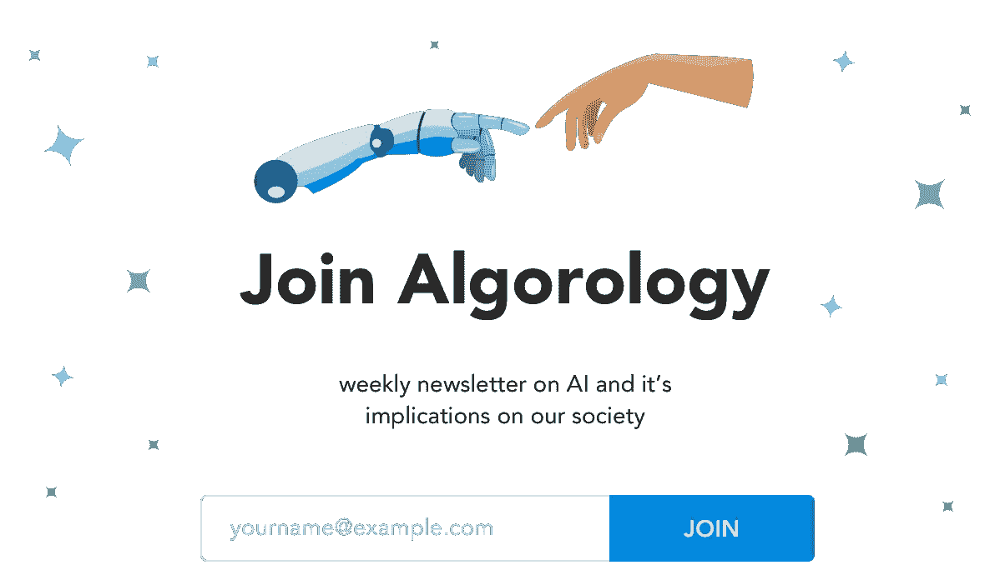

# 我们来谈谈自动驾驶汽车

> 原文：<https://medium.com/swlh/lets-talk-about-self-driving-cars-387cd5adb834>

## Andreessen Horowitz 关于自动驾驶汽车未来的演讲概述

我热爱自动驾驶汽车的一切，甚至在 [Udacity](https://www.udacity.com/course/self-driving-car-engineer-nanodegree--nd013) 攻读自动驾驶汽车工程师学位。这就是为什么 a16z 峰会的这个视频真正引起了我的注意。Frank Chen (a16z 合伙人)讨论了关于自动驾驶汽车最常见的问题，我决定在 [Medium](https://medium.com/u/504c7870fdb6?source=post_page-----387cd5adb834--------------------------------) 上深入探讨这些问题。

# 一级一级还是直奔第五级？

主要的假设是“所有移动的东西都将自动运行”，我们不只是在谈论汽车，我们道路上的所有卡车、天空中的无人机、购物汽车甚至玩具都将自动运行，以至于我们的参与将变得初级、不受欢迎甚至非法。

那我们怎么去呢？

有一个来自[汽车工程师协会](https://www.sae.org/misc/pdfs/automated_driving.pdf)的六级分类方案，并在六个类别中描述了自动驾驶。

## 零级:仅驾驶员

这个很简单，就是你完全自己开车的时候。

## 第一级:辅助

我们今天主要驾驶的汽车属于这里，那些有防抱死刹车和巡航控制的汽车，所以它们可以接管驾驶中一些不重要的过程。

## 第二级:部分自动化

当系统可以在一些特定的用例中接管控制，但驾驶员仍然必须始终监控系统时，它适用于汽车在高速公路上自动驾驶的情况，你只是坐在那里，期待它表现良好。

## 第三级:条件自动化

这个级别意味着驾驶员不必一直监控系统，但必须处于一个操作员可以快速恢复控制的位置。这意味着不需要手握方向盘，但你必须在听到紧急情况的声音时立即行动，这是系统可以有效识别的。

## 第四级:高度自动化

当你的车把你开到停车场时，你就到了第四级，在这一级，特定的用例或旅程的一部分不需要人类操作员。

## 第五级:完全自动化

圣杯就在这里，意味着系统可以在整个旅程中自动应对所有情况，不需要驾驶员完全没有控制，这意味着你别无选择。

# 什么样的传感器？到底是不是激光雷达？

下一个问题是哪种硬件可以让我们达到第五级，是一些新的传感器还是对现有传感器的不断改进？

谷歌等公司依赖激光雷达技术，该技术代表光探测和测距，是一种遥感方法，使用脉冲激光形式的光来测量到周围环境的距离(可变距离)。

结合相机和智能软件的 3D 激光地图，足以让一辆汽车在没有人类驾驶员的情况下自动驾驶。

目前的实现是一个屋顶上的移动桶，成本为 75000 美元，这使得它成为整个行业大规模应用的主要障碍。但有一些进步，使其成为固态，没有移动部件，成本约为 250 美元。

那么，让我们能够计算 3D 空间的立体摄像机呢？人类眼睛里的照相机让我们不会撞到彼此。这些相机让我们几乎获得了激光雷达的所有好处，并且不需要花费太多，但反论点是额外的分辨率和准确性。

# 新型预计算地图？

每个人都使用谷歌地图、Waze、苹果地图，它们有惊人的分辨率，使我们在城市中的移动没有摩擦。但是这个分辨率对于一辆想要自动驾驶的汽车来说还是不够的。

那还缺什么信息呢？比如:

*   曲线在哪里
*   交通桶在哪里
*   一天中的什么时候，我的相机前会出现一道强光，让我完全失明

并且所有其他种类的微分辨率细节完全从地图的广义视图中遗漏。因为我们人类根本不关心这些，而且目前的地图解决方案是为人类而不是机器设计的。

那么，我们是否需要仅为自动驾驶汽车分离预先计算的地图？似乎是的，但是谁来提供它们，费用是多少？没人问的最有趣的问题是，这个领域是否有垄断的机会？因为在不久的将来，当我们到达第五级时，你没有选择自己驾驶车辆——你完全依赖为自动驾驶汽车提供动力的基础设施。

我们会看到更便宜的预计算地图版本吗？它将允许我们的汽车在一定的低速或一定的安全水平下运行？

谁来监管这个潜在的危险灰色地带？

它也有电力方面的影响，因为你必须依靠你后备箱里的超级计算机来操作那些复杂的数百万参数预计算的高清地图，而且这些会消耗很多电力。

# 什么样的软件技术混合？

深度学习正在硅谷发出声音，但在机器人和路径搜索领域还有其他不应被遗忘的成就。这些方法之间的主要区别是系统从以前的经验/数据集学习的能力，或者仅基于硬连线逻辑或规则驱动决策的能力。

事实上，我们都钦佩的波士顿动力公司的机器人根本没有利用任何机器学习，但仍然取得了令人印象深刻的结果。

尽管那些直接编程的规则无法以与深度学习算法相同的效率击败阿尔法围棋选手，但它们仍然可以与机器学习的最新进展相结合，以提供更好的结果。

# 真实世界 vs 虚拟世界测试多少？

对于机器学习，你需要有巨大的数据集来学习，这些数据集是以前的经验，正确行为和环境的例子。

这里的问题是，相对于模拟环境，有多少数据将来自在真实道路上行驶的真实汽车。

事实上，已经有一些尝试简化这种类型的学习，通过模拟宇宙，如 OpenAI 的宇宙项目。

 [## OpenAI，DeepMind 发布软件平台，训练人工智能模拟人类技能

### OpenAI 的创建是为了使人工智能民主化和去中心化。非营利组织更接近这一目标…

www.tomshardware.com](http://www.tomshardware.com/news/openai-universe-deepmind-lab-announcements,33135.html) 

我们能确保算法会收敛到与现实世界中相同的预测吗？有了虚拟世界，你可以模拟更多的情况，但考虑到我们必须考虑的预计算地图的分辨率和粒度，这些情况会有多精确。

# V2X 收音机会发挥重要作用吗？

V2X 是一种技术形式，允许车辆与周围交通系统的移动部分进行通信。V2V 技术，即车对车，允许车辆与其他车辆进行通信。

使用案例的范围从在没有其他车辆时让您的汽车与交通灯通信，并且您在那里坐了 5 分钟，到更危险的情况，其中汽车必须紧急传达紧急状态，例如 T 形骨碰撞问题。

考虑到特斯拉的最新进展和一个病毒视频，一辆汽车在人类之前发现了车祸，这尤其有趣。

 [## 观看特斯拉预测前方 2 辆车发生车祸

### 一辆特斯拉的仪表盘摄像头画面显示，该车的自动驾驶功能在任何人看到车祸到来之前就预测到了车祸…

mashable.com](http://mashable.com/2016/12/27/tesla-predicts-crash-ahead-video/) 

想象一下，如果道路上和道路周围有适当的通信，可以避免多少事故。

这里主要关心的是通信的协议兼容性和效率，因为决定应该在毫秒内发生，并且没有时间进行与通信“语言”差异相关的额外计算。

这是一项每个人都视为美好未来的技术，但没有人计划将其作为完全自动驾驶汽车的第一次迭代。

# 我们能摆脱红绿灯吗？

四向灯太烂了，如果汽车可以互相交谈，并且完全自动驾驶，为什么我们不能去掉灯呢？这可能听起来非常混乱，但是，嘿，互联网数据包不也是这样移动的吗？

这将涉及智能重排算法和十字路口的极端监控，但考虑到它将带来的运输效率的提高，这是完全值得的。

# 汽车制造商将如何“本地化”他们的汽车？

每个城市都有不同的驾驶文化，那么自动驾驶汽车将如何对待这些独特的条件。班加罗尔的安全可能会导致波士顿的交通崩溃，等等。

本地化是一个来自计算机科学的术语，意思是软件将以某种方式准备好适应执行它的环境条件。

那么这在自动驾驶汽车中可以采取哪种形式，我们会有不同类型的算法专门用于不同的城市吗？波士顿版本，班加罗尔版本等每个城市的驾驶大会？或者，我们会有一个通用的算法，能够通过在道路上花费一些时间来适应任何环境？

这涉及到另一个研究领域，即通过吸收我们周围的人和物的行为来创造学习规则。通过学习社会习俗和典型的人类行为，汽车应该能够表现得更好。

# 谁会赢？硅谷 vs 中国 vs 老牌企业

这里的主要假设是，现任者是最容易成功的人，因为他们已经在制造汽车，并拥有所有必要的基础设施。

这些公司正在硅谷建立办公室，并积极试图雇佣人员来更快地推动创新，因为他们知道这将主要通过软件来实现。但对于本土硅谷汽车公司来说，也有机会，比如特斯拉。

有很多像百度这样的中国制造商和软件所有者正在非常积极地向这个领域推进。另一方面，中国发表的深度学习论文比地球上任何其他国家都多，因此绝对值得关注。

# 我们将购买汽车还是交通工具作为服务？

如果我们作为消费者将改变我们的行为，从从制造商那里购买汽车，转向从优步和 Lyft 这样的公司购买运输服务，那么所有的钱将开始流向另一个方向。

这将导致汽车行业看起来更像一个航空业，你不必选择你想乘坐的飞机，而是将你的钱奉献给一个机队提供商——航空公司。

这将导致汽车公司转型为 b2b 公司，而不是 B2C，他们将开始向优步这样的车队经理销售。因此，我们将看不到任何汽车的超级碗广告，许多其他存在的操纵我们购买汽车的东西将会消失。

# 保险会有怎样的变化？

其中一个变化就是保险业。现在，保险价格是作为一个函数来计算的，这个函数考虑了你作为一个司机，你的人口统计数据，你拥有的汽车的价格和你住在哪里。

在这个新的自动驾驶时代，保险公司会考虑哪些因素？算法的效率会是核心指标吗？汽车经理？汽车制造商？还是一个拥有或租用汽车的司机？

维修成本将如何表现？我们肯定会有更少的事故发生，但是实际修理你们的激光系统、预计算地图超级计算机分析仪和所有其他昂贵的硬件会有多复杂。

# 事故率将如何变化？

如果所有汽车都变成自动驾驶，事故率将为零，因为大多数事故的 25 个原因中有 24 个与人为错误有关。像超速行驶，分心驾驶，酒后驾车，闯红灯都是我们坐在方向盘后面的原因。

但是事物的混合状态呢？一些汽车仍将由人类驾驶，并将引发我们从未经历过的意外事故。

# 什么时候开车变成违法了？

如果算法在统计上比司机强是真的，那么我们就不应该让人们开车。但是仍然有很多人喜欢开车。这可能是一个有趣的娱乐活动，但我们只是不需要那些人在路上。

# 通勤会有什么变化？

一个论点是通勤时间会更长，因为我们会变得不在乎通勤需要多长时间。随着我们接近所有汽车都完全自动驾驶的状态，没有红绿灯，没有事故，我们应该能够在通勤期间做任何我们想做的事情。

见鬼，我们甚至可以像在火车上或飞机上一样在上下班途中睡觉。通勤肯定会从一件痛苦的事情转变成一件更好的事情。

但这也将释放出如此多的空间(停车位、汽车修理店)，人们将住得离工作地点更近，而不必像今天这样频繁地通勤。

# 城市会有怎样的变化？

有如此多的二阶和三阶效应将会发生，而且现在不可能预测，因为不可能预测沃尔玛现象。

这些东西肯定会改变我们的社会，并创造看不见的机会来利用。

# 这将在何时开始，我们将多快转向自动驾驶汽车？

一些主要参与者预测这将在 2020-2040 年发生。我们会在有生之年看到这个美丽的世界，问题是我们是否准备充分。

*声明，文章中的大部分内容来自* [*本视频*](http://a16z.com/2017/01/06/selfdriving-cars-frank-chen/) *，我是连同我的想法和额外的信息一起写出来的。请随意注册我的时事通讯，每周获取策划内容。*

