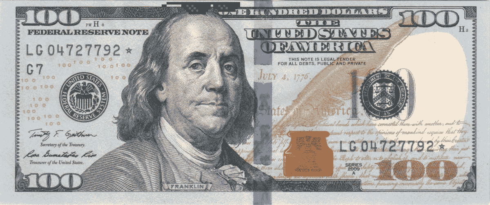

# 让我们来谈谈钱:我的净资产正好是 42，756.30 美元

> 原文：<https://medium.com/swlh/lets-talk-money-my-net-worth-is-exactly-42-756-30-d16d5c7de743>

Picture from [Wikipedia,](https://commons.wikimedia.org/wiki/File:Obverse_of_the_series_2009_$100_Federal_Reserve_Note.jpg) gif by yours truly

谈钱很难。

在我们的社会中，我们的净资产与我们的自我价值紧密相连。

你赚的钱越多，你就越成功，越聪明，越优秀。

可能会很吓人，尴尬，或者(还有？)诱发焦虑(✋🏽)来谈钱。