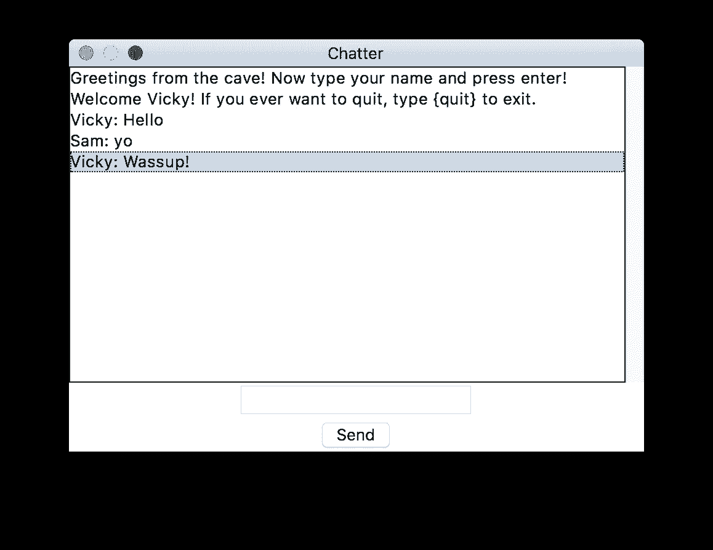
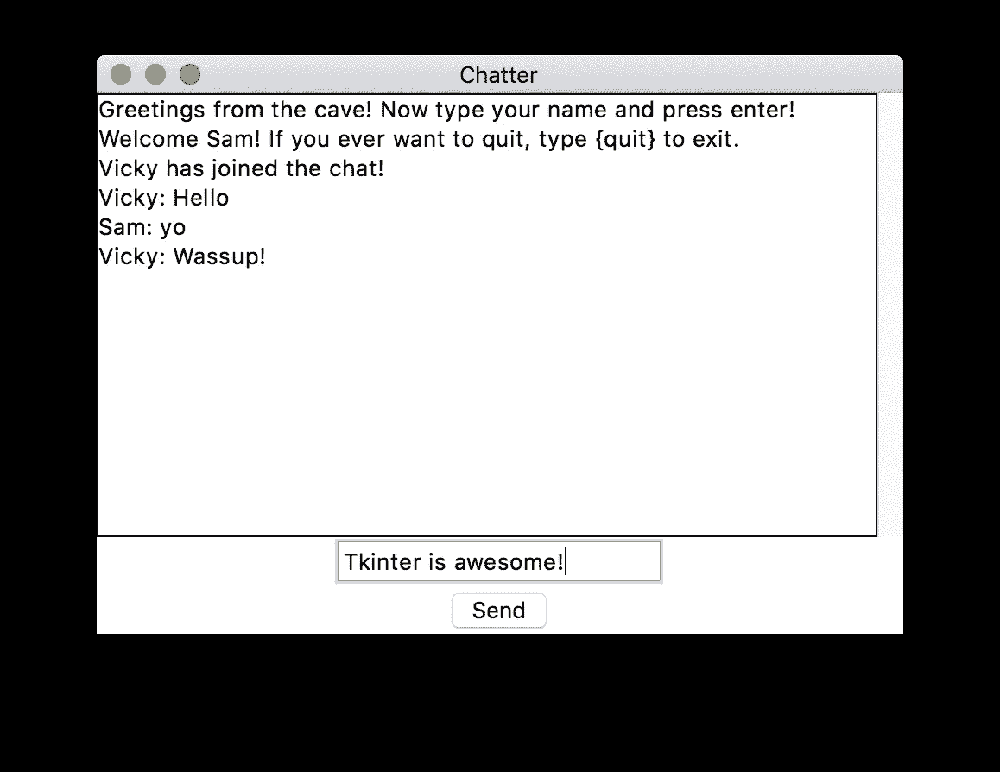

# 我们用 Python 写个聊天 App 吧

> 原文：<https://medium.com/swlh/lets-write-a-chat-app-in-python-f6783a9ac170>

不到 150 行代码中的 Tkinter +套接字


It’s Always Good to Have a Conversation!

不要太频繁，你碰巧创造了一些惊人的简单而有趣的东西，你只是迫不及待地与世界分享。

这正是发生在我身上的事情，事实上，我在这里分享我是如何用非常简洁的 Python 代码制作一个简单的聊天应用程序的。更何况；我已经在没有*任何*第三方依赖的情况下实现了代码！所以让我们开始吧！

首先，我创建了一个聊天服务器，通过它可以接收来自想要交流的客户的请求。为此，我使用了好的 ole 套接字和一点多线程。使用像 [Twisted](https://twistedmatrix.com/) 和 [SocketServer](https://pymotw.com/3/socketserver/) 这样的框架是一种选择，但对于我们这样简单的软件来说，这似乎有点大材小用了。

# **服务器**


下面是我们如何开始我们的服务器脚本(对于这个应用程序，只有两个脚本:一个用于服务器，另一个用于客户端):

```
#!/usr/bin/env python3
"""Server for multithreaded (asynchronous) chat application."""from socket import AF_INET, socket, SOCK_STREAM
from threading import Thread
```

为此我们将使用 TCP 套接字，因此我们使用`AF_INET`和`SOCK_STREAM`标志。我们在 UDP 套接字上使用它们，因为它们更像是电话，在通信开始之前，接收者必须批准传入的连接，而 UDP 套接字更像是邮件后的东西(任何人都可以向他/她知道地址的任何接收者发送邮件)，所以在通信发生之前，它们实际上不需要建立连接。显然，TCP 比 UDP 套接字更适合我们目的，因此我们使用它们。这里可以了解更多插座[。](https://en.wikipedia.org/wiki/Network_socket)

导入后，我们设置了一些*常量*以备后用:

```
clients = {}
addresses = {}HOST = ''
PORT = 33000
BUFSIZ = 1024
ADDR = (HOST, PORT)
SERVER = socket(AF_INET, SOCK_STREAM)
SERVER.bind(ADDR)
```

现在，我们将服务任务分为接受新连接、广播消息和处理特定客户。让我们从接受连接开始:

```
def accept_incoming_connections():
    """Sets up handling for incoming clients."""
    while True:
        client, client_address = SERVER.accept()
        print("%s:%s has connected." % client_address)
        client.send(bytes("Greetings from the cave!"+
                          "Now type your name and press enter!", "utf8"))
        addresses[client] = client_address
        Thread(target=handle_client, args=(client,)).start()
```

这只是一个永远等待传入连接的循环，一旦获得连接，它就记录连接(打印一些连接细节)并向连接的客户端发送欢迎消息。然后，它将客户端的地址存储在`addresses`字典中，稍后为该客户端启动处理线程。当然，我们还没有为此定义目标函数`handle_client()`，但我们会这样做:

```
def handle_client(client):  # Takes client socket as argument.
    """Handles a single client connection."""
     name = client.recv(BUFSIZ).decode("utf8")
    welcome = 'Welcome %s! If you ever want to quit, type {quit} to exit.' % name
    client.send(bytes(welcome, "utf8"))
    msg = "%s has joined the chat!" % name
    broadcast(bytes(msg, "utf8"))
    clients[client] = name
     while True:
        msg = client.recv(BUFSIZ)
        if msg != bytes("{quit}", "utf8"):
            broadcast(msg, name+": ")
        else:
            client.send(bytes("{quit}", "utf8"))
            client.close()
            del clients[client]
            broadcast(bytes("%s has left the chat." % name, "utf8"))
            break
```

自然地，在我们向新客户发送欢迎消息后，它会回复一个他/她希望用于进一步交流的名字。在`handle_client()`函数中，我们做的第一件事是保存这个名字，然后向客户端发送另一条消息，关于进一步的指令。接下来是通信的主循环:在这里，我们从客户端接收进一步的消息，如果消息不包含退出指令，我们只需将消息广播给其他连接的客户端(稍后我们将定义广播方法)。如果我们确实遇到了带有退出指令的消息(例如，客户端发送了一个`{quit}`)，我们将相同的消息回显到客户端(它触发客户端的关闭操作)，然后我们关闭它的连接套接字。然后，我们通过删除客户端的条目来做一些清理工作，最后向其他连接的人大声宣布这个特定的人已经离开了对话。

现在我们的`broadcast()`功能来了:

```
def broadcast(msg, prefix=""):  # prefix is for name identification.
    """Broadcasts a message to all the clients."""
     for sock in clients:
        sock.send(bytes(prefix, "utf8")+msg)
```

这几乎是不言自明的；它只是将`msg`发送给所有连接的客户端，并在必要时添加一个可选的`prefix`。在我们的`handle_client()`函数中，我们确实传递了一个`prefix`到`broadcast()`，我们这样做是为了让人们可以确切地看到谁是特定消息的发送者。

这就是我们的服务器所需的所有功能。最后，我们放入一些代码来启动我们的服务器并监听传入的连接:

```
if __name__ == "__main__":
    SERVER.listen(5)  # Listens for 5 connections at max.
    print("Waiting for connection...")
    ACCEPT_THREAD = Thread(target=accept_incoming_connections)
    ACCEPT_THREAD.start()  # Starts the infinite loop.
    ACCEPT_THREAD.join()
    SERVER.close()
```

我们`join()` `ACCEPT_THREAD`让主脚本等待它完成，而不跳转到下一行，关闭服务器。

这就完成了我们的服务器脚本，它呈现在以下要点中(对于那些正在智能手机上阅读本文的人，请访问 [this](https://github.com/schedutron/CPAP/blob/master/Chap5/chat_serv.py) 链接以获得完整的服务器代码):

# 客户


这更有趣，因为我们将编写一个 GUI！我们使用 Tkinter，Python 的“包含电池”GUI 构建工具来实现我们的目的。让我们先做一些导入:

```
#!/usr/bin/env python3
"""Script for Tkinter GUI chat client."""from socket import AF_INET, socket, SOCK_STREAM
from threading import Thread
import tkinter
```

现在我们将编写处理消息发送和接收的函数。我们从接收开始:

```
def receive():
    """Handles receiving of messages."""
    while True:
        try:
            msg = client_socket.recv(BUFSIZ).decode("utf8")
            msg_list.insert(tkinter.END, msg)
        except OSError:  # Possibly client has left the chat.
            break
```

为什么又是无限循环？因为我们接收信息的方式是不确定的，与我们发送信息的方式和时间无关。我们不希望这是一个对讲机聊天应用程序，一次只能发送 ***或*** 接收；我们希望在可能的时候接收信息，在需要的时候发送信息。循环中的功能非常简单；`recv()`是阻挡部分。它停止执行，直到收到一条消息，当收到消息时，我们继续前进，将消息追加到`msg_list`。我们将很快定义`msg_list`，它基本上是一个在屏幕上显示消息列表的 Tkinter 特性。

接下来，我们定义`send()`函数:

```
def send(event=None):  # event is passed by binders.
    """Handles sending of messages."""
    msg = my_msg.get()
    my_msg.set("")  # Clears input field.
    client_socket.send(bytes(msg, "utf8"))
    if msg == "{quit}":
        client_socket.close()
        top.quit()
```

我们使用`event`作为参数，因为当 GUI 上的`send`按钮被按下时，它被 Tkinter 隐式传递。`my_msg`是 GUI 上的输入字段，因此我们使用`msg = my_msg.get()`提取要发送的消息。之后，我们清除输入字段，然后将消息发送到服务器，正如我们之前看到的，服务器将此消息广播到所有客户端(如果它不是退出消息)。如果是退出消息，我们关闭套接字，然后关闭 GUI 应用程序(通过`top.close()`)

我们还定义了一个函数，当我们选择关闭 GUI 窗口时，这个函数将被调用。这是一种关闭前清理功能，应该在 GUI 关闭前关闭套接字连接:

```
def on_closing(event=None):
    """This function is to be called when the window is closed."""
    my_msg.set("{quit}")
    send()
```

这将输入字段设置为`{quit}`，然后调用`send()`，它将按预期工作。现在我们开始构建 GUI，在主名称空间中(即，在任何函数之外)。我们首先定义顶级小部件并设置其标题:

```
top = tkinter.Tk()
top.title("Chatter")
```

然后我们创建一个框架来保存消息列表。接下来，我们创建一个字符串变量，主要用于存储我们从输入字段获得的值(我们将很快定义它)。我们将该变量设置为`"Type your messages here."`来提示用户书写他们的消息。之后，我们创建一个滚动条来滚动这个消息框架。代码如下:

```
messages_frame = tkinter.Frame(top)
my_msg = tkinter.StringVar()  # For the messages to be sent.
my_msg.set("Type your messages here.")
scrollbar = tkinter.Scrollbar(messages_frame)  # To navigate through past messages.
```

现在我们定义将存储在`messages_frame`中的消息列表，然后将我们到目前为止创建的所有内容打包(在适当的位置):

```
msg_list = tkinter.Listbox(messages_frame, height=15, width=50, yscrollcommand=scrollbar.set)
scrollbar.pack(side=tkinter.RIGHT, fill=tkinter.Y)
msg_list.pack(side=tkinter.LEFT, fill=tkinter.BOTH)
msg_list.pack()messages_frame.pack()
```

之后，我们为用户创建输入字段来输入他们的消息，并将其绑定到上面定义的字符串变量。我们还将它绑定到`send()`函数，这样每当用户按下 return 时，消息就被发送到服务器。接下来，如果用户希望通过点击发送他们的消息，我们创建发送按钮。同样，我们将这个按钮的点击绑定到`send()`函数。是的，我们还打包了我们刚刚制作的所有这些东西。此外，不要忘记使用清理功能`on_closing()`，当用户希望关闭 GUI 窗口时，应该调用这个功能。我们通过使用`top`的`protocol`方法来做到这一点。这是所有这些的代码:

```
entry_field = tkinter.Entry(top, textvariable=my_msg)
entry_field.bind("<Return>", send)
entry_field.pack()
send_button = tkinter.Button(top, text="Send", command=send)
send_button.pack()top.protocol("WM_DELETE_WINDOW", on_closing)
```

(几乎)完成了。我们还没有编写连接到服务器的代码。为此，我们必须向用户询问服务器的地址。我已经通过简单地使用`input()`做到了这一点，所以在 GUI 开始之前，用户会收到一些命令行提示，要求输入主机地址。这可能有点不方便，您可以为此添加 GUI，但是我把它作为家庭作业留给您🙂。这是我的代码:

```
HOST = input('Enter host: ')
PORT = input('Enter port: ')if not PORT:
    PORT = 33000  # Default value.
else:
    PORT = int(PORT)BUFSIZ = 1024
ADDR = (HOST, PORT)
client_socket = socket(AF_INET, SOCK_STREAM)
client_socket.connect(ADDR)
```

一旦我们获得了地址并创建了一个套接字来连接它，我们就启动了接收消息的线程，然后是 GUI 应用程序的主循环:

```
receive_thread = Thread(target=receive)
receive_thread.start()
tkinter.mainloop()  # Starts GUI execution.
```

就是这样！我们已经编写了聊天应用程序。同样，完整的客户端脚本在下面的要点中给出(对于智能手机上的读者，这里是要点的链接):

# 演示

这种在多台电脑上测试的感觉棒极了。当然，您可以在同一台机器上运行服务器和客户机进行测试(在您的客户机上使用`127.0.0.1`代替`HOST`，但是看到不同计算机之间的实时通信感觉棒极了。服务器脚本将记录哪些 IP 地址正在访问它，客户端脚本将生成一个 GUI(在询问主机地址后),类似于下面的屏幕截图:



Client GUI



Another Client Connected to the Same Server

老实说，考虑到背后的 Python 代码行数，GUI 看起来不错，但并不出色！我把让它看起来更好(更直观)的任务留给了你，也许可以像脸书的 Messenger 一样制作一个左右聊天界面。你甚至可以使用像 Kivy 这样的第三方库来获得更多的美感和跨平台的可移植性，或者一个网络界面——在评论中发表你的想法。最后，谢谢你的耐心，一直读到最后一个字！我赞赏你的耐心🙂。

页（page 的缩写）s:关于我的其他项目(有些较小，有些大得多)，请访问[我的 GitHub 简介](https://github.com/schedutron)。

此外，我是博客新手，所以建设性的批评不仅需要，而且非常需要！我乐于接受更好的写作风格、技巧和教学方法——欢迎在评论中提出来。

[](http://buymeacoff.ee/schedutron)

Did you like the read? Medium doesn’t offer partner program in my country―so I ask people to buy me coffee instead.


## 这个故事发表在 [The Startup](https://medium.com/swlh) 上，这里有 263，100 多人聚集在一起阅读 Medium 关于创业的主要故事。

## 订阅接收[我们的头条](http://growthsupply.com/the-startup-newsletter/)。

