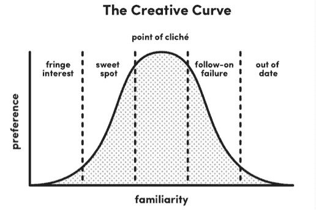

# 利用创意曲线

> 原文：<https://medium.com/swlh/leveraging-the-creative-curve-65145996a3e5>

*创造力。*

这个词可能会让你感到不舒服或自卑。十有八九，你的脑海中会浮现出像莫扎特、达芬奇和史蒂夫·乔布斯这样的创意大师。

他们看起来很特别。

人们很容易接受这样一种普遍的共识，即我们*不够特别，无法发挥创造力。即使我们认为创造力触手可及，我们可能仍然在等待隐喻的闪电，希望一个想法会简单地出现在我们的脑海中。*

在最新一集的 [*大胆的力量*](https://itunes.apple.com/us/podcast/the-power-of-bold/id1240586023?mt=2) 中，我的目标是解决这些神话，探索我们变得更有创造力的方法。我与 Allen Gannett 进行了一次有趣的讨论，他是 [TrackMaven](https://medium.com/u/70b67be47e89?source=post_page-----65145996a3e5--------------------------------) 的创始人兼首席执行官，也是[*The Creative Curve:How to Develop The Right Idea at Right Time*](https://www.thecreativecurve.com/)的作者。

> 你可以在 [iTunes](https://itunes.apple.com/us/podcast/episode-26-leveraging-creative-curve-allen-gannett/id1240586023?i=1000416400047&mt=2) 、 [Spotify](https://open.spotify.com/episode/6ZzvPrxDjjqEVeclcP3xJP?si=1eN5-5CzSoO1ZuvUkEvXtQ) 或 [Stitcher](http://www.stitcher.com/s?eid=55437585) 上找到我对艾伦的完整采访。

《创意曲线》不是一本关于创意的标准书籍。艾伦不仅探索了关于创造力的神话和误解，他还解释了我们如何模仿有创造力的一线明星的思想和行为，并产生我们自己的创造性想法。

> 为此，我们利用创意曲线。我们产生熟悉但新奇的想法。

艾伦显然在创造力方面做了功课，我们的讨论触及了涉及创造力的科学和实践的广泛话题。也就是说，以下是我与 Allen 讨论后得出的最高见解。

## 天才的闪光很少

有些人，当听到创造力这个词时，往往会想到那些闪电般的时刻，在这些时刻，创新者只是优秀想法的接受者。

事实是，这一普遍共识是错误的。为了证明这一点，你只需要看看有史以来最著名的乐队之一。

老套的故事是，甲壳虫乐队的保罗·麦卡特尼某天早上醒来，创造了昨天的热门歌曲。一般的理解是，昨天*的和弦进行*是他在梦中出现的。一旦他醒来，他坐在钢琴前，立即将所有的片段拼凑成有史以来记录最多的歌曲。

现实却大相径庭。

昨天*的故事*不是天才的突然雷击。这是多年准备和持续努力的故事。

当然，麦卡特尼从梦中醒来，回忆起一个简单的和弦进行，这将构成昨天*的基础。*然而，歌词和整体声音结构却不见了。麦卡特尼花了 20 个月的时间从昨天 Y 的简单和弦进行发展到一首成熟的歌曲。

从简单的和弦进行到传奇歌曲，没有简单的线性过程。它花了许多个月的辛勤工作和回避死胡同。麦卡特尼在梦里想到的简单和弦进行本身就是他多年来热爱音乐的最终结果。

昨天*的故事*令人鼓舞，因为它表明创造力是一个漫长而艰苦的过程——即使对伟大的人来说也是如此。这是努力和深思熟虑的结果。

如果你在等闪电，那就别等了。取而代之的是，采取行动，无论是消费你所在领域的内容，与你所在领域的人交谈，还是仅仅修补一些附带项目。

## 倾听市场，迭代

很容易想到那些遵循自己愿景的创意者，不管他们的同事或市场的态度如何。

经常被引用的例子是史蒂夫·乔布斯。许多人引用乔布斯的话，他贬低市场研究，依靠直觉为苹果客户服务。因此，一些创意人员和企业家认为，他们可以依靠自己的直觉来判断客户想要什么，而不是走出去，与客户交谈，做艰苦的市场研究。

但是通过研究乔布斯和他在苹果公司的记录，艾伦认为正是当乔布斯无视 T21 的顾客时，他开发的产品失败了。

例如，苹果的牛顿有许多功能，技术上令人印象深刻，但它不是在正确的时间的正确想法。20 世纪 90 年代初，观众还没准备好迎接苹果 PDA。

> 然而，苹果在 2000 年代和 2010 年代的产品开发是客户反馈和迭代的故事。

iPod 是更好的 mp3 播放器，iPhone 是带电话的 iPod，iPad 是不带电话的 iPhone。

创造力的甜蜜点——正如下面将要讨论的——是熟悉和新奇的结合。为了找到最佳点，了解你的目标市场的当前想法是至关重要的。即使一旦明白了市场在哪里，也需要不断迭代才能跟上消费者的喜好。

所以当你寻找下一个创意时，不要忽视当前的市场共识。从那里，继续收集更多的客户数据并进行创新。这样做会增加找到一个杀手级创意的几率。

## 利用熟悉和新奇的事物

艾伦所谓的*创意曲线*是基于熟悉度和新鲜感的关系。曲线本身本质上是一个倒“u”形。

当我们第一次接触新事物时，我们会有些害怕它，也不一定喜欢它。我们的不熟悉使我们很难接受新的概念或想法。也就是说，当我们进一步接触这个概念或想法时，我们的陌生感和恐惧感会消失，我们会越来越喜欢它。然而，最终我们的猎奇心理会胜出，我们会对这个概念或想法感到厌倦。传统的曝光让我们越来越不喜欢这个概念或想法。

关于这个想法的直观解释，你可以看下面艾伦的创意曲线:

熟悉感和新鲜感的平衡至关重要。

但是你怎么知道你在曲线的什么位置呢？

艾伦建议效仿 Ben & Jerry's flavor 团队的做法，该团队要求顾客评估潜在口味的候选名单。口味团队向顾客发送电子邮件调查，针对每种口味询问两个问题:

> *您购买这种口味的可能性有多大？*
> 
> *它有多独特？*

这两个问题实质上是询问顾客对一种风味的熟悉程度和新奇程度。通过将问题 ***和*** 一起提问，风味团队可以精确定位一个创意。

因此，最终，伟大的创造性成就者，无论是人还是组织，都会采纳反馈来理解他们想法的时机以及它在创造性曲线上的位置。通过跟随他们的模式，你增加了达到曲线最佳状态的机会。

## 消费被低估了

告诉我这听起来是否熟悉。

你正在浏览互联网或社交媒体，发现了一个解释消费者和创造者之间区别的激励图像或模因。事情是这样的:

> 消费者仅仅是梦想家，他们不会采取行动来实现他们的梦想。创造者把自己放在那里，他们是实干家，他们让世界变得更美好。

艾伦说，这些社交媒体迷因是错误的。事实上，*消费*是创作过程的关键成分。

> 最好的创作者是他们所在领域的大量消费者，因为他们需要了解什么是熟悉的，什么是新颖的，以及如何将两者结合起来。

举个例子，艾伦引用了网飞的首席内容官泰德·萨兰多斯的话。小时候，泰德在一家音像店当店员。他对电影如此热爱，以至于他看了店里的每一部电影。这一经历是他成功的重要部分，因为它赋予了他潜在的品味、对当前市场的了解，以及他对电影中熟悉和新奇事物的了解。

虽然这只是一个例子，但自然的结论是消费和创造并不相互排斥。事实上，消费是创作过程中的一个必要环节。

你显然不想把所有的时间都花在消费上，但是消费会帮助你理解熟悉的和新奇的事物，这最终会让你驾驭创意曲线，产生更多的创意。

## 加快进程

很容易理解创意曲线是什么。然而，走出去产生一个创造性的想法是完全不同的事情。

这可能需要很长时间。这没关系。

但是如果你想加快这个过程，艾伦建议你尝试在一个新的平台 中发挥创意 ***。***

在某些领域成为世界级要比在其他领域容易得多。仅举一个例子，成为世界级的钢琴演奏者比成为世界级的数字存储器更难，因为前者比后者有更多的人在“竞争”。

因此，当你在新平台上创作时，无论是虚拟现实、智能音箱还是其他东西，都更容易成为世界级的创作者。

或者，你可以颠倒这个策略。换句话说，你可以将你的创造性努力集中在 ***陈旧、乏味的行业*** 。

例如，无论是法律还是保险，关注创造力不足的领域都是有帮助的。这些行业中的大多数参与者都习惯于以某种方式做事，因此当行业内的个人对惯性无动于衷时，可能更容易利用创意曲线。

# 走出去创造

很容易认为我们没有创造力。我们的社会被几乎全是错误的创造力神话所控制。

我们需要忽略这些神话，真正相信我们能够创造出令人敬畏的、创新的产品和服务。幸运的是，艾伦的书清晰地解释了我们如何通过追求熟悉和新奇来找到创造性的想法。

的确，路很长，也不容易。但是，通过对自己能力的信心和投入工作，我们增加了为我们面前的任何项目产生令人敬畏的创造性想法的机会。

*感谢阅读！再次，您可以通过访问我们的页面*[*iTunes*](https://itunes.apple.com/us/podcast/the-power-of-bold/id1240586023?mt=2)*[*Google Play*](https://play.google.com/music/m/I5h6jsa4t7k3molnci4xkqgbuhu?t=The_Power_of_Bold)*[*Spotify*](https://open.spotify.com/show/6BbvqYtISbUFDaoj3NjoJc?si=KPcpm6uXRzKxB9_5O2r4NA)*或*[*Stitcher*](https://www.stitcher.com/podcast/the-power-of-bold)*来访问艾伦关于* [*的采访。如果你想阅读这一集的完整文本，你可以在我们的网站上查看这一集的节目笔记。也可以点击*](http://www.thepowerofbold.com) [*这里*](http://eepurl.com/dz8buX) *加入我的每月书友。***

****

## **这个故事发表在 [The Startup](https://medium.com/swlh) 上，这是 Medium 最大的企业家出版物，拥有 351，974+人。**

## **在这里订阅接收[我们的头条新闻](http://growthsupply.com/the-startup-newsletter/)。**

****