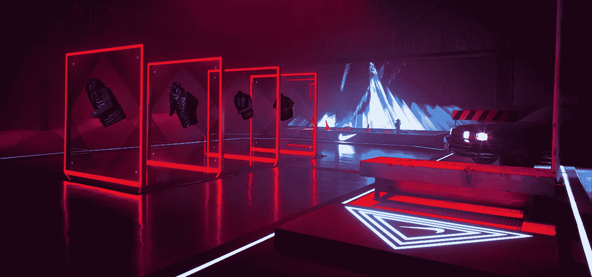
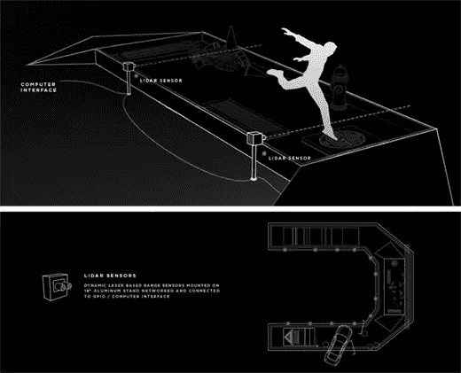
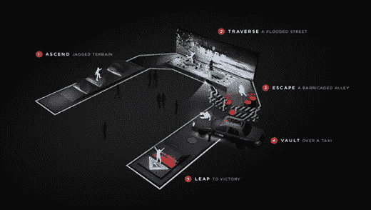
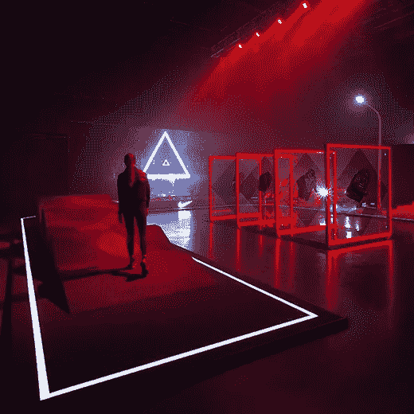
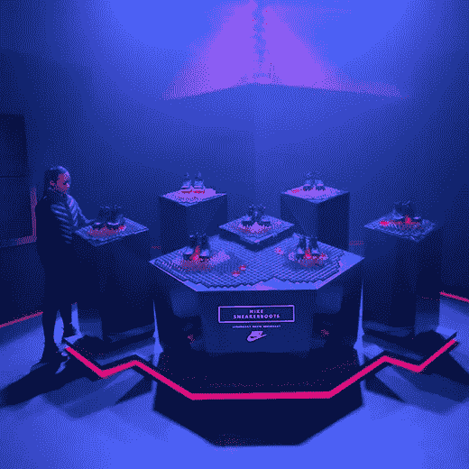
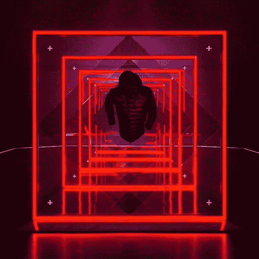
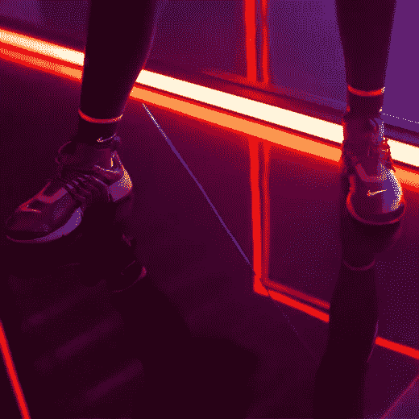

# 利维坦用 Nike Test Stride 体验挑战中国影响者

> 原文：<https://medium.com/swlh/leviathan-challenges-china-influencers-with-nike-test-stride-experience-72aaecbc4801>

耐克的全球运动服装团队在[利维坦](http://www.lvthn.com/about/)向我们的合作伙伴发起挑战，让合适的人在社交媒体上谈论(并测试)该品牌的新款冬季运动鞋和 Tech Pack Aeroloft 夹克。利维坦提出了“[测试步幅](http://www.lvthn.com/work/test-stride/)”的最初想法——一种新的高科技和即时的“社交媒体共享”方法，用于消费者的齿轮测试。他们希望媒体、有影响力的人、名人和运动员谈论新的冬季系列，并通过展示一种在社交环境中一起尝试的有益方式来实现这一目标。

利维坦在创造引人入胜的交互式数字体验并将它们整合到物理环境中的专业知识自然地将该项目引向了体验的方向。他们的目标是创造一种有吸引力的、先进的和令人兴奋的方式来测试和分享 Nike 的最新性能装备。具体来说，耐克团队希望利用利维坦[过去作品](http://www.lvthn.com/work/)中最受欢迎的元素，并将它们与现实世界的产品试验相结合。最终目标——向试验参与者证明一些非常具体的产品特性和优势，包括产品在危险的冬季条件下保持穿戴者温暖、干燥和安全防滑的能力。

重现真实生活场景，如城市街道，是该项目的一个组成部分。

*“这个项目的一个关键策略是证明你的风格不会因为天气变得恶劣而受到影响，所以我们知道我们的想法既要在运动层面上具有功能性，又要在当代设计层面上具有吸引力。”利维坦的执行创意总监杰森·怀特说。*“我们的解决方案是一个互动的城市障碍赛，这是一个竞争性的计时赛，测试参与者的体力和敏捷性，同时确保他们在比赛中表现良好。”**

“我们很快意识到我们需要物理元素，比如真正的水和混凝土。”怀特回忆道。“障碍跑道概念很快成为显而易见的路线，但让解决方案具有数字交互功能是设计团队从未见过或执行过的事情。”

根据 White 的说法，该项目的设计工作从概念草图开始，然后使用 Autodesk 的 Maya 进行 3D 建模。*“为了将我们雄心勃勃的想法转化为可投入生产的原理图，我们与才华横溢的设计师合作，他们为剧院、博物馆和零售店设计和建造了一些世界上最好的布景。”*他说，*“CS 能够通过精确的测量完成我们的愿景，并与我们合作提出实质性的建议。”*

“测试步幅”空间始于一个入口空间，参赛者可以通过平板电脑注册，然后开放到一个大房间，障碍跑道位于一个 170 英尺长的 U 形中。在球场旁边，团队放置了一个生动的 30 英尺宽、9 英尺高的 LED 屏幕。巨大的屏幕有几个用途——创造运动和深度，向参与者显示鼓舞人心的消息和统计数据，以及播放触发的动画序列。

五个障碍中的每一个都按照一个主题区域进行分类，该主题区域与被测试的装置的特征和优点相一致。这五个区域是上升、穿越、逃脱、跳马和跳跃。相应的障碍是参差不齐的地形、被洪水淹没的街景、设置路障的小巷、一辆出租车和一个水泥楼梯。每个地形都配有利维坦团队制作的定制三维动画。

“在每一个例子中，都有很好的机会去突破界限，创造真正独特的东西。这种特殊的激活是电影内容、突破性的交互性和物理环境的完美融合，这正是我们最强的地方。”详细白色。

通过设计，这个项目的交互性是如此完整地实现，以至于是潜意识的。一个例子是跟踪每个参与者的进度并在他们通过各种主题区时触发新内容的系统。利维坦的互动总监 Austin Mayer 解释说:“*该系统由基于激光的光学测距传感器组成，用于跟踪运动，Arduino 用于桥接物理-数字信号，TouchDesigner 用于提示预渲染的视频层，集成实时效果，合成照片瞬间和 Ableton Live 中的提示音频。所有这些技术结合起来，在 LED 屏幕上实时呈现课程结果。”*

额外的定制品牌媒体内容是为活动氛围创造的，采用了简短的超现实 CG 短片的形式，讲述了耐克运动鞋在冬季条件下的反击。在整个短片中，冬天的元素，如雪、倾盆大雨和尖尖的冰，对运动鞋发起了攻击。这些视频巧妙地配合了放置在空间周围的 LED 照明产品展示，以促进产品参与和摄影。

该项目在上海启动，各方见证了合作的惊人成果。该事件的报道是全球性的，引起了人们对耐克发布首款街头服饰和时尚媒体的兴奋。

*“我认为这次活动对耐克来说是特别成功和独特的，因为它结合了艺术展览、更高级别的互动技术和体育活动。”*州白。

***阅读我们其他的*** [***搭档展示***](http://bulldogdrummond.com/blog/partner-showcase-leviathan-project-150-media-stream) ***。***

***更多关于利维坦的朋友*** [利维坦](http://www.lvthn.com/)是一家专注于设计、数字媒体和互动的专业创意机构。通过将非凡的叙事内容和新兴技术引入物理环境，利维坦将想法转化为全球品牌和创意合作者的卓越体验。成立于 2010 年的利维坦在创新方面的经验已经得到了 Communication Arts、Creators Project、Fast Company、Forbes 和 Wired 等机构的认可。

## 这篇文章发表在[的《创业》(The Startup](https://medium.com/swlh) )上，这是 Medium 最大的创业刊物，有 355，974+人关注。

## 在这里订阅接收[我们的头条新闻](http://growthsupply.com/the-startup-newsletter/)。

