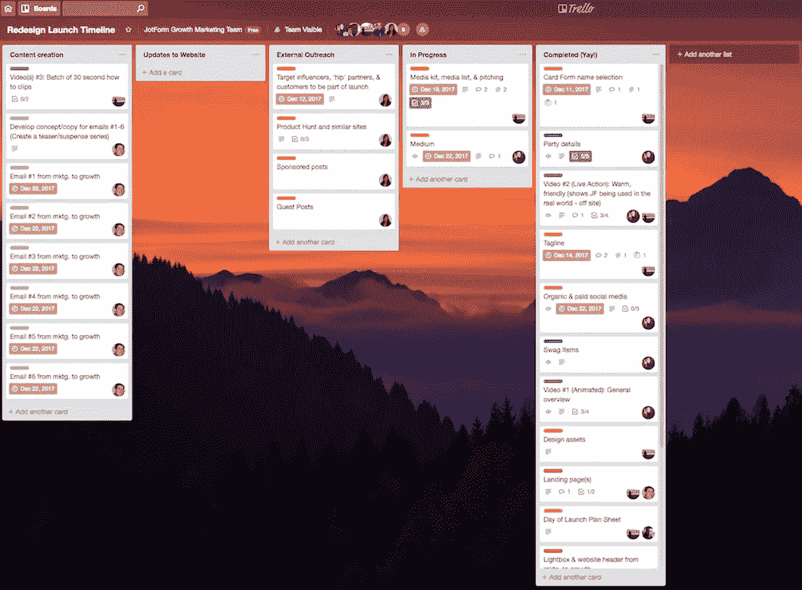
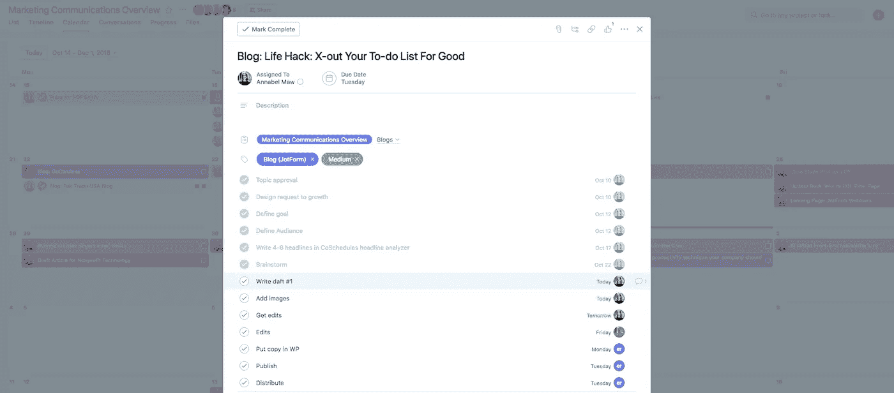

# 生活帮:永远划掉你的待办事项清单

> 原文：<https://medium.com/swlh/life-hack-x-out-your-to-do-list-for-good-4b47dd9ca380>

生活就是混沌，混沌就是生活。

在管理工作、关系和兼职之间，很难组织和跟踪我们正在进行的一切。

我们希望尽可能以最有效的方式处理混乱，所以我们计划、区分优先次序，并*创建列表*来帮助我们感觉我们是有成效的，完成了事情，并控制了我们的生活。

但事实是，待办事项清单并不都那么好。这些焦点门面也有黑暗的一面。

# 待办事项清单揭晓

乍一看，待办事项清单似乎是克服混乱的完美方法。人们可以清楚而简单地列出任务，并对他们需要做的事情进行概述，这减少了对未来的焦虑和不确定性。

这些要点庞然大物也有助于[蔡加尼克效应](https://blog.bufferapp.com/the-origin-of-the-to-do-list-and-how-to-design-one-that-works)，当“潜意识无法计划如何完成任务，但它对未完成的感觉感到恼火时，就会发生这种效应。为了摆脱这种感觉，它会用任务提醒来困扰有意识的大脑——不是为了完成任务，而是简单地鼓励我们制定一个计划。”

但是待办事项列表无论如何都不是完美的——它们给了我们一种人为的控制感，并且没有反映出我们已经写下的每项活动的复杂性。更糟糕的是，当我们使用它们时，我们应该感到有成就感，但往往相反，因为几乎没有任何东西被划掉。

本质上，待办事项清单是线性的、静态的，对于我们生活中的所有活动来说都太简单了。事实上，[许多成功人士选择不使用它们](https://www.jotform.com/blog/to-do-list-alternative/)。

它们变得流行只是因为它们给人一种你在做事的印象。

我个人以前很崇拜我的待办清单。我会每天添加，在上面放一些小的东西，比如“买更多的咖啡”或者“给妈妈打电话”，大的东西，比如“写完文章”或者“计划假期旅行”它们总是很长，有时感觉没完没了。

随着我工作和个人生活的加速，我注意到我已经超出了我的待办事项清单。越来越马虎了。我低估了完成一项任务所需要的时间，并且增加的时间比我划掉的时间要多。

我会在任务上取得进展，但不会完全完成。如果我没有完成某件事，那么我就不能划掉它，这会导致挫败感，因为感觉好像什么都没完成。

这种方法不起作用，是时候尝试一些流动的东西，清楚地显示项目的复杂性，并跟踪项目进展。

# 在工作追踪应用程序中寻找避难所

我第一次使用工作追踪应用是在二月份，当时我们公司推出了 [JotForm Cards](https://www.jotform.com/cards/) 。

营销团队的主要目标之一是为这次发布给*带来大量*媒体报道。当时，我还在用待办事项清单处理我的个人任务。我记得在清单上加上了“获得媒体报道”，但并不完全清楚*获得媒体报道*实际上意味着什么。

产生压力并不像我预期的那么简单——它需要很多步骤。我们需要定义目标垂直市场，研究记者，创建记者和媒体的主列表，建立媒体工具包，定制电子邮件，推介和跟进。

Example of how we used Trello for our JotForm Cards launch

获得媒体的所有组成部分都太长太复杂，无法作为一个单一的要点列在待办事项清单上，所以我们请特雷罗来帮忙。

Trello 易于使用且高效。这证明待办事项清单已经过时，工作追踪应用程序是规划项目和完成工作的更好方式。

发布后，土耳其安卡拉的运营团队继续使用 Trello，而我们旧金山的营销团队则走上了另一条道路，开始尝试 Asana。大约八个月后，我们都被迷住了。

我们如何使用 Asana 跟踪营销项目的例子

Example of how we use Asana to track marketing projects

我们的团队通过 Asana 生活和呼吸。我们用它来策划任何博客文章(比如这个！)到网络研讨会的广告。我们喜欢它，因为我们所有的项目都可以放在一个地方。它们用彩色编码标签组织起来，可以添加到多个电路板上。

# 最后的想法

不要误解我，待办事项清单并不完全是邪恶的。他们有一个时间和地点——比如你需要在杂货店买一些东西或者为即将到来的旅行打包。但是当涉及到管理复杂的团队、工作流程和事件时，他们就是做不到。

工作追踪应用给团队带来了灵活性。它们是为复杂性而构建的，这使得即使是最困难的项目也易于监督。他们很有动力，因为他们展示了小胜利和长期目标。它们是透明的，所以你可以准确地跟踪正在发生的事情，知道谁在做什么。

它们让我们处理混乱，让我们的生活变得更理智。

*原载于*[*www.jotform.com*](https://www.jotform.com/blog/x-out-your-to-do-list/)*。*