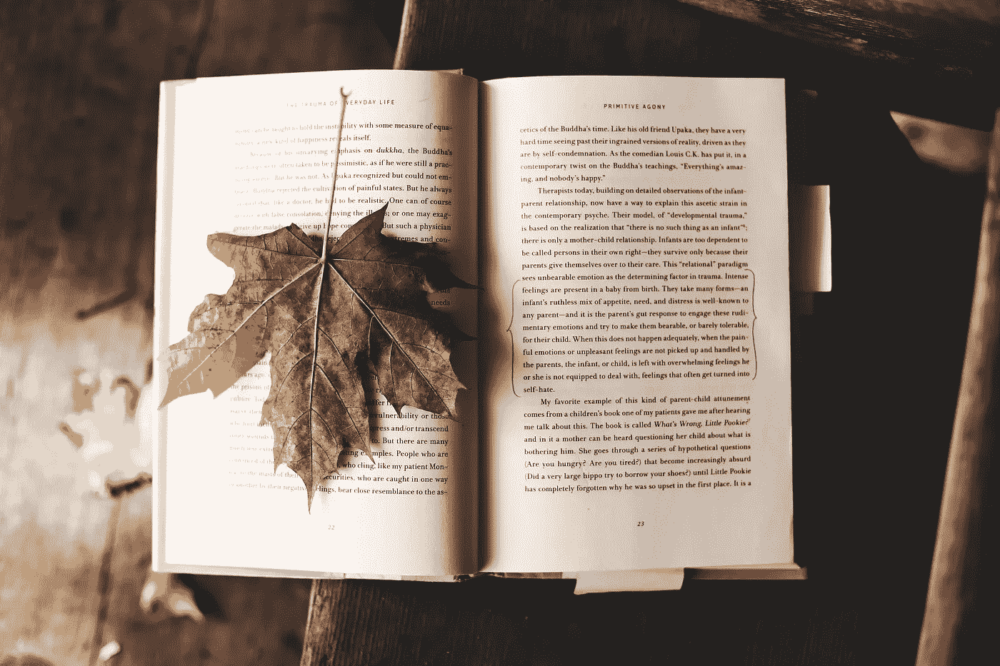

# 生活窍门:早晚惯例

> 原文：<https://medium.com/swlh/life-hacks-morning-and-evening-routines-385bca2b6382>

Image source: [Unsplash](https://unsplash.com/photos/LuK-MuZ-yf0)

我爱睡觉，但也爱熬夜。我倾向于发现我在早上和晚上都很有效率。这让我很难入睡。因此，我尽量延长睡眠时间。我有几个日常习惯，我发现对改善我的睡眠和早上更快出门非常有效:

## **使用手机上的定时器缩短淋浴时间**

这是我最有用的一招。我一直相信我洗澡很快。最多两分钟。不幸的是，事实证明这不是真的。我明白了，要做我需要做的每一件事而不匆忙，最理想的时间是 5 分钟。我用手机上的计时器倒数 5 分钟。我有时也会做同样的事情，比如吹干头发，化妆。通过在每项任务上最多花 5 分钟，你就限制了你走神的时间，这会导致大量的时间流失。

## **只把你每天使用的东西放在你的浴室柜台上**

减少视觉噪音也是一种节省时间的方法。保持浴室干净，只把你每天使用的物品(化妆品、吹风机等)放在浴室柜台上。这将帮助你更快地做好准备，因为不会有太多的干扰。

## **在**的前一天晚上准备好你的包和穿什么

剔除那些你不得不在早上做并决定的事情是很重要的，比如准备你的包和决定穿什么。我可以花很多时间换衣服，而不是决定早上穿什么。现在，我要确保出门前我的包已经准备好，我一天的行头已经放在椅子上，我可以很快穿上。如果前一天晚上我有什么东西放不进包里，我一定会为它写一张便利贴，这样我就不会忘记了。

## **进入卧室时开启飞行模式**

我是一个浅睡者，所以我总是在睡觉前打开飞行模式。这避免了夜间的干扰。它还避免了在床上查看邮件，因为我在那个时候不能做太多事情，所以它们只会造成不必要的压力。由于社交媒体是另一个耗费时间的东西，我试着关掉飞行模式，一直等到早上去上班的路上。我可以在上下班途中花时间了解最新消息，而不是躺在床上拿着手机。

## 清空你的大脑

我在床边放了一个笔记本，睡觉前在那里清空大脑。它有 A5 页那么大。通过清空我的大脑，我发现我睡得更好了，因为我知道我不会忘记它，当我醒来时我可以再次处理它。

雪莉·桑德伯格在她的书中写道:

> “写日记(……)帮助我更好地了解自己和反思。我能够用语言来表达我的感受，并把它们拆开。(……)给负面情绪贴上标签，让它们更容易处理。标签越具体越好。”“我感到孤独”比含糊的“我感觉很糟糕”更能帮助我们处理问题。"通过把感情用语言表达出来，我们给了自己更大的力量去控制它们."

最近我也在尝试使用五分钟日志，这是我在这里写的一个实验。如此关注我生活中的积极因素很有趣。这让我感到更加快乐。展望未来，我会把写五分钟日记和清空大脑结合起来。

## **看小说**

2017 年真的是我重返[阅读](/@aurorakb/the-year-i-returned-to-reading-a7b197e9af)的一年。“生活导师”蒂姆·费里斯和 Khe Hy 都认为睡前阅读很重要。晚上读小说帮助我平静下来，我觉得更有创造力。

## **在床边放一个水瓶**

喝足够的水对你一天的健康非常重要。你一大早就搭建好舞台，如果晚上你在床边放一个水瓶，事情会变得容易得多。我头疼的日子通常是我一天中没有喝足够水的日子。

## **知道什么时候你必须醒来**

打盹不是你的朋友，对你没有任何好处。睡觉前，我试着查看我的时间表，以便准确地知道我早上离开公寓的最晚时间。然后，我回溯我必须做的一切准备工作，并在我必须起床的最晚时间到达。然后我设置了闹钟，这迫使我没有时间打盹就从床上跳起来。

## 摘要

*   使用手机上的定时器来缩短淋浴时间
*   只把你每天使用的东西放在你的浴室柜台上
*   进入卧室时打开飞行模式
*   前一天晚上准备好你的包和要穿的衣服
*   清空你的大脑
*   看小说
*   在你的床边放一个水瓶
*   知道你什么时候该醒来

所有这些技巧都让我睡得更好，把我早上花在准备上的时间从 1 小时减少到了 20 分钟！你早上或晚上还有别的方法吗？请与我分享它们。我想进一步改进我的日常动作。

**延伸阅读:**

*   更快乐、更健康、更成功的人的 50 种生活方式
*   [如何作为一个创业创始人和团队保持理智](/the-megacool-blog/how-to-stay-sane-as-a-startup-founder-and-team-75aacef06e5d)

感谢[蒂芙·王绍博](https://medium.com/u/83d099de2a44?source=post_page-----385bca2b6382--------------------------------)和托斯坦·贝尔泰格阅读本文的草稿。

## 这篇文章发表在 [The Startup](https://medium.com/swlh) 上，这是 Medium 最大的创业刊物，有 277，678+人关注。

## 订阅接收[我们的头条新闻](http://growthsupply.com/the-startup-newsletter/)。

