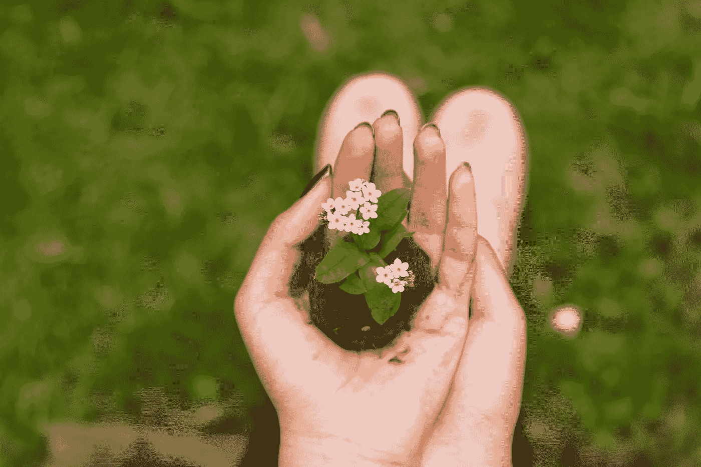
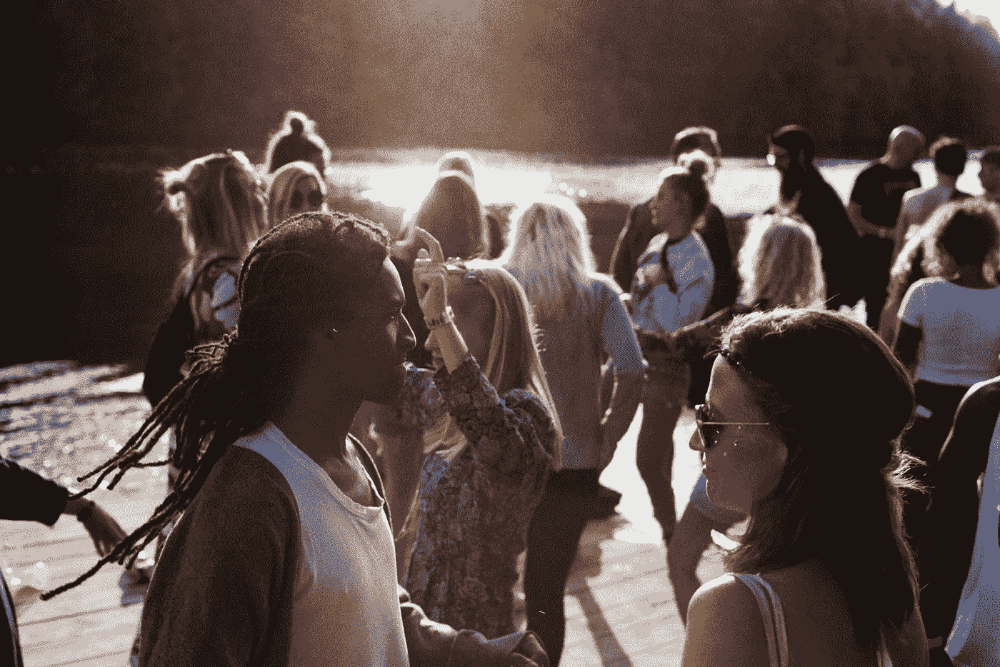

# 人生苦短。

> 原文：<https://medium.com/swlh/life-is-too-short-556899110656>

## 别说了。

Photo by [Tom Ezzatkhah](https://unsplash.com/photos/0JbiBIHmQtE?utm_source=unsplash&utm_medium=referral&utm_content=creditCopyText) on [Unsplash](https://unsplash.com/search/photos/life?utm_source=unsplash&utm_medium=referral&utm_content=creditCopyText)

你心中的怨恨——让它过去吧。原谅别人，忘记琐碎的争执。建立持久而丰富的关系，并努力保持这种关系。人生苦短。

停止那种在任何情况下都想着最坏情况的焦虑习惯。相反，征服它。意识到你已经走了这么远，你将*继续*走这么远。深呼吸，知道一切都会好起来的。人生苦短。

让你正在寻找的难以捉摸的关系来找你。花点时间和自己在一起，和朋友在一起，继续成长。闷闷不乐从来不会帮助任何人取得任何成就。人生苦短。

继续下床。每天早上。抑郁症很糟糕，但是不动会让它持续下去，这会对你造成更大的伤害。尽一切努力穿好衣服，去某个地方，任何地方。回去做你热爱的事情。人生苦短。

抱怨会毁了你。这会让你精疲力尽，并且对你做的任何事情都感到不快。这是没有成效的，疲惫最终会蔓延到你周围的人。放弃吧。开始看到缺点中的小优点。人生苦短。

不考虑他人的想法和想法，与人争论会变得有害。它会造成友谊和家庭的分裂，并在你的坏习惯中找到一个休息的地方。今天设法结束一场争论。人生苦短。

后悔。多么糟糕的感觉。如果你怀疑自己或者让恐惧替你做决定，停止吧。相信自己，去追求。我害怕的一件事是——带着遗憾生活。人生苦短。

面对面的谈话。多做几次。你是愿意盯着一个人，边喝咖啡边好好聊聊，还是愿意花几分钟时间盯着屏幕？人生苦短。

出去。享受阳光、天气和生活的乐趣。有一天你也许会回过头来想为什么你没有好好利用你生命中与伟大的人在一起的时光。不过，你今天可以改变它。记住，人生苦短。

Photo by [jens johnsson](https://unsplash.com/photos/oatYheJMm9E?utm_source=unsplash&utm_medium=referral&utm_content=creditCopyText) on [Unsplash](https://unsplash.com/search/photos/diversity?utm_source=unsplash&utm_medium=referral&utm_content=creditCopyText)

> “我们不是敌人，而是朋友。
> 我们不能成为敌人。虽然激情可能会使我们关系紧张
> ，但这绝不能破坏我们之间的感情纽带。记忆的神秘和弦会再次被触动，因为它们肯定会被我们本性中更好的天使触动。”
> 
> ~亚伯拉罕·林肯。

## 在这里找到更多我的故事。也可以关注我的[推特](https://twitter.com/Eturn102)。谢谢你让我开心！

## 如果你喜欢这个故事，请点击👏按钮并分享，帮助其他人找到它！欢迎在下方留言评论。

## 这篇文章发表在《创业公司》杂志上，这是 Medium 最大的创业刊物，有 313，216 人关注。

## 订阅接收[我们的头条](http://growthsupply.com/the-startup-newsletter/)。

