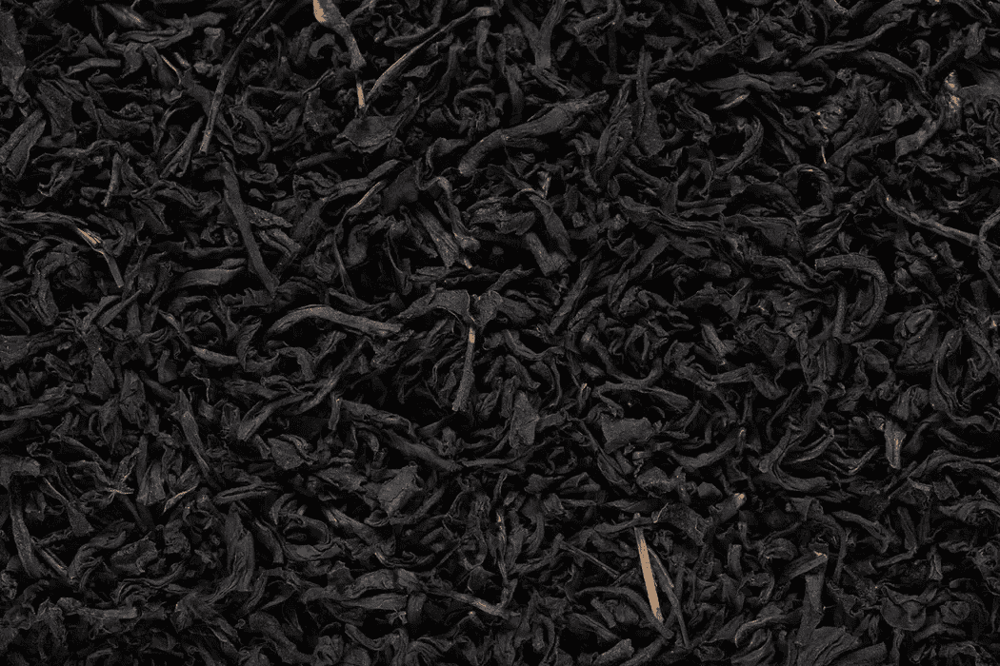
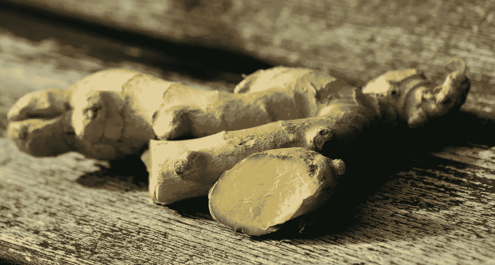
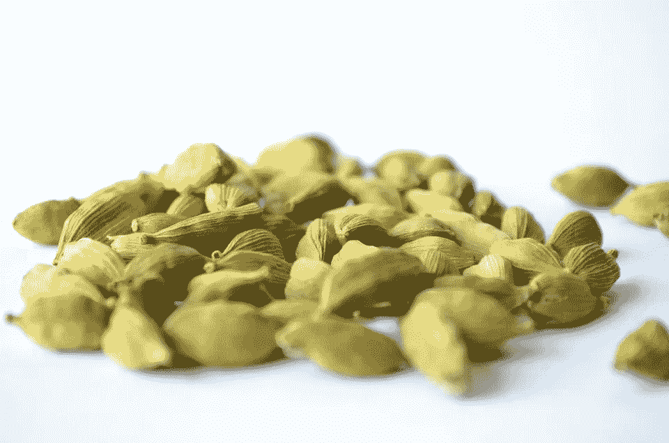
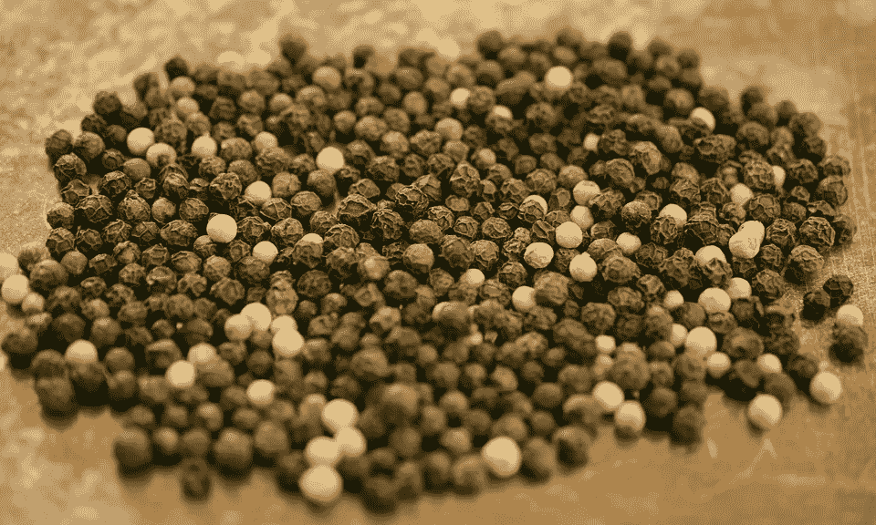
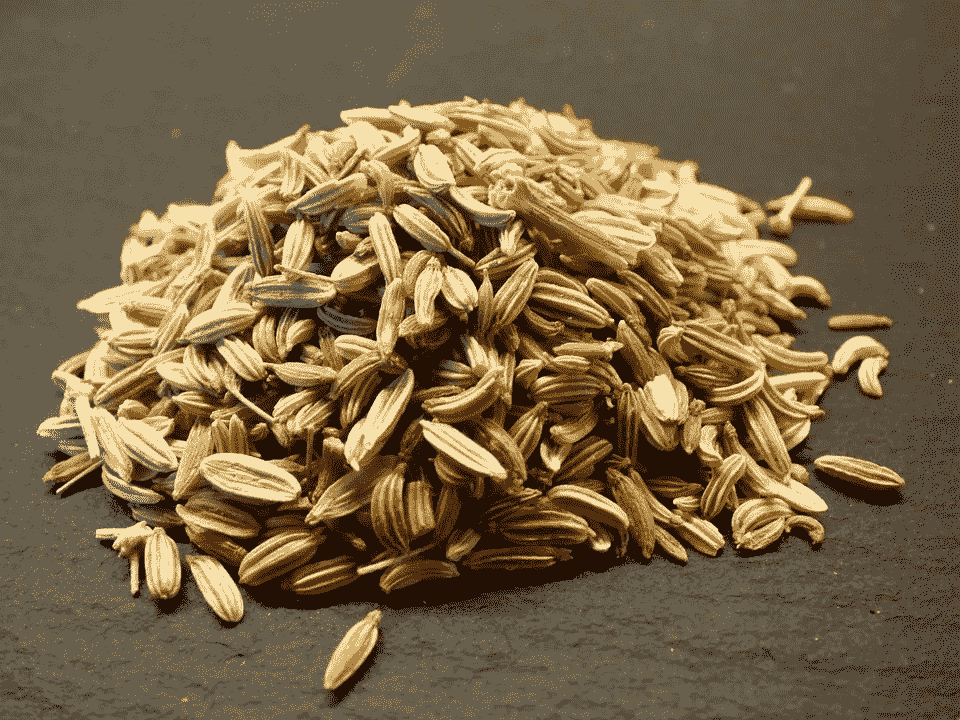
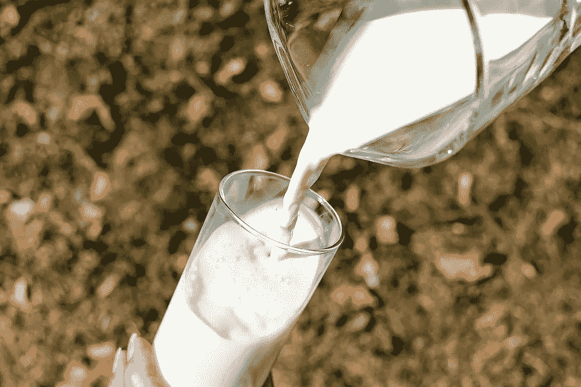
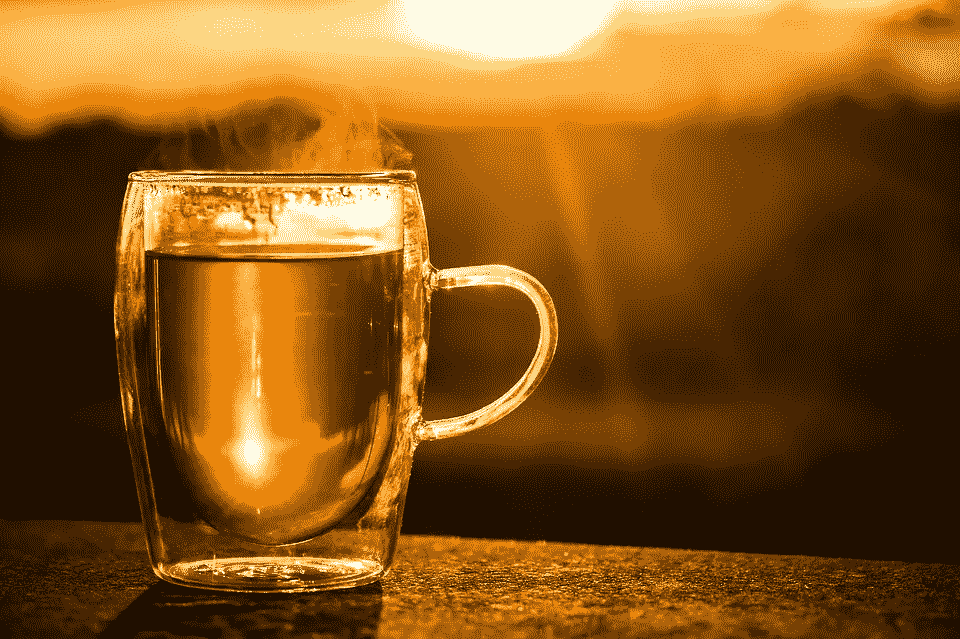

# 茶给人生的启示。

> 原文：<https://medium.com/swlh/life-lessons-from-chai-tea-e3a713fc7d1d>

> 我们来酿造吧。

我 ***爱*** 柴。有很多原因让柴，我的裴。这就是我典型的柴。

# 水

> 水里有东西

[Water](https://unsplash.com/photos/oxvquxJywGE)

水是我们生活中最基本的需求。这是最基本的要素，没有它我们就无法茁壮成长。毕竟， ***我们是*** 70%的水分。它教导我们永远不要忘记自己是由什么组成的。

> 我认为我是由爱和感激组成的。这激励着我每天去培育它，照顾它。

# 茶渣

> 草有不同的“绿色色调”

[Tea Leaves](https://unsplash.com/photos/2CRgKZAyPXg)

茶叶种类繁多，种类繁多。根据你的心情和喜好，你可以选择黑茶、绿茶、白茶、乌龙茶，而且总会有混合茶。生活总会给你一个选择，永远。由我们来选择对我们来说最好的选择。

> 在我的生命中有一段时间，我不得不在建立一个更好的职业生涯和艰难时期与家人在一起之间做出选择。我选择了家庭而不是事业，因为对我来说，人比事业图更重要。

# 精力

> 不仅仅是看上去的那样

[Ginger](https://www.pexels.com/photo/bless-you-cure-ginger-ginger-root-207002/)

除了对人体极其有益之外，生姜还是最容易被误解的调味品之一。它实际上是 ***茎*** ，而**不是*****根*** 。它长在地下并不代表它就是根。同样，仅仅因为某件事表面上看起来是某种方式，并不一定意味着它内在也是真实的。

> 我的工程教育完全是浪费时间和精力，在我上大学之前，从表面上看，这似乎是最重要的教育。回想起来，我会走一条不同的路。

# **豆蔻**

> 打开它

[Cardamom](https://pixabay.com/en/cardamom-elaichi-green-processed-166833/)

豆蔻是一种多用途的香料，它能给接触到的任何东西增添生命。当它的盖子完好无损地使用时，除了给正在准备的食物增加一点香味外，它不会增加任何东西。但是，当它打开后使用时，它会带着所有的生味带来完整的味道。就像在生活中，当我们处于休眠状态时，我们不会对很多事情产生巨大的影响。但是当我们让自己走出架子的时候，我们可以传播我们精神的力量！

> 当我年轻的时候，我从来没有给过任何人我对任何事情的真实意见，因为我不确定&没有安全感。现在，当我学会面对自己时，我就无所畏惧地给出真正的反馈。

# 黑胡椒

> 你值得吗？

[Black Pepper](https://pixabay.com/en/peppercorns-pepper-black-pepper-1992412/)

曾经被认为比银更有价值，并标志着一个人在社会中的经济地位的东西，现在是一种可以食用的东西，安全地储存在密封的容器中，远离阳光。它只是告诉我们，昨天你的价值是多少并不重要，但如果你不像昨天那样有价值，你就会降低到你真正的价值。没有什么能阻止这一点。每件事/每个人都有黄金时间。什么上去，什么下来。你唯一真正的价值，就是今天。

> 我用了四年的科学计算器在期末考试中途坏了。虽然它在过去的四年里为我提供了很好的服务，我对此非常感激，但它在考试大厅里完全没有价值。你只有在当下才是真实的。

# 茴香

> Infinocchiare

[Fennel](https://pixabay.com/en/fennel-seeds-herb-food-eat-307555/)

他们说，在任何食物中添加茴香，都会掩盖食物中任何不好或变质的味道，代之以一种新鲜的甜味。同样，生活中有些事情就像过滤器一样出现在我们眼前，掩盖了我们“生活的真实味道”。留意这些东西的存在会让我们对自己的生活有更清晰、更现实的看法。

> 佛教和冥想帮助我抛弃了那些无法区分真假朋友的过滤器，以及那些我放在待办事项列表中的真假目标。

# 牛奶

> Suum cuique

[Milk](https://pixabay.com/en/glass-milk-white-cow-s-milk-pour-a-1587258/)

各有所好。牛奶通常是基本茶之外的一种选择，因为有些人喜欢不加牛奶。正因为如此，我们应该试着理解每个人如何配得上他们的自由意志，以及它给世界带来的变化和多样性之美。

> 人们总是嘲笑我讨厌甜食。我个人认为甜是最被高估的味道。我不喜欢这样。比起其他口味，我更喜欢清淡的。我现在开始真诚地拥抱它。不喜欢大多数人喜欢的东西是可以的。

# 该过程

> 你是怎么做到的？

当我沏茶时，我处于这种崇高的流动状态，就像我写诗或骑自行车一样。我喜欢这朵花，就像喜欢茶本身一样。它提醒我，我们在生活中做的事情应该总是感觉正确的。

在开始做之前，我可能会变得懒惰几次和懈怠。但是当我把水烧开的时候，我从骨子里知道，这就是生活。做一个简单的柴就能让我充满幸福。想象一下，如果我开始像这样生活，更有意识，更用心，尊重我做的每一件事，会发生什么？！

# 最终产品

> 自食其果

我可能有时会忘记添加比我应该添加的更多的姜，或者有时会完全忘记茴香。最终的结果是我放入茶中的配料达到了顶点。还有那些我忘记的。或者选择置身事外。不会比我放进去的少或多。

*我做的柴的质量取决于我放进去的食材，以及我制作它的过程。*

[Here, have some chai now.](https://pixabay.com/en/teacup-cup-of-tea-tee-drink-hot-2324842/)

# 如果…会怎样

> (尤指可能会发生好事)很难说

可能会有这样的时候，我冰箱里的牛奶用完了，或者其他配料或我的炉子连接干了，或者地震袭击了我的厨房，把柴都吸进去了！任何时候，任何事情都可能发生。

> 我要做的，就是做我他妈的茶。

就像在生活中一样，我们应该磨练自己的技艺，努力工作，少关心一些假设。

**引自《博伽梵歌》:
(第二章，第 47 节)**

> **कर्मण्येवाधिकारस्तेमाफलेषुकदाचन| माकर्मफलहेतुर्भूर्मातेसङ्गोऽस्त्वकर्मणि**

**读作:**

> karmaṇy-evādhikāras·特马 phaleṣhu·卡达查纳
> 马噶玛·法拉·赫图尔·伯尔·特·saṅgo 'stvakarmaṇi

**翻译过来就是:**

你有权利履行你规定的职责，但你无权享受你行动的成果。永远不要认为自己是你活动结果的原因，也不要执着于无所作为。

**千禧版:**

做你的事。不要担心也不要期待。

我写[千禧一代](/the-post-grad-survival-guide/millennials-from-a-millennials-point-of-view-cbf2ca66f9fa)，[骑行经历](https://thecreative.cafe/cycling-is-showering-5e7f7c5fc941)，[给媒体发公开信](https://writingcooperative.com/an-open-letter-to-medium-1a5d415bbf99) & [回味我十年前写的诗](https://writingcooperative.com/can-you-help-me-prove-i-didnt-write-this-1e0290ea98e0)。
这个月，我还在做一首“[4 月 30 天，30 个表情](/series/30-days-of-april-for-30-facial-expressions-ce9e4fb780b5)”的 4 行诗。[说嗨，或者你好](mailto:hi@writealetterforme.com?subject=Hello From The Other Side&body=Hey there Kalpesh)；我不咬人:)

## 这篇文章发表在 [The Startup](https://medium.com/swlh) 上，这是 Medium 最大的创业刊物，有 317，238+人关注。

## 在这里订阅接收[我们的头条新闻](http://growthsupply.com/the-startup-newsletter/)。

