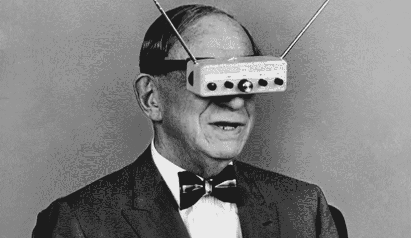
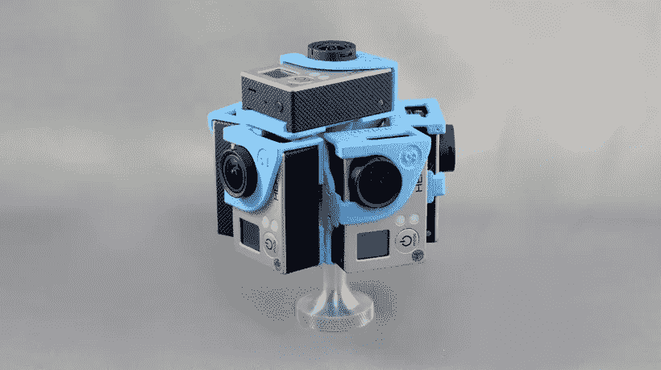
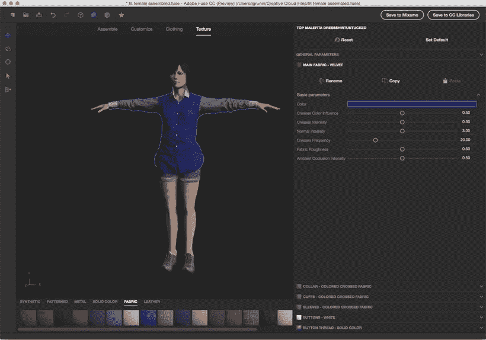
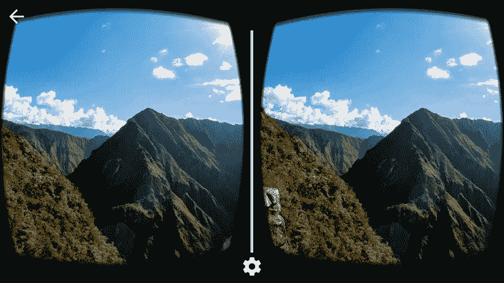
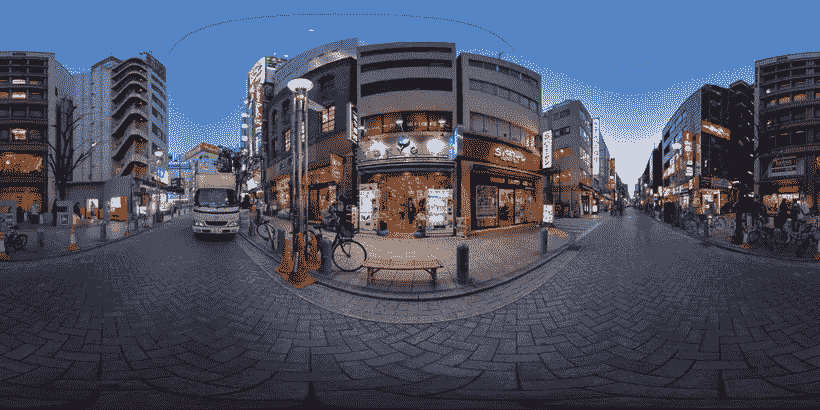

# 没有边缘的生活——为虚拟现实应用程序创建内容

> 原文：<https://medium.com/swlh/life-without-edges-creating-content-for-virtual-reality-apps-49014d9aabb5>

虚拟现实仍然感觉是一个遥远的世界，但事实上，它比以往任何时候都更快地向我们靠近。虚拟现实体验是通过利用计算机技术创建模拟环境来构建的，在模拟环境中，用户可以主动体验虚拟环境，通过将用户置于体验中，比传统用户界面更进一步，因此他们不仅看到屏幕，还沉浸在 3D 世界中。事实上，一些虚拟现实平台甚至让用户与 3D 世界互动。

虚拟现实是突破性的，因为它让用户感觉我们仿佛置身于一个 3D 世界。虚拟现实有许多类型，从非沉浸式到完全沉浸式，它有可能带你去你物理上不能去的地方。例如，你想过在月球上行走吗？有了 VR 技术，就可以。

因此，我们看到虚拟现实领域有无限的技术增长和创新空间，但是*你如何为一个不真实的世界创造内容？*

这可能比你想象的要简单。

# 创建内容

*拍摄 360 度视频*你不需要成为一个多产的程序员来为 VR 制作内容。为虚拟现实创建内容的两个最流行和技术上可行的选项是

1.  要拍 360 度沉浸式视频，这是目前比较便宜的选择；或者
2.  来构建你自己的 3D 动画。

如果你选择 360 度沉浸式视频路径，那么制作 360 度视频只需要一台 360 度球形摄像机。这是从现实世界中捕捉事件视频片段的最有用的工具，目前市场上最受欢迎的型号是 [360RIZE](http://www.360heros.com/) 、 [RICOH THETA](https://theta360.com/en/) 或 [ORAH 4i](https://www.orah.co/) ，但随着技术的改进，其他公司肯定也会生产它们。

这些相机允许你一次拍摄一个球形图像/电影，你可以稍后编辑，处理到 VR 耳机，并分享。视频本身是 360 度全方位拍摄和观看的。在拍摄内容时，相机必须保持静止，这一点很重要，可以通过将相机放在三脚架上、摄影师或通过无人机镜头来实现。事实上，要记住的两件事是你的相机位置和你的相机移动。

摄影机的位置对于讲故事来说是至关重要的，为了承载移动的动力，摄影机必须被携带。你会想把你的相机有策略地放在你拍摄的任何环境中，因为你的位置决定了你的用户将如何体验和看到这个环境。

理想情况下，相机应该放在活动的中心，这样用户就可以尽可能自然地探索场景并与之互动，就像它是真实的一样。例如，如果您的用户正在参与动作中的*，安装摄像机，使其与普通人的高度持平，这样他们就可以像站着一样看到动作。另一方面，如果用户是动作的*观察者*，摄像机可以固定在一个更有创意的位置，也许是天花板上的绳子，甚至是使用无人机从高处放置。*

此外，当你拍摄时，请记住，因为镜头是从 360 度观看的，*一切*都将出现在你的镜头中，限制了你的视野和行动自由，但允许你有创作自由，因为你可以将场景融合在一起。还要注意的是，无论是什么在控制摄像机(例如摄影师或无人机)，最终结果都会是可见的，所以要小心。

拍摄时，尽可能计算好动作和移动需求，因为相机的过多移动会导致恶心，这会使用户无法深入体验。为了克服这一点，也可以创造性地放置相机来照明，或者将你的设备巧妙地隐藏在当地环境中。

在走 360 度电影路线进行虚拟现实内容创作时，拍摄只是成功的一半。然后，来自每个摄像机和每个拍摄地点的镜头必须被下载、同步、拼接和处理，然后才能到达 VR 头戴设备。

编辑视频有多种选择，目前最流行的是 [VideoStitch](http://www.video-stitch.com/videostitch-studio-v2-1-released/) 。该软件拥有各种功能，包括镜头校准、撤销/重做功能、输入裁剪工具和增强的音频和视频输出，以尽可能简化和轻松地编辑您的 VR 内容。

如果你对此不感兴趣，你可以选择 3D 动画、建筑或建模来制作虚拟现实内容。因此，举例来说，如果你想制作一个虚拟现实应用程序来记录人类在火星上的第一步，你就必须制作一个 3D 动画，因为目前不可能登上火星(埃隆·马斯克，我希望你读过这篇文章)。

3D 动画与 360 度视频的工作方式不同，用户在整个体验中被固定在一个特定的点上，并通过单击按钮来移动它们，从而在 VR 序列中移动。

使用 3D 动画意味着观众看到的是他们在真实生活中看到的东西，并且可以自由地环顾他们所在的空间(即固定点)，因此他们需要做的只是在座位上旋转以获得更好的视图。市场上有许多 3D 建模/动画的选择，例如通过游戏引擎，如 [Unity](https://unity3d.com/unity) 或[虚幻引擎](https://www.unrealengine.com/what-is-unreal-engine-4)。

游戏引擎由印度应用程序开发人员创建，可创建交互式游戏场景，并有可能为 3D 室内设计和建筑项目创建内容。如果游戏不是你的行业，还有广受欢迎的[结构传感器](https://structure.io/)，它创新性地允许实时快速 3D 扫描物体和人，以及内部空间的 3D 映射，这使得区分 VR 和现实更加困难。

3D 扫描可以从您的 iPad 或平板电脑上捕捉人、地点、物体和事物的精确 3D 模型，并声称对您可以捕捉的内容的移动或大小没有限制。起价 [$379 美元](https://structure.io/store)，对于那些不想要单独 3D 摄像头的人来说，这可能不是一个坏选择，因为结构传感器直接连接到你平板电脑的摄像头上。

# 虚拟现实和应用程序开发

VR 的扩散使其具有开创性，Oculus Rift、HTC Vive、PlayStation VR 等头戴设备只是固化了其受欢迎程度。但是你可以从你自己的智能手机上获得虚拟现实的力量，它可以与谷歌 Cardboard 耳机配对，谷歌 Cardboard 耳机通过使用你的智能手机作为其屏幕来工作(适用于 [Android](https://www.android.com/) 和 [iOS](https://www.apple.com/ios/) )。

在这里，我们列出了一些最受欢迎的虚拟现实应用程序和引领虚拟现实技术创新的公司。房地产、游戏、汽车、教育和旅游行业已经采用了虚拟现实技术，随着技术的发展，虚拟现实在日常生活中也会越来越普及。

在游戏行业， [theBlu](http://store.steampowered.com/app/451520/) 被誉为“史诗”，是真正沉浸式虚拟现实体验的最佳范例之一。该游戏允许观众体验鲸鱼遭遇，见证珊瑚礁迁移到珊瑚礁的边缘，以及发光的深渊，允许用户沉浸在海洋的最深处，以发现“彩虹深渊”，以及海洋深处的威严。看游戏片段[这里](https://www.youtube.com/watch?v=I4XEm42HPKg&feature=youtu.be)。

[Virtuix](http://www.virtuix.com/) 另一方面，使用其虚拟现实界面 Omni 让用户沉浸在虚拟世界中探索。他们最大的创新是通过他们的跑步机 like machine 将自由运动融入到 VR 平台中，让你跑、跳、走、360 度无拘无束地变换动作。毫不夸张地说，你可以*成为*你最喜欢的角色，走进他们的世界。

接下来是 AltspaceVR ，一家软件公司，为虚拟现实建立社交平台，将用户连接在虚拟空间中，围绕网络上的任何东西创建共享体验。

Ascape 虚拟现实应用程序可以让你在世界上最大的城市进行虚拟旅行，让用户体验 360 度视频和一些世界上最大的城市的风景虚拟旅行。该应用程序完全集成了您手机的屏幕和功能，允许您倾斜智能手机向任何方向观看，并添加沉浸式视频和声音功能，让用户沉浸在旅行体验中。你可以通过[合并 VR 谷歌](https://mergevr.com/?ref=10)来提升旅行体验。

Magic Leap 正致力于使用他们所谓的“动态数字化光场信号”来生成与真实物体几乎无法区分的图像，并将这些图像无缝地放置到现实世界中。

虚拟现实将整个创造置于我们的指尖，允许我们以新的和创新的方式探索世界的过去、现在和未来。VR 技术将技术和创新的边界推向了新的高度。如果您或您的公司对此感兴趣，请在我们的网站页面和 [**作品集上查看我们的更多工作，查看我们之前承担的项目**](https://octodev.net/) 。

[联系我们](https://octodev.net/contact-us/)关于你心目中的项目，我们会给你一个最好的估价。对于技术方面的问题和疑问，一般启动问题，或任何其他可能想到的问题，不要犹豫，联系我们，根据您的创意需求和预算，免费咨询和研究虚拟现实解决方案。

*本文原载于* [*Octodev 博客*](https://octodev.net/life-without-edges-creating-content-for-virtual-reality-apps-octodev/) *。*

如果你喜欢这篇文章，请点击下面的拍手图标，让我知道！

## 这个故事发表在 [The Startup](https://medium.com/swlh) 上，这是 Medium 最大的企业家出版物，拥有 270，416+人。

## 在此订阅接收[我们的头条新闻](http://growthsupply.com/the-startup-newsletter/)。

