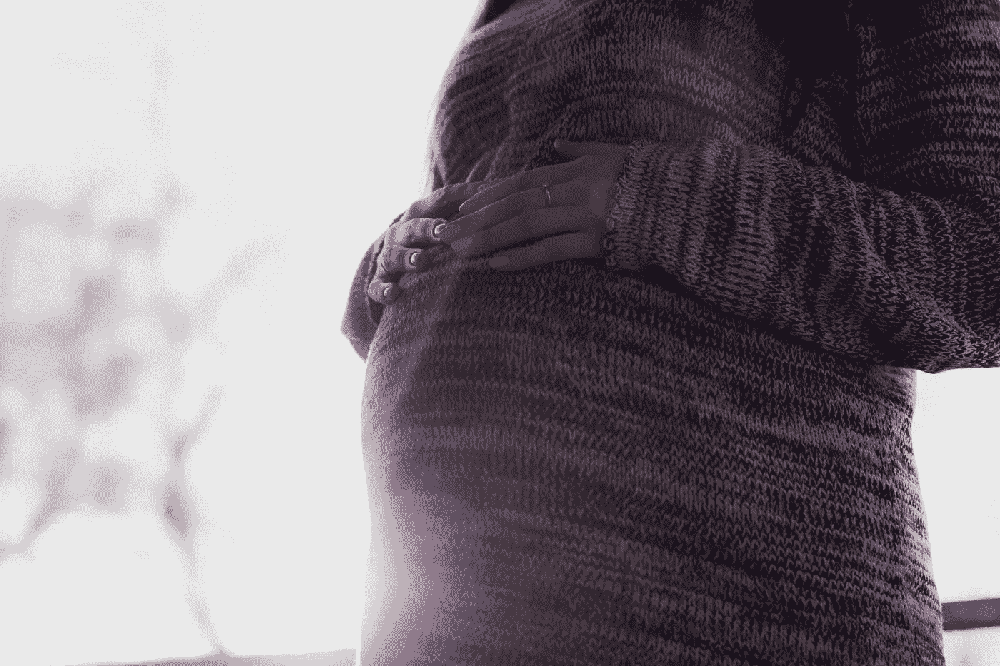

# 人生的决定性阶段——你现在在哪里？

> 原文：<https://medium.com/swlh/lifes-defining-stages-where-are-you-now-2202d7d0fc2e>

从出生到死亡，有四个定义生命的阶段。随着我们在生活中不断前进，我们都在成长、发展和成熟。对一些人来说，从一个阶段到另一个阶段的过渡感觉是一个自然的过程，而另一些人发现自己在一个阶段停滞了几十年。可悲的是，有些人甚至可能跳过某个阶段，而没有学到某个阶段的重要课程。

一旦我们准备好了，我们会经历几个不同的人生阶段。这些阶段在所有人的一生中都是真实的。通过密切观察我们的导师、家人和朋友的生活，可以让一个人认识到这些不同生活阶段背后的模式。这有助于你在自身成长和追求成功的过程中转变思路。

# 第一阶段:模仿和教育

第一阶段代表生活的所有基础。你学习如何走路、说话和做简单的事情，比如自己吃饭。在这个阶段，生活的焦点是教育和为你未来的生活打下基础。怎么会？ ***简单地模仿别人所看到的*** 。谁啊。你周围所有的成年人，你的老师，父母，甚至超级英雄，他们会告诉你如何运作。

作为一个婴儿，你是无助的，依赖他人生存。你基本上只是吃饭，睡觉和呼吸。当大脑发育，获得感觉能力和运动技能时，你的大脑处于平静状态。

到了童年后期，你开始从事更具挑战性的任务，但仍然依赖成年人的指导。通过模仿他人，你逐渐发展社交和类似的技能，学会适应社会。你开始观察你周围的规则和规范。你想被社会接受，因此，你要遵守这些规则，适应这些规范。

所有这些的基本目标是帮助我们成为自律的成年人。请记住，你仍然依赖他人的指导并寻求他们的认可。在人生的所有阶段中，这一阶段有助于我们奠定适当的基础。

从出生到青春期后期或成年早期，你一直处于第一阶段。在这个阶段，你可能遇到的最大危险是你不能放弃对外部确认的需求。你可能会被不赞成你独立的成年人困住。 ***有些成年人根本不适合教书*** 。他们想出各种形式的惩罚来阻止我们发展真正的独立。

当你有勇气将你的*个人价值观置于他人认可之上，并开始为自己行动时，就进入了下一个阶段。*

> *一旦你知道自己的价值观是什么，做决定就不难了—罗伊·e·迪斯尼*

# ***第二阶段:探索和自我发现***

**

*正如第一阶段教你如何融入，第二阶段将教你如何与众不同。在人生的这个时期，你已经准备好去发现真正的自己。 ***你现在正在做自己的决定，并学习什么让你与众不同。****

*青春期的结束标志着你走向成年的旅程的开始，这是人类生命周期中最长的阶段。你已经完成了学业，现在你的重点是获得一份好工作。 ***是你开始探索人生，走出去给世界留下印记的时候*** 。*

*此外，你会产生强烈的探索生活的欲望，这会增加你冒险的意愿。你开始尝试新的令人兴奋的可能性。你会犯很多，我是说很多错误， ***从试错中学习*** 。你将在许多地方生活，尝试不同的食物，尝试各种各样的活动。在这个阶段，你可能会和爱人和朋友有很多关系。*

*第二阶段会非常令人愉快和兴奋。因此，有些人根本不想离开这个舞台。他们宁愿在这个层次上继续生活，而不是让他们的发展展开。同样，在某些时候，你会注意到你的局限性，这将会激怒你。你可能一开始不接受这些限制，并不顾一切地努力去实现它们。*

*随着时间的推移，你会发现你的局限性是真实存在的，而且这是一件好事。他们向你展示你不擅长什么，毕竟，你不可能样样都很棒。一旦我们意识到我们必须有所选择，第二阶段就完成了。限制会帮助你过渡到第三阶段。*

> *“如果你接受自己的局限，你就会超越它们。”——布伦丹·弗兰西斯*

# ***第三阶段:奉献和承诺***

*所以，你允许你的发展展开，并接受你的局限。在第三阶段，你开始安排你认为合适的优先事项。在第三阶段，你评估你擅长什么，什么对你的生活有好处——也叫选择性。你不想带着第二阶段不必要的行李。这可能是 [*拖你后腿的人*](https://ye-chen.com/dont-compromise-yourself-for-toxic-people/) 、不健康的活动、 [*物质依附*](https://ye-chen.com/bye-bye-stuff-hello-minimalism/) 或场所。*

*在你去除了不重要的方面之后，你开始认真对待你所保留的东西。比如你现在关注的是你的事业和一个年轻家庭的发展。第三阶段标志着大量的责任，不仅是对我们自己，也是对他人。 ***此时，你开始建立你的遗产。****

*建立你的遗产就是当你离开的时候留下一些东西。在第三阶段，你开始为这个遗产打基础，包括优先事项和责任。 ***第三阶段的大多数人都有一种愿望，想让世界变得比他们当初发现时更美好。****

*对一些人来说，取得更多成就的雄心永无止境。人们习惯于不断地争取更多，他们对退休的前景感到焦虑。一旦那一天到来，对成就和权力的渴望开始困扰他们，他们错过了人生的下一个重要阶段。*

> *梦想和奉献是一个强大的组合—威廉·f·朗古*

# ***第四阶段:退休和传承遗产***

**

*每当你到了第四阶段，你可能已经花了半个世纪投资自己。也许你已经结婚，有了两个孩子，并在人生的这些阶段找到了你梦想的工作。也许你已经设法过上了舒适的生活。话说回来，也许你经历过动荡的生活，充满了冒险和不幸。 ***无论哪种方式，阶段四都是人生的结论，活得好不好。****

*不幸的是，在这个年龄，你再也负担不起探索和冒险了。 ***第四阶段是确保遗产被传递给你或其他孩子，并教导和帮助他们以健康的方式度过人生的各个阶段。****

*这个阶段是关于寻找生命和死亡的意义。它让我们有机会确保我们的某些东西继续活在这个世界上，即使我们早已不在人世。*

> **“死亡不是人生最大的损失。最大的损失是我们活着的时候内心死去的东西。”—诺曼·考辛斯**

*请随时和我分享你的旅程。*

**原载于 2018 年 4 月 10 日*[*ye-chen.com*](https://ye-chen.com/lifes-defining-stages%e2%80%8a-%e2%80%8awhere-are-you-now/)*。**

**

## *这篇文章发表在 [The Startup](https://medium.com/swlh) 上，这是 Medium 最大的创业刊物，拥有 314，785+的读者。*

## *在这里订阅接收[我们的头条新闻](http://growthsupply.com/the-startup-newsletter/)。*

**