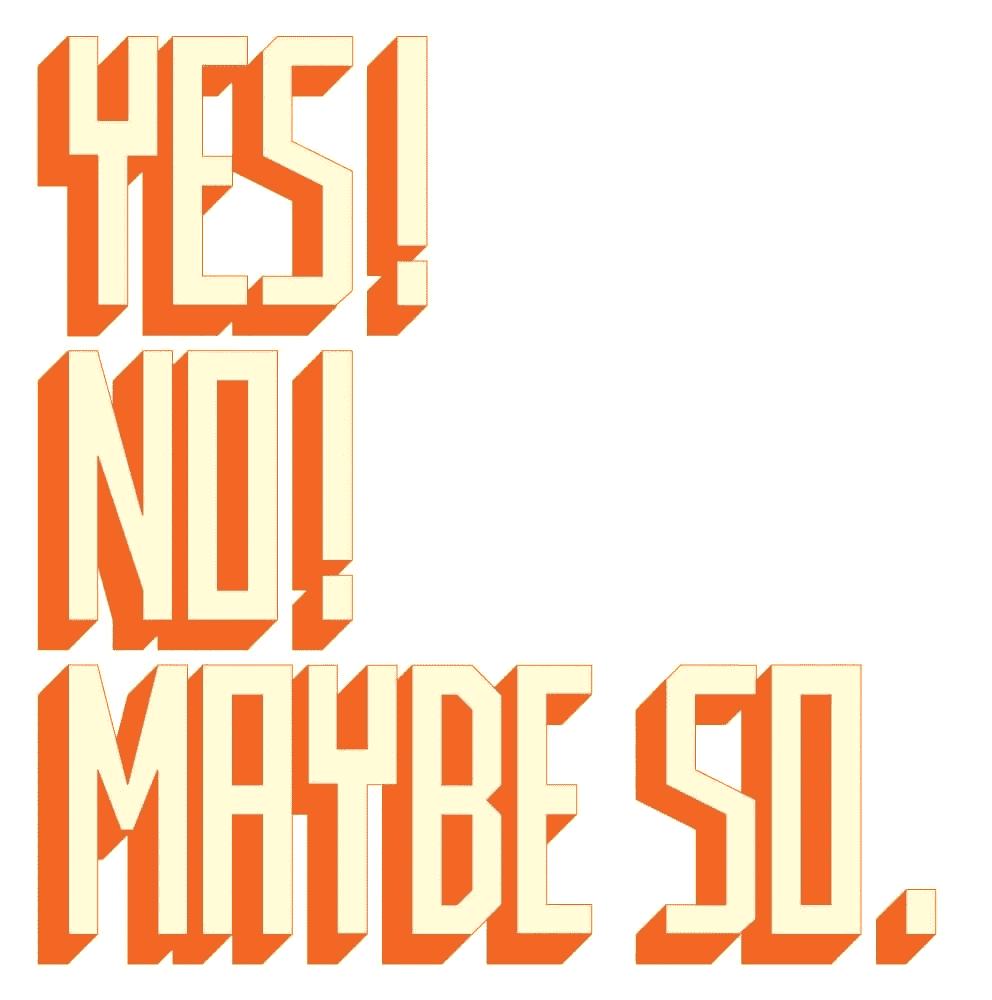

# 生活方式实验:以下是当我在 1 天内对所有事情都说“是”和在 10 天内对所有事情都说“不”时发生的情况

> 原文：<https://medium.com/swlh/lifestyle-experiment-here-is-what-happened-when-i-said-yes-to-everything-for-1-days-vs-af5fcd49c6fa>

## 我对所有事情说“是”和“不”的 10 天——生活方式实验

# *第一部分:我对所有人说“是”的头 10 天

昨天星期五之前，第一阶段的实验已经结束。对一切都是对的 VS [**对一切都不是**](https://isragarcia.com/say-no-to-everything-experiment) 。这是 10 天来一切都是肯定的。所有我能说的"是"。我学到的比我想象的多，我生活在充满有趣矛盾的两极。

*Photo credit:* [*Laura Veronesi*](https://www.flickr.com/photos/evereverse/)*.*

# 跟踪参数

这些是我遵循的定量参数:

*   “是”而不是“不是”:当我对通常会说“不是”的事情说“是”时
*   是的:“是的”他们不是被迫的，是自然的。
*   不:“不”不勉强，简单。
*   避免情况:当试图避免一份需要“是”的工作时
*   “不”而不是“是”:当我说“不”的时候，这应该是对我所处的实验阶段的“是”。
*   纠正措施:当我第一次说“不”的时候，我意识到了，然后说“是”

# 定性参数

*   突出的事情:在“是”中突出的事实
*   令人惊讶的:我认为是真实的轶事和时刻。
*   意想不到的情况:我措手不及，然后在没有意识到的情况下屈服了。

# 仪表板上的结果

以下是在“对一切都是”的 10 天结束时获得的量化结果:

*   20 个“是”而不是“不是”
*   50 是的。
*   11 没有。
*   2 避免的情况。
*   7 用“不”代替“是”。
*   4 整改。

这里是定性的…

10 天内突出的事情:

*   用现金支付你通常会用卡或公司支付的产品。
*   在离开超市的时候，把一周的所有购物都捐给一个点餐的人。
*   安排一次与多层次营销公司的会议。
*   让一个朋友开我的车
*   给一个在 Instagram 上问我的粉丝发 50€。
*   与 Eduardo Reyes 一起在 Castellón 组织会议和活动。
*   在加油站买一张彩票。一包口香糖，还有香肠。和一条小麦面包。除了车内缺少空气清新剂。(不吃这些食物)
*   致力于三个新项目，这些项目我都不知道，也不符合我的目标或要求。
*   确认世界逃亡日期间的在线会议。
*   听听我的电话公司的报价，改变计划，购买两个新套餐，租用一条新线路。

# 值得一提的令人惊讶的事情

*   用我的同事做挡箭牌，这样我就不用说“不”
*   去国家的另一边开一个免费的会议。
*   在我不太懂的时候帮邻居挂画。
*   让我的团队中的一名成员打扮成女人去参加下一个在阿利坎特举行的脱颖而出项目。
*   承认一个“不”而不是一个“是”
*   对自己撒谎说“是”。
*   认识到他们不必要地讨好我。
*   仅仅为了说一句“是”而承担不属于我的责任。
*   听 30 分钟推销信用卡的广告，最后签署一项计划。

# 发生了意想不到的事情

*   对我应该答应的承诺说“不”。
*   给优秀项目 Málaga 一个名额。
*   给一个无家可归的人 10€。
*   不得不吃 fideuá，在这里他们玩我很好。
*   说“是”来尝试购买一件你永远不会使用的产品。
*   免费工作 4 小时。
*   拒绝哈维·马西阿斯给我的香料。
*   处理并参加一个计划外的会议。

正如我所说的，这是不寻常的，奇怪的，非常不舒服，有时甚至令人不安。我觉得没什么好玩的。

# 10 天对一切都是肯定的

我已经录制了一段**的视频，向你解释在第一阶段对一切都是肯定的 10 天中剩下的体验，第一手的。**

# ***第二部分:我对所有人说“不”的最后 10 天**

****

***Photo credit:* [*Tau Zero*](https://www.flickr.com/photos/t_zero/)*.***

**当你活了 10 天，对眼前的一切说不，会发生什么？这是我在过去 10 天里试图回答的问题。这是实验的第二部分，对所有的事情说是，对所有的事情说不。**

**在所有这 10 天以及发生的事情中，我总结了一系列参数和指标，这些参数和指标我已经在对一切说是的 10 天中使用过。
在这份报告中，我详细介绍了这个第二阶段实验的亮点，对一切说不。**

# **1.跟踪参数的定义**

**定量参数:**

*   **“不”而不是“是”:每次我说“不”的时候，在正常情况下我会说“是”**
*   **“不”:说“不”是一种自然的“不”，因为那是需要说的。**
*   **“是”:不被强迫的肯定回答。**
*   **避免情况:我试图逃避拒绝的情况。**
*   **“是”而不是“不是”:在应该是“不是”的时候，我说了“是”的情况。**
*   **纠正措施:纠正和修正一个“是”，这个“是”应该是一个“否”。**

**定性参数:**

*   **突出的事情:提及“不”时需要强调的重要事件**
*   **趣闻:说“不”而沉浸其中的趣闻。**
*   **意想不到的事情:让我措手不及的情况。**

# **2.仪表板中的结果**

**这些是定量参数的结果:**

*   **35 次说“不”而不是“是”**
*   **我已经说了 70 次“不”**
*   **我已经说了 7 次“是”**
*   **只有一次我避免了一种情况。**
*   **五次“是”而不是“不是”**
*   **3 整改。**

# **3.突出的东西**

**这些事情反过来会产生积极的影响，或者当我说“不”时:**

**我对一位患有心脏病、需要人帮忙提一系列行李箱的女士说“是”。这是我还会做的事，当我看到那个女人的脸时，我就有麻烦了。我在这里中断了实验。**

**我连续四次对四个不同的人在同一天向我提出的四个请求说“不”。一个用来接人，另一个用来传递信息。另一个是贷款，最后一个是推荐信。**

**对我们感兴趣的工作提议说“不”。除了看看它是怎么逃出来的直到我们把它弄丢了。**

**连续两天拒绝对团队中出现的所有专业问题给出反馈和意见。**

**对客户询问我们是否会在这个项目上做更多工作的问题说“不”。**

**对两个可能的会议提议说“不”，这两个提议问我是否有可能为他们的活动举办一个会议。在不知道更多细节的情况下。**

**当他们问我是否要分享我正在做的研究的信息时，我说“不”，没有进一步解释。**

**以“是”的形式对反过来的问题说“不”。当问题反过来问时，把“是”看作“不是”。**

# **4.轶事**

**同一天对同一个人说七个“不”。导致与那个人的冲突。**

**在实验的第三天之后，我周围的任何人都不再向我寻求帮助。**

**在我最亲近的环境中，没有人敢问我，我们是否可以见面或一起分享片刻。**

**在这 10 天里，我从未因任何承诺而迟到。**

**四份请愿书拒绝借钱给四个不同的人。结果:四个持怀疑态度的人拿着“我的实验”**

**在巴伦西亚的露天广场外，给一个向她要食物的女人提供一个土豆煎蛋卷而不是比萨饼。**

**接受新实验的“不”(那很痛苦)。**

# **5.意外发生的事情**

**你意识到你对“不”有了更多的控制和假设，它变得更加自然。**

**习惯说“不”，以至于到了第八天，当你想说“是”的时候，你却说“不”**

**因为说“不”而错过一个派对和一次旅行，甚至都没听说过。**

**让你自己吃惊的是，当你完成实验时，你说“是”，好像你做错了什么。**

**实验是学习的源泉。与此同时，你生活在不以任何其他方式生活的情况和时刻中。**

****

# **对一切说不**

**[**在这个视频**](https://youtu.be/81irckHQAkg) 中，我以“号” 为中心，对实验 [**上的结果、观感、**](https://www.huffingtonpost.com/alexandra-franzen/how-to-say-no_b_3132921.html) **[**反思**](https://isragarcia.com/category/reflections)****

**很好奇比较一下**有没有的结果。看看当你在一边时，当你在另一边时，两边发生了什么以及它们的对比。以前说“是”让我对“不是”有了不同的看法，我想知道如果我以相反的方式开始实验会发生什么。****

****毫无疑问，你必须时不时地对一切说不。****

****在 5 到 10 天内对所有事情说不，看看会发生什么。你自己试试。****

# *****第三部分:对一切说“是”与对一切说“不”:对比和结论****

****是和不是，不是和是，是和不是。对一切说是和对一切说不是…有什么区别？有区别吗？有关系吗？****

****几周前，我完成了“是”与“否”的实验。10 天内，我对所有事情都说“是”**，接着又花了 10 天对所有事情都说“不”**。从一个极端走到另一个极端，去欣赏一种致力于取悦自己的生活(是)和另一种致力于取悦自己的生活(不是)的差异和对比。关于结论，我想给自己几周时间来反思，看看我的行为和日常表现有什么变化。********

******首先，这是第一阶段结束的视频，这 10 天是对一切都是肯定的。另一个属于第二阶段，10 天对任何事情都不做。今天，我发展了两者的差异、对比和结论，融合了一切。******

************

*******Photo credit:* [*Brett McFadden*](https://www.flickr.com/photos/brettmacfadden/)*.*******

# ******仪表板******

******对每件事都说好还是对每件事都说不是我必须监控的事情。在每次实验中，我都使用记分卡来记录每天的所有事情。在之前的报告中解释了这些参数，但是没有解释记分卡，尽管你可以在这里找到它。******

******当我看记分卡的时候，我意识到我比我练习“对一切都是”的时候有更多的问题。这将是一个值得欣赏的快速结论。******

# ******是与否的对比******

******对所有事情说“是”和对所有事情说“不”当然有不同的说法，这些是我发现的比较:******

*   ******“是”会暴露你，而“否”会释放你。******
*   ******你说“是”的次数越多，从情感上讲，你就越有可能崩溃。另一方面,“不”让你脚踏实地，让你稳定，让你无处不在。******
*   ******“不”保证控制，而“是”意味着放弃这种权力。******
*   ******本质上，“是”是脆弱的代名词，没有保护。另一方面，以这样或那样的方式说“不”会让你更加无懈可击。你设置了一个障碍。******
*   ******“是”让你不那么被重视，而“不是”让你更被考虑。******
*   ******使用“是”会让你放弃你的优先事项，而“否”会把它们收回。******
*   ******“不”是现在对以后的爱失望，很多时候。“是”就是现在去爱，以后再去失望。******
*   ******在应该说“是”的时候说“不”比在需要说“不”的时候说“是”花费更少。******
*   ******懂得用“不”的人比只会说“是”的人内心活得更平静******
*   ******对“不”的人说“是”很复杂，对“是”的人说“不”也很复杂。******

# ******是和不是，结论******

******最后，研究结果是:******

*   ******对一切说“不”不会让你成为一个更好或更坏的人，只会让你有能力为自己赢得更多的时间。******
*   ******对每件事都回答“是”会给你机会去做新的事情。它使你有资格被选中。如果这就是你所等待的，被选中。******
*   ******我对每件事都说“是”时所感到的不适，是我不得不与“不”打交道时所没有的。******
*   ******更多的“不”更多的孤独，更多的“是”，更多的人在你身边。******
*   ******我从这个实验中学到的最重要的事情不是学会说“是”或“不是”，而是知道何时以及如何使用它，是和不是，两者都是强大的。秘诀是同等重视它，然后根据情况和人给予它们最高的重要性。******
*   ******既不是每件事都是“是”，也不是每件事都是“否”。正如我上面所说的，当你发现两者的极端时，一旦你意识到“是”或“否”的选择和使用，你就能认识到什么时候你应该使用其中之一。******
*   ******经过这 20 天的实验，我更喜欢说“不”。你学得更多，你成长得更多，你比说“是”用得更多。******

******是和不是，也就是说，对所有事情说是和对所有事情说不，两种有效但同时又痛苦的武器。******

******【本帖首发于**】********

# ******只有当你觉得值得的时候，才让这个故事震撼吧！如果你发现任何有价值的东西，请鼓掌。******

> ******Isra Garcia = 55 个客户，48 家企业，400 次演讲，3.574 篇帖子，24 个项目，6 本书，380 场讲座，6 家公司，17 次冒险，26 次实验，∞失败。到目前为止…******
> 
> ******[有一手](https://isragarcia.com/wp/marketer)。顾问。扬声器。作家。教育家。经理。在 [IG](http://thisisig.com) 的负责人。博主。企业家。颠覆性创新。数字化转型。高绩效者和生活方式实验者。******

# ******行动号召>>点击[这里](http://feeds.feedburner.com/isragarcia)订阅更多类似的文章！******

************

## ******这篇文章发表在《初创企业》杂志上，这是 Medium 最大的创业刊物，有 351，974 人关注。******

## ******订阅接收[我们的头条新闻](http://growthsupply.com/the-startup-newsletter/)。******

************