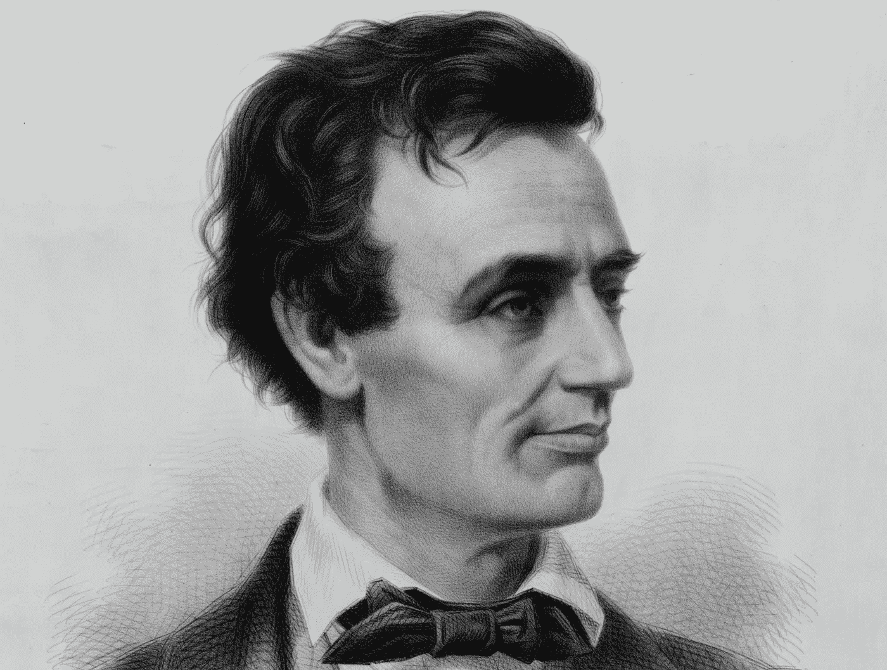

# 林肯，论暴民

> 原文：<https://medium.com/swlh/lincoln-on-mobs-99009fe97533>

1838 年，还不到 30 岁的亚伯拉罕·林肯在吕克昂学院做了这个演讲。180 年后，缺乏耐心的现代读者可以有利可图地跳到斜体部分。

在太阳下发生的事情的伟大日志中，我们，美国人民，发现我们的帐户运行在基督教时代的 19 世纪的日期。我们发现自己和平地拥有地球上最公平的部分，就领土的范围，土壤的肥力和气候的健康。我们发现自己处于一种政治制度的统治之下，这种制度比以往的历史告诉我们的任何制度都更有助于实现公民自由和宗教自由。当我们登上存在的舞台时，我们发现自己是这些基本权利的合法继承者。我们没有努力去获得或建立它们；他们是曾经顽强、勇敢和爱国，但现在却悲伤和离去的祖先留给我们的遗产。他们的任务(他们高尚地履行了这一任务)是占有他们自己，并通过他们自己占有我们这片美好的土地，并在它的山丘和山谷上建立一座自由和平等权利的政治大厦；我们只是要把这些——前者没有被侵略者的脚步所破坏，后者没有被时间的流逝所毁灭，也没有被篡夺所毁灭——传递给命运将让全世界知道的最新一代。这个任务是对我们祖先的感激，对我们自己的公正，对子孙后代的责任，以及对我们整个人类的爱，所有这些都迫切需要我们忠实地去完成。

*那我们该如何执行呢？在什么情况下我们会预料到危险的来临？我们用什么方法来防御它呢？我们能指望某个大西洋彼岸的军事巨人跨过大洋，一下子把我们打垮吗？绝不！欧洲、亚洲和非洲的所有军队联合起来，在他们的军事箱里有地球上所有的财富(我们自己的除外)，有一个波拿巴的指挥官，不能用武力从俄亥俄喝一杯酒或在一千年的审判中在蓝岭留下一条轨迹。*

*那么，在什么时候，危险的逼近是可以预料的？我回答，如果它曾经到达我们，它必须在我们中间出现；它不可能来自国外。如果毁灭是我们的命运，我们必须自己是它的创造者和终结者。作为一个由自由民组成的国家，我们必须活下去，否则就自杀。*

我希望我过度警惕了；但如果我不是，甚至现在有不祥的预兆在我们中间。我指的是弥漫全国的对法律日益增长的漠视——越来越倾向于用狂野和愤怒的激情代替法庭的冷静判断，用比野蛮暴民更坏的人代替司法部长。这种性格在任何社会都是可怕的；它现在存在于我们的心中，尽管承认这一点会让我们感到不快，但否认这一点就是违背真理，侮辱我们的智慧。《泰晤士报》每天都报道暴民的暴行。他们已经遍布全国从新英格兰到路易斯安那州；它们既不是前者永恒的雪所特有的，也不是后者燃烧的太阳所特有的；他们不是气候的产物，也不局限于蓄奴或非蓄奴州。他们同样出现在南方奴隶的寻欢作乐的主人和习惯稳定的土地上热爱秩序的公民中。无论他们的原因可能是什么，这是全国共同的。

详述所有这些恐怖事件既乏味又无用。那些发生在密西西比州和圣路易斯的事件也许是最危险的例子，令人厌恶。在密西西比州的情况下，他们首先开始绞死经常赌博的人——一组人当然不是为了谋生一个非常有用或非常诚实的职业，但是一个，迄今为止没有被法律禁止，实际上是由一年前通过的立法机构的法案许可的。接下来，被怀疑阴谋造反的黑人被抓起来，在全州各地被绞死；那时，白人应该和黑人结盟；最后，来自邻国的陌生人，去那里做生意，在许多情况下遭受同样的命运。就这样，从赌徒到黑人，从黑人到白人公民，再从这些人到陌生人，这种吊死的过程一直持续下去，直到人们看到死人挂在每条路边的大树枝上，其数量几乎足以与这个国家的本地西班牙苔藓相媲美，成为森林的窗帘。

那么，让我们回到圣路易斯那令人震惊的恐怖场景。只有一名受害者牺牲在那里。这个故事很短，也许是现实生活中所目睹的最悲惨的故事。一个名叫麦金托什的黑白混血儿在街上被抓住，拖到市郊，用链子锁在一棵树上，实际上被烧死；这一切都发生在一个小时之内，那时他已经是一个自由人，专心于自己的事业，与世界和平相处。

## 这就是暴民法律的效果，这就是在这片最近因热爱法律和秩序而闻名的土地上越来越频繁出现的场景，关于它的故事甚至现在已经变得太熟悉了，以至于吸引不了更多的闲言碎语。

但是你可能会问，“这和我们政治制度的永久化有什么关系？”我答:“有很大关系。”相比较而言，它的直接后果只是一种小小的罪恶，它的大部分危险在于我们倾向于把它的直接后果看作是它唯一的后果。抽象地考虑，在维克斯堡的赌徒绞刑，但很少的后果。他们构成了人口的一部分，在任何社区比无用的更糟；他们的死亡，如果没有恶劣的例子，从来没有合理的遗憾。如果他们每年都被瘟疫或天花从生存的舞台上扫走，诚实的人也许会从手术中受益匪浅。类似的，也是正确的推理关于圣路易斯黑人的燃烧。他丧失了他的生命的暴行谋杀了一个最值得尊敬的城市的公民，如果他没有死，他必须死于法律的判决在很短的时间后。对他一个人来说，这是最好的方式，否则它可以。但是这两种情况下的例子都很可怕。当人们今天想到绞死赌徒或烧死杀人犯时，他们应该记得，在通常参加这种交易的混乱中，他们很可能绞死或烧死一个既不是赌徒也不是杀人犯的人，而且，按照他们树立的榜样，明天的暴民可能，而且很可能会，因为同样的错误绞死或烧死他们中的一些人。不仅如此；无辜的人，那些曾经直面各种形式的违法行为的人，与有罪的人一样成为暴民法律蹂躏的受害者；因此，它一步一步地上升，直到所有为保护个人和个人财产而竖起的墙都被践踏和忽视。但这一切，甚至还不是罪恶的全部。通过这些例子，通过这些行为的肇事者逍遥法外的例子，精神上无法无天的人受到鼓励，在实践中变得无法无天；已经习惯了没有约束，但害怕惩罚，他们因此变得绝对无拘无束。他们认为政府是他们最致命的祸根，他们庆祝政府停止运作，祈祷政府彻底灭亡。而另一方面，好人，爱宁静的人，渴望遵守法律，享受他们的利益，他们会高兴地为保卫自己的国家洒下他们的鲜血，看到他们的财产被摧毁，他们的家庭被侮辱，他们的生命受到威胁，他们的人受伤，看不到任何预示着更好的变化的前景，变得厌倦和厌恶一个不为他们提供保护的政府，并不反对他们认为他们没有什么可失去的变化。*因此，所有人都必须承认，这种暴民主义精神现在已经泛滥成灾，任何政府，尤其是像我们这样的政府的最强大的堡垒，可能会被有效地瓦解和摧毁——我指的是人民的依附。* *每当这种效应在我们中间产生的时候；无论何时，当邪恶的部分人口被允许聚集成成百上千的团伙，烧毁教堂，破坏和抢劫粮库，把印刷机扔进河里，枪杀编辑，随意绞死和烧死讨厌的人而不受惩罚，相信它，这个政府不会持续*。通过这样的事情，最好的公民的感情将变得或多或少地疏远它，因此它将没有朋友，或太少，那些少数太弱，使他们的友谊有效。在这样的时候，在这样的情况下，有足够才华和雄心的人不会想要抓住机会，打击，推翻公平的结构，过去半个世纪一直是全世界自由爱好者的最大希望。

我知道美国人民非常热爱他们的政府；我知道他们会为此遭受很多痛苦；我知道他们会长期和耐心地忍受邪恶，然后才会想到把它换成另一个——然而，尽管如此，如果法律继续被蔑视和忽视，如果他们的人身和财产安全的权利没有比暴徒的任性更好的任期，他们对政府的感情的疏远是自然的结果；为此，它迟早会到来。

那么，这是一个可能会有危险的地方。

这个问题反复出现，“我们如何防御它？”答案很简单。让每一个美国人，每一个热爱自由的人，每一个祝福他的后代的人，以革命的鲜血发誓，绝不违反国家的法律，绝不容忍他人违反法律。正如 76 位爱国者支持《独立宣言》一样，让每一个美国人以自己的生命、财产和神圣的荣誉宣誓支持宪法和法律——让每一个人都记住，违反法律就是践踏父亲的鲜血，就是撕毁自己和孩子的自由宪章。让每一位美国母亲对她膝上喋喋不休的口齿不清的婴儿吐露对法律的崇敬；让它在学校、神学院和大学里被教授；让它写在启蒙书、拼写书和年鉴上；让它在讲坛上被宣扬，在立法大厅里被宣布，在法庭上被强制执行。简而言之，让它成为国家的政治宗教；让老年人和年轻人，富人和穷人，坟墓和同性恋的所有性别和舌头和颜色和条件，不断牺牲在它的祭坛上。

虽然这种情绪将会普遍甚至非常普遍地在全国盛行，但是颠覆我们国家自由的任何努力都是徒劳的，任何企图都是徒劳的。

当我如此强烈地要求严格遵守所有的法律时，请不要让我被理解为说没有坏的法律，或者说没有法律规定可以纠正的冤情不会产生。我无意说这样的话。但我的意思是说，虽然坏的法律，如果他们存在，应该尽快废除，但是，当他们继续有效，为了榜样，他们应该虔诚地遵守。在没有证据的情况下也是如此。如果出现这种情况，让适当的法律规定为他们尽可能少的延迟，但在此之前，让他们，如果不是太难以忍受，忍受。

没有一种冤屈是暴民法律可以平反昭雪的。在任何可能出现的情况下，例如，废除主义的宣传，两种立场之一必然是正确的——也就是说，事情本身是正确的，因此值得所有法律和所有好公民的保护，或者它是错误的，因此应该被法律禁止；在这两种情况下，暴民法的干预既不必要，合理，也不可原谅。

但人们可能会问，“为什么要假设我们的政治机构面临危险？我们不是保存了五十多年了吗？为什么我们不能持续五十倍的时间？”

我们希望没有足够的理由。我们希望一切危险都可以克服；但是得出没有危险会发生的结论本身就是极其危险的。现在有，而且以后还会有，许多危险的原因，这些原因以前没有，但也并非微不足道，不值得注意。我们的政府从建立到现在一直保持着原来的形式，这是不足为奇的。它有许多支撑它度过那个时期的支柱，但现在这些支柱已经腐朽和瓦解了。在此期间，所有人都认为这是一个未定的实验；现在人们认为这是一个成功的例子。那时，所有寻求名望、名声和声望的人都期望在实验的成功中找到他们。他们的一切都押在它身上；他们的命运与此密不可分。他们的野心是渴望在一个钦佩的世界面前展示一个迄今为止被认为充其量只是有问题的命题的真理的实际证明——即一个民族管理自己的能力。如果他们成功了，他们将永垂不朽；他们的名字将被转移到县，城市，河流和山脉；永远被崇敬，被歌颂，被敬酒。如果他们失败了，他们将被称为无赖，傻瓜，和狂热的一个小时；然后沉沦并被遗忘。他们成功了。实验成功了，成千上万的人因此而赢得了不朽的名声。但是游戏被抓住了；我相信这是真的，与捕捉结束追逐的乐趣。这片光荣的土地已经收割，庄稼已经被占有。但新的收割者将会出现，他们也将会寻找一块田地。这是否认世界历史告诉我们的是真的，假设男人的野心和才华不会继续出现在我们中间。当他们这样做时，他们会像在他们之前的其他人一样自然地寻求满足他们的统治激情。那么问题是，这种满足感能在支持和维护他人建造的大厦中找到吗？当然不能。可能会发现许多伟大的好人，足以胜任他们应该承担的任何任务，他们的野心只不过是渴望在国会中获得一个席位、州长或总统职位；但这不属于狮子的家族，也不属于鹰的部落。什么！你认为你这些地方会满足一个亚历山大，一个凯撒，或一个拿破仑吗？绝不！卓越的天才不屑走旁人走过的路。它寻找迄今未被探索的地区。它看不出在为纪念他人而树立的名誉纪念碑上增加一个又一个故事有什么区别。它否认在任何首领手下服务是足够光荣的。它不屑于追随任何前任的脚步，无论前任多么杰出。它渴望和燃烧的区别；如果可能的话，它将拥有它，无论是以解放奴隶还是奴役自由民为代价。那么，期望某个拥有最崇高的天才，并有足够的野心将它发挥到极致的人，会在某个时候出现在我们中间，这是不合理的吗？当这样一个人这样做的时候，它将要求人们彼此团结，依附于政府和法律，并且通常是聪明的，以成功地挫败他的计划。

## 杰出将是他最重要的目标，虽然他愿意，也许更愿意，通过做好事来获得它，但是，机会已经过去了，没有什么可以做的建设，他会大胆地开始拆除的任务。

这是一个可能的情况，非常危险，这样一个不可能存在至今。

另一个原因曾经是，但在同样程度上，现在已经不存在了，迄今为止在维护我们的机构。我的意思是革命的有趣的场景对人们的激情的强大影响区别于他们的判断。通过这种影响，嫉妒，羡慕和贪婪的事件，我们的本性，所以常见的和平，繁荣和意识的力量，在很大程度上被扼杀和呈现不活跃，而根深蒂固的仇恨的原则，和强大的报复动机，而不是互相反对，专门针对英国国家。因此，在环境的力量下，我们本性中最基本的原则要么被置于休眠状态，要么成为推进最崇高事业的积极推动者——即建立和维护公民和宗教自由。

但是这种感觉状态必须随着产生它的环境而消退，正在消退，已经消退。

我并不是说革命的场景现在或将来会被完全遗忘，而是说，像所有其他事情一样，它们必须在世界的记忆中褪色，并随着时间的推移越来越模糊。在历史上，我们希望，只要《圣经》被阅读，它们就会被阅读和叙述；但即使他们会，他们的影响也不可能是迄今为止。即使这样，他们也不会像刚刚死去的一代人那样广为人知，也不会如此真切地感受到。在这场斗争结束时，几乎每一个成年男性都参与了其中的一些场景。其结果是，在这些场景中，以丈夫、父亲、儿子或兄弟的形式，在每个家庭中都可以找到一部活生生的历史——在残肢断臂中，在受伤的伤疤中，在相关的场景中，一部具有自身真实性的不容置疑的见证的历史——一部所有人，无论是聪明的还是无知的，有学问的还是没学问的，都可以阅读和理解的历史。但是那些历史已经过去了。它们永远不会再读了。他们是力量的堡垒；但是入侵的敌人永远做不到的事情，时间的无声大炮做到了——夷平城墙。他们走了。它们是巨大橡树的森林；但是不可抗拒的飓风已经席卷了他们，只留下这里和那里一个孤独的树干，剥夺了它的绿色，它的叶子，unshading 和 unshaded，在几个更温柔的微风中低语，用它残缺的肢体战斗几个更粗鲁的风暴，然后下沉，不复存在。

他们是自由圣殿的支柱；现在他们已经崩溃了，除非我们，他们的后代，用其他的柱子来代替他们的位置，这些柱子是从清醒的理性的坚实的采石场砍下来的。激情曾帮助过我们，但再也帮不了我们了。它将来会是我们的敌人。理性——冷酷的、算计的、没有激情的理性——必须为我们未来的支持和防御提供所有的材料。让这些材料塑造成普遍的智慧、健全的道德，特别是对宪法和法律的崇敬；我们改进到最后，我们保持自由到最后，我们崇敬他的名字到最后，在他长眠期间，我们不允许任何敌对的脚通过或亵渎他的安息之地，将是学习最后特朗普将唤醒我们的华盛顿。

让自由的骄傲的结构在上面休息，作为它的基础的岩石；正如对唯一更伟大的机构所说的那样，“地狱之门将无法战胜它。”