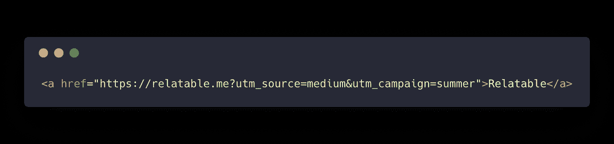
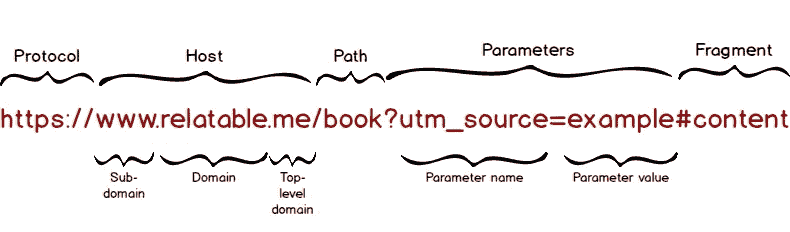
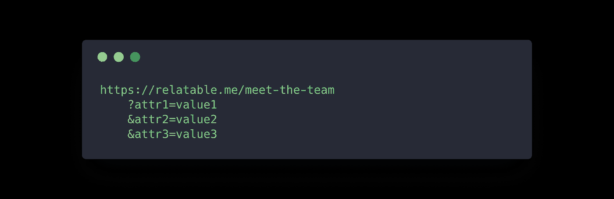
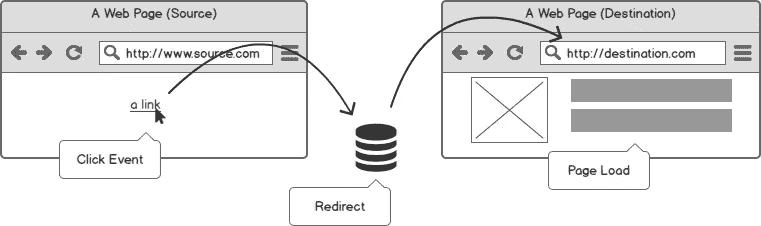
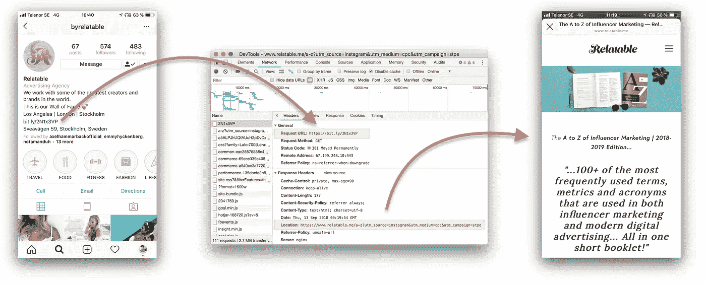

# 面向数字营销人员的深度链接跟踪

> 原文：<https://medium.com/swlh/link-tracking-in-depth-for-digital-marketers-af7eacbc26e6>


Aim high — link tracking is not rocket science.

## 理解链接跟踪是数字营销的基本知识。尽管如此，当与数字营销人员交谈时，我注意到许多困惑和错失的洞察机会。这就是为什么我决定写这篇深入的链接跟踪指南。

链路跟踪的本质是测量一个源通过链路到达目的地的流量。为了能够利用可能的力量，理解基本原理是至关重要的。

我怎么强调都不为过。在无数次，混乱的根源是由于不了解如何修改现有的链接或什么是重定向。

让我们从什么是链接和 URL 的基础知识开始，然后介绍跟踪点击的不同方法，最后介绍它们是如何工作的以及在哪里使用它们。我在文章*中加入了一些*专业建议*。这些提示可能更高级，但会让你成为一名营销人员。*

# 什么是链接？



A link in HTML with a href attribute containing a URL

链接是对用户可以通过点击或轻击直接跟随的内容的引用。指向互联网上另一个*事物*的实际*网址*是一个 URL(统一资源定位符)。然而，大多数情况下，术语*链接*和 *URL* 可以互换使用。

# 网址

URL 是理解链接跟踪最基本的部分。如果你知道了什么是 URL 以及它的格式，那么你就可以根据自己的需要随意修改它(正如后面所看到的，这是必要的)。



Anatomy of a URL

下图显示了典型 URL 的格式。这里是不同部分的概述。

*   **协议。**对于网址，这通常是 https 或 http(其中 https 要求通过安全连接发出请求)。
*   **主持人。**通常主机就是我们所说的网站地址。由可选的子域、域名和顶级域组成(例如。com 或国家代码)
*   **路径。以斜线`/`开始的可选路径，通常确定显示网站的哪个网页。**
*   **参数。**可选参数(也称为*查询字符串*)前面有一个问号。参数以属性-值对的形式发送到主机，由一个&符号`&`分隔。
*   **片段。**最后一部分是以哈希`#`开头的片段。该片段通常用于让浏览器自动滚动到网页的特定部分(也称为命名锚点)。

当用户跟随一个链接时，用户的网络浏览器向*主机*执行一个请求，用提供的*参数*请求指定*路径*上的数据。主机用指示用户的 web 浏览器做什么的数据来响应(通常显示一个网页，或者重定向到一个新的 URL)。

# 修改 URL 及其参数

对于链接跟踪，您最终可能要修改的通常是查询字符串及其属性-值对参数。典型的情况可能是，您需要添加额外的参数，如 UTM 码(有时称为 UTM 标签)，或者您自己的参数，以确保 URL 是唯一的。

稍后我们将深入研究什么是 UTM 码以及其他用例。重要的是要记住，在几乎所有的情况下，添加额外的参数是没有坏处的。你需要了解 URL 的格式以及如何添加参数。

* *从理论上讲，一个网页可能实现得很差，以至于由于一个意外的参数而无法显示，但这不应该是一个问题。*

重要的规则是:

*   路径和查询字符串之间总是有一个问号。
*   参数形式为`attribute=value`
*   用&符号`&`分隔多个参数
*   您可以添加一个虚构的参数，而不会影响任何东西



Parameter structure of an URL (line breaks inserted for clarity)

例如，我们想给这两个链接添加值为`medium`的参数`utm_source`。

在第一个例子中，我们只获得了一个完整的域名，所以我们需要添加问号来附加一个额外的参数。

`https://relatable.me`变成了`https://relatable.me?utm_source=medium`

在第二个例子中，URL 已经包含了一个参数。因此，我们使用&符号作为分隔符来附加另一个。

`https://careers.relatable.me/?id=123`变成了`https://careers.relatable.me/?id=123&utm_source=medium`

确保复制/粘贴已更改的 URL，并在浏览器中试用，以确保一切按预期运行。

# 什么是点击？

让我们从技术角度来看一下什么是网络浏览器中的点击，然后我们就可以理解如何以及在哪里测量它。

**1。**当用户点击一个链接时，浏览器触发一个信号，表明发生了一些事情——一个`event`。更具体地说是鼠标事件`click`。

**2。**浏览器检查是否有任何*处理程序*——当特定事件被触发时运行的一段 JavaScript 编程代码。

**3。**如果有处理程序，则执行处理程序代码。如果处理程序没有阻止它，浏览器会继续查看下一个要打开的 URL。

**4。**浏览器从 URL 请求数据，并查看响应中名为*头*的部分。如果标题没有告诉浏览器转到另一个 URL(重定向),浏览器将继续解析响应的正文，以在浏览器中显示目的地的内容。

**5。**浏览器加载目标页面和任何所需的资源(图像、样式表、JavaScript 代码等等)以在浏览器中显示网页。它还在加载时执行任何 JavaScript 代码。

当链接显示在应用程序中而不是浏览器中时，会跳过前三个步骤，并打开浏览器直接请求 URL。

现在，我们了解了正在发生的事情，并可以深入了解如何计数和跟踪点击。

# 如何跟踪链接点击

有三种主要方法来跟踪点击。



*   **点击事件**:使用处理程序监听网站链接的点击。
*   **重定向**:让链接转到一个主机(通常是一个 URL 缩短器)，该主机计算点击次数，然后将用户重定向到最终目的地。
*   **页面加载**:跟踪目标网站上的请求。这就是你要做的跟踪你自己网站的流量。

在深入研究每种方法之前，让我们总结一下:使用**点击事件**来跟踪你网站上的出站链接，使用**重定向**来跟踪你分享的链接的点击，并根据**页面加载**来获得你网站的入站流量。

# 点击事件和谷歌分析

为了跟踪网页上的点击事件，你需要访问网站源代码，要么直接访问，要么通过类似于[谷歌标签管理器](https://support.google.com/tagmanager/answer/6102821?hl=en)的东西。因此，这种解决方案通常只用于跟踪你自己网站上的链接。在 Instagram 上，在 YouTube 视频描述中，在 Twitter 上等等，使用这种方法来跟踪链接是不可能的。

Google Analytics 通过拦截点击事件，计算特定 URL 的点击次数，然后让浏览器打开新页面来实现这一点。参见谷歌分析[支持页面](https://support.google.com/tagmanager/answer/6106716?hl=en)了解如何实现这一点的细节。

# 重定向和 URL 缩写

当你无法控制链接的使用位置，也无法控制目标网站时，利用重定向是最完美的。一个典型的用例是使用社交媒体为客户网站增加流量。

使用重定向机制进行点击跟踪的最常见方式是使用 URL 缩写。 [Bitly](https://bitly.com/) 是最受欢迎的一个，但它们的基本概念都是一样的——将一个长 URL 映射到一个较短的 URL。

例如，在[relateable](https://relatable.me)上，我想分享我们的指南 [*在 Instagram 上使用 UTM 参数的影响者营销*](https://bit.ly/2NxwUZI) 的 A 到 Z。URL 变得很长:

```
[https://www.relatable.me/a-z?utm_source=instagram&utm_medium=cpc&utm_campaign=stpe](https://www.relatable.me/a-z?utm_source=instagram&utm_medium=cpc&utm_campaign=stpe)
```

通过 Bitly 输入 URL，我们得到了`https://bit.ly/2N1x3VP`——在 Instagram 个人资料的网站链接中使用更加方便。

Bitly 接受一个 URL 并为这个特定的链接创建一个唯一的短名称——一个 *bitlink* 。当点击一个 bitlink 时，用户的浏览器向 Bitly 主机发出一个请求，Bitly 主机把它算作一次点击，并查找长的目的地 URL，把用户的浏览器重定向到那里。



User clicks the link, is redirected to Bitly that count a click and redirects to the destination.

很容易检查任何位链接的点击统计是附加一个`+`-字符到网址`https://bit.ly/2N1x3VP+`，[试试看](https://bit.ly/2N1x3VP+)！请记住，统计数据对任何人都是公开的。

请注意，相同的网址将总是返回相同的缩短位链接。当你想知道不同的源对同一个目的地产生了多少点击时，这是一个问题。解决方案在下一节。

***亲提示:*** 有可能一个 URL 重定向到另一个会重定向的，以此类推。要查看完整的重定向链，请打开您的终端(macOS)并使用 *curl* 命令:

```
curl -sI -L [http://bit.ly/2IOKsLf](http://bit.ly/2IOKsLf) | grep ‘Location:’
```

# 同一目的地的多个跟踪链接

相同的 URL 导致相同的缩短的 Bitly 链接——那么当我们想要跟踪从多个来源到同一个目的地的点击时该怎么做呢？如果只使用一个小链接，我们将无法根据来源区分点击。

理解的关键是相同的 URL 将总是导致相同的缩短链接。因此，解决这个问题的方法是使我们的 URL 是唯一的。

我们可以向 URL 添加一个具有唯一值的参数，使其唯一。利用我们从上面的*修改 URL 及其参数*一节中获得的知识，我们知道如何去做。该参数可以是任何值，只要它是唯一的，但通常使用 UTM 参数可能是有意义的。

例子；我们希望几个不同的人使用他们的社交媒体帐户，让潜在的候选人成为我们的软件开发人员[工作页面。](https://careers.relatable.me/jobs/46522-full-stack-web-developer)网址是:

```
https://careers.relatable.me/jobs/46522-full-stack-web-developer
```

为了获得不同的比特链接，我们添加了虚构的参数`person`，并为其分配每个人姓名的值(也可以是虚构的值，只要它是不同的)。

```
https://careers.relatable.me/jobs/46522-full-stack-web-developer?person=sirihttps://careers.relatable.me/jobs/46522-full-stack-web-developer?person=roberthttps://careers.relatable.me/jobs/46522-full-stack-web-developer?person=annikaand so on...
```

使用这些网址，我们可以得到不同的链接，这样我们就可以知道每个人的链接被点击了多少次，即使他们都去了同一个目的地。

***专业提示:*** 如果你想更进一步，我已经写了另一篇关于[如何利用 Bitly API 来自动跟踪链接](/@stpe/automating-link-tracking-using-bitly-for-digital-marketing-221706cb59ce)，包括创建缩短的链接和检索统计数据(不需要编程技能)。

# 动态重定向

从技术上讲，没有什么可以阻止您重定向到的主机根据某些条件选择目的地 URL。根据一天中的时间选择不同的目的地，甚至可以从 URL 列表中随机选择目的地。

动态重定向最常见的用例是链接到移动应用程序。这就是它的工作原理。

当发出请求时，会提供一个称为用户代理的文本字符串。它包含有关发出请求的浏览器和设备的信息。使用 iPhone 和 Safari，它看起来确实是这样的:

```
Mozilla/5.0 (**iPhone**; CPU iPhone OS 11_4_1 like Mac OS X) AppleWebKit/605.1.15 (KHTML, like Gecko) Version/11.0 Mobile/15E148 Safari/604.1
```

使用 Android 手机，它可能看起来像这样:

```
Mozilla/5.0 (Linux; **Android** 9; Pixel 2 Build/PPR2.180905.005) AppleWebKit/537.36 (KHTML, like Gecko) Chrome/69.0.3497.86 Mobile Safari/537.36
```

以粗体突出显示的是，可用于确定操作系统类型的差异。如果`iPhone`那么重定向到应用商店，如果`Android`那么重定向到谷歌 Play 商店，如果都不是——那么重定向到网页作为后备。

一个支持移动应用动态重定向的免费提供商 [Onelink.to](http://onelink.to/) 。

# 页面加载和谷歌分析

如果你控制着目的地网站，你可以使用谷歌分析来跟踪传入的请求。将显示在**采集**部分下，您可以更深入地查看转介，以确定请求来自哪里。

问题是，对于很多请求，没有办法确定推荐人；相反，它们都被算作*直接*流量。直接并不一定意味着用户在其浏览器中键入了 URL，而是意味着请求中的 referrer 字段缺失或为空。当应用程序打开 URL 时，Referrer 可能会丢失，例如 Instagram 应用程序。

这可以通过使用 UTM 参数来解决。

# UTM 参数

您可以使用特殊的 UTM 参数来覆盖这些值，而不是让传入的请求在 Google Analytics 中显示为没有任何进一步上下文的直接流量。

您不需要使用所有的 UTM 参数，它们是可选的。没有正确或错误的值，但坚持一个约定是好的，这将使分析您的传入流量更容易。

惯例是用`utm_source`来描述流量来自哪里，比如 *facebook* 或者 *medium。* `utm_campaign` 用于确定该链接是否是活动或类似营销活动的一部分。`utm_medium`可用于分隔不同的方法，如 *link_in_bio* 或 *banner* 。

值不需要预先“注册”在任何地方。如果引入了一个新的价值，它会简单地显示在谷歌分析中。

为了帮助创建 UTM 参数，强烈推荐使用谷歌的[活动 URL 生成器](https://ga-dev-tools.appspot.com/campaign-url-builder/)。

请注意，UTM 参数对任何人都是可见的-不要使用您不想被看到的值。

我希望这个指南是有用的，你在导航链接跟踪的景观更有信心。如果你有任何问题，或者觉得这篇文章有帮助，请写下评论——我会尽全力回复。

*relable 是一家专注于影响者营销的营销科技公司。通过对技术和自动化的巧妙运用，我们与全球最具创造力和影响力的人一起创造了大规模的口碑营销。查看我们的* [*当前职位空缺*](https://careers.relatable.me?utm_source=medium&utm_medium=cpc&utm_campaign=stpe&utm_content=link-tracking-in-depth) *加入我们，或者我们的* [*案例研究*](https://www.relatable.me/case-studies?utm_source=medium&utm_medium=cpc&utm_campaign=stpe&utm_content=link-tracking-in-depth) *了解我们所做的事情。*

[](https://medium.com/swlh)

## 这篇文章发表在 [The Startup](https://medium.com/swlh) 上，这是 Medium 最大的创业刊物，拥有+368，366 人关注。

## 订阅接收[我们的头条新闻](http://growthsupply.com/the-startup-newsletter/)。

[](https://medium.com/swlh)