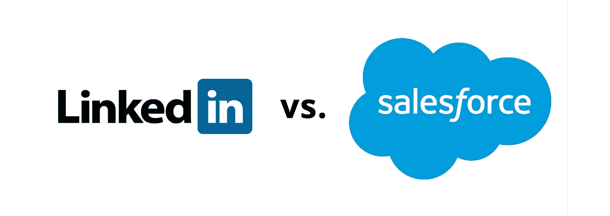
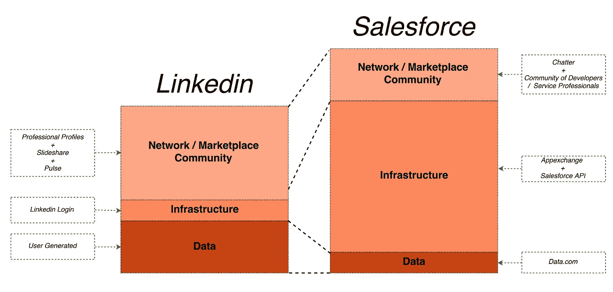

# Linkedin 如何错失了与 Salesforce 竞争的机会。

> 原文：<https://medium.com/swlh/linkedin-blew-it-linkedin-vs-salesforce-90c8c07eba61>

How Linkedin blew its chance to take on Salesforce.

## Linkedin vs. Salesforce

## ***注:本文最初发表于微软宣布将以 262 亿美元收购 Linkedin 之前的 5 月 10 日，不出意外，*** [***Salesforce 也在竞购 Linkedin***](http://www.wsj.com/articles/rival-bidding-forced-microsoft-to-raise-its-offer-for-linkedin-1467417326) ***。***

*Linkedin 失去了与 Salesforce 竞争并成为销售支持市场真正平台的机会。当然，这个职业网络绝不是处于崩溃的边缘，因为它仍然拥有世界上最准确和最新的专业人士数据。我们看到的是击倒，不是击倒。至少，现在还没有。*

尽管如此，Linkedin 的股票今年下跌了 50%；2015 年第四季度报告显示，2015 年净亏损达 1.65 亿英镑，而 2014 年亏损 1500 万英镑(**)。专业网络的收入来自三条业务线:人才解决方案、营销解决方案和高级订阅。人才解决方案是他们迄今为止最赚钱的业务，约占总收入的 62%。营销解决方案和高级订阅分别产生了总收入的 21%和 17%(*[*Linkedin 博客*](https://press.linkedin.com/site-resources/news-releases/2016/linkedin-announces-fourth-quarter-and-full-year-2015-results) *)。**

*但是在我们讨论 Linkedin 本可以做些什么(并且仍然可以做些什么)来加速增长并从 Salesforce 的盘子里分一杯羹之前，让我们仔细看看它的三项业务。*

***核心业务过于依赖外部因素***

*人才解决方案是 Linkedin 迄今为止最赚钱的业务。关于核心业务领域如何严重依赖用户来更新他们的 Linkedin 个人资料，已经有很多报道了。甚至连 Linkedin 的员工都不觉得有必要定期更新他们的职业资料。*

***分享趋势和缺乏关注限制了内容业务的增长***

*Linkedin 希望专注于营销解决方案，如赞助帖子，作为产生更多收入的手段。然而，通常情况下，Linkedin feed 类似于一个不受控制的信息流，与你在 Twitter feed 中发现的非常相似。*

*与希望参与用户社交活动各个方面的脸书不同，Linkedin 仍然是专业人士的解决方案，主要在工作时间使用。人们没有时间向下滚动提要来寻找宝石。更重要的是，你花在浏览 Linkedin feed 上的时间并不总是能得到有价值的信息。伟大的文章被层层的[“跟风”垃圾内容](/@myxys/me-too-content-marketing-strategy-leads-to-failure-727bc0e96ecc)所掩埋。*

*此外，您还可以关注您希望查看其内容的人，并接收每篇已发布文章的通知。这些通知还减少了用户对提要接收信息的依赖。*

*因此，虽然来自赞助帖子的收入显示出超过 30%的显著增长，但其增长主要是由于可共享内容量的纯粹增长。很快，广告客户就会意识到，即使是精确定位(基于标题和公司规模)也无法拯救他们的内容免于被埋在一堆垃圾中。*

> ****Linkedin feed 有一个 Twitter feed 问题。****

*还有一个趋势对 Linkedin 不利——个人生活和职业生活之间的界限继续模糊。[我们在脸书上分享更多的专业内容](http://fortune.com/2016/04/07/facebook-sharing-decline/)，我们在 Linkedin 订阅源中也注意到更多的个人内容。随着 Linkedin feed 变得越来越杂乱，人们发现关注脸书的行业专家更有效率。*

*你有没有注意到脸书上有更多关于你朋友职业生活的帖子？当然，我已经注意到了这种变化。因此，用户不再在 Linkedin 上关注某人，而是发现在脸书上关注行业专家和思想领袖更容易、更方便。*

***超值订阅业务承压***

*购买 Premium subscription 主要是为了建立个人品牌或获取更广泛的个人资料和功能。*

*但用户升级配置文件以访问更多连接的要求变得越来越没有吸引力。当成千上万的销售支持公司准备以非常低廉的价格提供这些数据时，找到某人的直接电子邮件不是问题。*

*Linkedin 的信息也有垃圾邮件的问题，这削弱了建立一个严重依赖电子邮件和高级订阅的销售流程的吸引力。*

> ****Linkedin 的消息充耳不闻。****

*我还应该提到，随着销售策略转向基于客户的销售，使用 Google sheets 和 Rapportive 插件为 Gmail 查找 30 个目标潜在客户的电子邮件不再那么耗时。升级你在 Linkedin 上的个人资料的需求大大减少了。*

*你有没有注意到 Angel.co 悄悄地在其平台上推出了连接？Angellist 专注于成为一个投资平台，分散了所有人的注意力，我们错过了他们如何慢慢进入 Linkedin 的职业网络领域。目前，销售代表越来越多地使用 Angel.co 来研究目标客户和合适的决策者。*

# ***Linkedin 错失了与 Salesforce 竞争的机会***

*Linkedin 失去了从专业网络向全面平台转型的机会。它仍然拥有超过 4 亿专业人士的最准确和最新的数据，但它缺乏工具和基础设施来从海量原始数据中释放出真正的价值。*

***Salesforce 拥有基础设施和功能；Linkedin 有数据***

*即使 Salesforce 已经将其产品线多元化到营销云、数据解决方案、客户支持和成功，Salesforce CRM 仍然是其核心产品，它充当连接其他产品的平台。*

*它的 CRM 提供了深度功能，通常需要大量资源来启动公司。但是，如果您刚刚为您的组织实施了 Salesforce，那么您是从零开始的，没有客户数据可供您使用。通过收购 Data.com，Salesforce 试图弥合这一差距，但任何使用过 data.com 的人都会告诉你，销售线索数据远远不是最新的，甚至是不准确的。*

> **没有数据的 Salesforce 就像没有汽油的汽车，或者像没有电的特斯拉。**

***Salesforce 存在数据准确性问题***

*您将很难找到一个没有抱怨过数据准确性或重复销售线索的 Salesforce 客户。这对组织来说是一个非常头痛的问题。如何确保将使用个人电子邮件的销售线索分配给已经在此客户上工作的销售代表？潜在客户培育、基于客户的销售和营销的成功都依赖于准确的潜在客户数据和跟踪。*

*整个产品池构建在 Salesforce 之上，只是为了解决销售线索重复、数据准确性和丰富性的问题。*

> ****Linkedin 拥有 Salesforce 极度缺乏的东西——准确而新鲜的数据。****

*由 Sangeet Paul Choudary 开发的平台画布帮助我们直观地了解 Linkedin 和 Salesforce 的不同之处。Linkedin 在 Salesforce 的网络/社区层具有巨大的优势，这使它能够建立起相当大的用户个人数据。但 Linkedin 缺乏基础设施或更具体的工具来使用这些数据捕捉 Salesforce 客户。*

## ***对比 Linkedin 和 Salesforce 的平台画布***

**

*Simplified comparison of Linkedin vs. Salesforce from the angle of sales enablement marketplace*

***开放 API 能促进 Linkedin 作为平台的发展***

*Salesforce 有工具，Linkedin 有数据。现在，什么是最容易复制的？如果你看看 CRM 领域的竞争有多激烈，答案是显而易见的——构建一个工具要容易得多。Linkedin 可以使其 API 对第三方开发者更加开放和可访问。这一举措将推动销售支持市场中的 SaaS 公司在其平台上进行构建。正如 App Store 和 Google Play 一样，Linkedin 需要公开和明确游戏规则。*

***转向平台商业模式***

*Linkedin 将能够立即从使用其 API 的产品产生的收入中收取一定比例的费用。严重依赖构建 Chrome 扩展来导出 Linkedin 数据的公司，如果不迁移到该平台，将处于不利地位。Linkedin 可以从这些交易中提成。*

***新的收入来源***

*通过扩展基础设施层向平台业务模式的转移将使 Linkedin 不仅仅是产生新的收入来源。它还将帮助销售生态系统中的许多公司脱离 Salesforce。想想看，你会选择一个空的 Salesforce 或 SugarCRM，在功能上非常类似，但也与 Linkedin API 相连，以保持数据的准确性和新鲜度吗？*

***收购机会***

*Linkedin 商业模式的平台转变也将带来独特的机会来发展和收购有前途的初创公司，这些公司已经与平台很好地整合，进一步吓退了 Salesforce。*

*以销售支持市场中另一个非常繁忙的领域为例——出站电子邮件解决方案，有像 [Outreach](https://medium.com/u/bc832b36fe99?source=post_page-----90c8c07eba61--------------------------------) 这样的公司。io，Sendbloom， [Yesware](https://medium.com/u/629863c6f851?source=post_page-----90c8c07eba61--------------------------------) ， [ToutApp](https://medium.com/u/8cd97eff5653?source=post_page-----90c8c07eba61--------------------------------) ， [ReplyApp](https://medium.com/u/40e155dff391?source=post_page-----90c8c07eba61--------------------------------) 等等很多。*为什么 Linkedin 不让他们访问自己的数据层？*对于出站电子邮件解决方案来说，这是进入更大市场以及将联系人数据集成到现有解决方案中的绝佳机会。另一方面，Linkedin 可以要求一定比例的收入，并学习开放率数据，以增强他们的用户档案。*

*正如我们所讨论的，Linkedin 希望在内容解决方案上加倍努力，以提高其作为专业人士内容平台的地位。*为什么不允许创业公司尝试在 Linkedin 的社交图谱上建立电子邮件简讯解决方案？*之后，电子邮件简讯是建立受众的最有效策略之一。*

*Linkedin 错过了一个很好的机会(大约 2-3 年前，销售支持 SaaS 公司像野火一样增长)来建立自己的弹药，并夺取 Salesforce 的市场份额。*

*在成为这一代的雅虎、推特或怪兽之前，Linkedin 作为科技宠儿还能生存多久？*

*不可否认，Linkedin 在网络和数据层方面比 Salesforce 有优势，但这两个领域的增长都受到缺乏基础设施以充分利用大量可用数据的限制。*

*其目前的业务面临巨大压力。Linkedin 需要采取行动将自己过渡到平台商业模式，开放 API 是这个方向的步骤之一。[当脸书正准备达到更平坦的用户增长模式](http://www.slate.com/articles/technology/technology/2016/04/facebook_isn_t_the_social_network_anymore_so_what_is_it.html)和原创内容分享的下降时，Linkedin 完全错误地估计了这些力量对其网络的影响，因此对这种转变完全没有准备。*

*也许杰夫·韦纳对 Linkedin 的未来有不同的想法，但似乎为第三方开发者开放 Linkedin API 的最佳时机是几年前。除了转向平台商业模式，你认为 Linkedin 还有其他保持相关性的方法吗？*

*在评论中分享你的想法。*

# *如果你喜欢这篇文章，请推荐和分享。*

****关注我上*** [***推特***](https://twitter.com/myxys) ***，*** [***中***](/@myxys) ***，连接上***[***Linkedin***](https://www.linkedin.com/in/mykolaponomarenko)***或发邮件给我评论和问题:myk@myxys.com。****

**本帖由* [*玛丽·克拉克·拉丁*](/@maryclarkrardin) *编辑。**

# *订阅我的每月简讯，里面有精选的关于创业、营销、成长和销售的文章。*

* [## 行业领导者如何打造强势品牌？

### 想主宰你的市场吗？选一个词。

medium.com](/p/bc112e12d34e)  [## “我也是”的内容策略导致失败

### 我们生活在一个交流过度的社会。

medium.com](/p/727bc0e96ecc)  [## 科技公司如何创造追随者

### 首席传道者是新的品牌大使

medium.com](/p/95abf711bffa)*