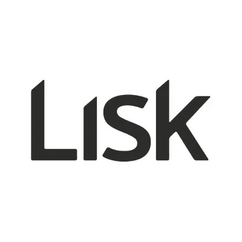
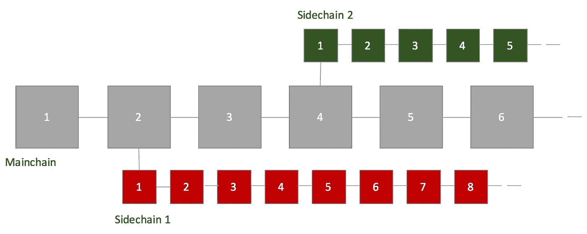

# lisk——基于 JavaScript 的区块链生态系统

> 原文：<https://medium.com/swlh/lisk-a-blockchain-ecosystem-based-on-javascript-ff95b7de7af7>

## [区块链 vNext 系列](/@sgrasmann/blockchain-vnext-a-series-ff5469aa1f22)(第三部分)

我想用[我的区块链 vNext 系列](/swlh/blockchain-vnext-a-series-ff5469aa1f22)的第三部潜入 [**Lisk**](https://lisk.io/) 。在前两部分中，我们了解了 [FileCoin、IPFS](/swlh/filecoin-and-ipfs-f5e84ae79afa) 和[海洋协议](/swlh/ocean-protocol-democratizing-data-markets-3d7c67fae50d)，它们都可能成为即将到来的区块链格局甚至互联网本身的重要基础部分。

> Lisk 不一样。这是下一代区块链生态系统。

## 技术

首先也是最重要的 Lisk 是一个为 **JavaScript** 开发者设计的**区块链平台**。它想让为网络开发者创建 dApps(分散式应用)变得非常简单。开发者可能会发现这个介绍是一个很好的方向。源代码可以在 [Github](https://github.com/LiskHQ) 上找到。Lisk [刚刚宣布](https://blog.lisk.io/lisk-community-update-december-2017-1a76c5ef79f6)他们将在 2018 年 2 月举行[重新启动活动](https://lisk.io/relaunch)并发布 Lisk Core 1.0。

该平台由 LSK 令牌驱动。LSK 不是 ERC20 令牌，因为它不是基于以太坊。这也是 Lisk 自带钱包的原因之一——Lisk Nano。Lisk Nano 有一个很好的用户界面，也用于为“代表”投票。Lisk 代表的任务是保护网络。Lisk 不使用[工作证明](https://de.wikipedia.org/wiki/Proof_of_Work)作为[共识算法](https://en.wikipedia.org/wiki/Consensus_(computer_science))，而是使用**委托股权证明**(dPoS)——类似于 [BitShares](https://bitshares.org/technology/delegated-proof-of-stake-consensus/) 或 [EOS](https://github.com/EOSIO/Documentation/blob/master/TechnicalWhitePaper.md) 。您可以在此找到 dpo[的简单描述。](https://www.mycryptopedia.com/delegated-proof-stake-dpos-explained/)

Lisk 使用这些代表中的 101 个来减少寻找共识的实体的数量。Lisk 令牌持有者可以定期投票给信任的代表。委托数量少的优点是 Lisk 比比特币或以太坊交易吞吐量高，可扩展性更好。但是还有更多的东西可以提高可伸缩性:Lisk 使用**侧链**的概念来分割在 Lisk 平台上运行的不同 dApps 之间的流量。

Lisk sidechains [(source](https://blog.lisk.io/what-is-lisk-and-what-it-isnt-e7b6b6188211))

每个 dApp 都有自己的侧链，独立于其他应用运行。每个 dApp 都可以创建自己的自定义令牌或使用 LSK。Lisk 希望防止流行的 dApps 可能对其整个生态系统产生负面影响，就像 2017 年底以太坊上的 [CryproKitties 一样。](/eidoo/cryptokitties-why-the-ethereum-blockchain-is-congested-ecb219fd0fe0)

## 提供资金

Lisk 团队[总部在柏林](https://blog.lisk.io/hello-berlin-hello-wework-hello-liskhq-bd64037cf5c0)， **Lisk 基金会**在瑞士[上市](https://zg.chregister.ch/cr-portal/auszug/auszug.xhtml?uid=CHE-476.165.977#)。创始人 [Max Kordek](https://medium.com/u/36a181ce43d1?source=post_page-----ff95b7de7af7--------------------------------) 和 [Oliver Beddows](https://medium.com/u/506c290192f8?source=post_page-----ff95b7de7af7--------------------------------) 是柏林区块链场景背后的驱动力。他们在 2016 年开始 Lisk。它的 ICO 当时收集了 14000 BTC。在撰写本文时(2018 年 1 月)，Lisk 的价值为 26 亿美元，在 [CoinMarketCap](https://coinmarketcap.com/currencies/lisk/) 排名第 20 位。因此，Lisk 拥有强大的财务基础，可以在未来几个月将该平台投入使用。

当我读到创始人 Max Kordek 关于他计划如何在未来 10 年内花掉他那份馅饼的故事时，我真的被深深打动了。)年。他的目标是对市场价格产生尽可能小的影响。很高兴看到为了建立信任花了多少心思。

## 对社会的影响

目前还很难说 Lisk 对社会会有什么影响。当然，Lisk 团队希望降低网络开发者进入区块链世界的门槛，并以他们选择的编程语言(即 JavaScript)创建引人注目的去中心化应用。我们必须等待这个开发者生态系统是否开始腾飞。但这些数字已经令人印象深刻:Lisk 在 Twitter 上有近 20 万名粉丝，在 Reddit 上有 2.5 万名粉丝。2018 年将是 Lisk 决定性的一年。

> 目前，Lisk 的令牌生态系统设计也有一些缺点。一笔交易目前的固定成本为 0.1 LSK——目前约为 2€，如果象征性估值进一步上升，可能会大幅增加。以太坊交易的动态天然气价格对我来说似乎是一个更好的选择。

另一个不利之处是:代币持有者要花 1 LSK 才能投票选出 33 名优先代表。如果你有少量——比如说 20 枚——LSK 代币:你会牺牲其中一枚来选择代表吗？是的，每笔交易你都会从你的代表那里得到回报，但是与你的投票投资相比，这只是小钱。一开始我以为我弄错了。但是[根据这篇文章](https://steemit.com/lisk/@cryptomcat/you-own-lisk-why-not-forging-it-it-s-really-simple-how-to)如果钱包里少于~750 LSK (~15k€)的话，投票就没有太大意义了(详见评论和回复)。我想知道这种经济上的争论是否对 dPoS 算法的稳健性至关重要？非常欢迎对这一点的反馈！

> 另一件我还不完全明白的事情是:令牌持有者选择值得信任的代表的最佳标准是什么？是的:有经济方面的，甚至有[工具来计算 RoI](http://tools.mylisk.com/calculator.php) 。但是还有其他的论点吗？我强烈地感觉到代表的选择应该是自动化的，并建立在系统中…

## 结论

看看像 [Lisk](https://lisk.io/) 、 [EOS](https://eos.io/) 或 [NEO](https://neo.org/) 这样的新区块链生态系统是否会赢得这场竞赛，成为以太坊的大竞争对手，这将是非常有趣的。肯定有很大的潜力。与此同时，以太坊作为一个生态系统获得了越来越多的关注，并致力于其交易速度和可扩展性(参见[雷电](https://raiden.network/)、[卡斯珀](https://blockgeeks.com/guides/ethereum-casper/)和[等离子](https://plasma.io/))。

2018 年肯定会是密切关注这些新兴技术的有趣一年！

***免责声明:*** *本文无意成为任何形式的投资建议。如果你打算投资本文提到的某个项目，自己做研究并寻求专业支持。*

## 这个故事发表在 [The Startup](https://medium.com/swlh) 上，这是 Medium 最大的企业家出版物，拥有 290，182+人。

## 在这里订阅接收[我们的头条新闻](http://growthsupply.com/the-startup-newsletter/)。

