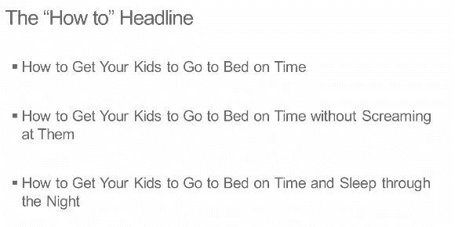
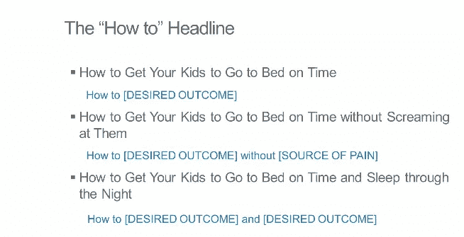

# 乔恩·莫罗是如何学会倾听的，让人们认为他读懂了他们的想法。并从竞争对手那里转移。

> 原文：<https://medium.com/swlh/listening-caused-jon-morrows-breakthrough-for-awakening-readers-3-listening-hacks-from-his-lessons-2d1d5ffa34cd>

## 3 监听黑客窃取竞争对手的客户。

[Source](https://unsplash.com/photos/ehB9JBq5Pgw?utm_source=unsplash&utm_medium=referral&utm_content=creditCopyText)

你一直在听。

您已经听取了大型企业客户、数百名最终用户、全国各地的合作公司、投资者和团队领导的意见。毕竟，你把倾听和整合反馈归因于创造你的优秀产品。

那么，乔恩·莫罗是如何为一家销售不那么出色产品的公司抢走你的理想客户的呢？

你知道失去一种感觉的人，比如视觉，是如何强化另一种感觉的，比如听觉。

乔恩·莫罗失去了行动能力。每块肌肉和身体部位，除了他脸上的几块。

莫罗精通倾听，他几乎能读懂理想客户的想法。(他与我想法一致的时机甚至促成了这篇文章的最终见解。)

通过阅读莫罗的内容，与他和他的团队一起工作，见证他的销售才能，我体验到了*不可阻挡的*倾听的力量。

**三个层次。**

第三种是 Morrow 用来抢走你的顾客的那种。

他非常善于倾听，通过别人的眼睛看世界。

# 3 倾听技巧，让你的目标人群认为你了解他们的想法。

通过课程模拟体验式学习。

[Source](https://depositphotos.com/home.html)

# 第一级:积极倾听

又一次客座博文被拒。

没有奖励几个月的阅读帖子和评论。研究一个网站和所有者。定制推介。

*THWACK！*

还没开张就不见了。

没有反馈。没有回复。没什么。

那天晚些时候…惊喜！一阵动力！

乔恩·莫罗的邮件。和我交流过。一个有趣的对比视频，我觉得很鼓舞人心。

***他怎么知道我喜欢收到什么，什么时候需要？***

(好像他知道在对投球有信心之前被拒绝是多么令人沮丧。意识到我最不想要的就是更多的提示和建议，或者是阅读标题公式的提醒。)

> 不，我不会给你一个神奇的键盘让你写的所有东西都棒极了。
> 
> 但这是退而求其次的好东西:
> 
> [让写精彩帖子更容易的 3 个小技巧](https://ue160.infusionsoft.com/app/linkClick/13241/b7f5c362646536ec/25056317/dd6968e899b84390)——乔恩·莫罗

**一、用诱惑预热。**

视觉隐喻。比较 3 道菜的菜单和 3 部分的博客大纲。

**二。一点文字魔法。**

从“bleh”到“SURE！我同意！”

**三。压轴戏。缓解转型的方法。**

模板为*烹饪过度的蔬菜话题*增添了活力。

你知道该在什么时候对你的理想客户说什么吗？

每当我不确定使用我的理想读者使用的词语，以及匹配他们如何思考问题或愿望时，我就会想象莫罗会说什么。

**回去积极倾听！！！**

[Source](https://unsplash.com/photos/d2MSDujJl2g?utm_source=unsplash&utm_medium=referral&utm_content=creditCopyText)

# 主动监听黑客

1.  询问人们关于他们最黑暗的恐惧，燃烧的挫折，狂热的目标和最深的渴望。让他们在凌晨两点前保持清醒。
    *我有什么好处！！*
2.  **听他们的话。倾听意义。倾听情感。**
3.  阅读人们用来自言自语、表达思想和情感的词语。他们看待恐惧、挫折、目标和欲望的方式。倾听——直到你能听到他们的话语、想法和感受。
4.  观察人们已经做了什么来减少他们的恐惧和挫折，并赋予他们的目标和愿望以生命。
    **做笔记，以证明你一直在听。**

# 二级。批判性听力

一旦一篇文章被编辑拒绝或被读者忽视，我害怕寻求反馈。然后，反映了莫罗遵循的克服挑战和内心斗争的智慧。

> 用枪指着你的头。
> 
> 如果你知道你需要做什么，而你正在努力让自己去做，你可能会想，“哦，那是因为我很烂。我没有乔恩那样的人的自律。”不对！这是因为你没有一把“枪指着你的头”迫使你采取行动，不管你喜欢与否。

没有什么比回避我们内心最深处的恐惧更能激励我们了。尤其是危及我们生活的恐惧。

[Source](https://unsplash.com/photos/_Ahy-o88Ryc?utm_source=unsplash&utm_medium=referral&utm_content=creditCopyText)

*我的“枪口对着脑袋”动机粉碎了什么障碍？*

不得不对被拒绝或忽略的帖子寻求反馈。

**所以，我可以批判性地倾听。**

# 关键听力技巧

*   消除你认为人们对他们的恐惧、挫折、梦想和愿望所说的、所想的和所感受到的与他们实际所说的、所想的和所感受到的之间的不一致。
*   意识到你的理想客户所回避的最黑暗的恐惧。他们不想要什么*强硬的建议*为。

[Source](https://depositphotos.com/home.html)

# 三级。共情倾听。

因为我不想重复错误，我考虑我从**积极的和批判性的倾听**中发现的东西。

从我为之写作的人的角度来看写作的线索。

然后挖掘莫罗擅长的… **感同身受地倾听。**

为他的业务突破精髓！

读者之所以认为他读懂了他们的心思。走极端，包括追求自己的博客激情，全职看完他的帖子。

[Source](https://unsplash.com/photos/3shfnfzdFVc?utm_source=unsplash&utm_medium=referral&utm_content=creditCopyText)

## 倾听周期。

1.  积极倾听人们的恐惧、挫折、目标以及与你所提供的相关的愿望。
2.  感同身受地倾听镜像读者的话语、想法和情绪。
3.  通过内容或对话进行测试。
4.  认真听取反馈。缩小你所听到的和人们实际所想、所说、所感之间的差距。
5.  **重复。**

## 营销和销售的同理心洞察。

用同理心倾听最难理解的一点是，发现人们对有益于他们的东西没有**欲望**。

即使这会改善他们的生活或生意。

从戒烟到换手机再到更好的沟通。

对他们关注和购买的人和公司感到无助——告诉他们他们想听的。

吸食医用大麻可以消除焦虑。

使用电话 XYZ 意味着你是我们中的一员。你可以继续用你习惯的。

用你喜欢的方式交流可以强化你熟悉的东西。

乔恩·莫罗最喜欢问的问题。

*怎样才能让人们去听新的东西？*

**带着同理心听和写。**

# 共情倾听技巧

> 如果你想让人们觉得你理解他们，就把他们的情绪反映给他们。
> 
> 通过亲密和真实的交流建立人与人之间的联系。真实一点，尤其是受伤的时候。
> 
> 移情是一项由内而外的工作。
> 
> 你必须首先选择变得足够脆弱，去触及你自己的内心，去唤起同样的感觉，因为建立人与人之间联系的唯一方式是分享同样的感觉，而不是用第三人称谈论它们。

## 前沿共情洞察。

还记得我对帮助缺乏愿望的人的关注吗？

在这篇文章发表的前一天，莫罗发表了他针对一个**愿望的想法，在下面的文章中**,[如何在 2018 年开一个博客:快 20 倍的新方法](https://smartblogger.com/how-to-start-a-blog/)。

他的想法来自于倾听他人的观点。

假设你想帮助男人理解他们自己的男子气概。

> 针对这种欲望的问题是。
> 
> **自我认同(“那就是我！”).最近的科学研究表明，一些由单身母亲抚养长大的男孩很难理解自己的男子气概。问题是，他们不这样认为自己。如果你问一群男人，“你们中有多少人在理解自己的男子气概方面有困难？”没有人会举手。
> 
> 解决方法:**针对症状**。**
> 
> 问:“你们中有多少人被女生划分为好友，却不知道为什么？”很多人会举手赞成。换句话说，你必须用你的观众描述自己的话来描述他们。
> 
> 几乎在所有情况下，你都会描述症状，而不是真正的原因。–[**乔恩·莫罗**](https://smartblogger.com/how-to-start-a-blog/)

这种洞察力与你销售的产品有什么关系？

如果莫罗想影响顾客购买一件不太引人注目的产品，这里有一个他如何做的例子。

假设，我对我的 IPhone 在最新版本出来后变得如此之慢感到沮丧。我了解到这是苹果公司用来鼓励用户升级到最新手机的一种技术。我的配偶告诉我，谷歌不会在他们的手机上这么做，这是为了节省电池电量。当我走进莫罗工作的商店时，我只对 Pixel 2 或 Sansung Galaxy S8 感兴趣。

因为莫罗和他的团队在所有三个级别都听过，他沉浸在我的世界里。他知道我不会说*理工*。告诉我像素、处理器、内存量、屏幕质量和空间量的区别是没有用的。我会相信我热爱技术的配偶有这些功能。

莫罗知道我使用手机的主要目的是为了研究，在小组和论坛上消磨时间，以及写笔记。他也知道我对目前的手机最大的不满。完成我的主要目标需要多长时间。

*   为了改变我的电话忠诚度，莫罗首先强调了我最大的挫败感。
*   然后，配套的**症状**，我来说说。
*   接下来，解决使用 Pixel 2 最大的时间节省器谷歌助手的快速技巧。展示了它是如何帮助解决我的**原因**的。

# 传递来自乔恩·莫罗的爱。

你的目标人群想知道你一直在听。

证明你得到了他们。

你能理解他们对过度失败和棘手问题的感受，以及对无法实现的目标的挫败感。

最终，他们会忽略那些不听的竞争对手。他们一直在谈论为什么他们认为他们的产品更好。

他们不像你那样关注潜在客户关心的事情。

强化你的秘密武器。

**三个层次的听力。**

# 准备好在生意中得到你想要的一切了吗？

## [接收电子邮件灵感……让他人获得他们想要的东西。为采取行动而沟通的艺术和科学。](https://earnloyalcustomers.com/earn-loyal-customers-through-emotional-selling-powers/)

## 这篇文章发表在 [The Startup](https://medium.com/swlh) 上，这是 Medium 最大的创业刊物，拥有 284，454+人关注。

## 在此订阅接收[我们的头条新闻](http://growthsupply.com/the-startup-newsletter/)。

